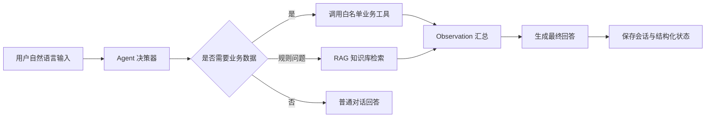

# 智能采购库存协同管理系统

基于 Spring Boot 3 + Vue 3 的采购库存协同管理系统，围绕采购、库存、仓储、供应商协同等场景，构建从采购申请、审批、采购订单、供应商确认、到货登记、入库确认到库存台账更新的完整业务闭环。

项目同时集成基于 Java Agent Loop 的智能业务助手，用于辅助用户查询业务状态、检索业务规则、分析待办事项，并通过工具调用和 RAG 知识库增强回答的业务可信度。

## 核心亮点

- 覆盖采购申请、审批、订单、到货、入库、库存流水和库存预警的完整业务流程。
- 支持管理员、采购员、采购经理、供应商、仓库岗等多角色协同，按角色控制菜单、数据范围和操作权限。
- 首页工作台聚合真实业务待办，按角色展示待审批、待确认、待入库、库存预警等处理事项。
- 后端基于 Spring Security + JWT 实现登录认证、接口鉴权和退出登录 Token 黑名单。
- 使用 MyBatis-Plus 实现分页查询、业务状态流转、逻辑删除和常规数据访问。
- 接入 Redis，用于 Token 黑名单、缓存能力和 AI 向量检索相关能力。
- 集成 Java Agent Loop，支持自然语言问题识别、白名单工具调用、RAG 知识检索和 SSE 流式响应。
- 前端基于 Vue 3 + Element Plus 构建多角色业务页面，强化流程引导和普通用户操作体验。

## 技术栈

### 后端

- Java 17
- Spring Boot 3.5
- Spring Security
- JWT
- MyBatis-Plus
- MySQL
- Redis
- Knife4j / OpenAPI
- Spring AI Alibaba
- DashScope Chat / Embedding
- Redis Vector Store
- Lombok
- Aliyun OSS

### 前端

- Vue 3
- TypeScript
- Vite
- Vue Router
- Pinia
- Element Plus
- Axios
- Marked
- DOMPurify

## 业务流程

系统主流程围绕采购履约闭环设计：


核心状态流转包括：

- 采购申请：草稿、待审批、审批通过、审批驳回、已撤回、已生成订单。
- 采购订单：待供应商确认、执行中、部分到货、待入库、已完成、已关闭、已取消。
- 到货登记：正常到货、异常到货。
- 入库单：待确认入库、已完成入库、已取消。
- 库存台账：正常库存、低库存、超储预警。

## 角色与权限

- 管理员：维护用户、物料、仓库、供应商、库存台账、操作日志和系统配置相关数据。
- 采购员：创建采购申请，跟进审批结果，生成采购订单，查看到货和入库进度。
- 采购经理：审批采购申请，查看库存和采购执行情况。
- 供应商：维护供应商资料，确认采购订单和交期，查看相关订单状态。
- 仓库岗：登记到货，生成和确认入库单，维护库存台账和库存流水。

## 功能模块

### 基础资料

- 用户管理
- 物料管理
- 仓库管理
- 供应商管理
- 供应商附件与资质审核

### 采购协同

- 采购申请创建与明细维护
- 采购申请提交、审批、驳回和撤回
- 已审批采购申请生成采购订单
- 采购订单明细维护
- 供应商确认订单和承诺交期
- 采购订单关闭、取消和状态跟踪

### 仓储库存

- 到货登记
- 异常到货记录
- 入库单生成
- 入库确认
- 库存台账查询
- 库存流水查询
- 低库存和超储预警

### 工作台与体验优化

- 按角色展示业务统计和待办事项。
- 为关键业务操作提供下一步提示。
- 对登录失败、退出登录、401/403 等场景提供统一提示。
- 根据业务页面区分空状态文案和操作按钮文案。

## AI Agent 设计

系统内置 AI 智能助手，用于辅助用户查询业务状态、理解流程规则和检索知识库内容。该模块不是简单的大模型问答，而是结合业务工具调用和结构化上下文的 Java Agent Loop。

### Agent 工作流



### Agent 能力

- 支持采购订单、采购申请、库存预警、供应商资料和角色待办查询。
- 支持白名单工具调用，避免模型直接生成 SQL 或绕过业务权限。
- 支持 RAG 知识库导入、分片、向量检索和业务规则问答。
- 支持 SSE 流式响应，前端可展示阶段状态和逐步回答。
- 支持会话历史、消息记录、工具调用结果和上一轮结构化状态保存。
- 支持根据最近会话理解“刚才那个”“继续”“下一步”等多轮追问。

### Agent 工具示例

- `list_role_todos`：按当前登录角色查询业务待办。
- `get_purchase_order_context`：查询采购订单状态、明细和下一步建议。
- `get_purchase_request_context`：查询采购申请状态、明细和审批记录。
- `list_inventory_alerts`：查询低库存或超储预警。
- `get_supplier_profile_context`：查询供应商资料和资质状态。
- `search_business_knowledge`：检索业务规则知识库。

## 项目结构

```text
inventory
├── inventory_back        # Spring Boot 后端服务
│   ├── src/main/java     # 业务接口、服务、实体、Mapper、Agent 模块
│   └── src/main/resources
│       ├── mapper        # MyBatis XML
│       └── application-*.yml
├── inventory_front       # Vue 3 前端项目
│   ├── src/api           # 前端接口封装
│   ├── src/router        # 路由与角色页面
│   ├── src/layouts       # 系统布局
│   └── src/view          # 业务页面与 AI 助手页面
└── AGENTS.md             # 项目协作规范
```

## 环境说明

项目使用环境变量管理数据库、Redis、JWT 和大模型 API Key 等敏感配置，示例见 `inventory_back/.env.example`。

## 可扩展方向

- 完善采购订单、到货和入库环节的异常处理流程。
- 增加库存预警到采购申请的自动建议能力。
- 为 Agent 工具调用增加更细粒度的权限校验和审计记录。
- 扩展供应商绩效分析，例如交付及时率、异常到货率和质量合格率。
- 增加关键业务链路的单元测试和集成测试覆盖。
