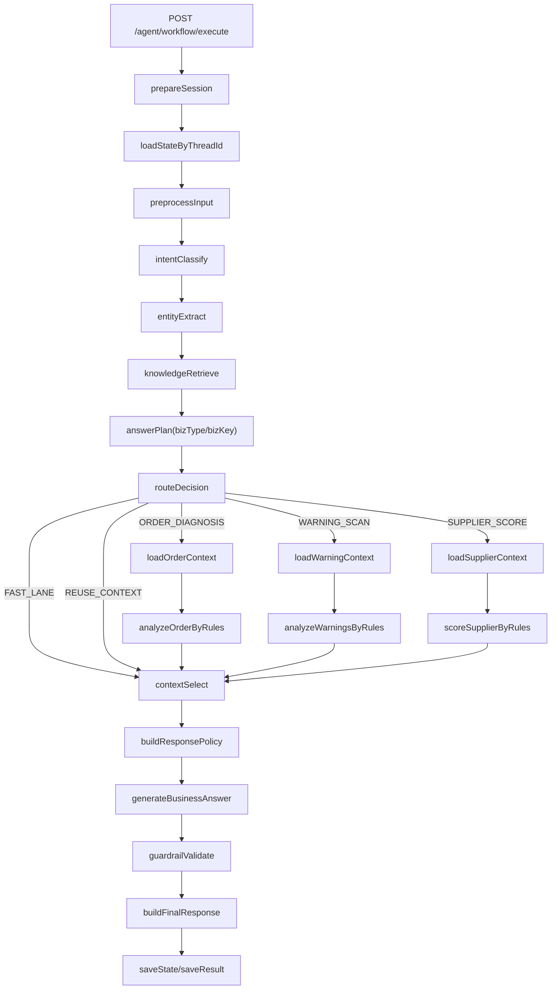

# 《Python版 AI 业务分析陪伴型 Agent 最终落地手册》

> 基于现有文档：
>
> ```text
> document/Python版AI自然对话与体验优化落地手册.md
> document/Python版AI问题聚焦与责任上下文最终落地手册.md
> document/Python版AI三流程问题聚焦与上下文增强最终落地手册.md
> ```
>
> 本文档只解决一个核心问题：
>
> ```text
> 当前 Python 版 workflow 虽然已经能查业务、能答问题，
> 但对用户来说还不像一个“专属 Agent”。
>
> 它更像：
> 1. 一个能把结构化结果翻成人话的助手；
> 2. 一个会接一点上下文的业务问答器；
>
> 而不是：
> 1. 一个懂当前业务对象是谁的 Agent；
> 2. 一个能持续承接追问的 Agent；
> 3. 一个既懂业务又能给用户陪伴感的 Agent。
> ```

---

## 0. 先把这次真实目标说清楚

你这次的目标不是：

```text
继续把回答修得更顺一点。
继续补几条 prompt。
继续多加几个关键词。
```

你这次真正要的，是一个：

```text
不修改业务数据、
但能持续分析业务问题、
能记住当前在聊哪条业务线、
能承接用户情绪、
能像“专属业务伙伴”一样陪用户往下看问题的 Agent。
```

这件事非常重要，因为它决定了这次不能再按“修答句”的方式做。

如果只是修回答，你最后得到的是：

```text
一个越来越会说话的助手。
```

但你真正要的是：

```text
一个“业务脑 + 陪伴脑 + 上下文记忆”同时成立的 Agent。
```

---

## 1. 这次到底解决什么问题

你现在系统的能力，大体已经有：

```text
1. /agent/workflow/execute 可用
2. 订单诊断 / 风险扫描 / 供应商评分可用
3. threadId 连续追问可用
4. AnswerPlan / ContextSelect / BusinessAnswerGenerate 已经成型
5. 回答已经比纯模板更自然
```

但现在还有三个更深层的问题没有解决：

### 1.1 它还不像“专属 Agent”

用户和它连续聊几轮后，仍然会感觉：

```text
它是在一问一答，
不是在“陪我沿着这条业务线继续看”。
```

典型表现：

```text
1. 用户说“好的谢谢”，系统只会回一句泛化的话
2. 用户说“那怎么提升这个评分”，系统容易继续解释分数，而不是承接到下一步动作
3. 用户说“还是不对”“一直这样”，系统感知不到用户已经烦了
```

### 1.2 它还没有“业务对象作用域”

现在最大的不稳定点不是模型智商，而是：

```text
系统能识别 intent，
但还不能稳定识别“这一轮在聊哪个业务对象”。
```

所以会出现：

```text
上一轮是订单诊断，
下一轮问“为什么 PO2026040001 风险这么高”，
结果被旧 thread 里的订单上下文带偏。
```

本质原因是：

```text
以前的复用更像：
这个 thread 里有旧结果 -> 复用一下

而不是：
这次和上次是不是同一个业务对象 -> 再决定是否复用
```

### 1.3 它没有“陪伴策略层”

现在的业务回答虽然已经不是死模板了，但仍然缺一层：

```text
这一轮到底应该怎么说？

是直接说？
还是先接住用户情绪？
还是要承接上轮业务线？
还是要在结尾主动给下一句可追问方向？
```

这个能力不是业务规则，也不是意图分类。

它是：

```text
response policy
```

也就是：

```text
同样一份业务事实，
面对“帮我分析”“那怎么办”“好一些了”“谢谢”“还是不行”，
表达方式应该不同。
```

---

## 2. 为什么继续微调，解决不了根问题

这个问题一定要讲透。

因为你后面如果不接受这个判断，就会一直掉进“继续修 prompt”的坑里。

### 2.1 微调能解决什么

微调能改善：

```text
1. 某些 questionFocus 分类更稳
2. 某些表达更像人
3. 少量固定场景的语气更统一
```

### 2.2 微调解决不了什么

微调解决不了：

```text
1. thread 里上下文串线
2. 不是同一个业务对象却复用了旧结果
3. 用户情绪没有被感知
4. 社交话术和业务话术没有被统一编排
5. LLM 既负责理解、又负责判断、又负责表达，边界混乱
```

所以这次的根方案不是：

```text
再把模型调大一点
再把 prompt 写得更长一点
```

而是：

```text
让系统从“会答业务问题”
升级成“会沿业务线陪用户往下看”的 Agent。
```

---

## 3. 这次方案的最终形态

这次最终要把系统拆成三层。

### 3.1 业务脑

负责：

```text
1. 识别意图
2. 识别 questionFocus
3. 识别当前业务对象
4. 拉取正确上下文
5. 基于规则生成结构化结论
```

这层必须“稳”和“可控”。

### 3.2 陪伴脑

负责：

```text
1. 感知用户情绪
2. 判断这一轮语气该直接、安抚、承接还是引导
3. 决定开场语和收束语
4. 决定结尾要不要主动给用户下一步可问方向
```

这层决定“有没有 Agent 感”。

### 3.3 对话记忆

负责：

```text
1. 记住最近在聊哪条业务线
2. 记住最近业务对象是什么
3. 记住上一轮 questionFocus
4. 记住用户最近情绪是急、烦、轻松还是感谢
```

这层决定“是不是专属”和“是不是陪伴”。

---

## 4. 改造后的最终工作流

最终链路应该长这样：

```text
prepareSession
saveUserMessage
loadStateByThreadId
preprocessInput
intentClassify
entityExtract
knowledgeRetrieve
answerPlan
routeDecision
  ├─ FAST_LANE
  ├─ REUSE_CONTEXT
  ├─ ORDER_DIAGNOSIS -> loadOrderContext -> analyzeOrderByRules
  ├─ WARNING_SCAN    -> loadWarningContext -> analyzeWarningsByRules
  └─ SUPPLIER_SCORE  -> loadSupplierContext -> scoreSupplierByRules
contextSelect
buildResponsePolicy
generateBusinessAnswer
guardrailValidate
buildFinalResponse
saveAssistantMessage
saveState
saveResult
return
```

相比旧版，这里多了两个真正关键的状态：

```text
1. bizType / bizKey
   用来确定当前到底在聊哪个业务对象

2. responsePolicy / conversationMemory
   用来让系统不只是“答题”，而是“陪着用户聊同一条业务线”
```

用图看就是：



---

## 5. 当前代码错在哪里

这部分你要重点看。

因为后面所有步骤，都是在修这几类结构性错误。

### 5.1 错误一：只有业务状态，没有对话状态

你现在旧代码里保存的是：

```text
ORDER_DIAGNOSIS
WARNING_ANALYSIS
SUPPLIER_SCORE
```

但没有保存：

```text
lastBizKey
lastEmotion
lastQuestionFocus
```

所以它会“记得查出来了什么”，
但不会“记得你们刚才在围绕哪条业务线往下聊”。

这就是它不像专属 Agent 的根源之一。

### 5.2 错误二：复用依据是 thread，不是业务对象

这是最危险的问题。

旧逻辑更像：

```text
这个 thread 里有历史结果 -> 复用一下
```

正确逻辑应该是：

```text
这个 thread 里有历史结果
并且
历史结果和这轮是同一个 bizType + bizKey
-> 才能复用
```

否则就一定会串线。

### 5.3 错误三：没有独立的陪伴策略层

旧系统只有：

```text
业务事实 -> 生成业务回答
```

但没有：

```text
用户现在是不是烦了？
这一轮需不需要先接住他？
他是不是在感谢？
是不是应该主动告诉他下一句还能继续问什么？
```

这就是为什么你总觉得它：

```text
“回答还可以，但不像一个合格 Agent”
```

这个判断完全对。

---

## 6. 这次已经落地的代码改动

下面是这轮已经落地的部分。

你可以直接对照当前仓库核对。

### 6.1 AnswerPlan 增加业务作用域

文件：

```text
python_ai_workflow_service/app/schemas/answer_plan.py
```

核心改动：

```python
from typing import Any

from pydantic import Field

from app.schemas.common import ApiModel


class AnswerPlan(ApiModel):
    interaction_type: str = Field(default="BUSINESS", alias="interactionType")
    intent: str
    question_focus: str = Field(default="FULL_ANALYSIS", alias="questionFocus")
    turn_type: str = Field(default="FIRST_TURN", alias="turnType")
    answer_mode: str = Field(default="FULL_ANALYSIS", alias="answerMode")
    biz_type: str | None = Field(default=None, alias="bizType")
    biz_key: str | None = Field(default=None, alias="bizKey")
    target_biz_no: str | None = Field(default=None, alias="targetBizNo")
    target_order_no: str | None = Field(default=None, alias="targetOrderNo")
    target_supplier_id: int | None = Field(default=None, alias="targetSupplierId")
    needs_refresh: bool = Field(default=True, alias="needsRefresh")
    use_llm: bool = Field(default=True, alias="useLlm")
    max_context_items: int = Field(default=10, alias="maxContextItems")


class SelectedContext(ApiModel):
    interaction_type: str = Field(default="BUSINESS", alias="interactionType")
    intent: str
    question_focus: str = Field(default="FULL_ANALYSIS", alias="questionFocus")
    answer_mode: str = Field(default="FULL_ANALYSIS", alias="answerMode")
    biz_type: str | None = Field(default=None, alias="bizType")
    biz_key: str | None = Field(default=None, alias="bizKey")
    use_llm: bool = Field(default=True, alias="useLlm")
    summary: str | None = None
    facts: dict[str, Any] = Field(default_factory=dict)
    items: list[dict[str, Any]] = Field(default_factory=list)
    instruction: str | None = None
```

这一段的意义不是“多加两个字段”。

真正意义是：

```text
从这一步开始，
系统不再只知道“这轮是供应商分析”，
还知道“这轮是 supplierId=1,days=180 这一个具体对象”。
```

---

### 6.2 WorkflowState 增加陪伴状态

文件：

```text
python_ai_workflow_service/app/workflows/state.py
```

核心改动：

```python
class WorkflowStateKeys:
    MESSAGE = "message"
    THREAD_ID = "threadId"
    AUTHORIZATION = "authorization"
    USER_ID = "userId"
    NORMALIZED_MESSAGE = "normalizedMessage"

    INTENT = "intent"
    ACTIVE_INTENT = "activeIntent"
    INTERACTION_TYPE = "interactionType"

    ENTITY = "entity"
    RAG_DOCS = "ragDocs"

    ORDER_SNAPSHOT = "orderSnapshot"
    ORDER_DIAGNOSIS = "orderDiagnosis"

    WARNING_CONTEXT = "warningContext"
    WARNING_ANALYSIS = "warningAnalysis"

    SUPPLIER_METRICS = "supplierMetrics"
    SUPPLIER_SCORE = "supplierScore"

    ANSWER_PLAN = "answerPlan"
    SELECTED_CONTEXT = "selectedContext"
    RESPONSE_POLICY = "responsePolicy"
    CONVERSATION_MEMORY = "conversationMemory"

    LLM_ANSWER = "llmAnswer"
    GUARDRAIL_RESULT = "guardrailResult"
    FINAL_RESPONSE = "finalResponse"
    ERROR_MESSAGE = "errorMessage"
    ROUTE = "_route"

    ORDER_CONTEXT = "orderContext"
    SUPPLIER_CONTEXT = "supplierContext"
```

这里的重点是：

```text
RESPONSE_POLICY
CONVERSATION_MEMORY
```

这意味着：

```text
陪伴感不再是 LLM 临场发挥，
而是工作流显式状态。
```

---

### 6.3 AnswerPlanNode 改成按业务对象规划

文件：

```text
python_ai_workflow_service/app/workflows/nodes/answer_plan.py
```

这次这个文件是关键中的关键。

完整代码如下：

```python
import re

from app.schemas.answer_plan import AnswerPlan
from app.workflows.state import InteractionType, WorkflowIntent, WorkflowStateKeys


BIZ_NO_PATTERN = re.compile(r"(PO|AR|IN)\d+", re.IGNORECASE)


class AnswerPlanNode:
    async def __call__(self, state: dict) -> dict:
        interaction_type = str(state.get(WorkflowStateKeys.INTERACTION_TYPE, InteractionType.BUSINESS.value))
        intent = str(state.get(WorkflowStateKeys.INTENT, WorkflowIntent.UNKNOWN.value))
        message = str(state.get(WorkflowStateKeys.MESSAGE, ""))
        biz_type, biz_key = self._resolve_biz_scope(state, intent, message)

        if interaction_type != InteractionType.BUSINESS.value:
            plan = AnswerPlan(
                interactionType=interaction_type,
                intent=WorkflowIntent.UNKNOWN.value,
                questionFocus=interaction_type,
                turnType="FIRST_TURN",
                answerMode=interaction_type,
                bizType=biz_type,
                bizKey=biz_key,
                needsRefresh=False,
                useLlm=False,
                maxContextItems=0,
            )
            return {WorkflowStateKeys.ANSWER_PLAN: plan.model_dump(by_alias=True)}

        plan = AnswerPlan(
            interactionType=InteractionType.BUSINESS.value,
            intent=intent,
            questionFocus=self._question_focus(intent, message),
            turnType="FOLLOW_UP" if self._has_reusable_result(state, intent, biz_key) else "FIRST_TURN",
            answerMode="AGENT_ANSWER",
            bizType=biz_type,
            bizKey=biz_key,
            targetBizNo=self._extract_biz_no(message),
            targetOrderNo=self._extract_order_no(message),
            targetSupplierId=self._extract_supplier_id(message),
            needsRefresh=self._needs_refresh(state, intent, message, biz_key),
            useLlm=True,
            maxContextItems=10,
        )
        return {WorkflowStateKeys.ANSWER_PLAN: plan.model_dump(by_alias=True)}

    def _question_focus(self, intent: str, message: str) -> str:
        text = message or ""

        if intent == WorkflowIntent.ORDER_DIAGNOSIS.value:
            asks_owner = self._contains_any(text, ["谁处理", "谁跟进", "哪个采购员", "哪位采购员", "负责人"])
            asks_reason = self._contains_any(text, ["为什么", "原因", "为什么选", "依据", "凭什么"])
            if asks_owner and asks_reason:
                return "OWNER_REASON"
            if asks_owner:
                return "OWNER"
            if self._contains_any(text, ["下一步", "怎么办", "怎么处理", "怎么解决"]):
                return "NEXT_ACTION"
            if asks_reason or self._contains_any(text, ["卡在哪", "没完成"]):
                return "CAUSE"
            if self._contains_any(text, ["证据", "根据什么"]):
                return "EVIDENCE"
            return "FULL_DIAGNOSIS"

        if intent == WorkflowIntent.WARNING_SCAN.value:
            if self._extract_biz_no(text):
                return "SPECIFIC_WARNING_REASON"
            if self._contains_any(text, ["最严重", "优先", "先处理", "先看哪几个"]):
                return "TOP_RISK"
            if self._contains_any(text, ["谁处理", "谁负责", "哪个角色处理"]):
                return "WARNING_OWNER"
            if self._contains_any(text, ["为什么优先", "为什么先", "为什么最严重"]):
                return "WARNING_PRIORITY_REASON"
            if self._contains_any(text, ["怎么处理", "怎么办", "下一步"]):
                return "WARNING_ACTION"
            return "WARNING_SUMMARY"

        if intent == WorkflowIntent.SUPPLIER_SCORE.value:
            if self._contains_any(text, ["差在哪", "差在哪里", "哪里差", "哪儿差", "短板", "拖后腿", "哪个指标", "问题在哪"]):
                return "WEAK_METRIC"
            if self._contains_any(text, ["怎么提升", "如何提升", "怎么提高", "如何提高", "提升", "提高", "优化", "改进"]):
                return "SUPPLIER_ACTION"
            if self._contains_any(text, ["为什么", "怎么算", "怎么来的", "为什么只有这个分"]):
                return "SCORE_REASON"
            if self._contains_any(text, ["分数", "意味着", "等级"]):
                return "SCORE_MEANING"
            if self._contains_any(text, ["合作", "还能不能", "继续合作", "建议"]):
                return "COOP_ADVICE"
            if self._contains_any(text, ["怎么改善", "怎么管控", "下一步"]):
                return "SUPPLIER_ACTION"
            return "SUPPLIER_FULL_ANALYSIS"

        return "CLARIFY"

    def _needs_refresh(self, state: dict, intent: str, message: str, biz_key: str | None) -> bool:
        if not self._has_reusable_result(state, intent, biz_key):
            return True
        return self._contains_any(message, ["重新", "刷新", "重新扫描", "再算", "最新"])

    def _has_reusable_result(self, state: dict, intent: str, biz_key: str | None) -> bool:
        if not self._scope_matches_cached_result(state, intent, biz_key):
            return False
        if intent == WorkflowIntent.ORDER_DIAGNOSIS.value:
            return bool(state.get(WorkflowStateKeys.ORDER_DIAGNOSIS))
        if intent == WorkflowIntent.WARNING_SCAN.value:
            return bool(state.get(WorkflowStateKeys.WARNING_ANALYSIS))
        if intent == WorkflowIntent.SUPPLIER_SCORE.value:
            return bool(state.get(WorkflowStateKeys.SUPPLIER_SCORE))
        return False

    def _resolve_biz_scope(self, state: dict, intent: str, message: str) -> tuple[str | None, str | None]:
        entity = dict(state.get(WorkflowStateKeys.ENTITY, {}) or {})

        if intent == WorkflowIntent.ORDER_DIAGNOSIS.value:
            order_no = entity.get("orderNo")
            if not order_no:
                diagnosis = dict(state.get(WorkflowStateKeys.ORDER_DIAGNOSIS, {}) or {})
                order_no = diagnosis.get("orderNo")
            return "PURCHASE_ORDER", str(order_no) if order_no else None

        if intent == WorkflowIntent.WARNING_SCAN.value:
            explicit_biz_no = self._extract_biz_no(message)
            if explicit_biz_no and self._contains_any(message, ["风险", "预警", "优先", "高", "中", "低"]):
                return "WARNING_ITEM", explicit_biz_no
            days = entity.get("days") or 7
            return "WARNING_SCAN_RANGE", f"days={days}"

        if intent == WorkflowIntent.SUPPLIER_SCORE.value:
            supplier_id = entity.get("supplierId")
            if supplier_id is None:
                score = dict(state.get(WorkflowStateKeys.SUPPLIER_SCORE, {}) or {})
                supplier_id = score.get("supplierId")
            days = entity.get("days") or 30
            if supplier_id is None:
                return "SUPPLIER", None
            return "SUPPLIER", f"supplierId={supplier_id},days={days}"

        return None, None

    def _scope_matches_cached_result(self, state: dict, intent: str, biz_key: str | None) -> bool:
        if not biz_key:
            return True
        cached_plan = dict(state.get(WorkflowStateKeys.ANSWER_PLAN, {}) or {})
        return cached_plan.get("intent") == intent and cached_plan.get("bizKey") == biz_key

    def _extract_biz_no(self, text: str) -> str | None:
        match = BIZ_NO_PATTERN.search(text or "")
        return match.group(0).upper() if match else None

    def _extract_order_no(self, text: str) -> str | None:
        biz_no = self._extract_biz_no(text)
        return biz_no if biz_no and biz_no.startswith("PO") else None

    def _extract_supplier_id(self, text: str) -> int | None:
        match = re.search(r"供应商\s*(\d+)", text or "")
        return int(match.group(1)) if match else None

    def _contains_any(self, text: str, words: list[str]) -> bool:
        return any(word in (text or "") for word in words)
```

这个文件的关键思路不是“多识别几个 focus”。

真正关键点是：

```text
_resolve_biz_scope()
_scope_matches_cached_result()
```

也就是说：

```text
先确定“这一轮聊的是哪个对象”，
再决定“能不能复用上轮结果”。
```

这就是让 Agent 不串线的根。

---

### 6.4 新增 ResponsePolicyNode

文件：

```text
python_ai_workflow_service/app/workflows/nodes/response_policy.py
```

这是这次“陪伴型 Agent”最关键的新增文件。

完整代码如下：

```python
from app.workflows.state import InteractionType, WorkflowIntent, WorkflowStateKeys


class ResponsePolicyNode:
    async def __call__(self, state: dict) -> dict:
        message = str(state.get(WorkflowStateKeys.MESSAGE, "") or "")
        interaction_type = str(state.get(WorkflowStateKeys.INTERACTION_TYPE, InteractionType.BUSINESS.value))
        selected_context = dict(state.get(WorkflowStateKeys.SELECTED_CONTEXT, {}) or {})
        plan = dict(state.get(WorkflowStateKeys.ANSWER_PLAN, {}) or {})
        previous_memory = dict(state.get(WorkflowStateKeys.CONVERSATION_MEMORY, {}) or {})

        emotion = self._detect_emotion(message)
        policy = self._build_policy(message, interaction_type, selected_context, plan, previous_memory, emotion)
        memory = self._update_memory(selected_context, plan, previous_memory, emotion)

        return {
            WorkflowStateKeys.RESPONSE_POLICY: policy,
            WorkflowStateKeys.CONVERSATION_MEMORY: memory,
        }

    def _build_policy(
        self,
        message: str,
        interaction_type: str,
        selected_context: dict,
        plan: dict,
        memory: dict,
        emotion: str,
    ) -> dict:
        intent = self._effective_intent(selected_context.get("intent"), plan.get("intent"), memory.get("lastIntent"))
        focus = selected_context.get("questionFocus") or plan.get("questionFocus")
        biz_key = selected_context.get("bizKey") or plan.get("bizKey")
        is_same_line = bool(biz_key and biz_key == memory.get("lastBizKey"))

        if interaction_type != InteractionType.BUSINESS.value:
            opening = self._social_opening(message, emotion)
            return {
                "tone": "companion_warm",
                "emotion": emotion,
                "empathyLevel": "medium" if emotion in {"frustrated", "anxious"} else "low",
                "opening": opening,
                "closingOffer": self._social_closing_offer(intent, memory),
                "detailLevel": "brief",
                "includeProactiveOffer": True,
            }

        opening = ""
        if emotion in {"frustrated", "anxious"}:
            opening = "先别急，我按现在的数据帮你把关键点拆开。"
        elif emotion in {"appreciative", "relieved"}:
            opening = "好，这条线我继续帮你接着看。"
        elif is_same_line:
            opening = "我接着这条线往下说。"

        return {
            "tone": "business_companion",
            "emotion": emotion,
            "empathyLevel": "medium" if emotion in {"frustrated", "anxious"} else "low",
            "opening": opening,
            "closingOffer": self._business_closing_offer(intent, focus),
            "detailLevel": self._detail_level(message, focus),
            "includeProactiveOffer": True,
        }

    def _update_memory(self, selected_context: dict, plan: dict, memory: dict, emotion: str) -> dict:
        updated = dict(memory)
        interaction_type = selected_context.get("interactionType")
        intent = self._effective_intent(selected_context.get("intent"), plan.get("intent"))
        biz_type = selected_context.get("bizType") or plan.get("bizType")
        biz_key = selected_context.get("bizKey") or plan.get("bizKey")

        if interaction_type == InteractionType.BUSINESS.value and intent != WorkflowIntent.UNKNOWN.value:
            updated["lastIntent"] = intent
            updated["lastQuestionFocus"] = selected_context.get("questionFocus") or plan.get("questionFocus")
            updated["lastBizType"] = biz_type
            updated["lastBizKey"] = biz_key
            updated["lastSummary"] = selected_context.get("summary")

        updated["lastEmotion"] = emotion
        updated["companionStyle"] = "business_companion"
        return updated

    def _detect_emotion(self, text: str) -> str:
        if self._contains_any(text, ["一直这样", "还是不行", "又不对", "烦", "头疼", "崩溃", "离谱", "搞不定"]):
            return "frustrated"
        if self._contains_any(text, ["急", "着急", "赶紧", "来不及", "怎么办", "风险这么高", "卡住"]):
            return "anxious"
        if self._contains_any(text, ["好一些", "好多了", "明白了", "清楚了"]):
            return "relieved"
        if self._contains_any(text, ["谢谢", "辛苦", "感谢"]):
            return "appreciative"
        return "neutral"

    def _effective_intent(self, *values: str | None) -> str | None:
        for value in values:
            if value and value != WorkflowIntent.UNKNOWN.value:
                return value
        return None

    def _social_opening(self, text: str, emotion: str) -> str:
        if emotion == "appreciative":
            return "不客气，我会继续跟着这条线。"
        if emotion == "relieved":
            return "好，有进展就行，我们继续稳住往下看。"
        if emotion in {"frustrated", "anxious"}:
            return "我在，先把事情拆小一点，一个点一个点看。"
        if self._contains_any(text, ["你好", "在吗"]):
            return "我在，可以直接把业务问题发我。"
        return "好，我接着陪你看。"

    def _social_closing_offer(self, intent: str | None, memory: dict) -> str:
        last_intent = intent or memory.get("lastIntent")
        if last_intent == WorkflowIntent.ORDER_DIAGNOSIS.value:
            return "你下一句如果想继续问这张订单的卡点、责任人或下一步，我可以直接接上。"
        if last_intent == WorkflowIntent.WARNING_SCAN.value:
            return "你下一句如果想继续问风险优先级、责任方或处理顺序，我可以直接接上。"
        if last_intent == WorkflowIntent.SUPPLIER_SCORE.value:
            return "你下一句如果想继续问这个供应商差在哪、怎么提升或还能不能合作，我可以直接接上。"
        return "你随时把问题丢给我，我会按当前数据帮你拆。"

    def _business_closing_offer(self, intent: str | None, focus: str | None) -> str:
        if intent == WorkflowIntent.ORDER_DIAGNOSIS.value:
            if focus in {"OWNER", "OWNER_REASON"}:
                return "如果你需要，我可以继续把催办话术也替你整理出来。"
            return "如果你愿意，我可以继续帮你拆责任人、催办顺序和下一步沟通话术。"
        if intent == WorkflowIntent.WARNING_SCAN.value:
            return "如果你愿意，我可以继续把这些风险按优先级和责任方排成处理顺序。"
        if intent == WorkflowIntent.SUPPLIER_SCORE.value:
            if focus == "SUPPLIER_ACTION":
                return "如果你愿意，我可以继续把提升动作拆成短期、中期两组。"
            return "如果你愿意，我可以继续把这个供应商的提升重点和跟踪指标列出来。"
        return "如果你愿意，我可以继续顺着这条业务往下拆。"

    def _detail_level(self, text: str, focus: str | None) -> str:
        if self._contains_any(text, ["简单", "一句话", "简短"]):
            return "brief"
        if self._contains_any(text, ["详细", "完整", "展开"]):
            return "detailed"
        if focus in {"FULL_DIAGNOSIS", "WARNING_SUMMARY", "SUPPLIER_FULL_ANALYSIS"}:
            return "normal"
        return "focused"

    def _contains_any(self, text: str, words: list[str]) -> bool:
        return any(word in (text or "") for word in words)
```

这层的作用可以用一句话概括：

```text
同样一份业务事实，
面对“帮我分析”“怎么处理”“谢谢”“还是不行”，
系统的说法应该不一样。
```

这就是：

```text
从“业务回答器”升级成“陪伴型 Agent”的关键一步。
```

---

### 6.5 WorkflowExecutor 接入陪伴策略层

文件：

```text
python_ai_workflow_service/app/workflows/workflow_executor.py
```

关键改动：

```python
from app.workflows.nodes.response_policy import ResponsePolicyNode


class WorkflowExecutor:
    def _build_graph(self):
        builder = StateGraph(WorkflowGraphState)

        builder.add_node("preprocessInput", PreprocessInputNode())
        builder.add_node("classifyIntent", IntentClassifyNode(self.llm_client))
        builder.add_node("extractEntities", EntityExtractNode())
        builder.add_node("retrieveKnowledge", KnowledgeRetrieveNode(self.rag_service))
        builder.add_node("answerPlan", AnswerPlanNode())
        builder.add_node("routeByIntent", RouteDecisionNode())

        builder.add_node("loadOrderContext", LoadOrderContextNode(self.backend, self.session_store))
        builder.add_node("analyzeOrderByRules", OrderRuleAnalyzeNode())
        builder.add_node("loadWarningContext", LoadWarningContextNode(self.backend, self.session_store))
        builder.add_node("analyzeWarningsByRules", WarningRuleAnalyzeNode())
        builder.add_node("loadSupplierContext", LoadSupplierContextNode(self.backend, self.session_store))
        builder.add_node("scoreSupplierByRules", SupplierScoreRuleNode())

        builder.add_node("contextSelect", ContextSelectNode())
        builder.add_node("buildResponsePolicy", ResponsePolicyNode())
        builder.add_node("generateBusinessAnswer", BusinessAnswerGenerateNode(self.llm_client))
        builder.add_node("guardrailValidate", GuardrailValidateNode())
        builder.add_node("buildFinalResponse", BuildFinalResponseNode())

        ...

        builder.add_edge("contextSelect", "buildResponsePolicy")
        builder.add_edge("buildResponsePolicy", "generateBusinessAnswer")
```

请注意：

```text
buildResponsePolicy
不是 businessAnswerGenerate 里的一个小函数，
而是图上的独立节点。
```

这是故意的。

因为以后：

```text
陪伴策略要独立演进，
不能和业务表达完全绑死。
```

---

### 6.6 SessionStore 恢复 conversationMemory

文件：

```text
python_ai_workflow_service/app/repositories/session_store.py
```

关键改动：

```python
restorable_keys = [
    WorkflowStateKeys.INTENT,
    WorkflowStateKeys.ACTIVE_INTENT,
    WorkflowStateKeys.ENTITY,
    WorkflowStateKeys.CONVERSATION_MEMORY,
    WorkflowStateKeys.ORDER_CONTEXT,
    WorkflowStateKeys.ORDER_SNAPSHOT,
    WorkflowStateKeys.ORDER_DIAGNOSIS,
    WorkflowStateKeys.WARNING_CONTEXT,
    WorkflowStateKeys.WARNING_ANALYSIS,
    WorkflowStateKeys.SUPPLIER_CONTEXT,
    WorkflowStateKeys.SUPPLIER_METRICS,
    WorkflowStateKeys.SUPPLIER_SCORE,
    WorkflowStateKeys.ANSWER_PLAN,
    WorkflowStateKeys.SELECTED_CONTEXT,
]
```

这表示：

```text
系统不再只恢复业务结果，
也恢复“对话层记忆”。
```

这一步不做，
“陪伴型 Agent”就一定是假的。

---

### 6.7 BusinessAnswerGenerate 改成读取陪伴策略

文件：

```text
python_ai_workflow_service/app/workflows/nodes/business_answer_generate.py
```

这个文件现在已经很大了，
这里不再把整份 400 多行完整贴一次，
而是把这次最关键的结构贴出来。

#### 6.7.1 入口先读 responsePolicy 和 conversationMemory

```python
selected_context = dict(state.get(WorkflowStateKeys.SELECTED_CONTEXT, {}) or {})
response_policy = dict(state.get(WorkflowStateKeys.RESPONSE_POLICY, {}) or {})
conversation_memory = dict(state.get(WorkflowStateKeys.CONVERSATION_MEMORY, {}) or {})
```

#### 6.7.2 非业务回复不再是固定一句

```python
def _non_business_answer(self, interaction_type: str, response_policy: dict, conversation_memory: dict) -> str:
    if interaction_type == InteractionType.SOCIAL.value:
        opening = response_policy.get("opening") or "好，我接着陪你看。"
        closing = response_policy.get("closingOffer")
        if closing:
            return self._sanitize_answer(f"{opening}{closing}")
        if conversation_memory.get("lastBizKey"):
            return self._sanitize_answer(f"{opening}你继续问，我会接着 {conversation_memory.get('lastBizKey')} 这条线看。")
        return opening
    if interaction_type == InteractionType.META.value:
        return (
            "我是你的采购入库协同 Agent。"
            "我不只做查询摘要，也会按当前数据帮你拆业务卡点、风险优先级和供应商履约问题；"
            "你情绪着急或不确定时，也可以直接把问题丢给我，我会陪你一步步往下看。"
        )
    return "我需要一个更具体的业务对象，比如订单号、供应商ID，或者一个明确的扫描范围。"
```

#### 6.7.3 fallback 也要吃 responsePolicy

```python
def _fallback_answer(self, draft: dict, response_policy: dict | None = None) -> str:
    response_policy = response_policy or {}
    parts = []
    opening = str(response_policy.get("opening") or "").strip()
    if opening:
        parts.append(opening)

    parts.append(str(draft.get("conclusion") or "").strip())

    reasons = self._dedupe_texts(draft.get("reasons") or [])
    unknowns = self._dedupe_texts(draft.get("unknowns") or [])
    next_actions = self._dedupe_texts(draft.get("nextActions") or [])

    if reasons:
        parts.append("我判断的依据是：" + self._join_points(reasons))
    if unknowns:
        parts.append("目前的边界是：" + self._join_points(unknowns))
    if next_actions:
        parts.append("下一步建议：" + self._join_points(next_actions))

    closing_offer = str(response_policy.get("closingOffer") or "").strip()
    if closing_offer:
        parts.append(closing_offer)

    return "\n\n".join(part for part in parts if part)
```

这里的关键思想是：

```text
即使 LLM 不可用，
系统 fallback 也不能像报表机。
```

---

## 7. 这次完整步骤怎么走

你要照着做剩下的步骤，可以按这个顺序来。

### 第一步：先确认现在代码已经到位

你先核对这些文件是否已更新：

```text
python_ai_workflow_service/app/schemas/answer_plan.py
python_ai_workflow_service/app/workflows/state.py
python_ai_workflow_service/app/workflows/nodes/answer_plan.py
python_ai_workflow_service/app/workflows/nodes/context_select.py
python_ai_workflow_service/app/workflows/nodes/response_policy.py
python_ai_workflow_service/app/workflows/nodes/business_answer_generate.py
python_ai_workflow_service/app/workflows/workflow_executor.py
python_ai_workflow_service/app/repositories/session_store.py
```

如果这些没对齐，后面的文档就不要继续往下做。

### 第二步：先验证“业务对象作用域”成立

你要先测这些场景：

```text
1. 帮我分析 PO2026040022 为什么还没完成
2. 为什么 PO2026040001 风险这么高
3. 分析供应商1最近180天履约表现
```

然后继续追问：

```text
1. 那谁来跟进
2. 那怎么处理
3. 那怎么提升评分
```

要求：

```text
1. 订单问题只能沿订单线回答
2. 风险问题不能被订单线带偏
3. 供应商问题不能被风险线带偏
```

### 第三步：再验证“陪伴感”成立

你要测这些话：

```text
1. 好的谢谢
2. 好一些了
3. 还是不行
4. 一直这样
5. 你在吗
```

要求：

```text
1. 回复不能是同一句模板
2. 能承接上一条业务线
3. 不能太油，也不能太冷
```

### 第四步：最后再测“业务追问承接”

比如供应商这一条：

```text
分析供应商1最近180天履约表现
为什么只有这个分
到底差在哪
那怎么提升这个评分表现
好的谢谢
```

你最终要得到的感觉是：

```text
这不是五次独立 API 调用，
而像一个 Agent 在沿同一条线陪我往下看。
```

---

## 8. 下一阶段还没做，但必须做的部分

现在这轮代码已经把系统从“回答器”推进到了“有陪伴策略的 Agent”。

但如果你想真正稳定下来，下一阶段必须继续做两件事。

---

### 8.1 下一步必须做：AnswerCard 标准化

为什么要做？

因为现在虽然已经有：

```text
业务脑
陪伴脑
记忆层
```

但业务回答层仍然是：

```text
各条链路自己在 BusinessAnswerGenerate 里拼 draft
```

这会导致两个问题：

```text
1. business_answer_generate.py 会越来越大
2. 三条业务链路的表达结构不统一
```

所以下一步必须新增：

```text
AnswerCard
```

建议新增文件：

```text
python_ai_workflow_service/app/schemas/answer_card.py
python_ai_workflow_service/app/workflows/nodes/build_answer_card.py
```

建议结构：

```python
from typing import Any

from pydantic import Field

from app.schemas.common import ApiModel


class AnswerCard(ApiModel):
    intent: str
    question_focus: str = Field(alias="questionFocus")
    biz_type: str | None = Field(default=None, alias="bizType")
    biz_key: str | None = Field(default=None, alias="bizKey")
    conclusion: str
    reasons: list[str] = Field(default_factory=list)
    evidence: list[str] = Field(default_factory=list)
    unknowns: list[str] = Field(default_factory=list)
    next_actions: list[str] = Field(default_factory=list)
    companion_hint: str | None = Field(default=None, alias="companionHint")
```

然后新增节点：

```python
from app.schemas.answer_card import AnswerCard
from app.workflows.state import WorkflowStateKeys


class BuildAnswerCardNode:
    async def __call__(self, state: dict) -> dict:
        selected = dict(state.get(WorkflowStateKeys.SELECTED_CONTEXT, {}) or {})
        intent = selected.get("intent")

        if intent == "ORDER_DIAGNOSIS":
            card = self._build_order_card(selected)
        elif intent == "WARNING_SCAN":
            card = self._build_warning_card(selected)
        elif intent == "SUPPLIER_SCORE":
            card = self._build_supplier_card(selected)
        else:
            card = AnswerCard(
                intent=intent or "UNKNOWN",
                questionFocus=selected.get("questionFocus", "CLARIFY"),
                bizType=selected.get("bizType"),
                bizKey=selected.get("bizKey"),
                conclusion=selected.get("summary") or "当前信息不足。",
            )

        return {"answerCard": card.model_dump(by_alias=True)}
```

然后把工作流改成：

```text
contextSelect
-> buildAnswerCard
-> buildResponsePolicy
-> generateBusinessAnswer
```

这样后面所有“业务表达”都只吃 `AnswerCard`。

这会让整个系统更稳。

---

### 8.2 下一步必须做：Agent 评测集

你现在最大的问题不是不会修，
而是没有“稳定验收面”。

建议新增：

```text
python_ai_workflow_service/tests/test_agent_eval_cases.py
```

至少覆盖这几类：

```text
1. 首问业务问题
2. 同对象追问
3. 跨对象切换
4. 跨意图切换
5. 感谢 / 问候 / 焦虑表达
6. 风险问题不能误走订单诊断
7. 供应商“怎么提升”必须走 SUPPLIER_ACTION
8. answer 里不能出现 PURCHASER / HIGH / WAIT_CONFIRM
```

如果没有这套评测，你每次改完都只能“看感觉”。

而“看感觉”会让系统越来越不稳定。

---

## 9. 这次方案为什么能解决你的痛点

这一段一定要看懂。

因为这不是“多了几个字段”的问题。

### 9.1 为什么它更像专属 Agent

因为它现在会记住：

```text
lastIntent
lastBizType
lastBizKey
lastQuestionFocus
lastEmotion
```

所以它不再是：

```text
每次收到 message 都重新来一次。
```

而是：

```text
先看你们现在在聊哪条线，
再决定这轮怎么承接。
```

### 9.2 为什么它更像“陪伴”，不是“安慰模板”

因为陪伴感不是直接写死在 answer 里，
而是通过：

```text
ResponsePolicyNode
```

先判断：

```text
这轮情绪是急、烦、感谢、缓和还是中性
```

然后决定：

```text
要不要先接住用户
要不要主动给下一句方向
要不要提醒我会继续沿这条线看
```

所以这种陪伴感是“有规则、可复用、可演进”的。

### 9.3 为什么它不会继续严重串线

因为现在复用条件从：

```text
这个 thread 里有旧结果
```

变成了：

```text
这个 thread 里有旧结果
并且
旧结果和当前是同一个 bizType + bizKey
```

这是从根上修。

---

## 10. 当前版本的局限

这个要诚实讲。

当前这版虽然已经往“业务分析陪伴型 Agent”走了一大步，
但还没有彻底终态。

当前仍然有三个局限：

### 10.1 陪伴策略还主要是规则层

现在 `ResponsePolicyNode` 里的情绪感知和 closing offer 还是规则驱动。

优点：

```text
稳、可控、不漂。
```

缺点：

```text
表达变化还不够多。
```

这是正常的。

先稳住，再丰富。

### 10.2 BusinessAnswerGenerate 还偏大

这就是为什么下一阶段一定要抽 `AnswerCard`。

### 10.3 还没有 Agent 评测集

所以现在虽然已经能跑通并且明显提升，
但还没有形成长期可维护的回归体系。

---

## 11. 本次建议的执行顺序

如果你接下来要照着做，
请严格按这个顺序：

### 第 1 步

先对齐本轮已落地代码：

```text
answer_plan.py
state.py
response_policy.py
workflow_executor.py
session_store.py
business_answer_generate.py
```

### 第 2 步

跑现有测试：

```powershell
.\.venv\Scripts\python.exe -m compileall app tests
.\.venv\Scripts\python.exe -m unittest discover -s tests -p "test_*.py" -v
```

### 第 3 步

手工测三条业务线：

```text
订单
风险
供应商
```

### 第 4 步

手工测陪伴语境：

```text
谢谢
好一些了
还是不行
在吗
```

### 第 5 步

开始做下一阶段：

```text
AnswerCard
Agent 评测集
```

不要反过来。

---

## 12. 最终一句话总结

你现在要的，不是：

```text
一个越来越会说话的业务助手。
```

你真正要的是：

```text
一个懂当前业务对象是谁、
能承接用户追问、
能接住用户情绪、
能沿同一条业务线陪用户把问题看明白的专属 Agent。
```

所以这次的根方案不是继续堆 prompt，
而是：

```text
业务作用域 + 陪伴策略 + 对话记忆
```

这三件事一起成立，
系统才会真正开始像一个合格 Agent。

---

## 13. 当前已验证通过

当前这轮代码已经通过：

```text
1. 订单负责人追问不暴露内部码
2. 供应商“差在哪”能识别为 WEAK_METRIC
3. 供应商“怎么提升”能识别为 SUPPLIER_ACTION
4. 风险问题带订单号时不会误走订单诊断
5. social 回复会结合上一条业务线做承接
6. bizKey 不同时不会误复用旧业务结果
```

这说明：

```text
你现在已经不再只是“修回答”，
而是在真正把它往专属 Agent 的方向推。
```

