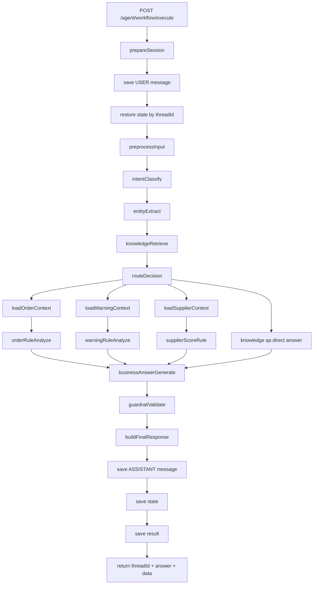

# 《Python版 AI Workflow 迁移傻瓜式落地手册（聚焦 /agent/workflow/execute 一比一迁移）》

> 这份文档只聚焦一条主路：
>
> ```text
> POST /agent/workflow/execute
> ```
>
> 你前面提到的三个原始接口：
>
> ```text
> POST /agent/diagnose/order
> POST /agent/warning/scan
> POST /agent/supplier/score
> ```
>
> 在这份文档里不再作为 Python 对外公开接口存在。
>
> 它们会被收进 workflow 内部，变成：
>
> ```text
> loadOrderContext + orderRuleAnalyze
> loadWarningContext + warningRuleAnalyze
> loadSupplierContext + supplierScoreRule
> ```
>
> 也就是说，这份手册不再教你“做三个 Python 原始 AI 接口”，而是教你“把这三种能力都收进 `/agent/workflow/execute` 这一条完整工作流里”。

---

## 0. 这份文档解决什么问题

这份文档解决的是一个非常具体的问题：

```text
你当前最需要的，不是把 SpringAI 的三个原始 AI 接口照抄成 Python。
你最需要的是把现有 SpringAI 的那条 workflow 主链路完整迁成 Python。
```

所以这次我们把目标收得非常窄，也非常实战：

```text
只做一条 Python 版 workflow 主入口：
POST /agent/workflow/execute
```

然后把你 Java / SpringAI 里现在真实存在的这些节点，一比一迁到 Python：

```text
PreprocessInputNode
IntentClassifyNode
EntityExtractNode
KnowledgeRetrieveNode
RouteDecisionNode
LoadOrderContextNode
OrderRuleAnalyzeNode
LoadWarningContextNode
WarningRuleAnalyzeNode
LoadSupplierContextNode
SupplierScoreRuleNode
BusinessAnswerGenerateNode
GuardrailValidateNode
BuildFinalResponseNode
```

### 0.1 为什么这次不再把三个原始接口作为重点

原因很简单：

```text
你真正对外要稳定使用的，是 workflow 主入口。
```

你 Java 代码里真实路线已经是：

```text
前端 / 调用方
    ↓
POST /agent/workflow/execute
    ↓
识别意图
    ↓
根据意图走订单诊断 / 预警扫描 / 供应商评分 / 知识问答
    ↓
返回统一 WorkflowAgentResponse
```

所以 Python 版最稳的迁移方式，不是先暴露三个分散接口，而是直接把最重要的主入口做出来。

### 0.2 这份文档最终要让你达到什么程度

看完并照着做完，你应该能达到这个程度：

```text
1. 能用 FastAPI 起一个 Python AI 服务
2. 能保留 threadId 连续对话语义
3. 能通过 Bearer Token 透传调 Java 库存后端
4. 能把 workflow 的 14 个节点完整跑通
5. 能做会话持久化
6. 能做工具调用留痕
7. 能做 state 恢复
8. 能跑通 /agent/workflow/execute
9. 能继续基于这份文档做 Java -> Python 一一对照迁移
```

### 0.3 第一版跑通后你会得到什么

你最终会得到一个 Python 项目：

```text
python_ai_workflow_service/
```

它对外核心接口只有：

```text
GET  /health
POST /agent/workflow/execute
GET  /agent/session/list
GET  /agent/session/messages/{threadId}
```

这里面：

```text
/health
    负责活性检查

/agent/workflow/execute
    负责全部 AI 主业务

/agent/session/list
/agent/session/messages/{threadId}
    负责查看连续对话和工作流留痕
```

也就是说，你最终得到的不是“一个 Python 杂项接口集合”，而是：

```text
一个 Python 版的 Workflow Agent 服务
```

---

## 1. 最终路线总览

这次路线不再是“先做 chat，再做三个接口”，而是：

```text
1. 创建 Python 项目
2. 安装依赖
3. 写配置
4. 写统一返回和异常
5. 写 Java 后端客户端 InventoryBackendClient
6. 写可替换 LLMClient
7. 写 MySQL 会话存储 SessionStore
8. 写 workflow 状态对象和 prompt
9. 写 14 个 workflow 节点
10. 写 WorkflowExecutor
11. 写 /agent/workflow/execute
12. 写 /agent/session/list
13. 写 /agent/session/messages/{threadId}
14. 本地启动
15. curl 跑完整工作流
16. 用相同 threadId 连续追问
17. 查看会话和消息落库
18. 排查常见错误
```

你可以把整条链理解成：



---

## 2. 技术选型说明

### 2.1 为什么还是 FastAPI

你是 Java 后端转 Python，FastAPI 对你最友好的地方不是“轻”，而是“像后端工程”。

对照关系：

| Java / Spring | Python / FastAPI |
| --- | --- |
| `@RestController` | `APIRouter` |
| `@RequestBody` | Pydantic model |
| `@RequestHeader` | `Header(...)` |
| `GlobalExceptionHandler` | `@app.exception_handler` |
| Swagger | `/docs` |

你可以把它理解为：

```text
非常像现代 Spring MVC 的 Python 版
```

### 2.2 为什么仍然用 Pydantic

因为 workflow 这条主链里对象特别多：

```text
WorkflowAgentRequest
WorkflowAgentResponse
WorkflowEntity
OrderSnapshotVO
OrderDiagnosisVO
WarningScanVO
SupplierScoreVO
RagSearchResultVO
AgentSessionVO
AgentMessageVO
```

这些对象如果不用 Pydantic，会很快乱掉。

Java 类比：

```text
Pydantic = DTO / VO + 参数校验 + JSON 映射
```

### 2.3 为什么 HTTPX 是必须的

Python workflow 服务不是自己直接查库存数据库。

它的定位是：

```text
AI 编排层
```

所以它必须通过 HTTP 调你现有 Java 库存系统接口。

这也是为什么这份文档最关键的文件之一是：

```text
InventoryBackendClient
```

它在 Java 里最像：

```text
Feign + WebClient + 统一响应解包
```

### 2.4 为什么这次要把会话持久化也一起做

因为你这次要的不是“单次问答”，而是：

```text
同一个 threadId 可以连续对话
工作流状态可以恢复
工具调用可以留痕
最终结构化结果可以回看
```

所以这次我们不再像上个版本那样只用进程内 dict。

这份文档会直接给你一个：

```text
MySQL 版 SessionStore
```

好处：

```text
1. 继续沿用你现有 MySQL，不额外引入 SQLite
2. 会话表结构和 Java 版 agent_session / agent_message / agent_session_state / agent_result 对齐
3. Python workflow 和 Java 后端可以围绕同一套会话数据演进
4. 后续如果要做会话列表、消息回放、结果审计，不需要再迁一次数据
5. RAG 仍然复用现有 Redis Stack，不把会话和向量检索混在一起
```

### 2.5 为什么 LangGraph 这次是真正主角

因为这次不是“workflow 概念讲解”，而是“workflow 工程落地”。

你 Java 里当前已经是状态图了：

```text
StateGraph
Node
StateKeys
ConditionalEdges
```

Python 里最像它的就是 LangGraph。

所以这次我们不会再把 workflow 简化成一个大 `if-else service`。

这次是：

```text
真正用 LangGraph 还原主链路
```

---

## 3. 项目目录结构

这次目录结构会比上个版本更偏 workflow。

```text
python_ai_workflow_service/
  requirements.txt
  .env.example
  README.md
  app/
    main.py
    core/
      config.py
      exceptions.py
      response.py
    api/
      routes/
        health.py
        agent.py
    schemas/
      common.py
      workflow.py
      diagnosis.py
      warning.py
      supplier.py
      rag.py
    clients/
      inventory_backend.py
      llm_client.py
    repositories/
      session_store.py
    services/
      rag_service.py
    workflows/
      state.py
      prompts.py
      workflow_executor.py
      nodes/
        preprocess_input.py
        intent_classify.py
        entity_extract.py
        knowledge_retrieve.py
        route_decision.py
        load_order_context.py
        order_rule_analyze.py
        load_warning_context.py
        warning_rule_analyze.py
        load_supplier_context.py
        supplier_score_rule.py
        business_answer_generate.py
        guardrail_validate.py
        build_final_response.py
```

### 3.1 每层像 Java 里的什么

| Python 目录 | Java 对应概念 | 说明 |
| --- | --- | --- |
| `api/routes` | `controller` | HTTP 接口层 |
| `schemas` | `dto/vo` | 请求、响应、状态对象 |
| `clients` | `Feign/WebClient` | 调 Java 后端和模型 |
| `repositories` | `mapper + session persistence` | 会话和消息存储 |
| `services` | `service` | 通用服务，当前主要是 RAG |
| `workflows/state.py` | `WorkflowStateKeys / WorkflowEntity / WorkflowIntent` | 状态定义 |
| `workflows/prompts.py` | `WorkflowPrompts.java` | workflow 提示词 |
| `workflows/nodes/*` | `node/*` | 一比一节点迁移 |
| `workflows/workflow_executor.py` | `ProcurementWorkflowExecutor + Config` | 图编排和执行 |

---

## 4. requirements.txt

先写这个，是因为 Python 项目没有 `pom.xml` 那种默认入口。

文件路径：

```text
python_ai_workflow_service/requirements.txt
```

完整代码：

```txt
fastapi>=0.115.0,<1.0.0
uvicorn[standard]>=0.34.0,<1.0.0
pydantic>=2.10.0,<3.0.0
pydantic-settings>=2.7.0,<3.0.0
httpx>=0.28.0,<1.0.0
pymysql>=1.1.1,<2.0.0
python-dotenv>=1.0.1,<2.0.0
langgraph>=0.2.60,<1.0.0
typing-extensions>=4.12.0,<5.0.0
```

依赖说明：

| 依赖 | 用途 |
| --- | --- |
| `fastapi` | Web 框架 |
| `uvicorn` | 本地运行服务器 |
| `pydantic` | DTO / VO / 校验 |
| `pydantic-settings` | `.env` 配置读取 |
| `httpx` | 调 Java 后端和模型服务 |
| `pymysql` | 直连 MySQL 保存 workflow 会话 |
| `python-dotenv` | 本地环境变量 |
| `langgraph` | workflow 图执行 |
| `typing-extensions` | 类型支持 |

---

## 5. .env.example

这次除了 Java 后端地址和模型配置，还要新增 MySQL 会话库配置。

文件路径：

```text
python_ai_workflow_service/.env.example
```

完整代码：

```env
APP_NAME=inventory-python-workflow-service
APP_ENV=dev

JAVA_BACKEND_BASE_URL=http://localhost:8080
JAVA_BACKEND_TIMEOUT=10

AI_DASHSCOPE_API_KEY=replace-with-your-dashscope-api-key
MODEL_API_KEY=
MODEL_BASE_URL=https://dashscope.aliyuncs.com/compatible-mode/v1
MODEL_NAME=qwen-plus
MODEL_TIMEOUT=30

MYSQL_HOST=localhost
MYSQL_PORT=3306
MYSQL_USER=root
MYSQL_PASSWORD=replace-with-your-mysql-password
MYSQL_DATABASE=inventory
MYSQL_CHARSET=utf8mb4
```

说明：

```text
MYSQL_DATABASE
    建议直接使用你现有 Java 后端使用的 inventory 库。

AI_DASHSCOPE_API_KEY
    兼容你现有 SpringAI / 百炼变量名。Python 版 config.py 会优先兼容这个名字。

MODEL_API_KEY
    作为兼容别名保留。如果你已经在其他项目里统一用 MODEL_API_KEY，也能继续复用。

agent_session / agent_message / agent_session_state / agent_result
    Python workflow 会写入这四张表，表结构和 Java 版会话持久化设计保持一致。

Redis Stack
    不在 .env 里额外配置。第一版 RAG 仍通过 Java /agent/rag/search 间接复用现有 Redis Stack。
```

### 5.1 `.env.example` 和 `.env` 到底怎么用

这一段必须看清楚：

```text
.env.example
    是模板文件
    会提交到 Git / GitHub
    只能放占位符
    不能放真实 API Key、真实数据库密码

.env
    是你本机真实配置
    程序运行时默认读取它
    一般不会提交到 Git
    真实 AI Key、真实 MySQL 密码必须写这里
```

正确做法：

1. 先把 [`.env.example`](D:/code/project/inventory/python_ai_workflow_service/.env.example) 写成模板。
2. 再复制一份生成 [`.env`](D:/code/project/inventory/python_ai_workflow_service/.env)。
3. 真实值只写进 [`.env`](D:/code/project/inventory/python_ai_workflow_service/.env)。

示例：

```text
.env.example
    AI_DASHSCOPE_API_KEY=replace-with-your-dashscope-api-key
    MYSQL_PASSWORD=replace-with-your-mysql-password

.env
    AI_DASHSCOPE_API_KEY=你的真实百炼key
    MYSQL_PASSWORD=你的真实MySQL密码
```

为什么必须这样做：

```text
因为项目根目录 .gitignore 会忽略 .env，
但不会忽略 .env.example。

所以：
.env.example 是给别人参考的模板
.env 才是你本机真正运行时使用的配置
```

---

## 6. 从零开始逐文件写代码

这一章是核心。

这次的节奏不是“先做三个业务接口”，而是：

```text
先把 workflow 工程骨架建起来
然后把 14 个节点一个一个补进去
最后只暴露 /agent/workflow/execute
```

### 6.1 app/main.py

这个文件干什么：

```text
启动 FastAPI，注册路由，注册全局异常处理。
```

为什么现在先写它：

```text
先把应用壳子搭起来，后面每写完一个接口都能马上试。
```

它在 Java / Spring 里像什么：

```text
Application 启动类 + GlobalExceptionHandler
```

文件路径：

```text
python_ai_workflow_service/app/main.py
```

完整代码：

```python
from fastapi import FastAPI, Request
from fastapi.responses import JSONResponse

from app.api.routes.agent import router as agent_router
from app.api.routes.health import router as health_router
from app.core.config import get_settings
from app.core.exceptions import ApiException
from app.core.response import fail


settings = get_settings()

app = FastAPI(
    title=settings.app_name,
    version="1.0.0",
    description="Python workflow agent service for inventory system.",
)


@app.exception_handler(ApiException)
async def api_exception_handler(request: Request, exc: ApiException):
    return JSONResponse(
        status_code=exc.http_status_code,
        content=fail(code=exc.code, msg=exc.msg, data=exc.data),
    )


@app.exception_handler(Exception)
async def common_exception_handler(request: Request, exc: Exception):
    return JSONResponse(
        status_code=500,
        content=fail(code=500, msg=f"Python workflow 服务异常：{exc}", data=None),
    )


app.include_router(health_router)
app.include_router(agent_router)
```

### 6.2 app/core/config.py

这个文件干什么：

```text
统一读取 .env。
```

为什么现在先写它：

```text
InventoryBackendClient、LLMClient、SessionStore 都要用配置。
```

它在 Java / Spring 里像什么：

```text
application.yml + @ConfigurationProperties
```

文件路径：

```text
python_ai_workflow_service/app/core/config.py
```

完整代码：

```python
from functools import lru_cache

from pydantic import AliasChoices, Field
from pydantic_settings import BaseSettings, SettingsConfigDict


class Settings(BaseSettings):
    model_config = SettingsConfigDict(
        env_file=".env",
        env_file_encoding="utf-8",
        extra="ignore",
    )

    app_name: str = "inventory-python-workflow-service"
    app_env: str = "dev"

    java_backend_base_url: str = "http://localhost:8080"
    java_backend_timeout: float = 10.0

    model_api_key: str = Field(
        default="",
        validation_alias=AliasChoices("MODEL_API_KEY", "AI_DASHSCOPE_API_KEY"),
    )
    model_base_url: str = "https://dashscope.aliyuncs.com/compatible-mode/v1"
    model_name: str = "qwen-plus"
    model_timeout: float = 30.0

    mysql_host: str = "localhost"
    mysql_port: int = 3306
    mysql_user: str = "root"
    mysql_password: str = ""
    mysql_database: str = "inventory"
    mysql_charset: str = "utf8mb4"


@lru_cache
def get_settings() -> Settings:
    return Settings()
```

### 6.3 app/core/exceptions.py

这个文件干什么：

```text
统一定义业务异常。
```

为什么现在先写它：

```text
Java 后端不能只看 HTTP 状态，要看 code/msg/data。
Python 自己也要保持统一异常出口。
```

它在 Java / Spring 里像什么：

```text
BusinessException + GlobalExceptionHandler
```

文件路径：

```text
python_ai_workflow_service/app/core/exceptions.py
```

完整代码：

```python
from typing import Any


class ApiException(Exception):
    def __init__(
        self,
        code: int = 500,
        msg: str = "系统异常",
        data: Any = None,
        http_status_code: int | None = None,
    ):
        super().__init__(msg)
        self.code = code
        self.msg = msg
        self.data = data
        self.http_status_code = http_status_code if http_status_code is not None else self._guess_http_status(code)

    @staticmethod
    def _guess_http_status(code: int) -> int:
        if code in (401, 403):
            return code
        return 200


class BackendBusinessException(ApiException):
    pass


class BackendHttpException(ApiException):
    def __init__(self, msg: str, data: Any = None):
        super().__init__(code=500, msg=msg, data=data, http_status_code=500)
```

### 6.4 app/core/response.py

这个文件干什么：

```text
统一返回 code / msg / data。
```

为什么现在先写它：

```text
你现有系统已经习惯这个返回结构了，Python 版不要改接口风格。
```

它在 Java / Spring 里像什么：

```text
Result.java
```

文件路径：

```text
python_ai_workflow_service/app/core/response.py
```

完整代码：

```python
from typing import Any

from fastapi.encoders import jsonable_encoder


def success(data: Any = None, msg: str = "success") -> dict[str, Any]:
    return {
        "code": 200,
        "msg": msg,
        "data": jsonable_encoder(data, by_alias=True),
    }


def fail(code: int = 500, msg: str = "系统异常", data: Any = None) -> dict[str, Any]:
    return {
        "code": code,
        "msg": msg,
        "data": jsonable_encoder(data, by_alias=True),
    }
```

### 6.5 app/schemas/common.py

这个文件干什么：

```text
放通用 BaseModel 和当前用户对象。
```

为什么现在先写它：

```text
workflow 执行前要先通过 Bearer Token 拿当前用户信息。
```

它在 Java / Spring 里像什么：

```text
公共 DTO / VO 基类 + CurrentUserVO
```

文件路径：

```text
python_ai_workflow_service/app/schemas/common.py
```

完整代码：

```python
from pydantic import BaseModel, ConfigDict, Field


class ApiModel(BaseModel):
    model_config = ConfigDict(populate_by_name=True, arbitrary_types_allowed=True)


class CurrentUserVO(ApiModel):
    id: int
    username: str | None = None
    name: str | None = None
    dept: str | None = None
    status: str | None = None
    role_codes: list[str] = Field(default_factory=list, alias="roleCodes")
```

### 6.6 app/schemas/workflow.py

这个文件干什么：

```text
定义 workflow 请求、响应、会话对象、消息对象。
```

为什么现在先写它：

```text
这次主角就是 workflow，所以这些对象是最先要对齐的。
```

它在 Java / Spring 里像什么：

```text
WorkflowAgentRequest
WorkflowAgentResponse
AgentSessionVO
AgentMessageVO
```

文件路径：

```text
python_ai_workflow_service/app/schemas/workflow.py
```

完整代码：

```python
from typing import Any

from pydantic import Field

from app.schemas.common import ApiModel


class WorkflowAgentRequest(ApiModel):
    message: str | None = None
    thread_id: str | None = Field(default=None, alias="threadId")


class WorkflowAgentResponse(ApiModel):
    session_id: int | None = Field(default=None, alias="sessionId")
    thread_id: str = Field(alias="threadId")
    intent: str
    answer: str
    current_stage: str | None = Field(default=None, alias="currentStage")
    risk_level: str | None = Field(default=None, alias="riskLevel")
    suggest_owner: str | None = Field(default=None, alias="suggestOwner")
    suggest_action: str | None = Field(default=None, alias="suggestAction")
    evidence: list[str] | None = None
    data: Any = None


class AgentSessionVO(ApiModel):
    id: int
    session_no: str = Field(alias="sessionNo")
    thread_id: str = Field(alias="threadId")
    user_id: int = Field(alias="userId")
    title: str | None = None
    agent_type: str = Field(alias="agentType")
    current_intent: str | None = Field(default=None, alias="currentIntent")
    status: str
    last_message_time: str | None = Field(default=None, alias="lastMessageTime")
    create_time: str | None = Field(default=None, alias="createTime")


class AgentMessageVO(ApiModel):
    id: int
    session_id: int = Field(alias="sessionId")
    thread_id: str = Field(alias="threadId")
    message_role: str = Field(alias="messageRole")
    message_type: str = Field(alias="messageType")
    content: str | None = None
    create_time: str | None = Field(default=None, alias="createTime")
```

### 6.7 app/schemas/diagnosis.py

这个文件干什么：

```text
定义订单快照和订单诊断结果。
```

为什么现在先写它：

```text
订单诊断虽然不再公开成接口，但依然是 workflow 的一个核心分支。
```

它在 Java / Spring 里像什么：

```text
OrderSnapshotVO
OrderDiagnosisVO
```

文件路径：

```text
python_ai_workflow_service/app/schemas/diagnosis.py
```

完整代码：

```python
from decimal import Decimal

from pydantic import Field

from app.schemas.common import ApiModel


class OrderSnapshotVO(ApiModel):
    order_id: int | None = Field(default=None, alias="orderId")
    order_no: str | None = Field(default=None, alias="orderNo")
    status: str | None = None
    supplier_id: int | None = Field(default=None, alias="supplierId")
    supplier_name: str | None = Field(default=None, alias="supplierName")
    total_order_number: Decimal = Field(default=Decimal("0"), alias="totalOrderNumber")
    total_arrive_number: Decimal = Field(default=Decimal("0"), alias="totalArriveNumber")
    total_inbound_number: Decimal = Field(default=Decimal("0"), alias="totalInboundNumber")
    arrival_count: int = Field(default=0, alias="arrivalCount")
    inbound_count: int = Field(default=0, alias="inboundCount")


class OrderDiagnosisVO(ApiModel):
    order_no: str | None = Field(default=None, alias="orderNo")
    current_stage: str | None = Field(default=None, alias="currentStage")
    block_reason: str | None = Field(default=None, alias="blockReason")
    evidence: list[str] = Field(default_factory=list)
    suggest_owner: str | None = Field(default=None, alias="suggestOwner")
    suggest_action: str | None = Field(default=None, alias="suggestAction")
    ai_summary: str | None = Field(default=None, alias="aiSummary")
```

### 6.8 app/schemas/warning.py

这个文件干什么：

```text
定义预警快照、风险项、扫描结果。
```

为什么现在先写它：

```text
预警扫描这条分支在 workflow 里是完整节点链，不再是对外接口。
```

它在 Java / Spring 里像什么：

```text
WarningSnapshotVO
WarningItemVO
WarningScanVO
```

文件路径：

```text
python_ai_workflow_service/app/schemas/warning.py
```

完整代码：

```python
from pydantic import Field

from app.schemas.common import ApiModel


class WarningSnapshotVO(ApiModel):
    biz_id: int | None = Field(default=None, alias="bizId")
    biz_no: str | None = Field(default=None, alias="bizNo")
    status: str | None = None
    supplier_id: int | None = Field(default=None, alias="supplierId")
    supplier_name: str | None = Field(default=None, alias="supplierName")
    warehouse_id: int | None = Field(default=None, alias="warehouseId")
    warehouse_name: str | None = Field(default=None, alias="warehouseName")
    last_operate_time: str | None = Field(default=None, alias="lastOperateTime")
    overdue_days: int = Field(default=0, alias="overdueDays")


class WarningItemVO(ApiModel):
    risk_level: str = Field(alias="riskLevel")
    biz_type: str = Field(alias="bizType")
    biz_id: int | None = Field(default=None, alias="bizId")
    biz_no: str | None = Field(default=None, alias="bizNo")
    problem: str
    reason: str
    suggest_owner: str = Field(alias="suggestOwner")
    suggest_action: str = Field(alias="suggestAction")


class WarningScanVO(ApiModel):
    summary: str
    items: list[WarningItemVO] = Field(default_factory=list)
    ai_summary: str | None = Field(default=None, alias="aiSummary")
```

### 6.9 app/schemas/supplier.py

这个文件干什么：

```text
定义供应商指标和评分结果。
```

为什么现在先写它：

```text
供应商评分不再单独暴露接口，但 workflow 分支里必须保留这个结构。
```

它在 Java / Spring 里像什么：

```text
SupplierPerformanceMetricsVO
SupplierScoreVO
```

文件路径：

```text
python_ai_workflow_service/app/schemas/supplier.py
```

完整代码：

```python
from pydantic import Field

from app.schemas.common import ApiModel


class SupplierPerformanceMetricsVO(ApiModel):
    supplier_id: int | None = Field(default=None, alias="supplierId")
    supplier_name: str | None = Field(default=None, alias="supplierName")
    total_order_count: int = Field(default=0, alias="totalOrderCount")
    completed_order_count: int = Field(default=0, alias="completedOrderCount")
    cancelled_order_count: int = Field(default=0, alias="cancelledOrderCount")
    abnormal_arrival_count: int = Field(default=0, alias="abnormalArrivalCount")
    total_arrival_count: int = Field(default=0, alias="totalArrivalCount")
    confirm_rate: float = Field(default=0.0, alias="confirmRate")
    arrival_completion_rate: float = Field(default=0.0, alias="arrivalCompletionRate")
    inbound_completion_rate: float = Field(default=0.0, alias="inboundCompletionRate")
    abnormal_arrival_rate: float = Field(default=0.0, alias="abnormalArrivalRate")


class SupplierScoreVO(ApiModel):
    supplier_id: int | None = Field(default=None, alias="supplierId")
    supplier_name: str | None = Field(default=None, alias="supplierName")
    score: int = 0
    level: str = "数据不足"
    confirm_rate: str = Field(default="0.00%", alias="confirmRate")
    arrival_completion_rate: str = Field(default="0.00%", alias="arrivalCompletionRate")
    inbound_completion_rate: str = Field(default="0.00%", alias="inboundCompletionRate")
    abnormal_arrival_rate: str = Field(default="0.00%", alias="abnormalArrivalRate")
    analysis: str | None = None
    suggestion: str | None = None
```

### 6.10 app/schemas/rag.py

这个文件干什么：

```text
定义 RAG 检索结果。
```

为什么现在先写它：

```text
workflow 在 route 前统一调用 knowledgeRetrieve，所以需要 RAG 对象。
```

它在 Java / Spring 里像什么：

```text
RagSearchRequest
RagSearchResultVO
```

文件路径：

```text
python_ai_workflow_service/app/schemas/rag.py
```

完整代码：

```python
from pydantic import Field

from app.schemas.common import ApiModel


class RagSearchRequest(ApiModel):
    query: str | None = None
    biz_intent: str | None = Field(default=None, alias="bizIntent")
    top_k: int | None = Field(default=None, alias="topK")


class RagSearchResultVO(ApiModel):
    id: str | None = None
    doc_code: str | None = Field(default=None, alias="docCode")
    title: str | None = None
    doc_type: str | None = Field(default=None, alias="docType")
    biz_intent: str | None = Field(default=None, alias="bizIntent")
    source_path: str | None = Field(default=None, alias="sourcePath")
    chunk_no: int | None = Field(default=None, alias="chunkNo")
    content: str | None = None
    score: float | None = None
```

### 6.11 app/clients/inventory_backend.py

这个文件干什么：

```text
统一调 Java 后端，自动透传 Bearer Token，自动判断 code/msg/data。
```

为什么现在先写它：

```text
这份 workflow 文档里，所有业务上下文都来自 Java 后端。
没有它，后面的节点都是空架子。
```

它在 Java / Spring 里像什么：

```text
FeignClient / WebClient / API gateway client
```

文件路径：

```text
python_ai_workflow_service/app/clients/inventory_backend.py
```

完整代码：

```python
from typing import Any

import httpx

from app.core.config import get_settings
from app.core.exceptions import ApiException, BackendBusinessException, BackendHttpException
from app.schemas.common import CurrentUserVO


class InventoryBackendClient:
    def __init__(self):
        self.settings = get_settings()

    def _headers(self, authorization: str | None) -> dict[str, str]:
        if not authorization:
            raise ApiException(code=401, msg="未登录或者登录已失效", http_status_code=401)
        if not authorization.startswith("Bearer "):
            raise ApiException(code=401, msg="Authorization 必须使用 Bearer Token", http_status_code=401)
        return {
            "Authorization": authorization,
            "Content-Type": "application/json",
        }

    async def _request(
        self,
        method: str,
        path: str,
        authorization: str | None,
        params: dict[str, Any] | None = None,
        json: dict[str, Any] | None = None,
    ) -> Any:
        url = self.settings.java_backend_base_url.rstrip("/") + path
        headers = self._headers(authorization)

        try:
            async with httpx.AsyncClient(timeout=self.settings.java_backend_timeout) as client:
                response = await client.request(
                    method=method,
                    url=url,
                    headers=headers,
                    params=params,
                    json=json,
                )
        except httpx.RequestError as exc:
            raise BackendHttpException(f"请求 Java 后端失败：{exc}") from exc

        if response.status_code in (401, 403):
            try:
                body = response.json()
                raise ApiException(
                    code=int(body.get("code", response.status_code)),
                    msg=body.get("msg", response.text),
                    data=body.get("data"),
                    http_status_code=response.status_code,
                )
            except ValueError:
                raise ApiException(code=response.status_code, msg=response.text, http_status_code=response.status_code)

        if response.status_code >= 400:
            raise BackendHttpException(f"Java 后端 HTTP 异常：{response.status_code} {response.text}")

        try:
            body = response.json()
        except ValueError as exc:
            raise BackendHttpException(f"Java 后端返回非 JSON：{response.text}") from exc

        if not isinstance(body, dict) or "code" not in body:
            raise BackendHttpException(f"Java 后端返回不是标准 Result 结构：{body}")

        code = int(body.get("code", 500))
        msg = body.get("msg") or "Java 后端业务异常"
        data = body.get("data")
        if code != 200:
            raise BackendBusinessException(code=code, msg=msg, data=data)
        return data

    async def get_current_user(self, authorization: str | None) -> CurrentUserVO:
        data = await self._request("GET", "/auth/me", authorization)
        return CurrentUserVO(**data)

    async def get_purchase_order_by_order_no(self, order_no: str, authorization: str) -> dict[str, Any] | None:
        data = await self._request(
            "GET",
            "/purchaseOrder/getPurchaseOrderPage",
            authorization,
            params={"pageNum": 1, "pageSize": 1, "orderNo": order_no},
        )
        if not isinstance(data, dict):
            return None
        records = data.get("records") or []
        return records[0] if records else None

    async def list_purchase_orders(
        self,
        authorization: str,
        status: str | None = None,
        supplier_name: str | None = None,
        page_size: int = 200,
    ) -> list[dict[str, Any]]:
        params: dict[str, Any] = {"pageNum": 1, "pageSize": page_size}
        if status:
            params["status"] = status
        if supplier_name:
            params["supplierName"] = supplier_name
        data = await self._request("GET", "/purchaseOrder/getPurchaseOrderPage", authorization, params=params)
        if not isinstance(data, dict):
            return []
        return data.get("records") or []

    async def get_purchase_order_items(self, order_id: int, authorization: str) -> list[dict[str, Any]]:
        data = await self._request(
            "GET",
            f"/purchaseOrderItem/getPurchaseOrderItemByOrderId/{order_id}",
            authorization,
        )
        return data if isinstance(data, list) else []

    async def list_arrivals(
        self,
        authorization: str,
        order_no: str | None = None,
        page_size: int = 200,
    ) -> list[dict[str, Any]]:
        params: dict[str, Any] = {"pageNum": 1, "pageSize": page_size}
        if order_no:
            params["orderNo"] = order_no
        data = await self._request("GET", "/arrival/getArrivalPage", authorization, params=params)
        if not isinstance(data, dict):
            return []
        return data.get("records") or []

    async def list_inbounds(
        self,
        authorization: str,
        order_no: str | None = None,
        arrival_no: str | None = None,
        status: str | None = None,
        page_size: int = 200,
    ) -> list[dict[str, Any]]:
        params: dict[str, Any] = {"pageNum": 1, "pageSize": page_size}
        if order_no:
            params["orderNo"] = order_no
        if arrival_no:
            params["arrivalNo"] = arrival_no
        if status:
            params["status"] = status
        data = await self._request("GET", "/inbound/getInboundPage", authorization, params=params)
        if not isinstance(data, dict):
            return []
        return data.get("records") or []

    async def list_suppliers(self, authorization: str, page_size: int = 200) -> list[dict[str, Any]]:
        data = await self._request(
            "GET",
            "/supplier/getSupplierPage",
            authorization,
            params={"pageNum": 1, "pageSize": page_size},
        )
        if not isinstance(data, dict):
            return []
        return data.get("records") or []

    async def get_supplier_by_id(self, supplier_id: int, authorization: str) -> dict[str, Any] | None:
        suppliers = await self.list_suppliers(authorization)
        for supplier in suppliers:
            if int(supplier.get("id", 0)) == int(supplier_id):
                return supplier
        return None

    async def rag_search(self, payload: dict[str, Any], authorization: str) -> list[dict[str, Any]]:
        data = await self._request("POST", "/agent/rag/search", authorization, json=payload)
        return data if isinstance(data, list) else []
```

### 6.12 app/clients/llm_client.py

这个文件干什么：

```text
封装可替换的大模型客户端。
```

为什么现在先写它：

```text
IntentClassifyNode 和 BusinessAnswerGenerateNode 都依赖模型调用。
```

它在 Java / Spring 里像什么：

```text
ChatClient / ChatModel
```

文件路径：

```text
python_ai_workflow_service/app/clients/llm_client.py
```

完整代码：

```python
import httpx

from app.core.config import get_settings
from app.core.exceptions import ApiException


class LLMClient:
    def __init__(self):
        self.settings = get_settings()

    async def chat_text(self, system_prompt: str, user_prompt: str, temperature: float = 0.2) -> str:
        if not self.settings.model_api_key or self.settings.model_api_key in (
            "replace-with-your-api-key",
            "replace-with-your-dashscope-api-key",
        ):
            return "LLM 未配置 MODEL_API_KEY / AI_DASHSCOPE_API_KEY，当前返回本地占位文本。"

        url = self.settings.model_base_url.rstrip("/") + "/chat/completions"
        payload = {
            "model": self.settings.model_name,
            "temperature": temperature,
            "messages": [
                {"role": "system", "content": system_prompt},
                {"role": "user", "content": user_prompt},
            ],
        }
        headers = {
            "Authorization": f"Bearer {self.settings.model_api_key}",
            "Content-Type": "application/json",
        }

        try:
            async with httpx.AsyncClient(timeout=self.settings.model_timeout) as client:
                response = await client.post(url, headers=headers, json=payload)
        except httpx.RequestError as exc:
            raise ApiException(code=500, msg=f"请求模型服务失败：{exc}", http_status_code=500) from exc

        if response.status_code >= 400:
            raise ApiException(code=500, msg=f"模型服务 HTTP 异常：{response.status_code} {response.text}", http_status_code=500)

        body = response.json()
        choices = body.get("choices") or []
        if not choices:
            raise ApiException(code=500, msg=f"模型服务响应缺少 choices：{body}", http_status_code=500)

        message = choices[0].get("message") or {}
        content = message.get("content")
        if not content:
            raise ApiException(code=500, msg=f"模型服务响应缺少 content：{body}", http_status_code=500)
        return content
```

### 6.13 app/repositories/session_store.py

这个文件干什么：

```text
负责 workflow 会话、消息、状态、结果持久化。
```

为什么现在先写它：

```text
因为这次重点就是完整 workflow，不做持久化就不叫完整链路。
```

它在 Java / Spring 里像什么：

```text
AgentSessionService + agent_session/agent_message/agent_session_state/agent_result
```

文件路径：

```text
python_ai_workflow_service/app/repositories/session_store.py
```

完整代码：

```python
import json
import uuid
from datetime import datetime
from typing import Any

import pymysql
from pymysql.cursors import DictCursor

from app.core.config import get_settings
from app.core.exceptions import ApiException
from app.schemas.workflow import WorkflowAgentResponse


class SessionStore:
    def __init__(self):
        self.settings = get_settings()
        self._init_db()

    def _conn(self):
        return pymysql.connect(
            host=self.settings.mysql_host,
            port=self.settings.mysql_port,
            user=self.settings.mysql_user,
            password=self.settings.mysql_password,
            database=self.settings.mysql_database,
            charset=self.settings.mysql_charset,
            autocommit=True,
            cursorclass=DictCursor,
        )

    def _init_db(self) -> None:
        ddl_list = [
            """
            create table if not exists agent_session (
                id bigint primary key auto_increment,
                session_no varchar(64) not null unique,
                thread_id varchar(128) not null unique,
                user_id bigint not null,
                title varchar(128) default null,
                agent_type varchar(64) not null default 'WORKFLOW_AGENT',
                current_intent varchar(64) default null,
                status varchar(32) not null default 'ACTIVE',
                last_message_time datetime default null,
                create_time datetime not null default current_timestamp,
                update_time datetime not null default current_timestamp on update current_timestamp,
                deleted tinyint(1) not null default 0,
                key idx_agent_session_user (user_id),
                key idx_agent_session_time (last_message_time)
            ) engine=innodb default charset=utf8mb4 collate=utf8mb4_unicode_ci
            """,
            """
            create table if not exists agent_message (
                id bigint primary key auto_increment,
                session_id bigint not null,
                thread_id varchar(128) not null,
                message_role varchar(32) not null,
                message_type varchar(32) not null,
                content text default null,
                node_name varchar(128) default null,
                tool_name varchar(128) default null,
                tool_request_json mediumtext default null,
                tool_response_json mediumtext default null,
                create_time datetime not null default current_timestamp,
                deleted tinyint(1) not null default 0,
                key idx_agent_message_session (session_id),
                key idx_agent_message_thread (thread_id),
                key idx_agent_message_time (create_time)
            ) engine=innodb default charset=utf8mb4 collate=utf8mb4_unicode_ci
            """,
            """
            create table if not exists agent_session_state (
                id bigint primary key auto_increment,
                session_id bigint not null unique,
                thread_id varchar(128) not null unique,
                current_node varchar(128) default null,
                current_intent varchar(64) default null,
                state_json mediumtext default null,
                create_time datetime not null default current_timestamp,
                update_time datetime not null default current_timestamp on update current_timestamp,
                deleted tinyint(1) not null default 0
            ) engine=innodb default charset=utf8mb4 collate=utf8mb4_unicode_ci
            """,
            """
            create table if not exists agent_result (
                id bigint primary key auto_increment,
                session_id bigint not null,
                thread_id varchar(128) not null,
                agent_type varchar(64) not null default 'WORKFLOW_AGENT',
                biz_type varchar(64) default null,
                biz_id bigint default null,
                biz_no varchar(64) default null,
                result_json mediumtext default null,
                summary varchar(1000) default null,
                create_time datetime not null default current_timestamp,
                deleted tinyint(1) not null default 0,
                key idx_agent_result_session (session_id),
                key idx_agent_result_thread (thread_id),
                key idx_agent_result_biz (biz_type, biz_id)
            ) engine=innodb default charset=utf8mb4 collate=utf8mb4_unicode_ci
            """,
        ]

        with self._conn() as conn:
            with conn.cursor() as cur:
                for ddl in ddl_list:
                    cur.execute(ddl)

    def prepare_session(self, thread_id: str | None, user_id: int, first_message: str | None) -> dict[str, Any]:
        if user_id is None:
            raise ApiException(code=401, msg="请先登录", http_status_code=401)

        with self._conn() as conn:
            with conn.cursor() as cur:
                if thread_id:
                    cur.execute(
                        "select * from agent_session where thread_id = %s and deleted = 0",
                        (thread_id,),
                    )
                    row = cur.fetchone()
                    if row is not None:
                        if int(row["user_id"]) != int(user_id):
                            raise ApiException(code=403, msg="无权访问该会话", http_status_code=403)
                        return row

                now = self._now()
                real_thread_id = thread_id or f"agt-{uuid.uuid4().hex}"
                session_no = "AS" + datetime.now().strftime("%Y%m%d%H%M%S%f")[:-3]
                cur.execute(
                    """
                    insert into agent_session (
                        session_no, thread_id, user_id, title, agent_type, status,
                        last_message_time, create_time, update_time
                    ) values (%s, %s, %s, %s, %s, %s, %s, %s, %s)
                    """,
                    (
                        session_no,
                        real_thread_id,
                        user_id,
                        self._build_title(first_message),
                        "WORKFLOW_AGENT",
                        "ACTIVE",
                        now,
                        now,
                        now,
                    ),
                )
                cur.execute(
                    "select * from agent_session where thread_id = %s and deleted = 0",
                    (real_thread_id,),
                )
                return cur.fetchone()

    def save_user_message(self, session: dict[str, Any], content: str | None) -> None:
        self._save_message(session, "USER", "TEXT", content=content)

    def save_assistant_message(self, session: dict[str, Any], content: str | None) -> None:
        self._save_message(session, "ASSISTANT", "TEXT", content=content)

    def save_tool_message(
        self,
        thread_id: str,
        tool_name: str,
        tool_request_json: str,
        tool_response_json: str,
    ) -> None:
        with self._conn() as conn:
            with conn.cursor() as cur:
                cur.execute(
                    "select * from agent_session where thread_id = %s and deleted = 0",
                    (thread_id,),
                )
                row = cur.fetchone()
                if row is None:
                    return
        self._save_message(
            row,
            "TOOL",
            "TOOL_RESULT",
            tool_name=tool_name,
            tool_request_json=tool_request_json,
            tool_response_json=tool_response_json,
        )

    def save_state(
        self,
        session: dict[str, Any],
        current_node: str,
        current_intent: str | None,
        state_data: dict[str, Any],
    ) -> None:
        safe_state = dict(state_data)
        safe_state.pop("authorization", None)
        safe_state.pop("finalResponse", None)
        safe_state_json = self._to_json(safe_state)
        now = self._now()

        with self._conn() as conn:
            with conn.cursor() as cur:
                cur.execute(
                    """
                    insert into agent_session_state (
                        session_id, thread_id, current_node, current_intent, state_json, create_time, update_time
                    ) values (%s, %s, %s, %s, %s, %s, %s)
                    on duplicate key update
                        current_node = values(current_node),
                        current_intent = values(current_intent),
                        state_json = values(state_json),
                        update_time = values(update_time),
                        deleted = 0
                    """,
                    (
                        session["id"],
                        session["thread_id"],
                        current_node,
                        current_intent,
                        safe_state_json,
                        now,
                        now,
                    ),
                )

    def load_state_by_thread_id(self, thread_id: str | None) -> dict[str, Any]:
        if not thread_id:
            return {}

        with self._conn() as conn:
            with conn.cursor() as cur:
                cur.execute(
                    "select state_json from agent_session_state where thread_id = %s and deleted = 0",
                    (thread_id,),
                )
                row = cur.fetchone()
                if row is None or not row["state_json"]:
                    return {}

        try:
            raw = json.loads(row["state_json"])
        except json.JSONDecodeError:
            return {}

        restored: dict[str, Any] = {}
        if "intent" in raw:
            restored["intent"] = raw["intent"]
        if "entity" in raw:
            restored["entity"] = raw["entity"]
        return restored

    def save_result(self, session: dict[str, Any], response: WorkflowAgentResponse) -> None:
        if response.data is None:
            return

        biz_type = None
        biz_id = None
        biz_no = None

        if response.intent == "ORDER_DIAGNOSIS":
            biz_type = "PURCHASE_ORDER"
            if isinstance(response.data, dict):
                biz_no = response.data.get("orderNo")
        elif response.intent == "WARNING_SCAN":
            biz_type = "WARNING_SCAN"
        elif response.intent == "SUPPLIER_SCORE":
            biz_type = "SUPPLIER"
            if isinstance(response.data, dict):
                biz_id = response.data.get("supplierId")

        with self._conn() as conn:
            with conn.cursor() as cur:
                cur.execute(
                    """
                    insert into agent_result (
                        session_id, thread_id, agent_type, biz_type, biz_id, biz_no,
                        result_json, summary, create_time
                    ) values (%s, %s, %s, %s, %s, %s, %s, %s, %s)
                    """,
                    (
                        session["id"],
                        session["thread_id"],
                        "WORKFLOW_AGENT",
                        biz_type,
                        biz_id,
                        biz_no,
                        self._to_json(response.model_dump(by_alias=True)),
                        response.answer,
                        self._now(),
                    ),
                )

    def update_session_intent(self, session_id: int, current_intent: str | None) -> None:
        now = self._now()
        with self._conn() as conn:
            with conn.cursor() as cur:
                cur.execute(
                    """
                    update agent_session
                    set current_intent = %s, last_message_time = %s, update_time = %s
                    where id = %s and deleted = 0
                    """,
                    (current_intent, now, now, session_id),
                )

    def list_sessions(self, user_id: int) -> list[dict[str, Any]]:
        with self._conn() as conn:
            with conn.cursor() as cur:
                cur.execute(
                    """
                    select id, session_no, thread_id, user_id, title, agent_type,
                           current_intent, status, last_message_time, create_time
                    from agent_session
                    where user_id = %s and deleted = 0
                    order by last_message_time desc, id desc
                    """,
                    (user_id,),
                )
                return cur.fetchall()

    def get_messages(self, thread_id: str, user_id: int) -> list[dict[str, Any]]:
        with self._conn() as conn:
            with conn.cursor() as cur:
                cur.execute(
                    """
                    select * from agent_session
                    where thread_id = %s and user_id = %s and deleted = 0
                    """,
                    (thread_id, user_id),
                )
                session = cur.fetchone()
                if session is None:
                    raise ApiException(code=403, msg="无权访问该会话", http_status_code=403)

                cur.execute(
                    """
                    select id, session_id, thread_id, message_role, message_type, content, create_time
                    from agent_message
                    where thread_id = %s and deleted = 0
                    order by create_time asc, id asc
                    """,
                    (thread_id,),
                )
                return cur.fetchall()

    def _save_message(
        self,
        session: dict[str, Any],
        role: str,
        message_type: str,
        content: str | None = None,
        node_name: str | None = None,
        tool_name: str | None = None,
        tool_request_json: str | None = None,
        tool_response_json: str | None = None,
    ) -> None:
        now = self._now()
        with self._conn() as conn:
            with conn.cursor() as cur:
                cur.execute(
                    """
                    insert into agent_message (
                        session_id, thread_id, message_role, message_type, content,
                        node_name, tool_name, tool_request_json, tool_response_json, create_time
                    ) values (%s, %s, %s, %s, %s, %s, %s, %s, %s, %s)
                    """,
                    (
                        session["id"],
                        session["thread_id"],
                        role,
                        message_type,
                        content,
                        node_name,
                        tool_name,
                        tool_request_json,
                        tool_response_json,
                        now,
                    ),
                )
                cur.execute(
                    """
                    update agent_session
                    set last_message_time = %s, update_time = %s
                    where id = %s and deleted = 0
                    """,
                    (now, now, session["id"]),
                )

    def _build_title(self, message: str | None) -> str:
        if not message or not message.strip():
            return "新会话"
        return message.strip()[:30]

    def _to_json(self, value: Any) -> str:
        return json.dumps(value, ensure_ascii=False, default=str)

    def _now(self) -> datetime:
        return datetime.now()
```

### 6.14 app/services/rag_service.py

这个文件干什么：

```text
统一封装 workflow 内部的知识检索。
```

为什么现在先写它：

```text
KnowledgeRetrieveNode 需要一个简单稳定的调用入口，不要直接在节点里散落 HTTP 调用。
```

它在 Java / Spring 里像什么：

```text
AgentRagService
```

文件路径：

```text
python_ai_workflow_service/app/services/rag_service.py
```

完整代码：

```python
from app.clients.inventory_backend import InventoryBackendClient
from app.schemas.rag import RagSearchRequest, RagSearchResultVO


class RagService:
    def __init__(self, backend: InventoryBackendClient):
        self.backend = backend

    async def search_internal(
        self,
        query: str,
        biz_intent: str | None,
        top_k: int,
        authorization: str,
    ) -> list[RagSearchResultVO]:
        request = RagSearchRequest(query=query, bizIntent=biz_intent, topK=top_k)
        rows = await self.backend.rag_search(request.model_dump(by_alias=True), authorization)
        return [RagSearchResultVO(**row) for row in rows]
```

### 6.15 app/workflows/state.py

这个文件干什么：

```text
统一定义 workflow intent、entity、state keys。
```

为什么现在先写它：

```text
这一步是 workflow 的“字典协议”。没有统一 key，节点之间根本连不起来。
```

它在 Java / Spring 里像什么：

```text
WorkflowIntent
WorkflowEntity
WorkflowStateKeys
```

文件路径：

```text
python_ai_workflow_service/app/workflows/state.py
```

完整代码：

```python
from enum import Enum
from typing import Any, TypedDict

from pydantic import Field

from app.schemas.common import ApiModel


class WorkflowIntent(str, Enum):
    ORDER_DIAGNOSIS = "ORDER_DIAGNOSIS"
    WARNING_SCAN = "WARNING_SCAN"
    SUPPLIER_SCORE = "SUPPLIER_SCORE"
    KNOWLEDGE_QA = "KNOWLEDGE_QA"
    UNKNOWN = "UNKNOWN"


class WorkflowEntity(ApiModel):
    order_no: str | None = Field(default=None, alias="orderNo")
    supplier_id: int | None = Field(default=None, alias="supplierId")
    days: int | None = None
    material_code: str | None = Field(default=None, alias="materialCode")
    warehouse_id: int | None = Field(default=None, alias="warehouseId")


class WorkflowStateKeys:
    MESSAGE = "message"
    THREAD_ID = "threadId"
    AUTHORIZATION = "authorization"
    USER_ID = "userId"
    NORMALIZED_MESSAGE = "normalizedMessage"
    INTENT = "intent"
    ENTITY = "entity"
    RAG_DOCS = "ragDocs"
    ORDER_SNAPSHOT = "orderSnapshot"
    ORDER_DIAGNOSIS = "orderDiagnosis"
    WARNING_CONTEXT = "warningContext"
    WARNING_ANALYSIS = "warningAnalysis"
    SUPPLIER_METRICS = "supplierMetrics"
    SUPPLIER_SCORE = "supplierScore"
    LLM_ANSWER = "llmAnswer"
    GUARDRAIL_RESULT = "guardrailResult"
    FINAL_RESPONSE = "finalResponse"
    ERROR_MESSAGE = "errorMessage"
    ROUTE = "_route"


class WorkflowGraphState(TypedDict, total=False):
    message: str
    threadId: str
    authorization: str
    userId: int
    normalizedMessage: str
    intent: str
    entity: dict[str, Any]
    ragDocs: str
    orderSnapshot: dict[str, Any]
    orderDiagnosis: dict[str, Any]
    warningContext: dict[str, Any]
    warningAnalysis: dict[str, Any]
    supplierMetrics: dict[str, Any]
    supplierScore: dict[str, Any]
    llmAnswer: str
    guardrailResult: str
    finalResponse: dict[str, Any]
    errorMessage: str
    _route: str
```

### 6.16 app/workflows/prompts.py

这个文件干什么：

```text
放 workflow 提示词，尽量贴近 Java 版 WorkflowPrompts。
```

为什么现在先写它：

```text
IntentClassify 和 BusinessAnswerGenerate 都依赖提示词。
```

它在 Java / Spring 里像什么：

```text
WorkflowPrompts.java
```

文件路径：

```text
python_ai_workflow_service/app/workflows/prompts.py
```

完整代码：

```python
INTENT_CLASSIFY_PROMPT = """
你是供应商协同采购入库系统的意图识别器。
你的任务是判断用户输入属于哪一种业务意图。

可选意图：
1. ORDER_DIAGNOSIS：用户想诊断采购订单卡在哪、为什么没完成、下一步谁处理。
2. WARNING_SCAN：用户想扫描采购执行风险、预警、待处理事项。
3. SUPPLIER_SCORE：用户想分析供应商履约表现、评分、合作建议。
4. KNOWLEDGE_QA：用户询问系统规则、状态流转、为什么某流程不能操作。
5. UNKNOWN：无法判断。

请只输出一个意图编码，不要输出解释。
如果用户当前问题明显是“那还有呢、下一步呢、继续分析、风险大吗、哪些更严重”这类追问，
并且上一次会话意图不是 UNKNOWN，请优先沿用上一次会话意图。

上一次会话意图：
{previousIntent}

用户输入：
{message}
""".strip()


ORDER_BUSINESS_PROMPT = """
你是采购订单流程阻塞诊断专家。
你会收到：
1. 用户当前问题
2. 采购订单执行快照
3. Python 规则判断结果
4. 可选业务规则文档片段

你的任务：
- 优先回答用户当前问题
- 如果用户问“谁处理”或“下一步谁处理”，请重点回答建议处理角色和建议动作
- 如果用户问“为什么没完成”，再解释当前阶段、阻塞原因和关键证据
- 用业务人员能理解的语言解释订单当前阶段
- 不允许编造系统没有返回的数据
- 不允许输出与规则判断相反的结论

输出格式：
当前阶段：
阻塞原因：
关键证据：
建议处理人：
建议动作：

用户当前问题：
{message}

订单快照：
{orderSnapshot}

规则结果：
{orderDiagnosis}

业务规则文档：
{ragDocs}
""".strip()


WARNING_BUSINESS_PROMPT = """
你是采购执行预警分析专家。
你会收到系统通过规则扫描出的风险列表。

你的任务：
- 优先回答用户当前问题
- 如果用户在追问“还有哪些高风险”“哪个最严重”“该先处理什么”，请重点围绕优先级回答
- 总结本次风险概况
- 按优先级说明最应该处理的风险
- 给出建议处理角色和动作
- 不允许新增风险列表中不存在的单据

输出格式：
风险概况：
高优先级事项：
风险集中点：
建议处理顺序：

用户当前问题：
{message}

风险列表：
{warningItems}

业务规则文档：
{ragDocs}
""".strip()


SUPPLIER_BUSINESS_PROMPT = """
你是供应商履约分析专家。
你会收到：
1. 用户当前问题
2. 规则计算出的供应商履约指标
3. 规则计算出的评分和等级
4. 可选业务规则文档片段

你的任务：
- 优先回答用户当前问题
- 如果用户追问“这个分数意味着什么”“能不能继续合作”，请优先围绕评价和建议回答
- 解释供应商履约分数
- 说明主要优势和主要风险
- 给出合作建议
- 不允许修改规则算出的分数
- 不允许把“统计周期内无订单”说成“供应商不存在”

输出格式：
总体评价：
主要优势：
主要风险：
合作建议：

用户当前问题：
{message}

供应商指标：
{supplierMetrics}

规则评分：
{supplierScore}

业务规则文档：
{ragDocs}
""".strip()
```

### 6.17 app/workflows/nodes/preprocess_input.py

这个文件干什么：

```text
清洗输入消息。
```

为什么现在先写它：

```text
workflow 第一站必须先把 message 收干净。
```

它在 Java / Spring 里像什么：

```text
PreprocessInputNode
```

文件路径：

```text
python_ai_workflow_service/app/workflows/nodes/preprocess_input.py
```

完整代码：

```python
from app.workflows.state import WorkflowStateKeys


class PreprocessInputNode:
    async def __call__(self, state: dict) -> dict:
        message = str(state.get(WorkflowStateKeys.MESSAGE, "")).strip()
        if not message:
            return {
                WorkflowStateKeys.ERROR_MESSAGE: "请输入要分析的问题",
                WorkflowStateKeys.NORMALIZED_MESSAGE: "",
            }
        return {WorkflowStateKeys.NORMALIZED_MESSAGE: message}
```

### 6.18 app/workflows/nodes/intent_classify.py

这个文件干什么：

```text
通过 LLM 做意图分类，并保留 previousIntent 回退语义。
```

为什么现在先写它：

```text
这一步就是整个 workflow 的分流器。
```

它在 Java / Spring 里像什么：

```text
IntentClassifyNode
```

文件路径：

```text
python_ai_workflow_service/app/workflows/nodes/intent_classify.py
```

完整代码：

```python
from app.clients.llm_client import LLMClient
from app.workflows.prompts import INTENT_CLASSIFY_PROMPT
from app.workflows.state import WorkflowIntent, WorkflowStateKeys


class IntentClassifyNode:
    def __init__(self, llm_client: LLMClient):
        self.llm_client = llm_client

    async def __call__(self, state: dict) -> dict:
        message = str(state.get(WorkflowStateKeys.NORMALIZED_MESSAGE, ""))
        previous_intent = str(state.get(WorkflowStateKeys.INTENT, WorkflowIntent.UNKNOWN.value))

        prompt = (
            INTENT_CLASSIFY_PROMPT
            .replace("{previousIntent}", previous_intent)
            .replace("{message}", message)
        )
        intent_text = await self.llm_client.chat_text(
            "你是意图分类器，只输出意图编码。",
            prompt,
            temperature=0.0,
        )
        intent = self._parse_intent(intent_text)
        if intent in (WorkflowIntent.UNKNOWN.value, WorkflowIntent.KNOWLEDGE_QA.value) and previous_intent != WorkflowIntent.UNKNOWN.value:
            intent = self._parse_intent(previous_intent)
        return {WorkflowStateKeys.INTENT: intent}

    def _parse_intent(self, text: str | None) -> str:
        if not text:
            return WorkflowIntent.UNKNOWN.value
        value = text.strip()
        for intent in WorkflowIntent:
            if intent.value in value:
                return intent.value
        return WorkflowIntent.UNKNOWN.value
```

### 6.19 app/workflows/nodes/entity_extract.py

这个文件干什么：

```text
抽取 orderNo / supplierId / days。
```

为什么现在先写它：

```text
不先抽实体，后面的分支上下文就没法加载。
```

它在 Java / Spring 里像什么：

```text
EntityExtractNode
```

文件路径：

```text
python_ai_workflow_service/app/workflows/nodes/entity_extract.py
```

完整代码：

```python
import re

from app.workflows.state import WorkflowStateKeys


ORDER_NO_PATTERN = re.compile(r"PO\d+")
DAYS_PATTERN = re.compile(r"(?:最近|近)?(\d+)\s*天")
SUPPLIER_ID_PATTERN = re.compile(r"供应商\s*(\d+)")


class EntityExtractNode:
    async def __call__(self, state: dict) -> dict:
        message = str(state.get(WorkflowStateKeys.NORMALIZED_MESSAGE, ""))
        entity = dict(state.get(WorkflowStateKeys.ENTITY, {}) or {})

        order_match = ORDER_NO_PATTERN.search(message)
        if order_match:
            entity["orderNo"] = order_match.group(0)

        days_match = DAYS_PATTERN.search(message)
        if days_match:
            entity["days"] = int(days_match.group(1))
        elif entity.get("days") is None:
            entity["days"] = 30

        supplier_match = SUPPLIER_ID_PATTERN.search(message)
        if supplier_match:
            entity["supplierId"] = int(supplier_match.group(1))

        return {WorkflowStateKeys.ENTITY: entity}
```

### 6.20 app/workflows/nodes/knowledge_retrieve.py

这个文件干什么：

```text
统一 RAG 检索。
```

为什么现在先写它：

```text
Java 版 workflow 是在 route 前统一检索知识，不是只给知识问答用。
```

它在 Java / Spring 里像什么：

```text
KnowledgeRetrieveNode
```

文件路径：

```text
python_ai_workflow_service/app/workflows/nodes/knowledge_retrieve.py
```

完整代码：

```python
from app.services.rag_service import RagService
from app.workflows.state import WorkflowStateKeys


class KnowledgeRetrieveNode:
    def __init__(self, rag_service: RagService):
        self.rag_service = rag_service

    async def __call__(self, state: dict) -> dict:
        intent = str(state.get(WorkflowStateKeys.INTENT, "UNKNOWN"))
        message = str(state.get(WorkflowStateKeys.NORMALIZED_MESSAGE, ""))
        authorization = str(state.get(WorkflowStateKeys.AUTHORIZATION, ""))

        try:
            hits = await self.rag_service.search_internal(message, intent, 4, authorization)
            docs = self._build_rag_docs(hits, intent)
        except Exception:
            docs = self._fallback_docs(intent)

        return {WorkflowStateKeys.RAG_DOCS: docs}

    def _build_rag_docs(self, hits, intent: str) -> str:
        if not hits:
            return self._fallback_docs(intent)

        parts = ["以下内容来自知识库检索结果，只能作为业务规则参考，不能替代数据库实时业务数据：\n"]
        for index, hit in enumerate(hits, start=1):
            parts.append(f"【资料{index}】{hit.title}，相似度：{hit.score}\n{hit.content}\n")
        return "\n".join(parts)

    def _fallback_docs(self, intent: str) -> str:
        if intent == "ORDER_DIAGNOSIS":
            return "采购订单状态规则：WAIT_CONFIRM 待确认，IN_PROGRESS 执行中，PARTIAL_ARRIVAL 部分到货，COMPLETED 已完成。"
        if intent == "WARNING_SCAN":
            return "采购执行预警规则：待确认超时、到货停滞、待入库超时均应进入预警列表。"
        if intent == "SUPPLIER_SCORE":
            return "供应商评分规则：确认及时率、到货完成率、入库完成率、异常到货率共同影响评分。"
        return ""
```

### 6.21 app/workflows/nodes/route_decision.py

这个文件干什么：

```text
把 intent 转成路由键。
```

为什么现在先写它：

```text
LangGraph 的条件边需要一个明确的 route key。
```

它在 Java / Spring 里像什么：

```text
RouteDecisionNode
```

文件路径：

```text
python_ai_workflow_service/app/workflows/nodes/route_decision.py
```

完整代码：

```python
from app.workflows.state import WorkflowStateKeys


class RouteDecisionNode:
    async def __call__(self, state: dict) -> dict:
        intent = str(state.get(WorkflowStateKeys.INTENT, "UNKNOWN"))
        return {WorkflowStateKeys.ROUTE: intent}
```

### 6.22 app/workflows/nodes/load_order_context.py

这个文件干什么：

```text
加载订单上下文，并写 tool 留痕。
```

为什么现在先写它：

```text
这一步替代原来的 /agent/diagnose/order 数据准备阶段。
但现在它是 workflow 内部节点。
```

它在 Java / Spring 里像什么：

```text
LoadOrderContextNode
```

文件路径：

```text
python_ai_workflow_service/app/workflows/nodes/load_order_context.py
```

完整代码：

```python
import json
from decimal import Decimal
from typing import Any

from app.clients.inventory_backend import InventoryBackendClient
from app.repositories.session_store import SessionStore
from app.schemas.diagnosis import OrderSnapshotVO
from app.workflows.state import WorkflowStateKeys


class LoadOrderContextNode:
    def __init__(self, backend: InventoryBackendClient, session_store: SessionStore):
        self.backend = backend
        self.session_store = session_store

    async def __call__(self, state: dict) -> dict:
        entity = dict(state.get(WorkflowStateKeys.ENTITY, {}) or {})
        thread_id = str(state.get(WorkflowStateKeys.THREAD_ID, ""))
        authorization = str(state.get(WorkflowStateKeys.AUTHORIZATION, ""))
        order_no = entity.get("orderNo")

        if not order_no:
            response = {"success": False, "message": "未识别采购订单号"}
            self.session_store.save_tool_message(thread_id, "loadOrderContext", self._json(entity), self._json(response))
            return {WorkflowStateKeys.ERROR_MESSAGE: "未识别采购订单号"}

        order = await self.backend.get_purchase_order_by_order_no(order_no, authorization)
        if order is None:
            response = {"success": False, "message": "采购订单号不存在", "orderNo": order_no}
            self.session_store.save_tool_message(thread_id, "loadOrderContext", self._json(entity), self._json(response))
            return {WorkflowStateKeys.ERROR_MESSAGE: "采购订单号不存在"}

        order_id = int(order["id"])
        items = await self.backend.get_purchase_order_items(order_id, authorization)
        arrivals = await self.backend.list_arrivals(authorization, order_no=order_no)
        inbounds = await self.backend.list_inbounds(authorization, order_no=order_no)

        snapshot = OrderSnapshotVO(
            orderId=order_id,
            orderNo=order.get("orderNo"),
            status=order.get("status"),
            supplierId=order.get("supplierId"),
            supplierName=order.get("supplierName"),
            totalOrderNumber=sum((self._decimal(item.get("orderNumber")) for item in items), Decimal("0")),
            totalArriveNumber=sum((self._decimal(item.get("arrivedNumber")) for item in items), Decimal("0")),
            totalInboundNumber=sum((self._decimal(item.get("inboundNumber")) for item in items), Decimal("0")),
            arrivalCount=len(arrivals),
            inboundCount=len(inbounds),
        )

        payload = {"success": True, "data": snapshot.model_dump(by_alias=True)}
        self.session_store.save_tool_message(thread_id, "loadOrderContext", self._json(entity), self._json(payload))
        return {WorkflowStateKeys.ORDER_SNAPSHOT: snapshot.model_dump(by_alias=True)}

    def _decimal(self, value: Any) -> Decimal:
        if value is None:
            return Decimal("0")
        return Decimal(str(value))

    def _json(self, value: Any) -> str:
        return json.dumps(value, ensure_ascii=False, default=str)
```

### 6.23 app/workflows/nodes/order_rule_analyze.py

这个文件干什么：

```text
用规则判断订单当前卡在哪。
```

为什么现在先写它：

```text
这一步是 workflow 里最核心的“结构化结论生成”。
```

它在 Java / Spring 里像什么：

```text
OrderRuleAnalyzeNode + ProcessDiagnosisAgentServiceImpl.diagnoseRule
```

文件路径：

```text
python_ai_workflow_service/app/workflows/nodes/order_rule_analyze.py
```

完整代码：

```python
from decimal import Decimal

from app.schemas.diagnosis import OrderDiagnosisVO
from app.workflows.state import WorkflowStateKeys


class OrderRuleAnalyzeNode:
    async def __call__(self, state: dict) -> dict:
        snapshot = dict(state.get(WorkflowStateKeys.ORDER_SNAPSHOT, {}) or {})
        if not snapshot:
            return {WorkflowStateKeys.ERROR_MESSAGE: "订单快照为空"}

        total_order = Decimal(str(snapshot.get("totalOrderNumber", 0)))
        total_arrive = Decimal(str(snapshot.get("totalArriveNumber", 0)))
        total_inbound = Decimal(str(snapshot.get("totalInboundNumber", 0)))

        evidence = [
            f"订单状态为 {snapshot.get('status')}",
            f"采购总数量为 {total_order}",
            f"已到货数量 {total_arrive}",
            f"已入库数量 {total_inbound}",
            f"到货次数 {snapshot.get('arrivalCount', 0)}",
            f"入库次数 {snapshot.get('inboundCount', 0)}",
        ]

        status = snapshot.get("status")
        base = {
            "orderNo": snapshot.get("orderNo"),
            "evidence": evidence,
        }

        if status == "WAIT_CONFIRM":
            result = OrderDiagnosisVO(
                **base,
                currentStage="供应商确认阶段",
                blockReason="采购订单仍处于供应商确认状态。",
                suggestOwner="PURCHASER",
                suggestAction="请采购员跟进供应商确认订单并反馈预计交期。",
            )
        elif status == "IN_PROGRESS" and total_arrive == 0:
            result = OrderDiagnosisVO(
                **base,
                currentStage="供应商发货 / 仓库到货登记阶段",
                blockReason="订单已进入执行中，但目前还没有到货记录。",
                suggestOwner="PURCHASER",
                suggestAction="请采购员跟进供应商发货，仓库岗收到货后登记到货。",
            )
        elif status == "PARTIAL_ARRIVAL" and total_arrive < total_order:
            result = OrderDiagnosisVO(
                **base,
                currentStage="剩余到货阶段",
                blockReason="订单已有部分到货，但仍有剩余采购数量未到货。",
                suggestOwner="PURCHASER",
                suggestAction="请采购员催促供应商补齐剩余到货。",
            )
        elif status == "PARTIAL_ARRIVAL" and total_arrive >= total_order and total_inbound < total_order:
            result = OrderDiagnosisVO(
                **base,
                currentStage="入库确认阶段",
                blockReason="订单已全部到货，但仍有部分数量未确认入库。",
                suggestOwner="WAREHOUSE",
                suggestAction="请仓库岗检查待确认入库单并执行确认入库。",
            )
        elif status == "COMPLETED":
            result = OrderDiagnosisVO(
                **base,
                currentStage="流程已完成",
                blockReason="采购订单已完成，无阻塞。",
                suggestOwner="NONE",
                suggestAction="无需处理。",
            )
        elif status in ("CLOSED", "CANCELLED"):
            result = OrderDiagnosisVO(
                **base,
                currentStage="流程已终止",
                blockReason="采购订单已关闭或取消。",
                suggestOwner="PURCHASER",
                suggestAction="如需继续采购，请重新发起采购申请或创建新订单。",
            )
        else:
            result = OrderDiagnosisVO(
                **base,
                currentStage="未知阶段",
                blockReason="当前状态无法根据规则判断阻塞点。",
                suggestOwner="PURCHASER",
                suggestAction="请采购员人工检查订单状态和明细数据。",
            )

        return {WorkflowStateKeys.ORDER_DIAGNOSIS: result.model_dump(by_alias=True)}
```

### 6.24 app/workflows/nodes/load_warning_context.py

这个文件干什么：

```text
加载预警上下文，并保存 tool 留痕。
```

为什么现在先写它：

```text
原来 /agent/warning/scan 的“查风险数据”部分，现在被折进 workflow。
```

它在 Java / Spring 里像什么：

```text
LoadWarningContextNode
```

文件路径：

```text
python_ai_workflow_service/app/workflows/nodes/load_warning_context.py
```

完整代码：

```python
import json
from datetime import datetime

from app.clients.inventory_backend import InventoryBackendClient
from app.repositories.session_store import SessionStore
from app.schemas.warning import WarningSnapshotVO
from app.workflows.state import WorkflowStateKeys


class LoadWarningContextNode:
    def __init__(self, backend: InventoryBackendClient, session_store: SessionStore):
        self.backend = backend
        self.session_store = session_store

    async def __call__(self, state: dict) -> dict:
        entity = dict(state.get(WorkflowStateKeys.ENTITY, {}) or {})
        thread_id = str(state.get(WorkflowStateKeys.THREAD_ID, ""))
        authorization = str(state.get(WorkflowStateKeys.AUTHORIZATION, ""))
        days = int(entity.get("days") or 7)

        wait_confirm_overdue = []
        in_progress_without_arrival = []
        partial_arrival_stuck = []
        arrived_without_inbound = []
        pending_inbound_overdue = []

        wait_confirm_orders = await self.backend.list_purchase_orders(authorization, status="WAIT_CONFIRM")
        for order in wait_confirm_orders:
            overdue = self._overdue_days(order.get("createTime") or order.get("updateTime"), days)
            if overdue > 0:
                wait_confirm_overdue.append(
                    WarningSnapshotVO(
                        bizId=order.get("id"),
                        bizNo=order.get("orderNo"),
                        status=order.get("status"),
                        supplierId=order.get("supplierId"),
                        supplierName=order.get("supplierName"),
                        lastOperateTime=order.get("updateTime") or order.get("createTime"),
                        overdueDays=overdue,
                    ).model_dump(by_alias=True)
                )

        in_progress_orders = await self.backend.list_purchase_orders(authorization, status="IN_PROGRESS")
        for order in in_progress_orders:
            arrivals = await self.backend.list_arrivals(authorization, order_no=order.get("orderNo"))
            overdue = self._overdue_days(order.get("updateTime") or order.get("createTime"), days)
            if overdue > 0 and not arrivals:
                in_progress_without_arrival.append(
                    WarningSnapshotVO(
                        bizId=order.get("id"),
                        bizNo=order.get("orderNo"),
                        status=order.get("status"),
                        supplierId=order.get("supplierId"),
                        supplierName=order.get("supplierName"),
                        lastOperateTime=order.get("updateTime") or order.get("createTime"),
                        overdueDays=overdue,
                    ).model_dump(by_alias=True)
                )

        partial_orders = await self.backend.list_purchase_orders(authorization, status="PARTIAL_ARRIVAL")
        for order in partial_orders:
            overdue = self._overdue_days(order.get("updateTime") or order.get("createTime"), days)
            if overdue > 0:
                partial_arrival_stuck.append(
                    WarningSnapshotVO(
                        bizId=order.get("id"),
                        bizNo=order.get("orderNo"),
                        status=order.get("status"),
                        supplierId=order.get("supplierId"),
                        supplierName=order.get("supplierName"),
                        lastOperateTime=order.get("updateTime") or order.get("createTime"),
                        overdueDays=overdue,
                    ).model_dump(by_alias=True)
                )

        arrivals = await self.backend.list_arrivals(authorization)
        for arrival in arrivals:
            inbounds = await self.backend.list_inbounds(authorization, arrival_no=arrival.get("arrivalNo"))
            overdue = self._overdue_days(arrival.get("createTime") or arrival.get("arrivalDate"), days)
            if overdue > 0 and not inbounds:
                arrived_without_inbound.append(
                    WarningSnapshotVO(
                        bizId=arrival.get("id"),
                        bizNo=arrival.get("arrivalNo"),
                        status=arrival.get("status"),
                        warehouseId=arrival.get("warehouseId"),
                        warehouseName=arrival.get("warehouseName"),
                        lastOperateTime=arrival.get("updateTime") or arrival.get("createTime"),
                        overdueDays=overdue,
                    ).model_dump(by_alias=True)
                )

        pending_inbounds = await self.backend.list_inbounds(authorization, status="PENDING")
        for inbound in pending_inbounds:
            overdue = self._overdue_days(inbound.get("updateTime") or inbound.get("createTime"), days)
            if overdue > 0:
                pending_inbound_overdue.append(
                    WarningSnapshotVO(
                        bizId=inbound.get("id"),
                        bizNo=inbound.get("inboundNo"),
                        status=inbound.get("status"),
                        warehouseId=inbound.get("warehouseId"),
                        warehouseName=inbound.get("warehouseName"),
                        lastOperateTime=inbound.get("updateTime") or inbound.get("createTime"),
                        overdueDays=overdue,
                    ).model_dump(by_alias=True)
                )

        context = {
            "waitConfirmOverdue": wait_confirm_overdue,
            "inProgressWithoutArrival": in_progress_without_arrival,
            "partialArrivalStuck": partial_arrival_stuck,
            "arrivedWithoutInbound": arrived_without_inbound,
            "pendingInboundOverdue": pending_inbound_overdue,
        }
        self.session_store.save_tool_message(
            thread_id,
            "loadWarningContext",
            self._json({"days": days}),
            self._json({"success": True, "data": context}),
        )
        return {WorkflowStateKeys.WARNING_CONTEXT: context}

    def _overdue_days(self, value: str | None, threshold_days: int) -> int:
        if not value:
            return 0
        try:
            dt = datetime.fromisoformat(str(value).replace("Z", ""))
        except ValueError:
            return 0
        days = (datetime.now() - dt).days
        return days if days > threshold_days else 0

    def _json(self, value) -> str:
        return json.dumps(value, ensure_ascii=False, default=str)
```

### 6.25 app/workflows/nodes/warning_rule_analyze.py

这个文件干什么：

```text
把 warningContext 变成结构化 WarningScanVO。
```

为什么现在先写它：

```text
这一步相当于把“扫描事实”转成“可展示的风险结果”。
```

它在 Java / Spring 里像什么：

```text
WarningRuleAnalyzeNode
```

文件路径：

```text
python_ai_workflow_service/app/workflows/nodes/warning_rule_analyze.py
```

完整代码：

```python
from app.schemas.warning import WarningItemVO, WarningScanVO
from app.workflows.state import WorkflowStateKeys


class WarningRuleAnalyzeNode:
    async def __call__(self, state: dict) -> dict:
        context = dict(state.get(WorkflowStateKeys.WARNING_CONTEXT, {}) or {})
        if not context:
            return {WorkflowStateKeys.ERROR_MESSAGE: "预警上下文为空"}

        items: list[WarningItemVO] = []
        self._append_warnings(items, context.get("waitConfirmOverdue", []), "HIGH", "PURCHASE_ORDER", "采购订单待供应商确认超时", "订单长时间停留在 WAIT_CONFIRM 状态", "PURCHASER")
        self._append_warnings(items, context.get("inProgressWithoutArrival", []), "HIGH", "PURCHASE_ORDER", "采购订单执行中但无到货", "订单进入执行中后长时间没有到货记录", "PURCHASER")
        self._append_warnings(items, context.get("partialArrivalStuck", []), "MEDIUM", "PURCHASE_ORDER", "采购订单部分到货后停滞", "订单处于 PARTIAL_ARRIVAL 且长时间没有新到货", "PURCHASER")
        self._append_warnings(items, context.get("arrivedWithoutInbound", []), "HIGH", "ARRIVAL", "到货后未生成入库单", "到货记录存在，但仍未生成入库单", "WAREHOUSE")
        self._append_warnings(items, context.get("pendingInboundOverdue", []), "MEDIUM", "INBOUND", "待确认入库单超时", "入库单长时间处于 PENDING 状态", "WAREHOUSE")

        result = WarningScanVO(
            summary=f"本次扫描共发现 {len(items)} 个执行风险。",
            items=items,
        )
        return {WorkflowStateKeys.WARNING_ANALYSIS: result.model_dump(by_alias=True)}

    def _append_warnings(self, items, snapshots, risk_level, biz_type, problem, reason, owner):
        for snapshot in snapshots or []:
            items.append(
                WarningItemVO(
                    riskLevel=risk_level,
                    bizType=biz_type,
                    bizId=snapshot.get("bizId"),
                    bizNo=snapshot.get("bizNo"),
                    problem=problem,
                    reason=f"{reason}，已超时 {snapshot.get('overdueDays', 0)} 天",
                    suggestOwner=owner,
                    suggestAction=f"请优先处理 {snapshot.get('bizNo')}",
                )
            )
```

### 6.26 app/workflows/nodes/load_supplier_context.py

这个文件干什么：

```text
加载供应商履约指标，并做 tool 留痕。
```

为什么现在先写它：

```text
原来 /agent/supplier/score 的数据聚合阶段，现在变成 workflow 内部节点。
```

它在 Java / Spring 里像什么：

```text
LoadSupplierContextNode
```

文件路径：

```text
python_ai_workflow_service/app/workflows/nodes/load_supplier_context.py
```

完整代码：

```python
import json
from datetime import datetime, timedelta

from app.clients.inventory_backend import InventoryBackendClient
from app.repositories.session_store import SessionStore
from app.schemas.supplier import SupplierPerformanceMetricsVO
from app.workflows.state import WorkflowStateKeys


class LoadSupplierContextNode:
    def __init__(self, backend: InventoryBackendClient, session_store: SessionStore):
        self.backend = backend
        self.session_store = session_store

    async def __call__(self, state: dict) -> dict:
        entity = dict(state.get(WorkflowStateKeys.ENTITY, {}) or {})
        thread_id = str(state.get(WorkflowStateKeys.THREAD_ID, ""))
        authorization = str(state.get(WorkflowStateKeys.AUTHORIZATION, ""))

        supplier_id = entity.get("supplierId")
        if supplier_id is None:
            response = {"success": False, "message": "未识别到供应商ID"}
            self.session_store.save_tool_message(thread_id, "loadSupplierContext", self._json(entity), self._json(response))
            return {WorkflowStateKeys.ERROR_MESSAGE: "未识别到供应商ID"}

        days = int(entity.get("days") or 30)
        supplier = await self.backend.get_supplier_by_id(int(supplier_id), authorization)
        if supplier is None:
            response = {"success": False, "message": "供应商不存在", "supplierId": supplier_id}
            self.session_store.save_tool_message(thread_id, "loadSupplierContext", self._json(entity), self._json(response))
            return {WorkflowStateKeys.ERROR_MESSAGE: "供应商不存在"}

        supplier_name = supplier.get("name")
        orders = await self.backend.list_purchase_orders(
            authorization=authorization,
            supplier_name=supplier_name,
            page_size=200,
        )

        cutoff = datetime.now() - timedelta(days=days)
        recent_orders = []
        for order in orders:
            create_time = self._parse_time(order.get("createTime"))
            if create_time is None or create_time >= cutoff:
                recent_orders.append(order)

        total_order_count = len(recent_orders)
        completed_order_count = sum(1 for order in recent_orders if order.get("status") == "COMPLETED")
        cancelled_order_count = sum(1 for order in recent_orders if order.get("status") in ("CANCELLED", "CLOSED"))
        confirmed_order_count = sum(1 for order in recent_orders if order.get("status") != "WAIT_CONFIRM")

        total_arrival_count = 0
        abnormal_arrival_count = 0
        orders_with_arrival = 0
        orders_with_inbound = 0

        for order in recent_orders:
            order_no = order.get("orderNo")
            arrivals = await self.backend.list_arrivals(authorization, order_no=order_no)
            inbounds = await self.backend.list_inbounds(authorization, order_no=order_no)
            if arrivals:
                orders_with_arrival += 1
            if inbounds:
                orders_with_inbound += 1
            total_arrival_count += len(arrivals)
            abnormal_arrival_count += sum(1 for arrival in arrivals if arrival.get("status") == "ABNORMAL")

        metrics = SupplierPerformanceMetricsVO(
            supplierId=supplier_id,
            supplierName=supplier_name,
            totalOrderCount=total_order_count,
            completedOrderCount=completed_order_count,
            cancelledOrderCount=cancelled_order_count,
            abnormalArrivalCount=abnormal_arrival_count,
            totalArrivalCount=total_arrival_count,
            confirmRate=self._rate(confirmed_order_count, total_order_count),
            arrivalCompletionRate=self._rate(orders_with_arrival, total_order_count),
            inboundCompletionRate=self._rate(orders_with_inbound, total_order_count),
            abnormalArrivalRate=self._rate(abnormal_arrival_count, total_arrival_count),
        )

        payload = {"success": True, "data": metrics.model_dump(by_alias=True)}
        self.session_store.save_tool_message(thread_id, "loadSupplierContext", self._json(entity), self._json(payload))
        return {WorkflowStateKeys.SUPPLIER_METRICS: metrics.model_dump(by_alias=True)}

    def _rate(self, numerator: int, denominator: int) -> float:
        if denominator <= 0:
            return 0.0
        return numerator / denominator

    def _parse_time(self, value: str | None):
        if not value:
            return None
        try:
            return datetime.fromisoformat(str(value).replace("Z", ""))
        except ValueError:
            return None

    def _json(self, value) -> str:
        return json.dumps(value, ensure_ascii=False, default=str)
```

### 6.27 app/workflows/nodes/supplier_score_rule.py

这个文件干什么：

```text
根据供应商指标算分。
```

为什么现在先写它：

```text
供应商分数必须由代码算，不能交给模型。
```

它在 Java / Spring 里像什么：

```text
SupplierScoreRuleNode
```

文件路径：

```text
python_ai_workflow_service/app/workflows/nodes/supplier_score_rule.py
```

完整代码：

```python
from app.schemas.supplier import SupplierScoreVO
from app.workflows.state import WorkflowStateKeys


class SupplierScoreRuleNode:
    async def __call__(self, state: dict) -> dict:
        metrics = dict(state.get(WorkflowStateKeys.SUPPLIER_METRICS, {}) or {})
        if not metrics:
            return {WorkflowStateKeys.ERROR_MESSAGE: "供应商指标为空"}

        result = SupplierScoreVO(
            supplierId=metrics.get("supplierId"),
            supplierName=metrics.get("supplierName"),
        )

        total_order_count = int(metrics.get("totalOrderCount", 0))
        if total_order_count <= 0:
            result.score = 0
            result.level = "数据不足"
            result.confirm_rate = "0.00%"
            result.arrival_completion_rate = "0.00%"
            result.inbound_completion_rate = "0.00%"
            result.abnormal_arrival_rate = "0.00%"
            result.analysis = "该供应商存在，但当前统计周期内暂无采购订单履约数据，暂无法形成有效履约评价。"
            result.suggestion = "建议扩大统计周期后重新分析，例如查看最近90天或180天。"
            return {WorkflowStateKeys.SUPPLIER_SCORE: result.model_dump(by_alias=True)}

        confirm_rate = float(metrics.get("confirmRate", 0))
        arrival_completion_rate = float(metrics.get("arrivalCompletionRate", 0))
        inbound_completion_rate = float(metrics.get("inboundCompletionRate", 0))
        abnormal_arrival_rate = float(metrics.get("abnormalArrivalRate", 0))
        cancelled_order_count = int(metrics.get("cancelledOrderCount", 0))

        confirm_score = round(confirm_rate * 20)
        arrival_score = round(arrival_completion_rate * 30)
        inbound_score = round(inbound_completion_rate * 20)
        abnormal_score = round((1 - abnormal_arrival_rate) * 20)
        cancel_score = round((1 - self._rate(cancelled_order_count, total_order_count)) * 10)
        total_score = max(0, min(100, confirm_score + arrival_score + inbound_score + abnormal_score + cancel_score))

        result.score = total_score
        result.level = self._level(total_score)
        result.confirm_rate = self._format_rate(confirm_rate)
        result.arrival_completion_rate = self._format_rate(arrival_completion_rate)
        result.inbound_completion_rate = self._format_rate(inbound_completion_rate)
        result.abnormal_arrival_rate = self._format_rate(abnormal_arrival_rate)

        return {WorkflowStateKeys.SUPPLIER_SCORE: result.model_dump(by_alias=True)}

    def _rate(self, numerator: int, denominator: int) -> float:
        if denominator <= 0:
            return 0.0
        return numerator / denominator

    def _format_rate(self, value: float) -> str:
        return f"{value * 100:.2f}%"

    def _level(self, score: int) -> str:
        if score >= 90:
            return "优秀"
        if score >= 75:
            return "良好"
        if score >= 60:
            return "一般"
        return "较差"
```

### 6.28 app/workflows/nodes/business_answer_generate.py

这个文件干什么：

```text
把结构化数据和 RAG 文档交给模型，生成对用户可读的回答。
```

为什么现在先写它：

```text
前面节点负责“得到事实”，这一步负责“把事实讲明白”。
```

它在 Java / Spring 里像什么：

```text
BusinessAnswerGenerateNode
```

文件路径：

```text
python_ai_workflow_service/app/workflows/nodes/business_answer_generate.py
```

完整代码：

```python
import json

from app.clients.llm_client import LLMClient
from app.workflows.prompts import ORDER_BUSINESS_PROMPT, SUPPLIER_BUSINESS_PROMPT, WARNING_BUSINESS_PROMPT
from app.workflows.state import WorkflowStateKeys


class BusinessAnswerGenerateNode:
    def __init__(self, llm_client: LLMClient):
        self.llm_client = llm_client

    async def __call__(self, state: dict) -> dict:
        intent = str(state.get(WorkflowStateKeys.INTENT, "UNKNOWN"))
        message = str(state.get(WorkflowStateKeys.MESSAGE, ""))
        rag_docs = str(state.get(WorkflowStateKeys.RAG_DOCS, ""))
        error_message = str(state.get(WorkflowStateKeys.ERROR_MESSAGE, ""))

        if error_message:
            return {WorkflowStateKeys.LLM_ANSWER: error_message}

        if intent == "ORDER_DIAGNOSIS":
            prompt = (
                ORDER_BUSINESS_PROMPT
                .replace("{message}", message)
                .replace("{orderSnapshot}", self._to_text(state.get(WorkflowStateKeys.ORDER_SNAPSHOT)))
                .replace("{orderDiagnosis}", self._to_text(state.get(WorkflowStateKeys.ORDER_DIAGNOSIS)))
                .replace("{ragDocs}", rag_docs)
            )
        elif intent == "WARNING_SCAN":
            prompt = (
                WARNING_BUSINESS_PROMPT
                .replace("{message}", message)
                .replace("{warningItems}", self._to_text(state.get(WorkflowStateKeys.WARNING_ANALYSIS)))
                .replace("{ragDocs}", rag_docs)
            )
        elif intent == "SUPPLIER_SCORE":
            prompt = (
                SUPPLIER_BUSINESS_PROMPT
                .replace("{message}", message)
                .replace("{supplierMetrics}", self._to_text(state.get(WorkflowStateKeys.SUPPLIER_METRICS)))
                .replace("{supplierScore}", self._to_text(state.get(WorkflowStateKeys.SUPPLIER_SCORE)))
                .replace("{ragDocs}", rag_docs)
            )
        elif intent == "KNOWLEDGE_QA":
            prompt = f"用户问题：{message}\n知识片段：{rag_docs}\n请用中文简洁回答。"
        else:
            return {WorkflowStateKeys.LLM_ANSWER: "用户问题无法识别，请提示用户补充订单号、供应商ID或扫描范围。"}

        answer = await self.llm_client.chat_text(
            "你是库存系统 workflow 业务回答助手，只能基于给定上下文回答，不允许编造事实。",
            prompt,
        )
        return {WorkflowStateKeys.LLM_ANSWER: answer}

    def _to_text(self, value) -> str:
        return json.dumps(value, ensure_ascii=False, default=str)
```

### 6.29 app/workflows/nodes/guardrail_validate.py

这个文件干什么：

```text
做一个最小 guardrail，避免模型和结构化结果冲突。
```

为什么现在先写它：

```text
你 Java 版已有 guardrail 节点，Python 版也要保留最小等价逻辑。
```

它在 Java / Spring 里像什么：

```text
GuardrailValidateNode
```

文件路径：

```text
python_ai_workflow_service/app/workflows/nodes/guardrail_validate.py
```

完整代码：

```python
from app.workflows.state import WorkflowStateKeys


class GuardrailValidateNode:
    async def __call__(self, state: dict) -> dict:
        answer = str(state.get(WorkflowStateKeys.LLM_ANSWER, ""))
        supplier_score = state.get(WorkflowStateKeys.SUPPLIER_SCORE)
        if "供应商不存在" in answer and supplier_score:
            return {
                WorkflowStateKeys.GUARDRAIL_RESULT: "REJECT",
                WorkflowStateKeys.LLM_ANSWER: "系统检测到 AI 回答可能与结构化数据冲突，请以系统结构化结果为准。",
            }
        return {WorkflowStateKeys.GUARDRAIL_RESULT: "PASS"}
```

### 6.30 app/workflows/nodes/build_final_response.py

这个文件干什么：

```text
把 workflow state 收口成最终返回对象。
```

为什么现在先写它：

```text
对外只能返回一个 WorkflowAgentResponse，不能把内部 state 原样泄露出去。
```

它在 Java / Spring 里像什么：

```text
BuildFinalResponseNode
```

文件路径：

```text
python_ai_workflow_service/app/workflows/nodes/build_final_response.py
```

完整代码：

```python
from app.schemas.workflow import WorkflowAgentResponse
from app.workflows.state import WorkflowStateKeys


class BuildFinalResponseNode:
    async def __call__(self, state: dict) -> dict:
        intent = str(state.get(WorkflowStateKeys.INTENT, "UNKNOWN"))
        answer = str(state.get(WorkflowStateKeys.LLM_ANSWER, ""))
        thread_id = str(state.get(WorkflowStateKeys.THREAD_ID, ""))

        response = WorkflowAgentResponse(
            threadId=thread_id,
            intent=intent,
            answer=answer,
            data=None,
        )

        if intent == "ORDER_DIAGNOSIS":
            diagnosis = state.get(WorkflowStateKeys.ORDER_DIAGNOSIS)
            response.data = diagnosis
            if isinstance(diagnosis, dict):
                response.current_stage = diagnosis.get("currentStage")
                response.suggest_owner = diagnosis.get("suggestOwner")
                response.suggest_action = diagnosis.get("suggestAction")
                response.evidence = diagnosis.get("evidence")
        elif intent == "WARNING_SCAN":
            response.data = state.get(WorkflowStateKeys.WARNING_ANALYSIS)
        elif intent == "SUPPLIER_SCORE":
            response.data = state.get(WorkflowStateKeys.SUPPLIER_SCORE)

        return {WorkflowStateKeys.FINAL_RESPONSE: response.model_dump(by_alias=True)}
```

### 6.31 app/workflows/workflow_executor.py

这个文件干什么：

```text
组装完整图、执行图、处理会话持久化。
```

为什么现在先写它：

```text
这就是 Python 版的 workflow 总控台。
```

它在 Java / Spring 里像什么：

```text
ProcurementWorkflowConfig + ProcurementWorkflowExecutor
```

文件路径：

```text
python_ai_workflow_service/app/workflows/workflow_executor.py
```

完整代码：

```python
from langgraph.graph import END, START, StateGraph

from app.clients.inventory_backend import InventoryBackendClient
from app.clients.llm_client import LLMClient
from app.repositories.session_store import SessionStore
from app.schemas.workflow import WorkflowAgentRequest, WorkflowAgentResponse
from app.services.rag_service import RagService
from app.workflows.nodes.build_final_response import BuildFinalResponseNode
from app.workflows.nodes.business_answer_generate import BusinessAnswerGenerateNode
from app.workflows.nodes.entity_extract import EntityExtractNode
from app.workflows.nodes.guardrail_validate import GuardrailValidateNode
from app.workflows.nodes.intent_classify import IntentClassifyNode
from app.workflows.nodes.knowledge_retrieve import KnowledgeRetrieveNode
from app.workflows.nodes.load_order_context import LoadOrderContextNode
from app.workflows.nodes.load_supplier_context import LoadSupplierContextNode
from app.workflows.nodes.load_warning_context import LoadWarningContextNode
from app.workflows.nodes.order_rule_analyze import OrderRuleAnalyzeNode
from app.workflows.nodes.preprocess_input import PreprocessInputNode
from app.workflows.nodes.route_decision import RouteDecisionNode
from app.workflows.nodes.supplier_score_rule import SupplierScoreRuleNode
from app.workflows.nodes.warning_rule_analyze import WarningRuleAnalyzeNode
from app.workflows.state import WorkflowIntent, WorkflowStateKeys, WorkflowGraphState


class WorkflowExecutor:
    def __init__(
        self,
        backend: InventoryBackendClient,
        llm_client: LLMClient,
        rag_service: RagService,
        session_store: SessionStore,
    ):
        self.backend = backend
        self.llm_client = llm_client
        self.rag_service = rag_service
        self.session_store = session_store
        self.graph = self._build_graph()

    def _build_graph(self):
        builder = StateGraph(WorkflowGraphState)

        builder.add_node("preprocessInput", PreprocessInputNode())
        builder.add_node("classifyIntent", IntentClassifyNode(self.llm_client))
        builder.add_node("extractEntities", EntityExtractNode())
        builder.add_node("retrieveKnowledge", KnowledgeRetrieveNode(self.rag_service))
        builder.add_node("routeByIntent", RouteDecisionNode())
        builder.add_node("loadOrderContext", LoadOrderContextNode(self.backend, self.session_store))
        builder.add_node("analyzeOrderByRules", OrderRuleAnalyzeNode())
        builder.add_node("loadWarningContext", LoadWarningContextNode(self.backend, self.session_store))
        builder.add_node("analyzeWarningsByRules", WarningRuleAnalyzeNode())
        builder.add_node("loadSupplierContext", LoadSupplierContextNode(self.backend, self.session_store))
        builder.add_node("scoreSupplierByRules", SupplierScoreRuleNode())
        builder.add_node("generateBusinessAnswer", BusinessAnswerGenerateNode(self.llm_client))
        builder.add_node("guardrailValidate", GuardrailValidateNode())
        builder.add_node("buildFinalResponse", BuildFinalResponseNode())

        builder.add_edge(START, "preprocessInput")
        builder.add_edge("preprocessInput", "classifyIntent")
        builder.add_edge("classifyIntent", "extractEntities")
        builder.add_edge("extractEntities", "retrieveKnowledge")
        builder.add_edge("retrieveKnowledge", "routeByIntent")

        builder.add_conditional_edges(
            "routeByIntent",
            lambda state: state.get(WorkflowStateKeys.ROUTE, WorkflowIntent.UNKNOWN.value),
            {
                WorkflowIntent.ORDER_DIAGNOSIS.value: "loadOrderContext",
                WorkflowIntent.WARNING_SCAN.value: "loadWarningContext",
                WorkflowIntent.SUPPLIER_SCORE.value: "loadSupplierContext",
                WorkflowIntent.KNOWLEDGE_QA.value: "generateBusinessAnswer",
                WorkflowIntent.UNKNOWN.value: "generateBusinessAnswer",
            },
        )

        builder.add_edge("loadOrderContext", "analyzeOrderByRules")
        builder.add_edge("analyzeOrderByRules", "generateBusinessAnswer")
        builder.add_edge("loadWarningContext", "analyzeWarningsByRules")
        builder.add_edge("analyzeWarningsByRules", "generateBusinessAnswer")
        builder.add_edge("loadSupplierContext", "scoreSupplierByRules")
        builder.add_edge("scoreSupplierByRules", "generateBusinessAnswer")
        builder.add_edge("generateBusinessAnswer", "guardrailValidate")
        builder.add_edge("guardrailValidate", "buildFinalResponse")
        builder.add_edge("buildFinalResponse", END)

        return builder.compile()

    async def execute(self, request: WorkflowAgentRequest, authorization: str) -> WorkflowAgentResponse:
        current_user = await self.backend.get_current_user(authorization)
        session = self.session_store.prepare_session(request.thread_id, current_user.id, request.message)
        self.session_store.save_user_message(session, request.message)

        restored_state = self.session_store.load_state_by_thread_id(session["thread_id"])
        input_state = dict(restored_state)
        input_state[WorkflowStateKeys.MESSAGE] = request.message or ""
        input_state[WorkflowStateKeys.THREAD_ID] = session["thread_id"]
        input_state[WorkflowStateKeys.AUTHORIZATION] = authorization
        input_state[WorkflowStateKeys.USER_ID] = current_user.id

        result_state = await self.graph.ainvoke(input_state)
        final_response = result_state.get(WorkflowStateKeys.FINAL_RESPONSE)
        if not final_response:
            response = WorkflowAgentResponse(
                sessionId=session["id"],
                threadId=session["thread_id"],
                intent="UNKNOWN",
                answer="工作流执行失败，未生成最终响应。",
                data=None,
            )
        else:
            response = WorkflowAgentResponse(**final_response)
            response.session_id = session["id"]
            response.thread_id = session["thread_id"]

        self.session_store.update_session_intent(session["id"], response.intent)
        self.session_store.save_assistant_message(session, response.answer)
        self.session_store.save_state(session, "END", response.intent, dict(result_state))
        self.session_store.save_result(session, response)
        return response
```

### 6.32 app/api/routes/health.py

这个文件干什么：

```text
健康检查。
```

为什么现在写它：

```text
服务能不能起来，先看 /health。
```

它在 Java / Spring 里像什么：

```text
HealthController / Actuator health
```

文件路径：

```text
python_ai_workflow_service/app/api/routes/health.py
```

完整代码：

```python
from fastapi import APIRouter

from app.core.config import get_settings
from app.core.response import success


router = APIRouter(tags=["health"])


@router.get("/health")
async def health():
    settings = get_settings()
    return success({
        "status": "UP",
        "service": settings.app_name,
        "env": settings.app_env,
    })
```

### 6.33 app/api/routes/agent.py

这个文件干什么：

```text
只暴露 workflow 主入口和会话查看接口。
```

为什么现在写它：

```text
这次对外接口要收口，不再暴露三个原始业务接口。
```

它在 Java / Spring 里像什么：

```text
AgentController + AgentSessionController
```

文件路径：

```text
python_ai_workflow_service/app/api/routes/agent.py
```

完整代码：

```python
from fastapi import APIRouter, Header

from app.clients.inventory_backend import InventoryBackendClient
from app.clients.llm_client import LLMClient
from app.core.response import success
from app.repositories.session_store import SessionStore
from app.schemas.workflow import AgentMessageVO, AgentSessionVO, WorkflowAgentRequest
from app.services.rag_service import RagService
from app.workflows.workflow_executor import WorkflowExecutor


router = APIRouter(prefix="/agent", tags=["agent"])

backend = InventoryBackendClient()
llm_client = LLMClient()
session_store = SessionStore()
rag_service = RagService(backend)
workflow_executor = WorkflowExecutor(backend, llm_client, rag_service, session_store)


@router.post("/workflow/execute")
async def execute_workflow(
    request: WorkflowAgentRequest,
    authorization: str | None = Header(default=None, alias="Authorization"),
):
    result = await workflow_executor.execute(request, authorization or "")
    return success(result)


@router.get("/session/list")
async def list_sessions(
    authorization: str | None = Header(default=None, alias="Authorization"),
):
    current_user = await backend.get_current_user(authorization or "")
    rows = session_store.list_sessions(current_user.id)
    return success([AgentSessionVO(**row) for row in rows])


@router.get("/session/messages/{thread_id}")
async def get_messages(
    thread_id: str,
    authorization: str | None = Header(default=None, alias="Authorization"),
):
    current_user = await backend.get_current_user(authorization or "")
    rows = session_store.get_messages(thread_id, current_user.id)
    return success([AgentMessageVO(**row) for row in rows])
```

### 6.34 README.md

这个文件干什么：

```text
给项目本身一个最小启动说明。
```

为什么现在写它：

```text
你以后打开项目目录，不需要翻整份大文档才能知道怎么启动。
```

它在 Java / Spring 里像什么：

```text
项目根 README
```

文件路径：

```text
python_ai_workflow_service/README.md
```

完整代码：

```md
# inventory-python-workflow-service

Python 版库存系统 Workflow Agent 服务。

## 对外公开接口

- `GET /health`
- `POST /agent/workflow/execute`
- `GET /agent/session/list`
- `GET /agent/session/messages/{threadId}`

## 启动

```powershell
python -m venv .venv
.\.venv\Scripts\Activate.ps1
pip install -r requirements.txt
copy .env.example .env
uvicorn app.main:app --reload --host 0.0.0.0 --port 8090
```

## Swagger

```text
http://localhost:8090/docs
```

## 说明

- 除 `/health` 外，所有接口都需要 `Authorization: Bearer <token>`。
- Token 来自 Java 后端 `/auth/login`。
- Python workflow 服务通过 HTTP 调 Java 后端，不直接查库存数据库。
- `threadId` 是连续对话核心字段。
- 原来的订单诊断 / 预警扫描 / 供应商评分能力，已收进 `/agent/workflow/execute` 内部节点。
```

---

## 7. 这次对外只保留哪些接口

### 7.1 对外公开接口

这次你真正需要暴露的接口只有这些：

| 方法 | 路径 | 作用 |
| --- | --- | --- |
| `GET` | `/health` | 健康检查 |
| `POST` | `/agent/workflow/execute` | workflow 主入口 |
| `GET` | `/agent/session/list` | 当前用户会话列表 |
| `GET` | `/agent/session/messages/{threadId}` | 查看会话消息 |

### 7.2 明确不再对外暴露的接口

这次 Python 版不再对外暴露：

```text
POST /agent/diagnose/order
POST /agent/warning/scan
POST /agent/supplier/score
```

原因不是它们不重要，而是：

```text
它们已经被 workflow 主入口吸收成内部能力。
```

对照关系：

| 原能力 | 现在在 workflow 里对应什么 |
| --- | --- |
| 订单诊断 | `loadOrderContext -> orderRuleAnalyze` |
| 预警扫描 | `loadWarningContext -> warningRuleAnalyze` |
| 供应商评分 | `loadSupplierContext -> supplierScoreRule` |

---

## 8. 完整工作流节点流程说明

这一章是这份手册最关键的部分。

### 8.1 整体流程

真实执行顺序是：

```text
prepareSession
saveUserMessage
loadStateByThreadId
preprocessInput
intentClassify
entityExtract
knowledgeRetrieve
routeDecision
  ├─ ORDER_DIAGNOSIS -> loadOrderContext -> orderRuleAnalyze
  ├─ WARNING_SCAN    -> loadWarningContext -> warningRuleAnalyze
  ├─ SUPPLIER_SCORE  -> loadSupplierContext -> supplierScoreRule
  └─ KNOWLEDGE_QA / UNKNOWN -> 直接进入回答生成
businessAnswerGenerate
guardrailValidate
buildFinalResponse
saveAssistantMessage
saveState
saveResult
return WorkflowAgentResponse
```

### 8.2 每一步到底在干什么

#### preprocessInput

目的：

```text
把空消息拦掉，统一得到 normalizedMessage。
```

像 Java 里的：

```text
PreprocessInputNode
```

#### intentClassify

目的：

```text
判断当前消息属于：
订单诊断 / 预警扫描 / 供应商评分 / 知识问答 / UNKNOWN
```

这一步为什么不能只用正则：

```text
因为追问场景很多：
“那还有呢？”
“这个分数是什么意思？”
“下一步该谁处理？”
```

只靠正则很容易丢意图，所以这里仍然保留 LLM 分类 + previousIntent 回退。

#### entityExtract

目的：

```text
从用户消息里抽取 orderNo / supplierId / days。
```

像 Java 里的：

```text
EntityExtractNode
```

#### knowledgeRetrieve

目的：

```text
统一做 RAG 检索，提前准备规则文档片段。
```

关键点：

```text
不是只有 KNOWLEDGE_QA 才能用 RAG。
订单诊断、预警扫描、供应商评分也都可以在回答生成阶段带上 ragDocs。
```

#### routeDecision

目的：

```text
把 intent 转成条件路由。
```

#### loadOrderContext

目的：

```text
通过 Java 后端接口拿订单主表、订单明细、到货、入库。
拼成 OrderSnapshotVO。
同时写 TOOL 留痕。
```

#### orderRuleAnalyze

目的：

```text
根据订单状态、到货数量、入库数量，判断卡在哪个阶段。
```

这里的核心原则是：

```text
阶段结论由规则代码给出
不是由模型猜
```

#### loadWarningContext

目的：

```text
扫描以下五类上下文：
1. 待确认超时
2. 执行中无到货
3. 部分到货后停滞
4. 到货后未生成入库单
5. 待确认入库超时
```

#### warningRuleAnalyze

目的：

```text
把 warningContext 转成真正可返回的 WarningScanVO。
```

#### loadSupplierContext

目的：

```text
聚合供应商履约指标：
总订单数
完成数
取消数
异常到货数
确认率
到货完成率
入库完成率
异常到货率
```

#### supplierScoreRule

目的：

```text
根据规则算总分和等级。
```

原则：

```text
分数不能让模型生成
分数必须由代码算
```

#### businessAnswerGenerate

目的：

```text
把结构化结果翻译成用户能看懂的话。
```

输入：

```text
用户当前问题
结构化结果
ragDocs
```

输出：

```text
llmAnswer
```

#### guardrailValidate

目的：

```text
兜底拦截明显和结构化数据冲突的回答。
```

当前最小 guardrail：

```text
如果模型说“供应商不存在”，但 supplierScore 已经算出来了，
就替换成“请以结构化结果为准”。
```

#### buildFinalResponse

目的：

```text
把内部 state 组装成对外统一的 WorkflowAgentResponse。
```

#### saveState / saveResult / saveMessage

目的：

```text
让 threadId 真正可连续对话、可恢复、可回看。
```

---

## 9. 为什么这条 workflow 比三个原始接口更重要

你现在最需要的是这条 route 的原因，可以用一句话概括：

```text
真正稳定对外的不是“能力碎片”，而是“统一 Agent 主入口”。
```

如果你先做三个接口，再做 workflow，后面一定会遇到这些问题：

```text
1. 前端到底调哪个接口？
2. 连续追问 threadId 放在哪？
3. 会话存在哪一层？
4. RAG 在哪个接口触发？
5. guardrail 放哪？
6. session list/messages 查哪个入口？
```

而直接做 workflow 主入口，结构天然就更顺：

```text
所有用户问题都先进 /agent/workflow/execute
再由 workflow 内部路由到业务分支
```

这和你 Java 版当前路线是完全一致的。

---

## 10. 本地运行方法

### 10.1 创建目录

```powershell
cd D:\code\project\inventory
mkdir python_ai_workflow_service
cd python_ai_workflow_service
```

### 10.2 创建虚拟环境

```powershell
python -m venv .venv
```

### 10.3 激活虚拟环境

```powershell
.\.venv\Scripts\Activate.ps1
```

激活成功后，命令行前面会出现：

```text
(.venv)
```

### 10.4 安装依赖

```powershell
pip install -r requirements.txt
```

### 10.5 配置 .env

```powershell
copy .env.example .env
```

然后修改：

```env
JAVA_BACKEND_BASE_URL=http://localhost:8080
AI_DASHSCOPE_API_KEY=你的百炼key
MODEL_API_KEY=
MODEL_BASE_URL=https://dashscope.aliyuncs.com/compatible-mode/v1
MODEL_NAME=qwen-plus
MYSQL_HOST=localhost
MYSQL_PORT=3306
MYSQL_USER=root
MYSQL_PASSWORD=你的MySQL密码
MYSQL_DATABASE=inventory
MYSQL_CHARSET=utf8mb4
```

### 10.6 启动 Java 后端

确保现有 Java 服务可用：

```text
http://localhost:8080
```

### 10.7 启动 Python workflow 服务

```powershell
uvicorn app.main:app --reload --host 0.0.0.0 --port 8090
```

### 10.8 访问 Swagger

```text
http://localhost:8090/docs
```

### 10.9 MySQL 会写哪些表

如果你按文档配置的是：

```env
MYSQL_DATABASE=inventory
```

那么第一次运行后，Python workflow 服务会在这个 MySQL 库里确保以下表存在并写入数据：

```text
agent_session
agent_message
agent_session_state
agent_result
```

同时：

```text
RAG 第一版仍然通过 Java /agent/rag/search 复用现有 Redis Stack。
也就是说：
会话进 MySQL
向量检索继续走 Redis Stack
```

---

## 11. curl / HTTP 测试示例

### 11.1 先登录 Java 后端

```powershell
curl -X POST "http://localhost:8080/auth/login" `
  -H "Content-Type: application/json" `
  -d "{\"username\":\"admin001\",\"password\":\"123456\"}"
```

拿到：

```text
Authorization: Bearer <token>
```

### 11.2 测 /health

```powershell
curl "http://localhost:8090/health"
```

### 11.3 第一次发起 workflow

订单诊断场景：

```powershell
curl -X POST "http://localhost:8090/agent/workflow/execute" `
  -H "Content-Type: application/json" `
  -H "Authorization: Bearer 你的token" `
  -d "{\"message\":\"帮我分析 PO202604211230001001 为什么还没完成\"}"
```

这里故意不传 `threadId`，因为 workflow 会自动生成：

```text
agt-xxxxxxxx
```

预期响应：

```json
{
  "code": 200,
  "msg": "success",
  "data": {
    "sessionId": 1,
    "threadId": "agt-8eae9f88c1274f1d8c1b5f1f4d2d20d8",
    "intent": "ORDER_DIAGNOSIS",
    "answer": "当前订单卡在入库确认阶段，请仓库岗处理待确认入库单。",
    "currentStage": "入库确认阶段",
    "suggestOwner": "WAREHOUSE",
    "suggestAction": "请仓库岗检查待确认入库单并执行确认入库。",
    "evidence": [
      "订单状态为 PARTIAL_ARRIVAL"
    ],
    "data": {
      "orderNo": "PO202604211230001001",
      "currentStage": "入库确认阶段",
      "blockReason": "订单已全部到货，但仍有部分数量未确认入库。"
    }
  }
}
```

### 11.4 用同一个 threadId 继续追问

```powershell
curl -X POST "http://localhost:8090/agent/workflow/execute" `
  -H "Content-Type: application/json" `
  -H "Authorization: Bearer 你的token" `
  -d "{\"message\":\"下一步该谁处理？\",\"threadId\":\"上一步返回的threadId\"}"
```

这个请求最关键的点是：

```text
同一个 threadId
```

这样 workflow 能恢复：

```text
上一次 intent = ORDER_DIAGNOSIS
上一次 entity.orderNo = PO202604211230001001
```

所以即使第二句没再写订单号，也还能继续答。

### 11.5 预警扫描场景

```powershell
curl -X POST "http://localhost:8090/agent/workflow/execute" `
  -H "Content-Type: application/json" `
  -H "Authorization: Bearer 你的token" `
  -d "{\"message\":\"扫描最近7天采购执行风险\"}"
```

### 11.6 供应商评分场景

```powershell
curl -X POST "http://localhost:8090/agent/workflow/execute" `
  -H "Content-Type: application/json" `
  -H "Authorization: Bearer 你的token" `
  -d "{\"message\":\"帮我分析供应商1最近30天履约表现\"}"
```

### 11.7 查看会话列表

```powershell
curl "http://localhost:8090/agent/session/list" `
  -H "Authorization: Bearer 你的token"
```

### 11.8 查看某个 threadId 的消息

```powershell
curl "http://localhost:8090/agent/session/messages/你的threadId" `
  -H "Authorization: Bearer 你的token"
```

你应该能看到：

```text
USER
TOOL
ASSISTANT
```

这些消息按时间顺序保存下来。

---

## 12. 常见错误排查

### 12.1 虚拟环境没激活

现象：

```text
ModuleNotFoundError: No module named 'fastapi'
```

解决：

```powershell
.\.venv\Scripts\Activate.ps1
pip install -r requirements.txt
```

### 12.2 app 模块导入失败

现象：

```text
Could not import module "app.main"
```

解决：

```powershell
cd D:\code\project\inventory\python_ai_workflow_service
uvicorn app.main:app --reload --port 8090
```

### 12.3 Java 后端不可达

现象：

```json
{
  "code": 500,
  "msg": "请求 Java 后端失败：..."
}
```

排查：

```text
1. Java 服务是否启动
2. JAVA_BACKEND_BASE_URL 是否正确
3. /auth/me 是否可访问
```

### 12.4 Bearer Token 没带

现象：

```json
{
  "code": 401,
  "msg": "未登录或者登录已失效"
}
```

解决：

```text
先调用 Java /auth/login
再把 Authorization: Bearer <token> 带给 Python workflow 服务
```

### 12.5 Java 返回 HTTP 200 但 code != 200

现象：

```text
Python 抛 BackendBusinessException
```

说明：

```text
这是正常设计。
因为库存系统很多接口业务成功与否要看 code，不是看 HTTP 状态。
```

### 12.6 threadId 传空怎么办

这次规则是：

```text
/agent/workflow/execute
    如果没传 threadId，就新建会话，生成 agt-{uuid}
```

前端收到后必须保存这个 `threadId`，后续连续对话继续传。

### 12.7 连续追问没带上一次实体

现象：

```text
第二句只问“下一步谁处理”，但 workflow 识别不出来。
```

说明：

```text
这通常是因为没有传回上一次 threadId，
或者 state 没正确落库 / 恢复。
```

排查：

```text
1. 检查 session_state 表是否有 state_json
2. 检查 load_state_by_thread_id 是否恢复了 intent/entity
3. 检查前端是否复用了 threadId
```

### 12.8 MySQL 会话表没写入数据

现象：

```text
/agent/workflow/execute 调通了，但 MySQL 里的 agent_session / agent_message 没有新增记录
```

排查：

```text
1. MYSQL_HOST / MYSQL_PORT / MYSQL_USER / MYSQL_PASSWORD / MYSQL_DATABASE 是否正确
2. Python 服务连到的是不是和 Java 后端同一个 MySQL 实例
3. 目标库用户是否有建表和写入权限
4. SessionStore 是否在应用启动时被实例化
```

### 12.9 LLM 配置错误

现象：

```text
模型服务 HTTP 401 / 404 / 429
```

排查：

```text
1. AI_DASHSCOPE_API_KEY 或 MODEL_API_KEY 是否正确
2. MODEL_BASE_URL 是否正确
3. MODEL_NAME 是否是该服务支持的模型
4. 如果你用的是阿里百炼 OpenAI 兼容模式，MODEL_BASE_URL 应该是 /compatible-mode/v1
```

### 12.10 workflow 节点报错

现象：

```text
LangGraph invoke 过程中报 KeyError / TypeError
```

排查：

```text
1. 每个节点返回值是否是 dict
2. state key 是否统一使用 WorkflowStateKeys
3. 条件路由 key 是否写到了 _route
4. buildFinalResponse 是否真的返回了 finalResponse
```

### 12.11 JSON 序列化问题

现象：

```text
Object of type Decimal is not JSON serializable
```

解决：

```text
1. 对外返回走 success(...)
2. SessionStore 存 JSON 时统一 json.dumps(..., default=str)
```

---

## 13. 代码和 SpringAI 工作流的映射关系

### 13.1 Java WorkflowConfig 对应 Python 哪

Java：

```text
ProcurementWorkflowConfig
```

Python：

```text
app/workflows/workflow_executor.py
```

### 13.2 Java WorkflowExecutor 对应 Python 哪

Java：

```text
ProcurementWorkflowExecutor
```

Python：

```text
WorkflowExecutor.execute(...)
```

### 13.3 Java state keys / intent / entity 对应 Python 哪

Java：

```text
WorkflowStateKeys
WorkflowIntent
WorkflowEntity
```

Python：

```text
app/workflows/state.py
```

### 13.4 Java node 对应 Python 哪

| Java 节点 | Python 文件 |
| --- | --- |
| `PreprocessInputNode` | `app/workflows/nodes/preprocess_input.py` |
| `IntentClassifyNode` | `app/workflows/nodes/intent_classify.py` |
| `EntityExtractNode` | `app/workflows/nodes/entity_extract.py` |
| `KnowledgeRetrieveNode` | `app/workflows/nodes/knowledge_retrieve.py` |
| `RouteDecisionNode` | `app/workflows/nodes/route_decision.py` |
| `LoadOrderContextNode` | `app/workflows/nodes/load_order_context.py` |
| `OrderRuleAnalyzeNode` | `app/workflows/nodes/order_rule_analyze.py` |
| `LoadWarningContextNode` | `app/workflows/nodes/load_warning_context.py` |
| `WarningRuleAnalyzeNode` | `app/workflows/nodes/warning_rule_analyze.py` |
| `LoadSupplierContextNode` | `app/workflows/nodes/load_supplier_context.py` |
| `SupplierScoreRuleNode` | `app/workflows/nodes/supplier_score_rule.py` |
| `BusinessAnswerGenerateNode` | `app/workflows/nodes/business_answer_generate.py` |
| `GuardrailValidateNode` | `app/workflows/nodes/guardrail_validate.py` |
| `BuildFinalResponseNode` | `app/workflows/nodes/build_final_response.py` |

### 13.5 Java 会话持久化对应 Python 哪

Java：

```text
AgentSessionServiceImpl
agent_session
agent_message
agent_session_state
agent_result
```

Python：

```text
app/repositories/session_store.py
MySQL agent_session / agent_message / agent_session_state / agent_result
```

### 13.6 Java 三个原始接口在 Python 里去哪了

Java 对外接口：

```text
/agent/diagnose/order
/agent/warning/scan
/agent/supplier/score
```

Python：

```text
不再对外暴露
只保留为 workflow 内部节点能力
```

这就是这份文档最重要的迁移决策。

---

## 14. 最后的落地建议

### 14.1 先跑什么最合适

按这个顺序来：

```text
1. /health
2. /agent/workflow/execute（订单诊断问题）
3. 用同一个 threadId 连续追问
4. /agent/session/list
5. /agent/session/messages/{threadId}
6. 再测预警和供应商评分
```

### 14.2 先看哪些文件最关键

如果你现在只想抓主线，优先看：

```text
1. app/api/routes/agent.py
2. app/workflows/workflow_executor.py
3. app/workflows/state.py
4. app/repositories/session_store.py
5. app/clients/inventory_backend.py
6. app/workflows/nodes/*
```

### 14.3 如果你接下来要做一一对照迁移，第一批先迁什么

建议顺序：

1. 先把 Java `WorkflowPrompts` 逐句对照到 Python `prompts.py`。
2. 再把 `IntentClassifyNode` 一比一对照。
3. 再把 `KnowledgeRetrieveNode` 对照。
4. 再把三条上下文加载节点对照：
   `LoadOrderContextNode`
   `LoadWarningContextNode`
   `LoadSupplierContextNode`
5. 再把三个规则节点对照：
   `OrderRuleAnalyzeNode`
   `WarningRuleAnalyzeNode`
   `SupplierScoreRuleNode`
6. 最后再对 `BusinessAnswerGenerateNode`、`GuardrailValidateNode`、`BuildFinalResponseNode`。

### 14.4 最重要的一句话

这次不要再把精力分散到三个原始接口上。

最稳路线是：

```text
只做 /agent/workflow/execute
把订单诊断 / 预警扫描 / 供应商评分都收进 workflow 内部节点
先把主链路完整跑通
```

这样你学到的，才是真正的 Python AI workflow 工程能力，而不是三个分散接口的拼装。
