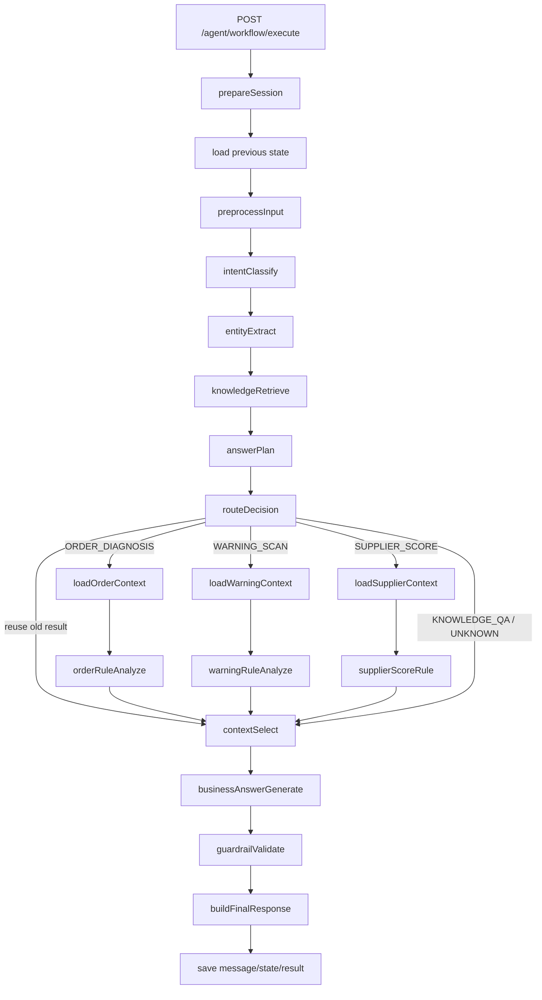

# 《Python版 AI Workflow 真正 Agent 化升级傻瓜式落地手册》

> 基于现有文档：
>
> ```text
> document/Python版AI应用迁移傻瓜式落地手册.md
> ```
>
> 本文档只解决一个问题：
>
> ```text
> 当前 Python workflow 虽然能跑通，但容易退化成“固定模板问答器”。
> 现在要一次性升级成真正的 Agent：先规划，再选上下文，再回答。
> ```
>
> 这份文档不是阶段性方案，不是“后续可以考虑”。  
> 你可以直接照着改当前项目：
>
> ```text
> D:\code\project\inventory\python_ai_workflow_service
> ```

---

## 0. 这份文档解决什么问题

你现在已经跑通了：

```text
POST /agent/workflow/execute
```

并且已经验证：

```text
1. Python FastAPI 能启动
2. Java 后端 8080 能调用
3. MySQL 会话表能写入
4. Redis Stack / RAG 能通过 Java 间接复用
5. 订单诊断链路能返回
6. 预警扫描链路能返回
7. threadId 能连续追问
```

但是现在有一个本质问题：

```text
追问时回答容易重复完整报告
预警数据一大就超时
为了避免超时加规则兜底后，又不像 Agent
```

根因不是 Python 性能差，也不是 prompt 某一句没写好，而是当前 workflow 缺少两层：

```text
AnswerPlanNode
ContextSelectNode
```

也就是说，现在的链路是：

```text
用户问题
    ↓
意图识别
    ↓
业务规则分析
    ↓
直接回答
```

这会导致：

```text
1. 首问和追问混在一起
2. 总览问题和具体单据问题混在一起
3. 大量结构化数据直接塞给模型
4. 模型超时后又只能写死规则兜底
```

升级后的链路应该是：

```text
用户问题
    ↓
意图识别
    ↓
实体抽取
    ↓
AnswerPlanNode：规划这一轮到底要回答什么
    ↓
RouteDecisionNode：决定复用旧上下文还是重新加载业务数据
    ↓
业务规则分析
    ↓
ContextSelectNode：从结构化结果里挑小而准的上下文
    ↓
BusinessAnswerGenerateNode：基于计划和小上下文回答
    ↓
Guardrail
    ↓
FinalResponse
```

这才是更像 Agent 的结构：

```text
模型负责规划和表达
代码负责事实、边界、过滤和落库
```

---

## 1. 最终改造后的完整流程

改造后，完整 workflow 是：

```text
prepareSession
saveUserMessage
loadStateByThreadId
preprocessInput
intentClassify
entityExtract
knowledgeRetrieve
answerPlan
routeDecision
  ├─ REUSE_CONTEXT      -> contextSelect
  ├─ ORDER_DIAGNOSIS    -> loadOrderContext -> orderRuleAnalyze -> contextSelect
  ├─ WARNING_SCAN       -> loadWarningContext -> warningRuleAnalyze -> contextSelect
  ├─ SUPPLIER_SCORE     -> loadSupplierContext -> supplierScoreRule -> contextSelect
  ├─ KNOWLEDGE_QA       -> contextSelect
  └─ UNKNOWN            -> contextSelect
businessAnswerGenerate
guardrailValidate
buildFinalResponse
saveAssistantMessage
saveState
saveResult
return
```

用图看：



关键变化：

```text
answerPlan
    决定这一轮回答模式，例如 SUMMARY / SPECIFIC_BIZ_EXPLAIN / NEXT_ACTION。

routeDecision
    决定是否复用上一次结构化结果，避免追问时重复扫库。

contextSelect
    从大结果里挑出本轮相关小上下文，避免模型超时。

businessAnswerGenerate
    不再直接面对全量结果，只面对 answerPlan + selectedContext。
```

---

## 2. 这次要新增和替换哪些文件

你当前已有这些文件：

```text
app/workflows/state.py
app/workflows/workflow_executor.py
app/workflows/nodes/route_decision.py
app/workflows/nodes/business_answer_generate.py
app/repositories/session_store.py
```

本次新增：

```text
app/schemas/answer_plan.py
app/workflows/nodes/answer_plan.py
app/workflows/nodes/context_select.py
```

本次替换：

```text
app/workflows/state.py
app/workflows/nodes/route_decision.py
app/workflows/nodes/business_answer_generate.py
app/workflows/workflow_executor.py
```

本次局部修改：

```text
app/repositories/session_store.py
```

目标不是把所有业务逻辑推倒重来，而是在你已经跑通的 workflow 上加上真正 Agent 必需的两层：

```text
AnswerPlanNode
ContextSelectNode
```

---

## 3. 新增文件：app/schemas/answer_plan.py

这个文件干什么：

```text
定义 Agent 的回答计划对象和被选中的上下文对象。
```

为什么现在写它：

```text
没有 AnswerPlan，Agent 就不知道当前这一轮是“总览、追问、解释原因、找处理人、看具体单据、看供应商指标”。
```

它在 Java / Spring 里像什么：

```text
类似 WorkflowEntity + 一个新的 AnswerPlan DTO
```

文件路径：

```text
python_ai_workflow_service/app/schemas/answer_plan.py
```

完整代码：

```python
from typing import Any

from pydantic import Field

from app.schemas.common import ApiModel


class AnswerPlan(ApiModel):
    intent: str
    turn_type: str = Field(default="FIRST_TURN", alias="turnType")
    answer_mode: str = Field(default="FULL_ANALYSIS", alias="answerMode")
    focus: str | None = None
    target_biz_no: str | None = Field(default=None, alias="targetBizNo")
    target_order_no: str | None = Field(default=None, alias="targetOrderNo")
    target_supplier_id: int | None = Field(default=None, alias="targetSupplierId")
    owner: str | None = None
    risk_level: str | None = Field(default=None, alias="riskLevel")
    risk_type: str | None = Field(default=None, alias="riskType")
    needs_refresh: bool = Field(default=True, alias="needsRefresh")
    use_llm: bool = Field(default=True, alias="useLlm")
    max_context_items: int = Field(default=10, alias="maxContextItems")


class SelectedContext(ApiModel):
    intent: str
    answer_mode: str = Field(alias="answerMode")
    summary: str | None = None
    facts: dict[str, Any] = Field(default_factory=dict)
    items: list[dict[str, Any]] = Field(default_factory=list)
    instruction: str | None = None
```

字段说明：

| 字段 | 含义 |
| --- | --- |
| `turnType` | 首问还是追问，例如 `FIRST_TURN` / `FOLLOW_UP` |
| `answerMode` | 当前应该怎么答，例如 `SUMMARY` / `NEXT_ACTION` / `SPECIFIC_BIZ_EXPLAIN` |
| `targetBizNo` | 用户是否问了具体业务单号，如 `PO2026040001` |
| `owner` | 用户是否关注某个处理角色，如 `WAREHOUSE` / `PURCHASER` |
| `needsRefresh` | 是否需要重新加载业务数据 |
| `useLlm` | 是否需要模型表达 |
| `maxContextItems` | 最多给模型几条上下文，避免超时 |

---

## 4. 替换文件：app/workflows/state.py

这个文件干什么：

```text
统一 workflow 状态 key。
```

为什么要改它：

```text
新增 answerPlan 和 selectedContext 两个状态。
```

文件路径：

```text
python_ai_workflow_service/app/workflows/state.py
```

完整替换代码：

```python
from enum import Enum
from typing import Any, TypedDict

from pydantic import Field

from app.schemas.common import ApiModel


class WorkflowIntent(str, Enum):
    ORDER_DIAGNOSIS = "ORDER_DIAGNOSIS"
    WARNING_SCAN = "WARNING_SCAN"
    SUPPLIER_SCORE = "SUPPLIER_SCORE"
    KNOWLEDGE_QA = "KNOWLEDGE_QA"
    UNKNOWN = "UNKNOWN"


class WorkflowStateKeys:
    MESSAGE = "message"
    THREAD_ID = "threadId"
    AUTHORIZATION = "authorization"
    USER_ID = "userId"
    NORMALIZED_MESSAGE = "normalizedMessage"
    INTENT = "intent"
    ENTITY = "entity"
    RAG_DOCS = "ragDocs"
    ORDER_SNAPSHOT = "orderSnapshot"
    ORDER_DIAGNOSIS = "orderDiagnosis"
    WARNING_CONTEXT = "warningContext"
    WARNING_ANALYSIS = "warningAnalysis"
    SUPPLIER_METRICS = "supplierMetrics"
    SUPPLIER_SCORE = "supplierScore"
    ANSWER_PLAN = "answerPlan"
    SELECTED_CONTEXT = "selectedContext"
    LLM_ANSWER = "llmAnswer"
    GUARDRAIL_RESULT = "guardrailResult"
    FINAL_RESPONSE = "finalResponse"
    ERROR_MESSAGE = "errorMessage"
    ROUTE = "_route"


class WorkflowEntity(ApiModel):
    order_no: str | None = Field(default=None, alias="orderNo")
    supplier_id: int | None = Field(default=None, alias="supplierId")
    days: int | None = None
    material_code: str | None = Field(default=None, alias="materialCode")
    warehouse_id: int | None = Field(default=None, alias="warehouseId")


class WorkflowGraphState(TypedDict, total=False):
    message: str
    threadId: str
    authorization: str
    userId: int
    normalizedMessage: str
    intent: str
    entity: dict[str, Any]
    ragDocs: str
    orderSnapshot: dict[str, Any]
    orderDiagnosis: dict[str, Any]
    warningContext: dict[str, Any]
    warningAnalysis: dict[str, Any]
    supplierMetrics: dict[str, Any]
    supplierScore: dict[str, Any]
    answerPlan: dict[str, Any]
    selectedContext: dict[str, Any]
    llmAnswer: str
    guardrailResult: str
    finalResponse: dict[str, Any]
    errorMessage: str
    _route: str
```

---

## 5. 新增文件：app/workflows/nodes/answer_plan.py

这个文件干什么：

```text
让 Agent 先判断“这一轮到底该怎么回答”。
```

为什么这是关键：

```text
没有它，追问会退化成重复完整报告。
有了它，Agent 可以先规划：
    用户问的是总览？
    具体单据？
    谁处理？
    哪个最严重？
    分数是什么意思？
```

文件路径：

```text
python_ai_workflow_service/app/workflows/nodes/answer_plan.py
```

完整代码：

```python
import json
import re

from app.clients.llm_client import LLMClient
from app.schemas.answer_plan import AnswerPlan
from app.workflows.state import WorkflowIntent, WorkflowStateKeys


BIZ_NO_PATTERN = re.compile(r"(PO|AR|IN)\d+", re.IGNORECASE)


class AnswerPlanNode:
    def __init__(self, llm_client: LLMClient):
        self.llm_client = llm_client

    async def __call__(self, state: dict) -> dict:
        intent = str(state.get(WorkflowStateKeys.INTENT, WorkflowIntent.UNKNOWN.value))
        message = str(state.get(WorkflowStateKeys.MESSAGE, ""))

        fallback = self._fallback_plan(state, intent, message)
        try:
            llm_plan = await self._llm_plan(state, intent, message, fallback)
            plan = self._merge_plan(fallback, llm_plan)
        except Exception:
            plan = fallback

        return {WorkflowStateKeys.ANSWER_PLAN: plan.model_dump(by_alias=True)}

    async def _llm_plan(self, state: dict, intent: str, message: str, fallback: AnswerPlan) -> AnswerPlan:
        prompt = f"""
你是库存系统 Workflow Agent 的回答规划器。
你的任务不是回答用户，而是输出一个 JSON，告诉后续节点应该如何回答。

必须只输出 JSON，不要输出 Markdown，不要解释。

字段：
- intent：当前业务意图
- turnType：FIRST_TURN 或 FOLLOW_UP
- answerMode：回答模式
- focus：回答重点
- targetBizNo：用户提到的单据号，如 PO/AR/IN 开头
- targetOrderNo：用户提到的采购订单号
- targetSupplierId：用户提到的供应商ID
- owner：用户关注的处理角色，PURCHASER / WAREHOUSE / SUPPLIER / ADMIN / NONE
- riskLevel：HIGH / MEDIUM / LOW
- riskType：风险类型关键词
- needsRefresh：是否需要重新加载业务数据
- useLlm：是否需要模型生成自然语言
- maxContextItems：最多选择多少条上下文

可选 answerMode：
ORDER_DIAGNOSIS:
  FULL_ANALYSIS, NEXT_ACTION, CAUSE_EXPLAIN, EVIDENCE_EXPLAIN
WARNING_SCAN:
  SUMMARY, SPECIFIC_BIZ_EXPLAIN, TOP_RISK, OWNER_FILTER, RISK_LEVEL_FILTER, RISK_TYPE_FILTER
SUPPLIER_SCORE:
  FULL_ANALYSIS, SCORE_MEANING, COOP_ADVICE, METRIC_DETAIL
KNOWLEDGE_QA:
  KNOWLEDGE_ANSWER
UNKNOWN:
  CLARIFY

当前 intent:
{intent}

当前用户问题:
{message}

是否已有可复用结果:
{self._has_reusable_result(state, intent)}

兜底计划:
{fallback.model_dump(by_alias=True)}
""".strip()

        text = await self.llm_client.chat_text(
            "你是严格的 JSON 规划器，只输出 JSON。",
            prompt,
            temperature=0.0,
        )
        data = self._extract_json(text)
        return AnswerPlan(**data)

    def _fallback_plan(self, state: dict, intent: str, message: str) -> AnswerPlan:
        has_reusable = self._has_reusable_result(state, intent)
        turn_type = "FOLLOW_UP" if has_reusable else "FIRST_TURN"
        target_biz_no = self._extract_biz_no(message)

        answer_mode = "FULL_ANALYSIS"
        focus = None
        owner = None
        risk_level = None
        risk_type = None
        max_context_items = 10

        if intent == WorkflowIntent.ORDER_DIAGNOSIS.value:
            if self._contains_any(message, ["下一步", "谁处理", "谁负责", "怎么处理", "怎么办"]):
                answer_mode = "NEXT_ACTION"
                focus = "owner_action"
                max_context_items = 3
            elif self._contains_any(message, ["为什么", "原因", "卡在哪", "没完成"]):
                answer_mode = "CAUSE_EXPLAIN"
                focus = "cause"
                max_context_items = 5
            elif self._contains_any(message, ["证据", "依据", "根据什么"]):
                answer_mode = "EVIDENCE_EXPLAIN"
                focus = "evidence"
                max_context_items = 5
            else:
                answer_mode = "FULL_ANALYSIS"

        elif intent == WorkflowIntent.WARNING_SCAN.value:
            if target_biz_no:
                answer_mode = "SPECIFIC_BIZ_EXPLAIN"
                focus = "specific_biz"
                max_context_items = 5
            elif self._contains_any(message, ["哪个最严重", "最严重", "优先", "先处理", "top", "Top"]):
                answer_mode = "TOP_RISK"
                focus = "priority"
                max_context_items = 10
            elif self._contains_any(message, ["仓库", "入库"]):
                answer_mode = "OWNER_FILTER"
                owner = "WAREHOUSE"
                focus = "owner"
                max_context_items = 10
            elif self._contains_any(message, ["采购", "供应商"]):
                answer_mode = "OWNER_FILTER"
                owner = "PURCHASER"
                focus = "owner"
                max_context_items = 10
            elif self._contains_any(message, ["高风险", "HIGH"]):
                answer_mode = "RISK_LEVEL_FILTER"
                risk_level = "HIGH"
                focus = "risk_level"
                max_context_items = 10
            elif self._contains_any(message, ["确认超时", "到货", "入库", "停滞"]):
                answer_mode = "RISK_TYPE_FILTER"
                risk_type = message
                focus = "risk_type"
                max_context_items = 10
            else:
                answer_mode = "SUMMARY"
                focus = "summary"
                max_context_items = 10

        elif intent == WorkflowIntent.SUPPLIER_SCORE.value:
            if self._contains_any(message, ["分数", "意味着", "等级", "多少分"]):
                answer_mode = "SCORE_MEANING"
                focus = "score"
                max_context_items = 5
            elif self._contains_any(message, ["合作", "还能不能", "是否继续", "建议"]):
                answer_mode = "COOP_ADVICE"
                focus = "cooperation"
                max_context_items = 5
            elif self._contains_any(message, ["指标", "确认率", "到货", "入库", "异常"]):
                answer_mode = "METRIC_DETAIL"
                focus = "metrics"
                max_context_items = 5
            else:
                answer_mode = "FULL_ANALYSIS"

        elif intent == WorkflowIntent.KNOWLEDGE_QA.value:
            answer_mode = "KNOWLEDGE_ANSWER"
            focus = "knowledge"
        else:
            answer_mode = "CLARIFY"
            focus = "clarify"

        return AnswerPlan(
            intent=intent,
            turnType=turn_type,
            answerMode=answer_mode,
            focus=focus,
            targetBizNo=target_biz_no,
            targetOrderNo=self._extract_order_no(message),
            targetSupplierId=self._extract_supplier_id(message),
            owner=owner,
            riskLevel=risk_level,
            riskType=risk_type,
            needsRefresh=self._needs_refresh(state, intent, message),
            useLlm=True,
            maxContextItems=max_context_items,
        )

    def _merge_plan(self, fallback: AnswerPlan, llm_plan: AnswerPlan) -> AnswerPlan:
        # LLM 负责细化模式，但 needsRefresh 以代码兜底判断为准，避免模型误触发大扫描。
        data = fallback.model_dump(by_alias=True)
        llm_data = llm_plan.model_dump(by_alias=True)
        for key, value in llm_data.items():
            if value not in (None, "", []):
                data[key] = value
        data["needsRefresh"] = fallback.needs_refresh
        if data.get("maxContextItems") is None or data["maxContextItems"] <= 0:
            data["maxContextItems"] = fallback.max_context_items
        data["maxContextItems"] = min(int(data["maxContextItems"]), 20)
        return AnswerPlan(**data)

    def _needs_refresh(self, state: dict, intent: str, message: str) -> bool:
        if not self._has_reusable_result(state, intent):
            return True
        if self._contains_any(message, ["重新", "刷新", "重新扫描", "再扫描", "最新"]):
            return True

        entity = dict(state.get(WorkflowStateKeys.ENTITY, {}) or {})

        if intent == WorkflowIntent.ORDER_DIAGNOSIS.value:
            current_order_no = entity.get("orderNo")
            previous = state.get(WorkflowStateKeys.ORDER_DIAGNOSIS) or {}
            previous_order_no = previous.get("orderNo")
            return bool(current_order_no and previous_order_no and current_order_no != previous_order_no)

        if intent == WorkflowIntent.SUPPLIER_SCORE.value:
            current_supplier_id = entity.get("supplierId")
            previous = state.get(WorkflowStateKeys.SUPPLIER_SCORE) or {}
            previous_supplier_id = previous.get("supplierId")
            return bool(current_supplier_id and previous_supplier_id and int(current_supplier_id) != int(previous_supplier_id))

        if intent == WorkflowIntent.WARNING_SCAN.value:
            # 如果用户明确说“扫描最近X天”，通常代表要重新扫描。
            return self._contains_any(message, ["扫描最近", "最近"])

        return False

    def _has_reusable_result(self, state: dict, intent: str) -> bool:
        if intent == WorkflowIntent.ORDER_DIAGNOSIS.value:
            return bool(state.get(WorkflowStateKeys.ORDER_DIAGNOSIS))
        if intent == WorkflowIntent.WARNING_SCAN.value:
            return bool(state.get(WorkflowStateKeys.WARNING_ANALYSIS))
        if intent == WorkflowIntent.SUPPLIER_SCORE.value:
            return bool(state.get(WorkflowStateKeys.SUPPLIER_SCORE))
        return False

    def _extract_json(self, text: str) -> dict:
        start = text.find("{")
        end = text.rfind("}")
        if start < 0 or end < start:
            raise ValueError("LLM plan is not JSON")
        return json.loads(text[start:end + 1])

    def _extract_biz_no(self, text: str) -> str | None:
        match = BIZ_NO_PATTERN.search(text or "")
        return match.group(0).upper() if match else None

    def _extract_order_no(self, text: str) -> str | None:
        biz_no = self._extract_biz_no(text)
        return biz_no if biz_no and biz_no.startswith("PO") else None

    def _extract_supplier_id(self, text: str) -> int | None:
        match = re.search(r"供应商\s*(\d+)", text or "")
        return int(match.group(1)) if match else None

    def _contains_any(self, text: str, words: list[str]) -> bool:
        return any(word in (text or "") for word in words)
```

这个节点的关键点：

```text
1. 先用 LLM 规划回答方式。
2. 如果 LLM 规划失败，用规则兜底。
3. needsRefresh 不完全相信模型，代码兜底判断。
4. 追问时如果已有结构化结果，就尽量复用，不重复扫库。
```

---

## 6. 替换文件：app/workflows/nodes/route_decision.py

这个文件干什么：

```text
根据 intent + answerPlan 判断要不要重新加载业务数据。
```

为什么要改它：

```text
之前追问也会重新走 loadWarningContext，导致重复扫库。
现在如果 answerPlan.needsRefresh=false，并且 state 里有可复用结构化结果，就直接进入 contextSelect。
```

文件路径：

```text
python_ai_workflow_service/app/workflows/nodes/route_decision.py
```

完整替换代码：

```python
from app.workflows.state import WorkflowIntent, WorkflowStateKeys


class RouteDecisionNode:
    async def __call__(self, state: dict) -> dict:
        intent = str(state.get(WorkflowStateKeys.INTENT, WorkflowIntent.UNKNOWN.value))
        plan = dict(state.get(WorkflowStateKeys.ANSWER_PLAN, {}) or {})

        if plan and not plan.get("needsRefresh", True) and self._has_reusable_result(state, intent):
            return {WorkflowStateKeys.ROUTE: "REUSE_CONTEXT"}

        return {WorkflowStateKeys.ROUTE: intent}

    def _has_reusable_result(self, state: dict, intent: str) -> bool:
        if intent == WorkflowIntent.ORDER_DIAGNOSIS.value:
            return bool(state.get(WorkflowStateKeys.ORDER_DIAGNOSIS))
        if intent == WorkflowIntent.WARNING_SCAN.value:
            return bool(state.get(WorkflowStateKeys.WARNING_ANALYSIS))
        if intent == WorkflowIntent.SUPPLIER_SCORE.value:
            return bool(state.get(WorkflowStateKeys.SUPPLIER_SCORE))
        return intent in (WorkflowIntent.KNOWLEDGE_QA.value, WorkflowIntent.UNKNOWN.value)
```

效果：

```text
第一次：“扫描最近7天采购执行风险”
    -> needsRefresh=true
    -> 加载数据并扫描

第二次：“为什么 PO2026040001 风险这么高？”
    -> needsRefresh=false
    -> 复用上次 warningAnalysis
    -> 不重新扫库
```

---

## 7. 新增文件：app/workflows/nodes/context_select.py

这个文件干什么：

```text
根据 AnswerPlan 从结构化结果中选择本轮问题相关的小上下文。
```

为什么必须有它：

```text
Agent 不能把 77 条、770 条风险都塞给模型。
Agent 应该根据用户问题只挑相关的 5 到 20 条。
```

文件路径：

```text
python_ai_workflow_service/app/workflows/nodes/context_select.py
```

完整代码：

```python
import re
from typing import Any

from app.schemas.answer_plan import SelectedContext
from app.workflows.state import WorkflowIntent, WorkflowStateKeys


class ContextSelectNode:
    async def __call__(self, state: dict) -> dict:
        intent = str(state.get(WorkflowStateKeys.INTENT, WorkflowIntent.UNKNOWN.value))
        plan = dict(state.get(WorkflowStateKeys.ANSWER_PLAN, {}) or {})

        if intent == WorkflowIntent.ORDER_DIAGNOSIS.value:
            selected = self._select_order_context(state, plan)
        elif intent == WorkflowIntent.WARNING_SCAN.value:
            selected = self._select_warning_context(state, plan)
        elif intent == WorkflowIntent.SUPPLIER_SCORE.value:
            selected = self._select_supplier_context(state, plan)
        elif intent == WorkflowIntent.KNOWLEDGE_QA.value:
            selected = SelectedContext(
                intent=intent,
                answerMode=plan.get("answerMode", "KNOWLEDGE_ANSWER"),
                summary="知识库问答",
                facts={"ragDocs": state.get(WorkflowStateKeys.RAG_DOCS, "")},
                instruction="基于知识库片段回答用户问题。",
            )
        else:
            selected = SelectedContext(
                intent=intent,
                answerMode="CLARIFY",
                summary="无法识别用户意图",
                facts={},
                instruction="提示用户补充订单号、供应商ID或扫描范围。",
            )

        return {WorkflowStateKeys.SELECTED_CONTEXT: selected.model_dump(by_alias=True)}

    def _select_order_context(self, state: dict, plan: dict) -> SelectedContext:
        diagnosis = dict(state.get(WorkflowStateKeys.ORDER_DIAGNOSIS, {}) or {})
        snapshot = dict(state.get(WorkflowStateKeys.ORDER_SNAPSHOT, {}) or {})
        mode = plan.get("answerMode", "FULL_ANALYSIS")

        if mode == "NEXT_ACTION":
            facts = {
                "currentStage": diagnosis.get("currentStage"),
                "suggestOwner": diagnosis.get("suggestOwner"),
                "suggestAction": diagnosis.get("suggestAction"),
            }
            instruction = "只回答下一步谁处理、怎么处理，不要重复完整诊断报告。"
        elif mode == "CAUSE_EXPLAIN":
            facts = {
                "currentStage": diagnosis.get("currentStage"),
                "blockReason": diagnosis.get("blockReason"),
                "evidence": diagnosis.get("evidence", []),
            }
            instruction = "重点解释为什么没有完成、卡在哪个环节。"
        elif mode == "EVIDENCE_EXPLAIN":
            facts = {
                "evidence": diagnosis.get("evidence", []),
                "snapshot": snapshot,
            }
            instruction = "只解释判断依据和关键证据。"
        else:
            facts = {
                "snapshot": snapshot,
                "diagnosis": diagnosis,
            }
            instruction = "给出完整但简洁的订单诊断。"

        return SelectedContext(
            intent=WorkflowIntent.ORDER_DIAGNOSIS.value,
            answerMode=mode,
            summary=diagnosis.get("blockReason"),
            facts=facts,
            instruction=instruction,
        )

    def _select_warning_context(self, state: dict, plan: dict) -> SelectedContext:
        analysis = dict(state.get(WorkflowStateKeys.WARNING_ANALYSIS, {}) or {})
        items = list(analysis.get("items", []) or [])
        mode = plan.get("answerMode", "SUMMARY")
        limit = int(plan.get("maxContextItems", 10) or 10)
        limit = max(1, min(limit, 20))

        selected_items = items
        instruction = "总结本次预警扫描结果。"

        if mode == "SPECIFIC_BIZ_EXPLAIN":
            target_biz_no = plan.get("targetBizNo")
            selected_items = [item for item in items if item.get("bizNo") == target_biz_no]
            instruction = f"只解释 {target_biz_no} 为什么风险高。"
        elif mode == "TOP_RISK":
            selected_items = self._sort_warning_items(items)[:limit]
            instruction = "说明哪些风险最严重，以及为什么优先处理。"
        elif mode == "OWNER_FILTER":
            owner = plan.get("owner")
            selected_items = [item for item in items if item.get("suggestOwner") == owner]
            selected_items = self._sort_warning_items(selected_items)[:limit]
            instruction = f"只分析 {owner} 相关风险。"
        elif mode == "RISK_LEVEL_FILTER":
            risk_level = plan.get("riskLevel")
            selected_items = [item for item in items if item.get("riskLevel") == risk_level]
            selected_items = self._sort_warning_items(selected_items)[:limit]
            instruction = f"只分析 {risk_level} 风险。"
        elif mode == "RISK_TYPE_FILTER":
            risk_type = plan.get("riskType") or ""
            selected_items = [
                item for item in items
                if risk_type in item.get("problem", "") or risk_type in item.get("reason", "")
            ]
            selected_items = self._sort_warning_items(selected_items)[:limit]
            instruction = "只分析用户关注的风险类型。"
        else:
            selected_items = self._sort_warning_items(items)[:limit]
            instruction = "给出风险总览、Top风险类型和建议处理顺序。"

        facts = {
            "totalCount": len(items),
            "highRiskCount": sum(1 for item in items if item.get("riskLevel") == "HIGH"),
            "mediumRiskCount": sum(1 for item in items if item.get("riskLevel") == "MEDIUM"),
            "riskTypeStats": self._risk_type_stats(items),
            "ownerStats": self._owner_stats(items),
        }

        return SelectedContext(
            intent=WorkflowIntent.WARNING_SCAN.value,
            answerMode=mode,
            summary=analysis.get("summary"),
            facts=facts,
            items=selected_items[:limit],
            instruction=instruction,
        )

    def _select_supplier_context(self, state: dict, plan: dict) -> SelectedContext:
        metrics = dict(state.get(WorkflowStateKeys.SUPPLIER_METRICS, {}) or {})
        score = dict(state.get(WorkflowStateKeys.SUPPLIER_SCORE, {}) or {})
        mode = plan.get("answerMode", "FULL_ANALYSIS")

        if mode == "SCORE_MEANING":
            facts = {
                "supplierId": score.get("supplierId"),
                "supplierName": score.get("supplierName"),
                "score": score.get("score"),
                "level": score.get("level"),
                "keyMetrics": {
                    "confirmRate": score.get("confirmRate"),
                    "arrivalCompletionRate": score.get("arrivalCompletionRate"),
                    "inboundCompletionRate": score.get("inboundCompletionRate"),
                    "abnormalArrivalRate": score.get("abnormalArrivalRate"),
                },
            }
            instruction = "解释这个分数和等级意味着什么。"
        elif mode == "COOP_ADVICE":
            facts = {
                "score": score,
                "metrics": metrics,
            }
            instruction = "重点回答是否建议继续合作，以及合作策略。"
        elif mode == "METRIC_DETAIL":
            facts = {
                "metrics": metrics,
                "score": score,
            }
            instruction = "重点解释哪些指标拖累评分。"
        else:
            facts = {
                "metrics": metrics,
                "score": score,
            }
            instruction = "给出完整但简洁的供应商履约分析。"

        return SelectedContext(
            intent=WorkflowIntent.SUPPLIER_SCORE.value,
            answerMode=mode,
            summary=score.get("analysis") or score.get("suggestion"),
            facts=facts,
            instruction=instruction,
        )

    def _sort_warning_items(self, items: list[dict[str, Any]]) -> list[dict[str, Any]]:
        def score(item: dict[str, Any]) -> tuple[int, int]:
            risk_score = 2 if item.get("riskLevel") == "HIGH" else 1
            overdue = self._extract_overdue_days(item.get("reason", ""))
            return risk_score, overdue

        return sorted(items, key=score, reverse=True)

    def _extract_overdue_days(self, reason: str) -> int:
        match = re.search(r"超时\s*(\d+)\s*天", reason or "")
        return int(match.group(1)) if match else 0

    def _risk_type_stats(self, items: list[dict[str, Any]]) -> dict[str, int]:
        stats: dict[str, int] = {}
        for item in items:
            problem = item.get("problem") or "未知风险"
            stats[problem] = stats.get(problem, 0) + 1
        return dict(sorted(stats.items(), key=lambda kv: kv[1], reverse=True)[:10])

    def _owner_stats(self, items: list[dict[str, Any]]) -> dict[str, int]:
        stats: dict[str, int] = {}
        for item in items:
            owner = item.get("suggestOwner") or "UNKNOWN"
            stats[owner] = stats.get(owner, 0) + 1
        return dict(sorted(stats.items(), key=lambda kv: kv[1], reverse=True))
```

这个节点解决三个问题：

```text
1. 大数据量不再全塞给模型。
2. 追问具体单据时，只取这个单据相关风险。
3. 三条业务分支都有统一的上下文选择逻辑。
```

---

## 8. 替换文件：app/workflows/nodes/business_answer_generate.py

这个文件干什么：

```text
基于 answerPlan + selectedContext 生成回答。
```

为什么要替换：

```text
旧版直接看完整结构化结果，容易重复完整报告，也容易超时。
新版只看本轮被选中的小上下文。
```

文件路径：

```text
python_ai_workflow_service/app/workflows/nodes/business_answer_generate.py
```

完整替换代码：

```python
import json

from app.clients.llm_client import LLMClient
from app.workflows.state import WorkflowStateKeys


class BusinessAnswerGenerateNode:
    def __init__(self, llm_client: LLMClient):
        self.llm_client = llm_client

    async def __call__(self, state: dict) -> dict:
        message = str(state.get(WorkflowStateKeys.MESSAGE, ""))
        error_message = str(state.get(WorkflowStateKeys.ERROR_MESSAGE, ""))
        if error_message:
            return {WorkflowStateKeys.LLM_ANSWER: error_message}

        answer_plan = dict(state.get(WorkflowStateKeys.ANSWER_PLAN, {}) or {})
        selected_context = dict(state.get(WorkflowStateKeys.SELECTED_CONTEXT, {}) or {})

        if not selected_context:
            return {WorkflowStateKeys.LLM_ANSWER: "没有可用上下文，请补充订单号、供应商ID或扫描范围。"}

        if not answer_plan.get("useLlm", True):
            return {WorkflowStateKeys.LLM_ANSWER: self._fallback_answer(selected_context)}

        prompt = self._build_prompt(message, answer_plan, selected_context)

        try:
            answer = await self.llm_client.chat_text(
                "你是库存系统业务 Agent。你必须严格根据回答计划和选中上下文回答，不允许编造事实。",
                prompt,
            )
        except Exception:
            answer = self._fallback_answer(selected_context)

        return {WorkflowStateKeys.LLM_ANSWER: answer}

    def _build_prompt(self, message: str, answer_plan: dict, selected_context: dict) -> str:
        return f"""
你是供应商协同采购入库系统的业务 Agent。

你现在要回答用户当前这一轮问题，不是重复完整报告。

硬性规则：
1. 必须优先回答用户当前问题。
2. 只能使用 selectedContext 中的数据。
3. 如果 answerMode 不是 FULL_ANALYSIS 或 SUMMARY，不要输出完整报告。
4. 如果上下文不足，直接说明缺少什么，不要编造。
5. 回答要具体、短、可执行。

用户当前问题：
{message}

回答计划 answerPlan：
{self._to_text(answer_plan)}

本轮选中上下文 selectedContext：
{self._to_text(selected_context)}

请输出中文回答。
""".strip()

    def _fallback_answer(self, selected_context: dict) -> str:
        intent = selected_context.get("intent")
        mode = selected_context.get("answerMode")
        summary = selected_context.get("summary")
        facts = selected_context.get("facts") or {}
        items = selected_context.get("items") or []

        if intent == "ORDER_DIAGNOSIS":
            if mode == "NEXT_ACTION":
                return (
                    f"建议处理人：{facts.get('suggestOwner')}。"
                    f"建议动作：{facts.get('suggestAction')}。"
                )
            if mode == "CAUSE_EXPLAIN":
                return (
                    f"当前阶段：{facts.get('currentStage')}。"
                    f"阻塞原因：{facts.get('blockReason')}。"
                    f"关键证据：{'；'.join(facts.get('evidence') or [])}。"
                )
            return summary or "订单诊断已完成，请查看结构化结果。"

        if intent == "WARNING_SCAN":
            total = facts.get("totalCount", 0)
            high = facts.get("highRiskCount", 0)
            medium = facts.get("mediumRiskCount", 0)
            if mode == "SPECIFIC_BIZ_EXPLAIN" and items:
                item = items[0]
                return (
                    f"{item.get('bizNo')} 风险较高，风险等级为 {item.get('riskLevel')}。"
                    f"风险类型：{item.get('problem')}。"
                    f"原因：{item.get('reason')}。"
                    f"建议处理人：{item.get('suggestOwner')}。"
                    f"建议动作：{item.get('suggestAction')}。"
                )
            if mode == "TOP_RISK" and items:
                biz_nos = "、".join(item.get("bizNo", "") for item in items[:5])
                return f"本次最优先处理的风险单据包括：{biz_nos}。建议先处理 HIGH 风险，再处理 MEDIUM 风险。"
            return f"本次扫描共发现 {total} 个风险，其中 HIGH 风险 {high} 个，MEDIUM 风险 {medium} 个。"

        if intent == "SUPPLIER_SCORE":
            score = facts.get("score") or {}
            if mode == "SCORE_MEANING":
                return f"该供应商得分 {score.get('score')}，等级为 {score.get('level')}。可结合关键指标判断履约稳定性。"
            return summary or "供应商评分已完成，请查看结构化结果。"

        return summary or "已完成分析，请查看结构化结果。"

    def _to_text(self, value) -> str:
        return json.dumps(value, ensure_ascii=False, default=str)
```

这个版本的重点：

```text
1. 不再直接读取 warningAnalysis 全量 items 给模型。
2. 不再自己写一堆预警 if/else 到回答节点。
3. 如果模型失败，才用 selectedContext 做兜底回答。
4. 真正回答什么，由 answerPlan + contextSelect 决定。
```

---

## 9. 替换文件：app/workflows/workflow_executor.py

这个文件干什么：

```text
组装新的 Agent 图。
```

为什么要替换：

```text
要把 answerPlan 和 contextSelect 插进主链路。
```

文件路径：

```text
python_ai_workflow_service/app/workflows/workflow_executor.py
```

完整替换代码：

```python
from langgraph.graph import END, START, StateGraph

from app.clients.inventory_backend import InventoryBackendClient
from app.clients.llm_client import LLMClient
from app.repositories.session_store import SessionStore
from app.schemas.workflow import WorkflowAgentRequest, WorkflowAgentResponse
from app.services.rag_service import RagService
from app.workflows.nodes.answer_plan import AnswerPlanNode
from app.workflows.nodes.build_final_response import BuildFinalResponseNode
from app.workflows.nodes.business_answer_generate import BusinessAnswerGenerateNode
from app.workflows.nodes.context_select import ContextSelectNode
from app.workflows.nodes.entity_extract import EntityExtractNode
from app.workflows.nodes.guardrail_validate import GuardrailValidateNode
from app.workflows.nodes.intent_classify import IntentClassifyNode
from app.workflows.nodes.knowledge_retrieve import KnowledgeRetrieveNode
from app.workflows.nodes.load_order_context import LoadOrderContextNode
from app.workflows.nodes.load_supplier_context import LoadSupplierContextNode
from app.workflows.nodes.load_warning_context import LoadWarningContextNode
from app.workflows.nodes.order_rule_analyze import OrderRuleAnalyzeNode
from app.workflows.nodes.preprocess_input import PreprocessInputNode
from app.workflows.nodes.route_decision import RouteDecisionNode
from app.workflows.nodes.supplier_score_rule import SupplierScoreRuleNode
from app.workflows.nodes.warning_rule_analyze import WarningRuleAnalyzeNode
from app.workflows.state import WorkflowGraphState, WorkflowIntent, WorkflowStateKeys


class WorkflowExecutor:
    def __init__(
        self,
        backend: InventoryBackendClient,
        llm_client: LLMClient,
        rag_service: RagService,
        session_store: SessionStore,
    ):
        self.backend = backend
        self.llm_client = llm_client
        self.rag_service = rag_service
        self.session_store = session_store
        self.graph = self._build_graph()

    def _build_graph(self):
        builder = StateGraph(WorkflowGraphState)

        builder.add_node("preprocessInput", PreprocessInputNode())
        builder.add_node("classifyIntent", IntentClassifyNode(self.llm_client))
        builder.add_node("extractEntities", EntityExtractNode())
        builder.add_node("retrieveKnowledge", KnowledgeRetrieveNode(self.rag_service))
        builder.add_node("answerPlan", AnswerPlanNode(self.llm_client))
        builder.add_node("routeByIntent", RouteDecisionNode())

        builder.add_node("loadOrderContext", LoadOrderContextNode(self.backend, self.session_store))
        builder.add_node("analyzeOrderByRules", OrderRuleAnalyzeNode())
        builder.add_node("loadWarningContext", LoadWarningContextNode(self.backend, self.session_store))
        builder.add_node("analyzeWarningsByRules", WarningRuleAnalyzeNode())
        builder.add_node("loadSupplierContext", LoadSupplierContextNode(self.backend, self.session_store))
        builder.add_node("scoreSupplierByRules", SupplierScoreRuleNode())

        builder.add_node("contextSelect", ContextSelectNode())
        builder.add_node("generateBusinessAnswer", BusinessAnswerGenerateNode(self.llm_client))
        builder.add_node("guardrailValidate", GuardrailValidateNode())
        builder.add_node("buildFinalResponse", BuildFinalResponseNode())

        builder.add_edge(START, "preprocessInput")
        builder.add_edge("preprocessInput", "classifyIntent")
        builder.add_edge("classifyIntent", "extractEntities")
        builder.add_edge("extractEntities", "retrieveKnowledge")
        builder.add_edge("retrieveKnowledge", "answerPlan")
        builder.add_edge("answerPlan", "routeByIntent")

        builder.add_conditional_edges(
            "routeByIntent",
            lambda state: state.get(WorkflowStateKeys.ROUTE, WorkflowIntent.UNKNOWN.value),
            {
                "REUSE_CONTEXT": "contextSelect",
                WorkflowIntent.ORDER_DIAGNOSIS.value: "loadOrderContext",
                WorkflowIntent.WARNING_SCAN.value: "loadWarningContext",
                WorkflowIntent.SUPPLIER_SCORE.value: "loadSupplierContext",
                WorkflowIntent.KNOWLEDGE_QA.value: "contextSelect",
                WorkflowIntent.UNKNOWN.value: "contextSelect",
            },
        )

        builder.add_edge("loadOrderContext", "analyzeOrderByRules")
        builder.add_edge("analyzeOrderByRules", "contextSelect")

        builder.add_edge("loadWarningContext", "analyzeWarningsByRules")
        builder.add_edge("analyzeWarningsByRules", "contextSelect")

        builder.add_edge("loadSupplierContext", "scoreSupplierByRules")
        builder.add_edge("scoreSupplierByRules", "contextSelect")

        builder.add_edge("contextSelect", "generateBusinessAnswer")
        builder.add_edge("generateBusinessAnswer", "guardrailValidate")
        builder.add_edge("guardrailValidate", "buildFinalResponse")
        builder.add_edge("buildFinalResponse", END)

        return builder.compile()

    async def execute(self, request: WorkflowAgentRequest, authorization: str) -> WorkflowAgentResponse:
        current_user = await self.backend.get_current_user(authorization)
        session = self.session_store.prepare_session(request.thread_id, current_user.id, request.message)
        self.session_store.save_user_message(session, request.message)

        restored_state = self.session_store.load_state_by_thread_id(session["thread_id"])
        input_state = dict(restored_state)
        input_state[WorkflowStateKeys.MESSAGE] = request.message or ""
        input_state[WorkflowStateKeys.THREAD_ID] = session["thread_id"]
        input_state[WorkflowStateKeys.AUTHORIZATION] = authorization
        input_state[WorkflowStateKeys.USER_ID] = current_user.id

        result_state = await self.graph.ainvoke(input_state)
        final_response = result_state.get(WorkflowStateKeys.FINAL_RESPONSE)
        if not final_response:
            response = WorkflowAgentResponse(
                sessionId=session["id"],
                threadId=session["thread_id"],
                intent="UNKNOWN",
                answer="工作流执行失败，未生成最终响应。",
                data=None,
            )
        else:
            response = WorkflowAgentResponse(**final_response)
            response.session_id = session["id"]
            response.thread_id = session["thread_id"]

        self.session_store.update_session_intent(session["id"], response.intent)
        self.session_store.save_assistant_message(session, response.answer)
        self.session_store.save_state(session, "END", response.intent, dict(result_state))
        self.session_store.save_result(session, response)
        return response
```

---

## 10. 局部修改：app/repositories/session_store.py

这个文件为什么要改：

```text
追问要复用上一次结构化结果，不能只恢复 intent/entity。
```

你当前的 `load_state_by_thread_id` 如果只恢复：

```text
intent
entity
```

那追问时还是会重新扫库。

现在要恢复：

```text
intent
entity
orderSnapshot
orderDiagnosis
warningAnalysis
supplierMetrics
supplierScore
answerPlan
selectedContext
```

文件路径：

```text
python_ai_workflow_service/app/repositories/session_store.py
```

先在文件顶部增加导入：

```python
from app.workflows.state import WorkflowStateKeys
```

然后把 `load_state_by_thread_id` 方法整体替换为：

```python
    def load_state_by_thread_id(self, thread_id: str | None) -> dict[str, Any]:
        if not thread_id:
            return {}

        with self._conn() as conn:
            with conn.cursor() as cur:
                cur.execute(
                    "select state_json from agent_session_state where thread_id = %s and deleted = 0",
                    (thread_id,),
                )
                row = cur.fetchone()
                if row is None or not row["state_json"]:
                    return {}

        try:
            raw = json.loads(row["state_json"])
        except json.JSONDecodeError:
            return {}

        restored: dict[str, Any] = {}
        restorable_keys = [
            WorkflowStateKeys.INTENT,
            WorkflowStateKeys.ENTITY,
            WorkflowStateKeys.ORDER_SNAPSHOT,
            WorkflowStateKeys.ORDER_DIAGNOSIS,
            WorkflowStateKeys.WARNING_ANALYSIS,
            WorkflowStateKeys.SUPPLIER_METRICS,
            WorkflowStateKeys.SUPPLIER_SCORE,
            WorkflowStateKeys.ANSWER_PLAN,
            WorkflowStateKeys.SELECTED_CONTEXT,
        ]

        for key in restorable_keys:
            if key in raw:
                restored[key] = raw[key]

        return restored
```

为什么只改这一个方法：

```text
save_state 已经会保存整份 state。
之前只是 load 时只拿了 intent/entity。
所以现在只需要把 load 恢复范围扩大。
```

---

## 11. 现在三个分支会如何工作

### 11.1 订单诊断分支

首问：

```json
{
  "message": "帮我分析 PO2026040022 为什么还没完成"
}
```

流程：

```text
intent = ORDER_DIAGNOSIS
answerPlan.answerMode = CAUSE_EXPLAIN
needsRefresh = true
loadOrderContext
orderRuleAnalyze
contextSelect 只选择 currentStage/blockReason/evidence
generateBusinessAnswer
```

追问：

```json
{
  "message": "下一步谁处理？",
  "threadId": "上次返回的threadId"
}
```

流程：

```text
恢复上次 orderDiagnosis
answerPlan.answerMode = NEXT_ACTION
needsRefresh = false
route = REUSE_CONTEXT
contextSelect 只选择 suggestOwner/suggestAction
generateBusinessAnswer
```

结果：

```text
不会重新查订单
不会重复完整报告
只回答下一步谁处理
```

### 11.2 预警扫描分支

首问：

```json
{
  "message": "扫描最近7天采购执行风险"
}
```

流程：

```text
intent = WARNING_SCAN
answerPlan.answerMode = SUMMARY
needsRefresh = true
loadWarningContext
warningRuleAnalyze
contextSelect 只选择统计摘要和 Top 风险
generateBusinessAnswer
```

追问具体单据：

```json
{
  "message": "为什么 PO2026040001 风险这么高？",
  "threadId": "上次返回的threadId"
}
```

流程：

```text
恢复上次 warningAnalysis
answerPlan.answerMode = SPECIFIC_BIZ_EXPLAIN
needsRefresh = false
route = REUSE_CONTEXT
contextSelect 只选择 PO2026040001 相关风险项
generateBusinessAnswer
```

结果：

```text
不会重新扫库
不会返回同一份总览
只解释 PO2026040001 为什么风险高
```

追问优先级：

```json
{
  "message": "如果今天只能处理5个，先处理哪些？",
  "threadId": "上次返回的threadId"
}
```

流程：

```text
answerPlan.answerMode = TOP_RISK
contextSelect 选择 Top 5~10 高风险项
```

### 11.3 供应商评分分支

首问：

```json
{
  "message": "分析供应商1最近30天履约表现"
}
```

追问：

```json
{
  "message": "这个分数意味着什么？",
  "threadId": "上次返回的threadId"
}
```

流程：

```text
恢复 supplierScore / supplierMetrics
answerPlan.answerMode = SCORE_MEANING
needsRefresh = false
contextSelect 只选择 score/level/keyMetrics
generateBusinessAnswer
```

结果：

```text
不会重复完整供应商报告
只解释分数含义
```

---

## 12. 测试步骤

### 12.1 重启 Python 服务

修改完成后，先重启：

```powershell
cd D:\code\project\inventory\python_ai_workflow_service
.\.venv\Scripts\python.exe -m uvicorn app.main:app --reload
```

### 12.2 测订单首问

```http
POST http://127.0.0.1:8000/agent/workflow/execute
Authorization: Bearer 你的token
Content-Type: application/json

{
  "message": "帮我分析 PO2026040022 为什么还没完成"
}
```

检查：

```text
intent = ORDER_DIAGNOSIS
data.orderNo = PO2026040022
answer 是原因解释
```

### 12.3 测订单追问

```http
POST http://127.0.0.1:8000/agent/workflow/execute
Authorization: Bearer 你的token
Content-Type: application/json

{
  "message": "下一步谁处理？",
  "threadId": "上一步返回的threadId"
}
```

检查：

```text
不重复完整报告
只回答 suggestOwner / suggestAction
```

### 12.4 测预警首问

```http
POST http://127.0.0.1:8000/agent/workflow/execute
Authorization: Bearer 你的token
Content-Type: application/json

{
  "message": "扫描最近7天采购执行风险"
}
```

检查：

```text
intent = WARNING_SCAN
data.items 有结构化风险列表
answer 是总览和优先级摘要
```

### 12.5 测预警具体单据追问

```http
POST http://127.0.0.1:8000/agent/workflow/execute
Authorization: Bearer 你的token
Content-Type: application/json

{
  "message": "为什么 PO2026040001 风险这么高？",
  "threadId": "上一步返回的threadId"
}
```

检查：

```text
不重新扫库
不返回总览模板
只解释 PO2026040001 的风险类型、原因、处理人、处理动作
```

### 12.6 测预警优先处理追问

```http
POST http://127.0.0.1:8000/agent/workflow/execute
Authorization: Bearer 你的token
Content-Type: application/json

{
  "message": "如果今天只能处理5个，先处理哪些？",
  "threadId": "上一步返回的threadId"
}
```

检查：

```text
answerMode 应该走 TOP_RISK
回答应该列出优先单据
```

### 12.7 测供应商首问

```http
POST http://127.0.0.1:8000/agent/workflow/execute
Authorization: Bearer 你的token
Content-Type: application/json

{
  "message": "分析供应商1最近30天履约表现"
}
```

### 12.8 测供应商追问

```http
POST http://127.0.0.1:8000/agent/workflow/execute
Authorization: Bearer 你的token
Content-Type: application/json

{
  "message": "这个分数意味着什么？",
  "threadId": "上一步返回的threadId"
}
```

检查：

```text
不重复完整供应商报告
只解释分数、等级、关键指标含义
```

---

## 13. 数据库验证

执行：

```sql
select id, thread_id, current_intent, title, last_message_time
from agent_session
order by id desc;
```

看：

```text
thread_id 是否复用
current_intent 是否正确
```

执行：

```sql
select session_id, thread_id, current_intent, current_node, state_json
from agent_session_state
order by id desc;
```

检查 `state_json` 中是否包含：

```text
answerPlan
selectedContext
orderDiagnosis / warningAnalysis / supplierScore
```

执行：

```sql
select id, thread_id, message_role, message_type, content, create_time
from agent_message
order by id desc;
```

检查：

```text
USER
TOOL
ASSISTANT
```

是否都写入。

---

## 14. 常见问题

### 14.1 追问还是重新扫库

检查：

```text
1. session_store.load_state_by_thread_id 是否恢复了 warningAnalysis / orderDiagnosis / supplierScore
2. answerPlan.needsRefresh 是否为 false
3. routeDecision 是否返回 REUSE_CONTEXT
```

### 14.2 追问还是回答完整报告

检查：

```text
1. answerPlan.answerMode 是否识别正确
2. contextSelect 是否只选择了小上下文
3. businessAnswerGenerate 是否只读取 selectedContext
```

### 14.3 预警扫描仍然很慢

区分两种慢：

```text
第一次扫描慢：
    业务数据确实多，需要优化 loadWarningContext 查询策略。

追问慢：
    不应该慢。追问应该复用 warningAnalysis。
```

如果追问仍然慢，说明：

```text
needsRefresh 没判断对
或者 previous state 没恢复出 warningAnalysis
```

### 14.4 模型返回非 JSON 导致 answerPlan 失败

不用慌。

`AnswerPlanNode` 已经做了：

```text
LLM 规划失败 -> fallback_plan
```

所以最多退回规则规划，不会影响主链路返回。

### 14.5 上下文太少，回答不够丰富

调：

```text
maxContextItems
```

但不要无限放大。

建议：

```text
订单：3~5
预警：5~20
供应商：5
```

---

## 15. 为什么这是真正 Agent 版

旧版：

```text
意图识别
业务分析
直接回答
```

新版：

```text
意图识别
业务分析
回答规划
上下文选择
模型表达
安全校验
```

旧版的问题：

```text
问题一多就写模板
数据一多就超时
追问时重复完整报告
```

新版的解决方式：

```text
AnswerPlanNode
    让 Agent 判断这一轮到底要回答什么。

ContextSelectNode
    让 Agent 只拿相关上下文。

BusinessAnswerGenerateNode
    只负责表达，不负责再从海量数据里猜重点。
```

这才符合真正 Agent 的职责边界：

```text
模型做规划和表达
代码做事实、过滤、边界和持久化
```

---

## 16. 最终落地标准

完成本文改造后，必须满足：

```text
1. 首问订单诊断能返回结构化结果。
2. 订单追问“下一步谁处理”不重复完整报告。
3. 首问预警扫描能返回总览和 data.items。
4. 预警追问“为什么 POxxx 风险高”只解释该单据。
5. 预警追问“先处理哪些”只列 Top 风险。
6. 首问供应商评分能返回评分。
7. 供应商追问“这个分数意味着什么”只解释分数。
8. agent_session_state.state_json 中能看到 answerPlan 和 selectedContext。
9. 大数据量预警追问不重新扫库。
10. 模型超时时仍能基于 selectedContext 兜底返回。
```

如果以上都满足，这一版才算从“固定问答器”升级成“真正 Agent workflow”。
