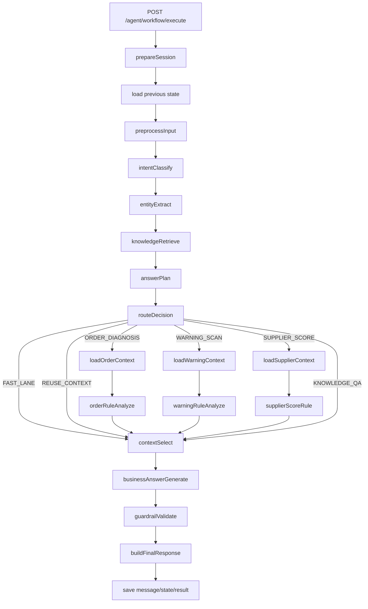

# 《Python版 AI Workflow 自然对话与体验优化傻瓜式落地手册》

> 基于现有文档：
>
> ```text
> document/Python版AI应用迁移傻瓜式落地手册.md
> document/Python版AI真正Agent工作流升级落地手册.md
> ```
>
> 本文档只解决一个问题：
>
> ```text
> 当前 Python workflow 虽然已经能跑通，也已经有了一定的 Agent 工作流能力，
> 但是现在仍然存在两个明显问题：
>
> 1. 非业务问题虽然快了，但回答发傻，像“请补充订单号”的死模板；
> 2. 业务问题虽然能答，但语言还不够像一个聪明、自然、懂业务的 Agent。
> ```
>
> 这份文档不是讨论思路，不是局部 patch，不是“后面有空再优化”。
> 你可以直接照着改当前项目：
>
> ```text
> D:\code\project\inventory\python_ai_workflow_service
> ```

---

## 0. 这份文档解决什么问题

你现在的系统已经具备：

```text
1. /agent/workflow/execute 主入口可用
2. threadId 连续对话可用
3. 订单诊断 / 风险扫描 / 供应商评分三条业务链路可用
4. AnswerPlan + ContextSelect 已经初步落地
5. 简单问候语已经能走快路径
```

但是现在还有一个更深层的问题：

```text
“快”和“聪明”还没有同时成立。
```

你当前遇到的真实现象是：

```text
1. “你会做什么”这类问题虽然变快了，但还比较像预设模板
2. “你是什么模型”这类元问题容易被误判成“请补充订单号”
3. “下一步谁处理”“怎么解决”这类业务追问虽然能答，但语气仍然像字段回填
4. 回答里还会出现 PURCHASER / HIGH / WAIT_CONFIRM 这类内部码值，真实感不够
5. 如果继续给 UNKNOWN 堆很多 if/else，系统会越来越突兀，越来越像规则机
```

根因不是模型不够聪明，也不是 prompt 某一句话没写好。

根因是现在系统还缺三层：

```text
1. InteractionType：先判断这一轮是 SOCIAL / META / BUSINESS / CLARIFY
2. MetaTopic：对于 META，只抽少量主题槽位，不做一堆硬编码快路径
3. AnswerHumanizer：把角色码、业务码、风险等级、状态码翻成中文人话
```

也就是说，这次不是继续“多写几条模板”。

这次真正要做的是：

```text
让系统先区分“这一轮在聊什么类型的问题”，
再决定是否走业务链路，
最后统一经过一层自然表达和中文化转换。
```

---

## 1. 这次改造后的目标

这次改造完，你应该得到下面这种效果：

```text
1. “你好 / 好的 / 谢谢 / 收到”
   直接快回复，不走业务检索，不走模型

2. “你是谁 / 你是什么模型 / 你会做什么 / 怎么用你”
   直接走 META 路径，回答自然，但不打断已有业务上下文

3. “下一步谁来处理这个问题 / 怎么解决 / 这个分数什么意思”
   继续基于 threadId 里的历史业务结果追问
   但输出更像自然语言，不像结构化字段拼接

4. PURCHASER / WAREHOUSE / HIGH / WAIT_CONFIRM / PURCHASE_ORDER
   不再直接暴露给用户，而是翻成中文角色和中文业务词

5. threadId 中间插入一次 META 或 SOCIAL 问题后，
   之前的业务上下文不会丢
```

最终你要得到的是：

```text
一个“对话层更像人、事实层仍然可控、延迟也更低”的 Python Workflow Agent。
```

---

## 2. 为什么这次不是“做很多元问题快路径”

你前面提到的担心是对的：

```text
如果我们把“你是什么模型”“你是谁”“你怎么工作”“你会做什么”
全写成一堆 if/else，
系统会越来越突兀，越来越脆。
```

所以这次正确做法不是：

```text
枚举几十种元问题问法
```

而是：

```text
先做一层粗粒度交互识别：

SOCIAL   问候 / 致谢 / 确认
META     问 Agent 自己
BUSINESS 问业务
CLARIFY  信息不足，需要用户补充
```

然后在 `META` 下面再只保留少量主题：

```text
IDENTITY
MODEL
CAPABILITY
USAGE
LIMITATION
```

这样做有两个好处：

```text
1. 规则不需要膨胀成几百条问法
2. 回答仍然可以通过统一表达层保持同一种 Agent 口气
```

这才是不突兀的做法。

---

## 3. 最终工作流长什么样

这次优化后的完整流程是：

```text
prepareSession
saveUserMessage
loadStateByThreadId
preprocessInput
intentClassify
entityExtract
knowledgeRetrieve
answerPlan
routeDecision
  ├─ FAST_LANE         -> contextSelect
  ├─ REUSE_CONTEXT     -> contextSelect
  ├─ ORDER_DIAGNOSIS   -> loadOrderContext -> orderRuleAnalyze -> contextSelect
  ├─ WARNING_SCAN      -> loadWarningContext -> warningRuleAnalyze -> contextSelect
  ├─ SUPPLIER_SCORE    -> loadSupplierContext -> supplierScoreRule -> contextSelect
  └─ KNOWLEDGE_QA      -> contextSelect
businessAnswerGenerate
guardrailValidate
buildFinalResponse
saveAssistantMessage
saveState
saveResult
return
```

请注意这次多了两个关键设计：

```text
1. interactionType
   决定这一轮是不是业务问题

2. activeIntent
   用来保存“当前 thread 正在处理的最近业务意图”
   即使中间插入一句“好的，谢谢”或“你是什么模型”，
   业务上下文也不会丢
```

用图看就是这样：



---

## 4. 这次要新增和替换哪些文件

本次新增：

```text
app/services/answer_humanizer.py
```

本次替换：

```text
app/schemas/answer_plan.py
app/workflows/state.py
app/workflows/nodes/intent_classify.py
app/workflows/nodes/answer_plan.py
app/workflows/nodes/knowledge_retrieve.py
app/workflows/nodes/route_decision.py
app/workflows/nodes/context_select.py
app/workflows/nodes/business_answer_generate.py
app/workflows/nodes/build_final_response.py
app/workflows/workflow_executor.py
```

本次局部修改：

```text
app/repositories/session_store.py
```

---

## 5. 这次的核心思想到底是什么

一句话总结：

```text
模型不再负责“所有轮次都重新理解一遍”，
而是只在真正需要自然表达的地方出手。
```

更具体一点：

```text
intentClassify
    先用代码识别交互类型，只有真的模糊时才让模型兜底

answerPlan
    不再额外调一次模型做规划，直接代码化

knowledgeRetrieve
    只有 BUSINESS 才做知识检索

routeDecision
    SOCIAL / META / CLARIFY 直接 FAST_LANE

businessAnswerGenerate
    先做人话化，再决定是否调用最终大模型
```

这会直接带来三个结果：

```text
1. 简单问题明显更快
2. 元问题不再发傻
3. 业务问题里的内部码值会被翻成中文
```

---

## 6. 逐文件完整代码

### 6.1 app/schemas/answer_plan.py

```python
from typing import Any

from pydantic import Field

from app.schemas.common import ApiModel


class AnswerPlan(ApiModel):
    interaction_type: str = Field(default="BUSINESS", alias="interactionType")
    meta_topic: str | None = Field(default=None, alias="metaTopic")
    intent: str
    turn_type: str = Field(default="FIRST_TURN", alias="turnType")
    answer_mode: str = Field(default="FULL_ANALYSIS", alias="answerMode")
    focus: str | None = None
    target_biz_no: str | None = Field(default=None, alias="targetBizNo")
    target_order_no: str | None = Field(default=None, alias="targetOrderNo")
    target_supplier_id: int | None = Field(default=None, alias="targetSupplierId")
    owner: str | None = None
    risk_level: str | None = Field(default=None, alias="riskLevel")
    risk_type: str | None = Field(default=None, alias="riskType")
    needs_refresh: bool = Field(default=True, alias="needsRefresh")
    use_llm: bool = Field(default=True, alias="useLlm")
    max_context_items: int = Field(default=10, alias="maxContextItems")


class SelectedContext(ApiModel):
    interaction_type: str = Field(default="BUSINESS", alias="interactionType")
    meta_topic: str | None = Field(default=None, alias="metaTopic")
    intent: str
    answer_mode: str = Field(alias="answerMode")
    summary: str | None = None
    facts: dict[str, Any] = Field(default_factory=dict)
    items: list[dict[str, Any]] = Field(default_factory=list)
    instruction: str | None = None
```

---

### 6.2 app/workflows/state.py

```python
from enum import Enum
from typing import Any, TypedDict

from pydantic import Field

from app.schemas.common import ApiModel


class WorkflowIntent(str, Enum):
    ORDER_DIAGNOSIS = "ORDER_DIAGNOSIS"
    WARNING_SCAN = "WARNING_SCAN"
    SUPPLIER_SCORE = "SUPPLIER_SCORE"
    KNOWLEDGE_QA = "KNOWLEDGE_QA"
    UNKNOWN = "UNKNOWN"


class InteractionType(str, Enum):
    BUSINESS = "BUSINESS"
    SOCIAL = "SOCIAL"
    META = "META"
    CLARIFY = "CLARIFY"


class WorkflowStateKeys:
    MESSAGE = "message"
    THREAD_ID = "threadId"
    AUTHORIZATION = "authorization"
    USER_ID = "userId"
    NORMALIZED_MESSAGE = "normalizedMessage"

    INTENT = "intent"
    ACTIVE_INTENT = "activeIntent"
    INTERACTION_TYPE = "interactionType"

    ENTITY = "entity"
    RAG_DOCS = "ragDocs"

    ORDER_SNAPSHOT = "orderSnapshot"
    ORDER_DIAGNOSIS = "orderDiagnosis"

    WARNING_CONTEXT = "warningContext"
    WARNING_ANALYSIS = "warningAnalysis"

    SUPPLIER_METRICS = "supplierMetrics"
    SUPPLIER_SCORE = "supplierScore"

    ANSWER_PLAN = "answerPlan"
    SELECTED_CONTEXT = "selectedContext"

    LLM_ANSWER = "llmAnswer"
    GUARDRAIL_RESULT = "guardrailResult"
    FINAL_RESPONSE = "finalResponse"
    ERROR_MESSAGE = "errorMessage"
    ROUTE = "_route"


class WorkflowEntity(ApiModel):
    order_no: str | None = Field(default=None, alias="orderNo")
    supplier_id: int | None = Field(default=None, alias="supplierId")
    days: int | None = None
    material_code: str | None = Field(default=None, alias="materialCode")
    warehouse_id: int | None = Field(default=None, alias="warehouseId")


class WorkflowGraphState(TypedDict, total=False):
    message: str
    threadId: str
    authorization: str
    userId: int
    normalizedMessage: str

    intent: str
    activeIntent: str
    interactionType: str

    entity: dict[str, Any]
    ragDocs: str

    orderSnapshot: dict[str, Any]
    orderDiagnosis: dict[str, Any]

    warningContext: dict[str, Any]
    warningAnalysis: dict[str, Any]

    supplierMetrics: dict[str, Any]
    supplierScore: dict[str, Any]

    answerPlan: dict[str, Any]
    selectedContext: dict[str, Any]

    llmAnswer: str
    guardrailResult: str
    finalResponse: dict[str, Any]
    errorMessage: str
    _route: str
```

---

### 6.3 新增文件：app/services/answer_humanizer.py

这一个文件专门解决两个问题：

```text
1. 不要把内部码值直接吐给用户
2. 让最终回答更像自然中文，而不是系统字段
```

完整代码如下：

```python
from copy import deepcopy
from typing import Any


class AnswerHumanizer:
    ROLE_LABELS = {
        "PURCHASER": "采购员",
        "WAREHOUSE": "仓库收货员",
        "SUPPLIER": "供应商",
        "ADMIN": "系统管理员",
        "NONE": "未指定责任方",
        "UNKNOWN": "待确认责任方",
    }

    STATUS_LABELS = {
        "WAIT_CONFIRM": "待供应商确认",
        "IN_PROGRESS": "执行中",
        "PARTIAL_ARRIVAL": "部分到货",
        "COMPLETED": "已完成",
        "CANCELLED": "已取消",
        "CLOSED": "已关闭",
        "PENDING": "待入库",
        "ABNORMAL": "异常到货",
    }

    RISK_LEVEL_LABELS = {
        "HIGH": "高风险",
        "MEDIUM": "中风险",
        "LOW": "低风险",
    }

    BIZ_TYPE_LABELS = {
        "PURCHASE_ORDER": "采购订单",
        "ARRIVAL": "到货单",
        "INBOUND": "入库单",
        "SUPPLIER": "供应商",
        "WARNING_SCAN": "风险扫描",
    }

    def role_label(self, code: str | None) -> str:
        if not code:
            return "待确认责任方"
        return self.ROLE_LABELS.get(str(code), str(code))

    def status_label(self, code: str | None) -> str:
        if not code:
            return ""
        return self.STATUS_LABELS.get(str(code), str(code))

    def risk_level_label(self, code: str | None) -> str:
        if not code:
            return ""
        return self.RISK_LEVEL_LABELS.get(str(code), str(code))

    def biz_type_label(self, code: str | None) -> str:
        if not code:
            return ""
        return self.BIZ_TYPE_LABELS.get(str(code), str(code))

    def humanize_selected_context(self, selected_context: dict[str, Any]) -> dict[str, Any]:
        return self._humanize_value(deepcopy(selected_context), None)

    def _humanize_value(self, value: Any, parent_key: str | None) -> Any:
        if isinstance(value, dict):
            result: dict[str, Any] = {}
            for key, item in value.items():
                display_key = self._humanize_nested_key(parent_key, key)
                result[display_key] = self._humanize_leaf(key, item)
            return result

        if isinstance(value, list):
            return [self._humanize_value(item, parent_key) for item in value]

        if isinstance(value, str):
            return self._humanize_free_text(value)

        return value

    def _humanize_leaf(self, key: str, value: Any) -> Any:
        if isinstance(value, (dict, list)):
            return self._humanize_value(value, key)

        if value is None:
            return value

        if key in {"suggestOwner", "owner"}:
            return self.role_label(str(value))

        if key == "riskLevel":
            return self.risk_level_label(str(value))

        if key == "bizType":
            return self.biz_type_label(str(value))

        if key in {"status", "orderStatus", "arrivalStatus", "inboundStatus"}:
            return self.status_label(str(value))

        if isinstance(value, str):
            return self._humanize_free_text(value)

        return value

    def _humanize_nested_key(self, parent_key: str | None, key: str) -> str:
        if parent_key == "ownerStats":
            return self.role_label(str(key))
        if parent_key == "riskLevelStats":
            return self.risk_level_label(str(key))
        if parent_key == "statusStats":
            return self.status_label(str(key))
        return str(key)

    def _humanize_free_text(self, text: str) -> str:
        result = text or ""

        replacements: dict[str, str] = {}
        replacements.update(self.ROLE_LABELS)
        replacements.update(self.STATUS_LABELS)
        replacements.update(self.RISK_LEVEL_LABELS)
        replacements.update(self.BIZ_TYPE_LABELS)

        for raw, label in replacements.items():
            result = result.replace(raw, label)

        return result
```

---

### 6.4 替换文件：app/workflows/nodes/intent_classify.py

这次 `intentClassify` 的关键目标不是“尽量多让模型判断”，而是：

```text
先用代码识别 InteractionType，
只有 BUSINESS 且规则没法确定意图时，才让模型兜底。
```

完整代码如下：

```python
import re

from app.clients.llm_client import LLMClient
from app.workflows.prompts import INTENT_CLASSIFY_PROMPT
from app.workflows.state import InteractionType, WorkflowIntent, WorkflowStateKeys


class IntentClassifyNode:
    ORDER_NO_PATTERN = re.compile(r"\bPO\d+\b", re.IGNORECASE)
    SUPPLIER_ID_PATTERN = re.compile(r"供应商\s*(\d+)")

    def __init__(self, llm_client: LLMClient):
        self.llm_client = llm_client

    async def __call__(self, state: dict) -> dict:
        message = str(state.get(WorkflowStateKeys.NORMALIZED_MESSAGE, "")).strip()
        active_intent = self._resolve_active_intent(state)

        interaction_type = self._classify_interaction_type(message, active_intent)
        if interaction_type == InteractionType.SOCIAL.value:
            return {
                WorkflowStateKeys.INTERACTION_TYPE: interaction_type,
                WorkflowStateKeys.INTENT: WorkflowIntent.UNKNOWN.value,
            }

        if interaction_type == InteractionType.META.value:
            return {
                WorkflowStateKeys.INTERACTION_TYPE: interaction_type,
                WorkflowStateKeys.INTENT: WorkflowIntent.UNKNOWN.value,
            }

        if interaction_type == InteractionType.CLARIFY.value:
            return {
                WorkflowStateKeys.INTERACTION_TYPE: interaction_type,
                WorkflowStateKeys.INTENT: WorkflowIntent.UNKNOWN.value,
            }

        rule_intent = self._rule_business_intent(message, active_intent)
        if rule_intent is not None:
            return {
                WorkflowStateKeys.INTERACTION_TYPE: InteractionType.BUSINESS.value,
                WorkflowStateKeys.INTENT: rule_intent,
                WorkflowStateKeys.ACTIVE_INTENT: rule_intent,
            }

        prompt = (
            INTENT_CLASSIFY_PROMPT
            .replace("{previousIntent}", active_intent)
            .replace("{message}", message)
        )
        intent_text = await self.llm_client.chat_text(
            "你是意图分类器，只输出意图编码。",
            prompt,
            temperature=0.0,
        )
        intent = self._parse_intent(intent_text)

        if intent == WorkflowIntent.UNKNOWN.value:
            if active_intent != WorkflowIntent.UNKNOWN.value and self._looks_like_business_follow_up(message):
                intent = active_intent
            else:
                return {
                    WorkflowStateKeys.INTERACTION_TYPE: InteractionType.CLARIFY.value,
                    WorkflowStateKeys.INTENT: WorkflowIntent.UNKNOWN.value,
                }

        return {
            WorkflowStateKeys.INTERACTION_TYPE: InteractionType.BUSINESS.value,
            WorkflowStateKeys.INTENT: intent,
            WorkflowStateKeys.ACTIVE_INTENT: intent,
        }

    def _resolve_active_intent(self, state: dict) -> str:
        active_intent = str(state.get(WorkflowStateKeys.ACTIVE_INTENT, "")).strip()
        if active_intent in {
            WorkflowIntent.ORDER_DIAGNOSIS.value,
            WorkflowIntent.WARNING_SCAN.value,
            WorkflowIntent.SUPPLIER_SCORE.value,
            WorkflowIntent.KNOWLEDGE_QA.value,
        }:
            return active_intent

        current_intent = str(state.get(WorkflowStateKeys.INTENT, WorkflowIntent.UNKNOWN.value))
        if current_intent in {
            WorkflowIntent.ORDER_DIAGNOSIS.value,
            WorkflowIntent.WARNING_SCAN.value,
            WorkflowIntent.SUPPLIER_SCORE.value,
            WorkflowIntent.KNOWLEDGE_QA.value,
        }:
            return current_intent

        return WorkflowIntent.UNKNOWN.value

    def _parse_intent(self, text: str | None) -> str:
        if not text:
            return WorkflowIntent.UNKNOWN.value
        value = text.strip()
        for intent in WorkflowIntent:
            if intent.value in value:
                return intent.value
        return WorkflowIntent.UNKNOWN.value

    def _classify_interaction_type(self, message: str, active_intent: str) -> str:
        if not message:
            return InteractionType.CLARIFY.value

        if self._is_social_message(message):
            return InteractionType.SOCIAL.value

        if self._is_meta_message(message):
            return InteractionType.META.value

        if active_intent != WorkflowIntent.UNKNOWN.value and self._looks_like_business_follow_up(message):
            return InteractionType.BUSINESS.value

        if self.ORDER_NO_PATTERN.search(message):
            return InteractionType.BUSINESS.value

        if self.SUPPLIER_ID_PATTERN.search(message):
            return InteractionType.BUSINESS.value

        if self._contains_any(
            message,
            [
                "订单",
                "采购单",
                "采购订单",
                "风险",
                "预警",
                "扫描",
                "供应商",
                "履约",
                "到货",
                "入库",
                "规则",
                "状态流转",
            ],
        ):
            return InteractionType.BUSINESS.value

        if len(message) <= 6:
            return InteractionType.CLARIFY.value

        return InteractionType.BUSINESS.value

    def _rule_business_intent(self, message: str, active_intent: str) -> str | None:
        text = (message or "").strip()

        if active_intent != WorkflowIntent.UNKNOWN.value and self._looks_like_business_follow_up(text):
            return active_intent

        if self.ORDER_NO_PATTERN.search(text):
            return WorkflowIntent.ORDER_DIAGNOSIS.value

        if self.SUPPLIER_ID_PATTERN.search(text) or (
            "供应商" in text and self._contains_any(text, ["履约", "评分", "分数", "等级", "合作", "表现", "分析"])
        ):
            return WorkflowIntent.SUPPLIER_SCORE.value

        if self._contains_any(text, ["风险", "预警", "扫描", "优先处理", "高风险", "中风险", "低风险"]):
            return WorkflowIntent.WARNING_SCAN.value

        if self._contains_any(text, ["规则", "状态流转", "为什么不能", "为什么无法", "怎么操作", "是什么意思"]):
            return WorkflowIntent.KNOWLEDGE_QA.value

        if self._contains_any(text, ["订单", "采购单", "采购订单"]) and self._contains_any(
            text,
            ["为什么", "没完成", "卡在哪", "下一步", "谁处理", "怎么处理", "怎么办", "到货", "入库"],
        ):
            return WorkflowIntent.ORDER_DIAGNOSIS.value

        return None

    def _is_social_message(self, text: str) -> bool:
        if text in {"你好", "您好", "hi", "hello", "在吗", "收到", "好的", "好", "谢谢", "谢谢你", "辛苦了", "ok", "OK"}:
            return True
        return self._contains_any(text, ["你好", "您好", "在吗", "收到", "好的", "谢谢", "辛苦了"])

    def _is_meta_message(self, text: str) -> bool:
        return self._contains_any(
            text,
            [
                "你是谁",
                "你是什么",
                "你是什么模型",
                "你用的什么模型",
                "底层模型",
                "你会做什么",
                "你能做什么",
                "你可以做什么",
                "你有什么能力",
                "怎么用你",
                "怎么和你说",
                "你怎么工作",
                "你和普通助手有什么区别",
                "你有什么限制",
            ],
        )

    def _looks_like_business_follow_up(self, text: str) -> bool:
        return self._contains_any(
            text,
            [
                "为什么",
                "原因",
                "下一步",
                "怎么处理",
                "怎么办",
                "谁处理",
                "什么意思",
                "依据",
                "哪个",
                "哪些",
                "先处理",
                "怎么解决",
                "这个问题",
                "这个分数",
                "这个风险",
            ],
        )

    def _contains_any(self, text: str, words: list[str]) -> bool:
        return any(word in (text or "") for word in words)
```

---

### 6.5 替换文件：app/workflows/nodes/answer_plan.py

这次 `AnswerPlanNode` 不再额外调一次模型。

原因很简单：

```text
当前系统要解决的第一优先级问题，是“别再把简单问题搞慢、搞傻”。
```

所以这次回答规划直接代码化。

完整代码如下：

```python
import re

from app.schemas.answer_plan import AnswerPlan
from app.workflows.state import InteractionType, WorkflowIntent, WorkflowStateKeys


BIZ_NO_PATTERN = re.compile(r"(PO|AR|IN)\d+", re.IGNORECASE)


class AnswerPlanNode:
    async def __call__(self, state: dict) -> dict:
        interaction_type = str(state.get(WorkflowStateKeys.INTERACTION_TYPE, InteractionType.BUSINESS.value))
        intent = str(state.get(WorkflowStateKeys.INTENT, WorkflowIntent.UNKNOWN.value))
        message = str(state.get(WorkflowStateKeys.MESSAGE, ""))

        plan = self._build_plan(state, interaction_type, intent, message)
        return {WorkflowStateKeys.ANSWER_PLAN: plan.model_dump(by_alias=True)}

    def _build_plan(self, state: dict, interaction_type: str, intent: str, message: str) -> AnswerPlan:
        has_reusable = self._has_reusable_result(state, intent)
        turn_type = "FOLLOW_UP" if has_reusable else "FIRST_TURN"
        target_biz_no = self._extract_biz_no(message)

        if interaction_type == InteractionType.SOCIAL.value:
            answer_mode = "GREETING" if self._contains_any(message, ["你好", "您好", "在吗", "hi", "hello"]) else "ACKNOWLEDGE"
            return AnswerPlan(
                interactionType=interaction_type,
                intent=WorkflowIntent.UNKNOWN.value,
                turnType=turn_type,
                answerMode=answer_mode,
                focus="social",
                needsRefresh=False,
                useLlm=False,
                maxContextItems=0,
            )

        if interaction_type == InteractionType.META.value:
            meta_topic = self._classify_meta_topic(message)
            answer_mode = {
                "IDENTITY": "META_IDENTITY",
                "MODEL": "META_MODEL",
                "CAPABILITY": "META_CAPABILITY",
                "USAGE": "META_USAGE",
                "LIMITATION": "META_LIMITATION",
            }[meta_topic]
            return AnswerPlan(
                interactionType=interaction_type,
                metaTopic=meta_topic,
                intent=WorkflowIntent.UNKNOWN.value,
                turnType=turn_type,
                answerMode=answer_mode,
                focus=meta_topic.lower(),
                needsRefresh=False,
                useLlm=False,
                maxContextItems=0,
            )

        if interaction_type == InteractionType.CLARIFY.value:
            return AnswerPlan(
                interactionType=interaction_type,
                intent=WorkflowIntent.UNKNOWN.value,
                turnType=turn_type,
                answerMode="CLARIFY",
                focus="clarify",
                needsRefresh=False,
                useLlm=False,
                maxContextItems=0,
            )

        answer_mode = "FULL_ANALYSIS"
        focus = None
        owner = None
        risk_level = None
        risk_type = None
        max_context_items = 10
        use_llm = True

        if intent == WorkflowIntent.ORDER_DIAGNOSIS.value:
            if self._contains_any(message, ["下一步", "谁处理", "谁负责", "怎么处理", "怎么办", "怎么解决"]):
                answer_mode = "NEXT_ACTION"
                focus = "owner_action"
                max_context_items = 3
                use_llm = False
            elif self._contains_any(message, ["为什么", "原因", "卡在哪", "没完成"]):
                answer_mode = "CAUSE_EXPLAIN"
                focus = "cause"
                max_context_items = 5
                use_llm = False
            elif self._contains_any(message, ["证据", "依据", "根据什么"]):
                answer_mode = "EVIDENCE_EXPLAIN"
                focus = "evidence"
                max_context_items = 5
                use_llm = False

        elif intent == WorkflowIntent.WARNING_SCAN.value:
            if target_biz_no:
                answer_mode = "SPECIFIC_BIZ_EXPLAIN"
                focus = "specific_biz"
                max_context_items = 5
                use_llm = False
            elif self._contains_any(message, ["哪个最严重", "最严重", "优先", "先处理", "top", "Top"]):
                answer_mode = "TOP_RISK"
                focus = "priority"
                max_context_items = 10
                use_llm = False
            elif self._contains_any(message, ["仓库", "入库"]):
                answer_mode = "OWNER_FILTER"
                owner = "WAREHOUSE"
                focus = "owner"
                max_context_items = 10
                use_llm = False
            elif self._contains_any(message, ["采购", "供应商"]):
                answer_mode = "OWNER_FILTER"
                owner = "PURCHASER"
                focus = "owner"
                max_context_items = 10
                use_llm = False
            elif self._contains_any(message, ["高风险", "HIGH"]):
                answer_mode = "RISK_LEVEL_FILTER"
                risk_level = "HIGH"
                focus = "risk_level"
                max_context_items = 10
                use_llm = False
            elif self._contains_any(message, ["确认超时", "到货", "入库", "停滞"]):
                answer_mode = "RISK_TYPE_FILTER"
                risk_type = message
                focus = "risk_type"
                max_context_items = 10
                use_llm = False
            else:
                answer_mode = "SUMMARY"
                focus = "summary"

        elif intent == WorkflowIntent.SUPPLIER_SCORE.value:
            if self._contains_any(message, ["分数", "意味着", "等级", "多少分"]):
                answer_mode = "SCORE_MEANING"
                focus = "score"
                max_context_items = 5
                use_llm = False
            elif self._contains_any(message, ["合作", "还能不能", "是否继续", "建议"]):
                answer_mode = "COOP_ADVICE"
                focus = "cooperation"
                max_context_items = 5
                use_llm = False
            elif self._contains_any(message, ["指标", "确认率", "到货", "入库", "异常"]):
                answer_mode = "METRIC_DETAIL"
                focus = "metrics"
                max_context_items = 5
                use_llm = False

        elif intent == WorkflowIntent.KNOWLEDGE_QA.value:
            answer_mode = "KNOWLEDGE_ANSWER"
            focus = "knowledge"
            max_context_items = 4
            use_llm = True

        return AnswerPlan(
            interactionType=interaction_type,
            intent=intent,
            turnType=turn_type,
            answerMode=answer_mode,
            focus=focus,
            targetBizNo=target_biz_no,
            targetOrderNo=self._extract_order_no(message),
            targetSupplierId=self._extract_supplier_id(message),
            owner=owner,
            riskLevel=risk_level,
            riskType=risk_type,
            needsRefresh=self._needs_refresh(state, interaction_type, intent, message),
            useLlm=use_llm,
            maxContextItems=max_context_items,
        )

    def _needs_refresh(self, state: dict, interaction_type: str, intent: str, message: str) -> bool:
        if interaction_type != InteractionType.BUSINESS.value:
            return False

        if not self._has_reusable_result(state, intent):
            return True

        if self._contains_any(message, ["重新", "刷新", "重新扫描", "再扫描", "最新"]):
            return True

        entity = dict(state.get(WorkflowStateKeys.ENTITY, {}) or {})

        if intent == WorkflowIntent.ORDER_DIAGNOSIS.value:
            current_order_no = entity.get("orderNo")
            previous = state.get(WorkflowStateKeys.ORDER_DIAGNOSIS) or {}
            previous_order_no = previous.get("orderNo")
            return bool(current_order_no and previous_order_no and current_order_no != previous_order_no)

        if intent == WorkflowIntent.SUPPLIER_SCORE.value:
            current_supplier_id = entity.get("supplierId")
            previous = state.get(WorkflowStateKeys.SUPPLIER_SCORE) or {}
            previous_supplier_id = previous.get("supplierId")
            return bool(current_supplier_id and previous_supplier_id and int(current_supplier_id) != int(previous_supplier_id))

        if intent == WorkflowIntent.WARNING_SCAN.value:
            return self._contains_any(message, ["扫描最近", "最近"])

        return False

    def _has_reusable_result(self, state: dict, intent: str) -> bool:
        if intent == WorkflowIntent.ORDER_DIAGNOSIS.value:
            return bool(state.get(WorkflowStateKeys.ORDER_DIAGNOSIS))
        if intent == WorkflowIntent.WARNING_SCAN.value:
            return bool(state.get(WorkflowStateKeys.WARNING_ANALYSIS))
        if intent == WorkflowIntent.SUPPLIER_SCORE.value:
            return bool(state.get(WorkflowStateKeys.SUPPLIER_SCORE))
        return False

    def _classify_meta_topic(self, message: str) -> str:
        text = (message or "").strip()
        if self._contains_any(text, ["什么模型", "哪个模型", "底层模型", "用的什么模型"]):
            return "MODEL"
        if self._contains_any(text, ["你是谁", "你是什么", "你是干嘛的"]):
            return "IDENTITY"
        if self._contains_any(text, ["你会做什么", "你能做什么", "你有什么能力"]):
            return "CAPABILITY"
        if self._contains_any(text, ["怎么用你", "怎么和你说", "怎么工作"]):
            return "USAGE"
        return "LIMITATION"

    def _extract_biz_no(self, text: str) -> str | None:
        match = BIZ_NO_PATTERN.search(text or "")
        return match.group(0).upper() if match else None

    def _extract_order_no(self, text: str) -> str | None:
        biz_no = self._extract_biz_no(text)
        return biz_no if biz_no and biz_no.startswith("PO") else None

    def _extract_supplier_id(self, text: str) -> int | None:
        match = re.search(r"供应商\s*(\d+)", text or "")
        return int(match.group(1)) if match else None

    def _contains_any(self, text: str, words: list[str]) -> bool:
        return any(word in (text or "") for word in words)
```

---

### 6.6 替换文件：app/workflows/nodes/knowledge_retrieve.py

这里的核心改动非常简单：

```text
只有 BUSINESS 才做知识检索。
SOCIAL / META / CLARIFY 一律不检索。
```

完整代码如下：

```python
from app.services.rag_service import RagService
from app.workflows.state import InteractionType, WorkflowStateKeys


class KnowledgeRetrieveNode:
    def __init__(self, rag_service: RagService):
        self.rag_service = rag_service

    async def __call__(self, state: dict) -> dict:
        interaction_type = str(state.get(WorkflowStateKeys.INTERACTION_TYPE, InteractionType.BUSINESS.value))
        intent = str(state.get(WorkflowStateKeys.INTENT, "UNKNOWN"))
        message = str(state.get(WorkflowStateKeys.NORMALIZED_MESSAGE, ""))
        authorization = str(state.get(WorkflowStateKeys.AUTHORIZATION, ""))

        if interaction_type != InteractionType.BUSINESS.value or intent == "UNKNOWN":
            return {WorkflowStateKeys.RAG_DOCS: ""}

        try:
            hits = await self.rag_service.search_internal(message, intent, 4, authorization)
            docs = self._build_rag_docs(hits, intent)
        except Exception:
            docs = self._fallback_docs(intent)

        return {WorkflowStateKeys.RAG_DOCS: docs}

    def _build_rag_docs(self, hits, intent: str) -> str:
        if not hits:
            return self._fallback_docs(intent)

        parts = ["以下内容来自知识库检索结果，只能作为业务规则参考，不能替代数据库实时业务数据：\n"]
        for index, hit in enumerate(hits, start=1):
            parts.append(f"【资料{index}】{hit.title}，相似度：{hit.score}\n{hit.content}\n")
        return "\n".join(parts)

    def _fallback_docs(self, intent: str) -> str:
        if intent == "ORDER_DIAGNOSIS":
            return "采购订单状态规则：WAIT_CONFIRM 待确认，IN_PROGRESS 执行中，PARTIAL_ARRIVAL 部分到货，COMPLETED 已完成。"
        if intent == "WARNING_SCAN":
            return "采购执行预警规则：待确认超时、到货停滞、待入库超时均应进入预警列表。"
        if intent == "SUPPLIER_SCORE":
            return "供应商评分规则：确认及时率、到货完成率、入库完成率、异常到货率共同影响评分。"
        return ""
```

---

### 6.7 替换文件：app/workflows/nodes/route_decision.py

`routeDecision` 这次要新增一个分支：

```text
FAST_LANE
```

它代表：

```text
这一轮不是业务分析，不需要再扫业务上下文，直接进 contextSelect。
```

完整代码如下：

```python
from app.workflows.state import InteractionType, WorkflowIntent, WorkflowStateKeys


class RouteDecisionNode:
    async def __call__(self, state: dict) -> dict:
        interaction_type = str(state.get(WorkflowStateKeys.INTERACTION_TYPE, InteractionType.BUSINESS.value))
        intent = str(state.get(WorkflowStateKeys.INTENT, WorkflowIntent.UNKNOWN.value))
        plan = dict(state.get(WorkflowStateKeys.ANSWER_PLAN, {}) or {})

        if interaction_type != InteractionType.BUSINESS.value:
            return {WorkflowStateKeys.ROUTE: "FAST_LANE"}

        if plan and not plan.get("needsRefresh", True) and self._has_reusable_result(state, intent):
            return {WorkflowStateKeys.ROUTE: "REUSE_CONTEXT"}

        return {WorkflowStateKeys.ROUTE: intent}

    def _has_reusable_result(self, state: dict, intent: str) -> bool:
        if intent == WorkflowIntent.ORDER_DIAGNOSIS.value:
            return bool(state.get(WorkflowStateKeys.ORDER_DIAGNOSIS))
        if intent == WorkflowIntent.WARNING_SCAN.value:
            return bool(state.get(WorkflowStateKeys.WARNING_ANALYSIS))
        if intent == WorkflowIntent.SUPPLIER_SCORE.value:
            return bool(state.get(WorkflowStateKeys.SUPPLIER_SCORE))
        return intent == WorkflowIntent.KNOWLEDGE_QA.value
```

---

### 6.8 替换文件：app/workflows/nodes/context_select.py

`contextSelect` 这次要把非业务问题也正规化，而不是只给一个死的 UNKNOWN 文本。

完整代码如下：

```python
import re
from typing import Any

from app.core.config import get_settings
from app.schemas.answer_plan import SelectedContext
from app.workflows.state import InteractionType, WorkflowIntent, WorkflowStateKeys


class ContextSelectNode:
    def __init__(self):
        self.settings = get_settings()

    async def __call__(self, state: dict) -> dict:
        interaction_type = str(state.get(WorkflowStateKeys.INTERACTION_TYPE, InteractionType.BUSINESS.value))
        intent = str(state.get(WorkflowStateKeys.INTENT, WorkflowIntent.UNKNOWN.value))
        plan = dict(state.get(WorkflowStateKeys.ANSWER_PLAN, {}) or {})

        if interaction_type == InteractionType.SOCIAL.value:
            selected = self._select_social_context(plan)
        elif interaction_type == InteractionType.META.value:
            selected = self._select_meta_context(plan)
        elif interaction_type == InteractionType.CLARIFY.value:
            selected = self._select_clarify_context(plan)
        elif intent == WorkflowIntent.ORDER_DIAGNOSIS.value:
            selected = self._select_order_context(state, plan)
        elif intent == WorkflowIntent.WARNING_SCAN.value:
            selected = self._select_warning_context(state, plan)
        elif intent == WorkflowIntent.SUPPLIER_SCORE.value:
            selected = self._select_supplier_context(state, plan)
        elif intent == WorkflowIntent.KNOWLEDGE_QA.value:
            selected = SelectedContext(
                interactionType=interaction_type,
                intent=intent,
                answerMode=plan.get("answerMode", "KNOWLEDGE_ANSWER"),
                summary="知识库问答",
                facts={"ragDocs": state.get(WorkflowStateKeys.RAG_DOCS, "")},
                instruction="基于知识库片段回答用户问题。",
            )
        else:
            selected = self._select_clarify_context(plan)

        return {WorkflowStateKeys.SELECTED_CONTEXT: selected.model_dump(by_alias=True)}

    def _select_social_context(self, plan: dict) -> SelectedContext:
        mode = plan.get("answerMode", "ACKNOWLEDGE")
        if mode == "GREETING":
            summary = "问候"
            facts = {
                "followUpHint": "你可以直接发订单号、供应商ID，或者说“扫描最近7天采购风险”。",
            }
            instruction = "简短接住用户的问候，然后自然引导到业务问题。"
        else:
            summary = "确认收到"
            facts = {
                "followUpHint": "如果你接下来要继续看业务，直接把订单号、供应商ID或扫描范围发过来就行。",
            }
            instruction = "简短收束，不重复业务结论。"

        return SelectedContext(
            interactionType=InteractionType.SOCIAL.value,
            intent=WorkflowIntent.UNKNOWN.value,
            answerMode=mode,
            summary=summary,
            facts=facts,
            instruction=instruction,
        )

    def _select_meta_context(self, plan: dict) -> SelectedContext:
        meta_topic = plan.get("metaTopic") or "CAPABILITY"
        mode = plan.get("answerMode", "META_CAPABILITY")

        base_facts = {
            "agentName": "采购入库协同业务 Agent",
            "modelName": self.settings.model_name,
            "capabilities": [
                "按订单号诊断采购订单卡在哪、为什么没完成、下一步谁处理。",
                "扫描近期采购执行风险，按风险等级、责任角色和优先级给出处理建议。",
                "分析供应商履约表现，解释评分、指标短板和合作建议。",
            ],
            "examples": [
                "帮我分析 PO2026040022 为什么还没完成",
                "扫描最近7天采购执行风险",
                "分析供应商1最近180天履约表现",
            ],
            "limitations": [
                "我擅长的是采购入库协同业务，不是通用百科问答。",
                "如果没有订单号、供应商ID或扫描范围，我只能先引导你补充信息。",
                "我的结论会严格依赖系统里的业务数据和规则，不会编造事实。",
            ],
        }

        if meta_topic == "MODEL":
            summary = "模型说明"
            instruction = "回答当前接的是哪个模型，并强调对用户真正有价值的是业务能力。"
        elif meta_topic == "IDENTITY":
            summary = "Agent 身份说明"
            instruction = "回答你是谁、职责是什么。"
        elif meta_topic == "USAGE":
            summary = "使用说明"
            instruction = "告诉用户怎样最省事地跟你提问。"
        elif meta_topic == "LIMITATION":
            summary = "能力边界"
            instruction = "坦诚说明边界，但不要显得笨。"
        else:
            summary = "能力介绍"
            instruction = "介绍能做什么，并给出可直接复制的示例。"

        return SelectedContext(
            interactionType=InteractionType.META.value,
            metaTopic=meta_topic,
            intent=WorkflowIntent.UNKNOWN.value,
            answerMode=mode,
            summary=summary,
            facts=base_facts,
            instruction=instruction,
        )

    def _select_clarify_context(self, plan: dict) -> SelectedContext:
        facts = {
            "examples": [
                "帮我分析 PO2026040022 为什么还没完成",
                "扫描最近7天采购执行风险",
                "分析供应商1最近180天履约表现",
            ]
        }
        return SelectedContext(
            interactionType=InteractionType.CLARIFY.value,
            intent=WorkflowIntent.UNKNOWN.value,
            answerMode=plan.get("answerMode", "CLARIFY"),
            summary="信息不足",
            facts=facts,
            instruction="提示用户补充一个具体业务对象，不要显得机械。",
        )

    def _select_order_context(self, state: dict, plan: dict) -> SelectedContext:
        diagnosis = dict(state.get(WorkflowStateKeys.ORDER_DIAGNOSIS, {}) or {})
        snapshot = dict(state.get(WorkflowStateKeys.ORDER_SNAPSHOT, {}) or {})
        mode = plan.get("answerMode", "FULL_ANALYSIS")

        if mode == "NEXT_ACTION":
            facts = {
                "currentStage": diagnosis.get("currentStage"),
                "suggestOwner": diagnosis.get("suggestOwner"),
                "suggestAction": diagnosis.get("suggestAction"),
            }
            instruction = "只回答下一步谁处理、怎么处理，不要重复完整诊断报告。"
        elif mode == "CAUSE_EXPLAIN":
            facts = {
                "currentStage": diagnosis.get("currentStage"),
                "blockReason": diagnosis.get("blockReason"),
                "evidence": diagnosis.get("evidence", []),
            }
            instruction = "重点解释为什么没有完成、卡在哪个环节。"
        elif mode == "EVIDENCE_EXPLAIN":
            facts = {
                "evidence": diagnosis.get("evidence", []),
                "snapshot": snapshot,
            }
            instruction = "只解释判断依据和关键证据。"
        else:
            facts = {
                "snapshot": snapshot,
                "diagnosis": diagnosis,
            }
            instruction = "给出完整但简洁的订单诊断。"

        return SelectedContext(
            interactionType=InteractionType.BUSINESS.value,
            intent=WorkflowIntent.ORDER_DIAGNOSIS.value,
            answerMode=mode,
            summary=diagnosis.get("blockReason"),
            facts=facts,
            instruction=instruction,
        )

    def _select_warning_context(self, state: dict, plan: dict) -> SelectedContext:
        analysis = dict(state.get(WorkflowStateKeys.WARNING_ANALYSIS, {}) or {})
        items = list(analysis.get("items", []) or [])
        mode = plan.get("answerMode", "SUMMARY")
        limit = int(plan.get("maxContextItems", 10) or 10)
        limit = max(1, min(limit, 20))

        selected_items = items
        instruction = "总结本次预警扫描结果。"

        if mode == "SPECIFIC_BIZ_EXPLAIN":
            target_biz_no = plan.get("targetBizNo")
            selected_items = [item for item in items if item.get("bizNo") == target_biz_no]
            instruction = f"只解释 {target_biz_no} 为什么风险高。"
        elif mode == "TOP_RISK":
            selected_items = self._sort_warning_items(items)[:limit]
            instruction = "说明哪些风险最严重，以及为什么优先处理。"
        elif mode == "OWNER_FILTER":
            owner = plan.get("owner")
            selected_items = [item for item in items if item.get("suggestOwner") == owner]
            selected_items = self._sort_warning_items(selected_items)[:limit]
            instruction = f"只分析 {owner} 相关风险。"
        elif mode == "RISK_LEVEL_FILTER":
            risk_level = plan.get("riskLevel")
            selected_items = [item for item in items if item.get("riskLevel") == risk_level]
            selected_items = self._sort_warning_items(selected_items)[:limit]
            instruction = f"只分析 {risk_level} 风险。"
        elif mode == "RISK_TYPE_FILTER":
            risk_type = plan.get("riskType") or ""
            selected_items = [
                item for item in items
                if risk_type in item.get("problem", "") or risk_type in item.get("reason", "")
            ]
            selected_items = self._sort_warning_items(selected_items)[:limit]
            instruction = "只分析用户关心的风险类型。"
        else:
            selected_items = self._sort_warning_items(items)[:limit]
            instruction = "给出风险总览、Top 风险类型和建议处理顺序。"

        facts = {
            "totalCount": len(items),
            "highRiskCount": sum(1 for item in items if item.get("riskLevel") == "HIGH"),
            "mediumRiskCount": sum(1 for item in items if item.get("riskLevel") == "MEDIUM"),
            "riskTypeStats": self._risk_type_stats(items),
            "ownerStats": self._owner_stats(items),
        }

        return SelectedContext(
            interactionType=InteractionType.BUSINESS.value,
            intent=WorkflowIntent.WARNING_SCAN.value,
            answerMode=mode,
            summary=analysis.get("summary"),
            facts=facts,
            items=selected_items[:limit],
            instruction=instruction,
        )

    def _select_supplier_context(self, state: dict, plan: dict) -> SelectedContext:
        metrics = dict(state.get(WorkflowStateKeys.SUPPLIER_METRICS, {}) or {})
        score = dict(state.get(WorkflowStateKeys.SUPPLIER_SCORE, {}) or {})
        mode = plan.get("answerMode", "FULL_ANALYSIS")

        if mode == "SCORE_MEANING":
            facts = {
                "supplierId": score.get("supplierId"),
                "supplierName": score.get("supplierName"),
                "score": score.get("score"),
                "level": score.get("level"),
                "keyMetrics": {
                    "confirmRate": score.get("confirmRate"),
                    "arrivalCompletionRate": score.get("arrivalCompletionRate"),
                    "inboundCompletionRate": score.get("inboundCompletionRate"),
                    "abnormalArrivalRate": score.get("abnormalArrivalRate"),
                },
            }
            instruction = "解释这个分数和等级意味着什么。"
        elif mode == "COOP_ADVICE":
            facts = {
                "score": score,
                "metrics": metrics,
            }
            instruction = "重点回答是否建议继续合作，以及合作策略。"
        elif mode == "METRIC_DETAIL":
            facts = {
                "metrics": metrics,
                "score": score,
            }
            instruction = "重点解释哪些指标拖累评分。"
        else:
            facts = {
                "metrics": metrics,
                "score": score,
            }
            instruction = "给出完整但简洁的供应商履约分析。"

        return SelectedContext(
            interactionType=InteractionType.BUSINESS.value,
            intent=WorkflowIntent.SUPPLIER_SCORE.value,
            answerMode=mode,
            summary=score.get("analysis") or score.get("suggestion"),
            facts=facts,
            instruction=instruction,
        )

    def _sort_warning_items(self, items: list[dict[str, Any]]) -> list[dict[str, Any]]:
        def score(item: dict[str, Any]) -> tuple[int, int]:
            risk_score = 2 if item.get("riskLevel") == "HIGH" else 1
            overdue = self._extract_overdue_days(item.get("reason", ""))
            return risk_score, overdue

        return sorted(items, key=score, reverse=True)

    def _extract_overdue_days(self, reason: str) -> int:
        match = re.search(r"超时\s*(\d+)\s*天", reason or "")
        return int(match.group(1)) if match else 0

    def _risk_type_stats(self, items: list[dict[str, Any]]) -> dict[str, int]:
        stats: dict[str, int] = {}
        for item in items:
            problem = item.get("problem") or "未知风险"
            stats[problem] = stats.get(problem, 0) + 1
        return dict(sorted(stats.items(), key=lambda kv: kv[1], reverse=True)[:10])

    def _owner_stats(self, items: list[dict[str, Any]]) -> dict[str, int]:
        stats: dict[str, int] = {}
        for item in items:
            owner = item.get("suggestOwner") or "UNKNOWN"
            stats[owner] = stats.get(owner, 0) + 1
        return dict(sorted(stats.items(), key=lambda kv: kv[1], reverse=True))
```

---

### 6.9 替换文件：app/workflows/nodes/business_answer_generate.py

这一层是本次体验优化的关键。

原因是：

```text
就算前面的路由都对了，
如果最后回答仍然像字段拼接，
用户感受还是会觉得“有点傻”。
```

完整代码如下：

```python
import json

from app.clients.llm_client import LLMClient
from app.core.config import get_settings
from app.services.answer_humanizer import AnswerHumanizer
from app.workflows.state import InteractionType, WorkflowStateKeys


class BusinessAnswerGenerateNode:
    def __init__(self, llm_client: LLMClient):
        self.llm_client = llm_client
        self.settings = get_settings()
        self.humanizer = AnswerHumanizer()

    async def __call__(self, state: dict) -> dict:
        interaction_type = str(state.get(WorkflowStateKeys.INTERACTION_TYPE, InteractionType.BUSINESS.value))
        message = str(state.get(WorkflowStateKeys.MESSAGE, ""))
        error_message = str(state.get(WorkflowStateKeys.ERROR_MESSAGE, ""))
        if error_message:
            return {WorkflowStateKeys.LLM_ANSWER: error_message}

        answer_plan = dict(state.get(WorkflowStateKeys.ANSWER_PLAN, {}) or {})
        selected_context = dict(state.get(WorkflowStateKeys.SELECTED_CONTEXT, {}) or {})

        if not selected_context:
            return {WorkflowStateKeys.LLM_ANSWER: "当前没有可用上下文。你可以先给我订单号、供应商ID，或者一个明确的扫描范围。"}

        humanized_context = self.humanizer.humanize_selected_context(selected_context)

        if not answer_plan.get("useLlm", True):
            return {WorkflowStateKeys.LLM_ANSWER: self._fallback_answer(interaction_type, humanized_context)}

        prompt = self._build_prompt(message, answer_plan, humanized_context)

        try:
            answer = await self.llm_client.chat_text(
                "你是采购入库协同业务 Agent。你必须严格基于给定上下文回答，不允许编造事实。",
                prompt,
            )
        except Exception:
            answer = self._fallback_answer(interaction_type, humanized_context)

        return {WorkflowStateKeys.LLM_ANSWER: answer}

    def _build_prompt(self, message: str, answer_plan: dict, selected_context: dict) -> str:
        return f"""
你是采购入库协同业务 Agent。

你不是客服话术机，也不是 JSON 字段解释器。
你现在要回答的是“用户这一轮真正关心的问题”，不是把整份报告重说一遍。

回答风格要求：
1. 先接住用户问题，再给明确结论。
2. 结论后再补原因、证据或下一步动作。
3. 语气要像一个专业、靠谱、说人话的同事。
4. 不要说“根据系统指令”“为您生成”“如下所示”。
5. 不要直接输出内部码值，例如 PURCHASER / HIGH / WAIT_CONFIRM。
6. 如果 answerMode 不是 FULL_ANALYSIS、SUMMARY、KNOWLEDGE_ANSWER，就不要输出完整报告。
7. 如果上下文不足，直接说缺什么，不要编造。

用户当前问题：
{message}

回答计划 answerPlan：
{self._to_text(answer_plan)}

本轮选中上下文 selectedContext：
{self._to_text(selected_context)}

请直接输出中文回答。
""".strip()

    def _fallback_answer(self, interaction_type: str, selected_context: dict) -> str:
        intent = selected_context.get("intent")
        mode = selected_context.get("answerMode")
        summary = selected_context.get("summary")
        facts = selected_context.get("facts") or {}
        items = selected_context.get("items") or []

        if interaction_type == InteractionType.SOCIAL.value:
            if mode == "GREETING":
                return f"你好，我在。{facts.get('followUpHint')}"
            return f"好，明白了。{facts.get('followUpHint')}"

        if interaction_type == InteractionType.META.value:
            if mode == "META_MODEL":
                return (
                    f"当前这套服务接的是 {facts.get('modelName')}。"
                    f"不过对你来说，更重要的是我不是通用闲聊助手，"
                    f"而是专门帮你处理采购入库协同业务的 {facts.get('agentName')}。"
                )

            if mode == "META_IDENTITY":
                return (
                    f"你可以把我理解成一个 {facts.get('agentName')}。"
                    "我擅长把订单、风险和供应商履约这些业务数据串起来，"
                    "直接告诉你问题卡在哪、为什么会发生、下一步该谁处理。"
                )

            if mode == "META_USAGE":
                examples = facts.get("examples") or []
                example_text = "\n".join(f"- {example}" for example in examples[:3])
                return (
                    "最省事的用法就是直接把业务对象发给我，不用先铺垫背景。\n"
                    "你可以直接这样问：\n"
                    f"{example_text}"
                )

            if mode == "META_LIMITATION":
                limitations = facts.get("limitations") or []
                limitation_text = "；".join(limitations[:3])
                return f"我的边界大概是这样：{limitation_text}"

            examples = facts.get("examples") or []
            example_text = "\n".join(f"- {example}" for example in examples[:3])
            return (
                "我主要能帮你处理三类问题：订单卡单诊断、采购执行风险扫描、供应商履约分析。\n"
                "你可以直接这样问：\n"
                f"{example_text}"
            )

        if interaction_type == InteractionType.CLARIFY.value:
            examples = facts.get("examples") or []
            example_text = "\n".join(f"- {example}" for example in examples[:3])
            return (
                "我先需要一个更具体的业务对象，才能继续往下看。\n"
                "你可以直接这样发给我：\n"
                f"{example_text}"
            )

        if intent == "ORDER_DIAGNOSIS":
            if mode == "NEXT_ACTION":
                return (
                    f"这单现在先由 {facts.get('suggestOwner')} 跟进就行。"
                    f"具体动作是：{facts.get('suggestAction')}。"
                )

            if mode == "CAUSE_EXPLAIN":
                evidence = "；".join(facts.get("evidence") or [])
                return (
                    f"这单目前卡在“{facts.get('currentStage')}”这个阶段。"
                    f"直接原因是：{facts.get('blockReason')}。"
                    f"我这样判断的依据主要有：{evidence}。"
                )

            if mode == "EVIDENCE_EXPLAIN":
                evidence = "；".join(facts.get("evidence") or [])
                return f"这次判断主要依据这些证据：{evidence}。"

            return summary or "订单诊断已经完成，你可以继续追问“为什么没完成”或者“下一步谁处理”。"

        if intent == "WARNING_SCAN":
            total = facts.get("totalCount", 0)
            high = facts.get("highRiskCount", 0)
            medium = facts.get("mediumRiskCount", 0)

            if mode == "SPECIFIC_BIZ_EXPLAIN" and items:
                item = items[0]
                return (
                    f"{item.get('bizNo')} 现在属于 {item.get('riskLevel')}。"
                    f"它被判成风险单，主要是因为命中了“{item.get('problem')}”。"
                    f"直接原因是：{item.get('reason')}。"
                    f"建议先由 {item.get('suggestOwner')} 处理，动作是：{item.get('suggestAction')}。"
                )

            if mode == "TOP_RISK" and items:
                biz_nos = "、".join(item.get("bizNo", "") for item in items[:5])
                return (
                    f"如果今天只能优先处理一批，建议先盯这几单：{biz_nos}。"
                    "处理顺序上先清高风险，再处理中风险。"
                )

            if mode == "OWNER_FILTER":
                owner = items[0].get("suggestOwner") if items else "对应责任人"
                biz_nos = "、".join(item.get("bizNo", "") for item in items[:5]) or "暂无"
                return f"当前和 {owner} 相关、最值得先看的风险单据主要是：{biz_nos}。"

            if mode == "RISK_LEVEL_FILTER":
                level = items[0].get("riskLevel") if items else "指定风险等级"
                biz_nos = "、".join(item.get("bizNo", "") for item in items[:5]) or "暂无"
                return f"当前 {level} 里最需要优先看的单据有：{biz_nos}。"

            if mode == "RISK_TYPE_FILTER":
                biz_nos = "、".join(item.get("bizNo", "") for item in items[:5]) or "暂无"
                return f"你关心的这类风险，现在主要集中在这些单据：{biz_nos}。"

            return f"本次扫描共发现 {total} 个风险，其中高风险 {high} 个，中风险 {medium} 个。"

        if intent == "SUPPLIER_SCORE":
            metrics = facts.get("metrics") or {}
            score = facts.get("score") or {}

            if mode == "SCORE_MEANING":
                return (
                    f"这个分数可以理解为：供应商当前整体属于“{score.get('level')}”水平，"
                    f"综合得分 {score.get('score')}。"
                    "重点就看确认率、到货完成率、入库完成率和异常到货率，"
                    "哪一项偏低，就说明履约还有明显短板。"
                )

            if mode == "COOP_ADVICE":
                return (
                    f"从当前结果看，这家供应商综合评分 {score.get('score')}，等级 {score.get('level')}。"
                    "如果业务必须继续合作，可以继续，但要重点盯确认和履约过程，不能完全放手。"
                )

            if mode == "METRIC_DETAIL":
                return (
                    f"当前拖累评分的关键指标主要是：确认率 {metrics.get('confirmRate')}，"
                    f"到货完成率 {metrics.get('arrivalCompletionRate')}，入库完成率 {metrics.get('inboundCompletionRate')}。"
                    "也就是说，它的问题更多是履约效率，而不是到货质量。"
                )

            return summary or "供应商履约分析已经完成，你可以继续追问“这个分数意味着什么”或者“还建议继续合作吗”。"

        return summary or "已完成分析。"

    def _to_text(self, value) -> str:
        return json.dumps(value, ensure_ascii=False, default=str)
```

---

### 6.10 替换文件：app/workflows/nodes/build_final_response.py

这里有一个非常关键的细节：

```text
META / SOCIAL / CLARIFY 这类问题的 response.data 必须为空，
否则会把上一次业务结果误带给前端。
```

完整代码如下：

```python
from app.schemas.workflow import WorkflowAgentResponse
from app.workflows.state import InteractionType, WorkflowStateKeys


class BuildFinalResponseNode:
    async def __call__(self, state: dict) -> dict:
        interaction_type = str(state.get(WorkflowStateKeys.INTERACTION_TYPE, InteractionType.BUSINESS.value))
        intent = str(state.get(WorkflowStateKeys.INTENT, "UNKNOWN"))
        answer = str(state.get(WorkflowStateKeys.LLM_ANSWER, ""))
        thread_id = str(state.get(WorkflowStateKeys.THREAD_ID, ""))

        response_intent = intent if interaction_type == InteractionType.BUSINESS.value else "UNKNOWN"

        response = WorkflowAgentResponse(
            threadId=thread_id,
            intent=response_intent,
            answer=answer,
            data=None,
        )

        if interaction_type != InteractionType.BUSINESS.value:
            return {WorkflowStateKeys.FINAL_RESPONSE: response.model_dump(by_alias=True)}

        if intent == "ORDER_DIAGNOSIS":
            response.data = state.get(WorkflowStateKeys.ORDER_DIAGNOSIS)
        elif intent == "WARNING_SCAN":
            response.data = state.get(WorkflowStateKeys.WARNING_ANALYSIS)
        elif intent == "SUPPLIER_SCORE":
            response.data = state.get(WorkflowStateKeys.SUPPLIER_SCORE)

        return {WorkflowStateKeys.FINAL_RESPONSE: response.model_dump(by_alias=True)}
```

---

### 6.11 替换文件：app/workflows/workflow_executor.py

这一层的关键改动有两个：

```text
1. AnswerPlanNode 不再依赖 LLMClient
2. 保存会话 current_intent 时，优先保存 activeIntent，而不是当前 response.intent
```

第二点尤其重要。

因为：

```text
如果当前轮次是“好的，谢谢”或“你是什么模型”，
response.intent 会是 UNKNOWN，
但 thread 里的业务上下文不能因此丢失。
```

完整代码如下：

```python
from langgraph.graph import END, START, StateGraph

from app.clients.inventory_backend import InventoryBackendClient
from app.clients.llm_client import LLMClient
from app.repositories.session_store import SessionStore
from app.schemas.workflow import WorkflowAgentRequest, WorkflowAgentResponse
from app.services.rag_service import RagService
from app.workflows.nodes.answer_plan import AnswerPlanNode
from app.workflows.nodes.build_final_response import BuildFinalResponseNode
from app.workflows.nodes.business_answer_generate import BusinessAnswerGenerateNode
from app.workflows.nodes.context_select import ContextSelectNode
from app.workflows.nodes.entity_extract import EntityExtractNode
from app.workflows.nodes.guardrail_validate import GuardrailValidateNode
from app.workflows.nodes.intent_classify import IntentClassifyNode
from app.workflows.nodes.knowledge_retrieve import KnowledgeRetrieveNode
from app.workflows.nodes.load_order_context import LoadOrderContextNode
from app.workflows.nodes.load_supplier_context import LoadSupplierContextNode
from app.workflows.nodes.load_warning_context import LoadWarningContextNode
from app.workflows.nodes.order_rule_analyze import OrderRuleAnalyzeNode
from app.workflows.nodes.preprocess_input import PreprocessInputNode
from app.workflows.nodes.route_decision import RouteDecisionNode
from app.workflows.nodes.supplier_score_rule import SupplierScoreRuleNode
from app.workflows.nodes.warning_rule_analyze import WarningRuleAnalyzeNode
from app.workflows.state import WorkflowGraphState, WorkflowIntent, WorkflowStateKeys


class WorkflowExecutor:
    def __init__(
        self,
        backend: InventoryBackendClient,
        llm_client: LLMClient,
        rag_service: RagService,
        session_store: SessionStore,
    ):
        self.backend = backend
        self.llm_client = llm_client
        self.rag_service = rag_service
        self.session_store = session_store
        self.graph = self._build_graph()

    def _build_graph(self):
        builder = StateGraph(WorkflowGraphState)

        builder.add_node("preprocessInput", PreprocessInputNode())
        builder.add_node("classifyIntent", IntentClassifyNode(self.llm_client))
        builder.add_node("extractEntities", EntityExtractNode())
        builder.add_node("retrieveKnowledge", KnowledgeRetrieveNode(self.rag_service))
        builder.add_node("answerPlan", AnswerPlanNode())
        builder.add_node("routeByIntent", RouteDecisionNode())

        builder.add_node("loadOrderContext", LoadOrderContextNode(self.backend, self.session_store))
        builder.add_node("analyzeOrderByRules", OrderRuleAnalyzeNode())
        builder.add_node("loadWarningContext", LoadWarningContextNode(self.backend, self.session_store))
        builder.add_node("analyzeWarningsByRules", WarningRuleAnalyzeNode())
        builder.add_node("loadSupplierContext", LoadSupplierContextNode(self.backend, self.session_store))
        builder.add_node("scoreSupplierByRules", SupplierScoreRuleNode())

        builder.add_node("contextSelect", ContextSelectNode())
        builder.add_node("generateBusinessAnswer", BusinessAnswerGenerateNode(self.llm_client))
        builder.add_node("guardrailValidate", GuardrailValidateNode())
        builder.add_node("buildFinalResponse", BuildFinalResponseNode())

        builder.add_edge(START, "preprocessInput")
        builder.add_edge("preprocessInput", "classifyIntent")
        builder.add_edge("classifyIntent", "extractEntities")
        builder.add_edge("extractEntities", "retrieveKnowledge")
        builder.add_edge("retrieveKnowledge", "answerPlan")
        builder.add_edge("answerPlan", "routeByIntent")

        builder.add_conditional_edges(
            "routeByIntent",
            lambda state: state.get(WorkflowStateKeys.ROUTE, WorkflowIntent.UNKNOWN.value),
            {
                "FAST_LANE": "contextSelect",
                "REUSE_CONTEXT": "contextSelect",
                WorkflowIntent.ORDER_DIAGNOSIS.value: "loadOrderContext",
                WorkflowIntent.WARNING_SCAN.value: "loadWarningContext",
                WorkflowIntent.SUPPLIER_SCORE.value: "loadSupplierContext",
                WorkflowIntent.KNOWLEDGE_QA.value: "contextSelect",
                WorkflowIntent.UNKNOWN.value: "contextSelect",
            },
        )

        builder.add_edge("loadOrderContext", "analyzeOrderByRules")
        builder.add_edge("analyzeOrderByRules", "contextSelect")

        builder.add_edge("loadWarningContext", "analyzeWarningsByRules")
        builder.add_edge("analyzeWarningsByRules", "contextSelect")

        builder.add_edge("loadSupplierContext", "scoreSupplierByRules")
        builder.add_edge("scoreSupplierByRules", "contextSelect")

        builder.add_edge("contextSelect", "generateBusinessAnswer")
        builder.add_edge("generateBusinessAnswer", "guardrailValidate")
        builder.add_edge("guardrailValidate", "buildFinalResponse")
        builder.add_edge("buildFinalResponse", END)

        return builder.compile()

    async def execute(self, request: WorkflowAgentRequest, authorization: str) -> WorkflowAgentResponse:
        current_user = await self.backend.get_current_user(authorization)
        session = self.session_store.prepare_session(request.thread_id, current_user.id, request.message)
        self.session_store.save_user_message(session, request.message)

        restored_state = self.session_store.load_state_by_thread_id(session["thread_id"])
        input_state = dict(restored_state)
        input_state[WorkflowStateKeys.MESSAGE] = request.message or ""
        input_state[WorkflowStateKeys.THREAD_ID] = session["thread_id"]
        input_state[WorkflowStateKeys.AUTHORIZATION] = authorization
        input_state[WorkflowStateKeys.USER_ID] = current_user.id

        result_state = await self.graph.ainvoke(input_state)
        final_response = result_state.get(WorkflowStateKeys.FINAL_RESPONSE)
        if not final_response:
            response = WorkflowAgentResponse(
                sessionId=session["id"],
                threadId=session["thread_id"],
                intent="UNKNOWN",
                answer="工作流执行失败，未生成最终响应。",
                data=None,
            )
        else:
            response = WorkflowAgentResponse(**final_response)
            response.session_id = session["id"]
            response.thread_id = session["thread_id"]

        active_intent = str(result_state.get(WorkflowStateKeys.ACTIVE_INTENT, "")).strip()
        current_intent_for_session = active_intent or response.intent
        if current_intent_for_session == "UNKNOWN":
            current_intent_for_session = None

        self.session_store.update_session_intent(session["id"], current_intent_for_session)
        self.session_store.save_assistant_message(session, response.answer)
        self.session_store.save_state(session, "END", current_intent_for_session, dict(result_state))
        self.session_store.save_result(session, response)
        return response
```

---

### 6.12 局部修改：app/repositories/session_store.py

这个文件不需要整份重写。

你只需要把 `load_state_by_thread_id` 里的 `restorable_keys` 改成下面这样：

```python
restorable_keys = [
    WorkflowStateKeys.INTENT,
    WorkflowStateKeys.ACTIVE_INTENT,
    WorkflowStateKeys.ENTITY,
    WorkflowStateKeys.ORDER_SNAPSHOT,
    WorkflowStateKeys.ORDER_DIAGNOSIS,
    WorkflowStateKeys.WARNING_ANALYSIS,
    WorkflowStateKeys.SUPPLIER_METRICS,
    WorkflowStateKeys.SUPPLIER_SCORE,
    WorkflowStateKeys.ANSWER_PLAN,
    WorkflowStateKeys.SELECTED_CONTEXT,
]
```

为什么一定要加 `ACTIVE_INTENT`？

因为：

```text
没有它的话，
用户在一个业务 thread 里插入一句“好的，谢谢”或“你是什么模型”，
下一轮再问“那下一步谁处理”，系统就可能忘掉刚才在聊订单诊断。
```

---

## 7. 改完之后会发生什么变化

### 7.1 SOCIAL

现在：

```text
“你好”
“好的，谢谢”
```

会直接得到简短自然回复，不会走业务分析，不会把上一次结构化数据错误带出来。

### 7.2 META

现在：

```text
“你是什么模型”
“你是谁”
“你会做什么”
“怎么用你”
```

会走统一的 `META` 路径，而不是掉进：

```text
请补充订单号、供应商ID或扫描范围
```

这种显得很傻的兜底。

### 7.3 BUSINESS

现在业务问题的回答会有两个明显变化：

```text
1. 更少出现内部码值
2. 更像自然语言，不像系统字段回填
```

比如：

```text
旧：
这单下一步建议由 PURCHASER 先跟进。具体动作是：请采购员跟进供应商发货...

新：
这单现在先由采购员跟进就行。具体动作是：请先催供应商发货，等到货后再让仓库登记收货。
```

---

## 8. 推荐测试用例

### 8.1 问候语

请求：

```json
{
  "message": "你好"
}
```

预期：

```text
1. response.intent = UNKNOWN
2. response.data = null
3. 回答自然、简短
```

### 8.2 元问题

请求：

```json
{
  "message": "你是什么模型"
}
```

预期：

```text
1. 不再要求补订单号
2. 会回答当前接的模型名
3. 同时会说明自己是采购入库协同业务 Agent，而不是通用闲聊机器人
```

### 8.3 能力介绍

请求：

```json
{
  "message": "你会做什么"
}
```

预期：

```text
1. 返回三类核心能力
2. 带 2 到 3 个可直接复制的提问示例
3. 不走业务分析
```

### 8.4 订单首问

请求：

```json
{
  "message": "帮我分析 PO2026040022 为什么还没完成"
}
```

预期：

```text
1. intent = ORDER_DIAGNOSIS
2. 能给出阶段、原因、证据
3. 不暴露内部角色码
```

### 8.5 订单追问

请求：

```json
{
  "message": "下一步谁来解决这个问题，怎么解决？",
  "threadId": "上一步返回的 threadId"
}
```

预期：

```text
1. 复用旧上下文
2. 不重写整份诊断报告
3. 角色输出为“采购员”“仓库收货员”这类中文
```

### 8.6 业务中插元问题

请求 1：

```json
{
  "message": "帮我分析 PO2026040022 为什么还没完成"
}
```

请求 2：

```json
{
  "message": "你是什么模型",
  "threadId": "上一步返回的 threadId"
}
```

请求 3：

```json
{
  "message": "那下一步谁处理",
  "threadId": "同一个 threadId"
}
```

预期：

```text
1. 第 2 步返回 META 回答
2. 第 3 步仍然能接回订单诊断上下文
3. 不会因为中间问了一句元问题就丢失业务上下文
```

---

## 9. 这次方案为什么能同时解决“快”和“傻”

这次方案真正有效的地方在于：

```text
1. 非业务轮次：
   直接 FAST_LANE，不再浪费业务链路

2. 回答规划：
   代码化，不再额外多打一轮模型

3. 元问题：
   不再丢进“请补充业务对象”的统一兜底

4. 最终表达：
   统一经过中文化和自然表达层
```

所以你会得到这种组合效果：

```text
SOCIAL / META
    更快，而且不傻

BUSINESS 追问
    更稳，而且更像人话

BUSINESS 首问
    保留结构化事实能力，但回答更自然
```

---

## 10. 最后的落地建议

### 10.1 先改哪些文件最关键

如果你时间有限，先改这 5 个文件：

```text
app/workflows/nodes/intent_classify.py
app/workflows/nodes/answer_plan.py
app/workflows/nodes/context_select.py
app/workflows/nodes/business_answer_generate.py
app/services/answer_humanizer.py
```

因为最明显的“傻感”主要就出在这几层。

### 10.2 哪一层最重要

如果只能记一句话，就记这个：

```text
不要把“元问题快路径”做成一堆硬编码问法，
而要先做 interactionType，再做 metaTopic，再统一走自然表达层。
```

### 10.3 这次最值钱的改动是什么

不是某个 prompt。

而是：

```text
activeIntent + interactionType + AnswerHumanizer
```

这三个加在一起，才真正把：

```text
快
自然
不断上下文
不暴露内部码值
```

同时做到了。

### 10.4 最重要的一句话

```text
真正的“更像 Agent”，不是多写几句模板，
而是让系统先判断“这一轮到底在聊什么”，
再决定该不该走业务链路，最后统一用人话表达事实。
```

