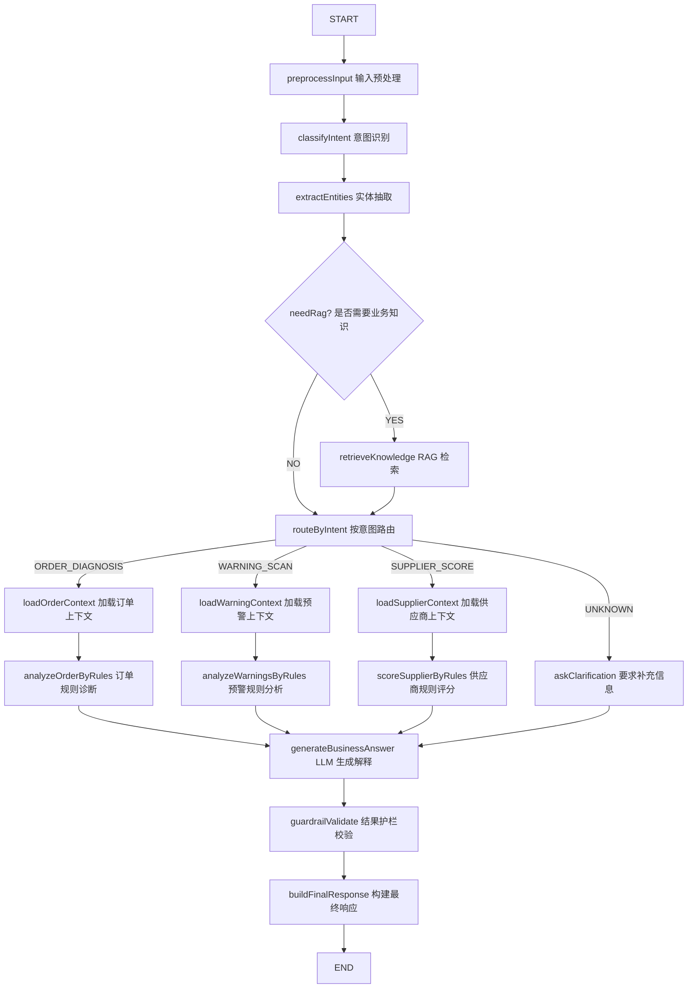

# Spring AI Alibaba Workflow Agent 进阶落地方案

## 0. 文档定位

本文件是 [SpringAIAlibaba-Agent傻瓜式落地手册.md](SpringAIAlibaba-Agent傻瓜式落地手册.md) 的进阶版。

第一版手册的目标是：

```text
用 ReactAgent + Tool Calling 跑通一个最小 Agent
```

本文件的目标是：

```text
用 Spring AI Alibaba Graph / Workflow 做一个真正的流程型 Agent
```

也就是说，第一版更像：

```text
Agent 调一个 Tool，再让模型总结
```

进阶版要做成：

```text
用户输入
    ↓
意图识别
    ↓
实体抽取
    ↓
可选 RAG 检索业务知识
    ↓
按意图路由到不同业务工作流
    ↓
调用业务 Tool / Mapper
    ↓
Java 规则做确定性分析
    ↓
LLM 做业务解释和建议
    ↓
护栏校验
    ↓
最终输出
```

## 1. 为什么要做 Workflow Agent

你已经发现第一版三个 Agent 的问题：

```text
Java 做了大部分业务逻辑，Agent 只是总结 Java 结果
```

这个做法稳定、安全，但 Agent 自主参与感不强。

真正的 Workflow Agent 应该让 Agent 至少参与：

```text
1. 判断用户想处理哪类业务问题
2. 抽取订单号、供应商 ID、时间范围等实体
3. 根据意图选择不同工作流
4. 结合业务规则文档解释原因
5. 对多个风险做归并和处理优先级建议
6. 对 AI 结论做护栏校验后再输出
```

但仍然要坚持：

```text
事实由 Tool 查询
核心状态机由 Java 校验
模型负责解释、归纳、建议
```

## 2. 官方 Graph / Workflow 概念

Spring AI Alibaba Graph 是 Agent Framework 的底层运行时。

官方文档中提到三个核心概念：

```text
State：节点之间传递的状态，本质是 Map<String, Object>
Node：执行逻辑单元，接收 State，返回 State 更新
Edge：节点之间的控制流，可以是固定边，也可以是条件边
```

简单理解：

```text
Node 负责做事
Edge 负责决定下一步去哪
State 负责保存上下文
```

官方示例中，自定义节点通常实现：

```java
public interface NodeAction {
    Map<String, Object> apply(OverAllState state) throws Exception;
}
```

或者需要运行配置时实现：

```java
public interface NodeActionWithConfig {
    Map<String, Object> apply(OverAllState state, RunnableConfig config) throws Exception;
}
```

Graph 定义大致形态：

```java
StateGraph graph = new StateGraph(keyStrategyFactory);
graph.addNode("nodeName", node_async(new SomeNode()));
graph.addEdge(StateGraph.START, "nodeName");
graph.addConditionalEdges("router", edge_async(...), Map.of(...));
graph.addEdge("finalNode", StateGraph.END);
```

参考：

- [Spring AI Alibaba Workflow](https://java2ai.com/docs/frameworks/agent-framework/advanced/workflow/)

## 3. 这次要做的 Workflow Agent 名称

建议命名为：

```text
ProcurementWorkflowAgent
```

中文名称：

```text
采购执行工作流 Agent
```

它不是替代你已经做的三个接口，而是作为更上层入口：

```text
POST /agent/workflow/execute
```

用户可以输入自然语言：

```json
{
  "message": "帮我看看 PO2026040011 为什么没完成",
  "threadId": "u1-workflow"
}
```

也可以输入：

```json
{
  "message": "扫描一下最近 7 天采购执行风险",
  "threadId": "u1-workflow"
}
```

或者：

```json
{
  "message": "分析供应商 1 最近 90 天履约情况",
  "threadId": "u1-workflow"
}
```

Workflow Agent 需要自己识别用户意图，并路由到对应流程。

## 4. 目标图结构

建议第一版工作流图：



这个图的重点：

- LLM 不是每一步都主导。
- 关键业务事实依然由 Java 查询。
- 关键业务规则依然由 Java 判断。
- LLM 主要参与意图识别、实体抽取、业务解释。
- 最后有护栏节点校验 AI 结果。

## 5. State 设计

State 是整个 Workflow 的共享上下文。

建议定义这些 key：

```text
message                 用户原始输入
threadId                会话 ID
normalizedMessage        预处理后的输入
intent                  用户意图
entity                  抽取出的实体
needRag                 是否需要 RAG
ragDocs                 RAG 检索结果
orderSnapshot           订单快照
orderDiagnosis          订单诊断结构化结果
warningItems            预警列表
warningAnalysis         预警结构化分析
supplierMetrics         供应商履约指标
supplierScore           供应商评分结构化结果
llmAnswer               大模型生成的解释
guardrailResult         护栏校验结果
finalResponse           最终返回内容
errorMessage            错误信息
```

### 5.1 Intent 枚举

建议定义：

```text
ORDER_DIAGNOSIS     订单阻塞诊断
WARNING_SCAN        采购执行预警扫描
SUPPLIER_SCORE      供应商履约评分
KNOWLEDGE_QA        业务规则问答
UNKNOWN             无法识别
```

### 5.2 Entity 结构

建议统一抽成：

```java
public class WorkflowEntity {
    private String orderNo;
    private Long supplierId;
    private Integer days;
    private String materialCode;
    private Long warehouseId;
}
```

用户输入：

```text
分析供应商 1 最近 90 天履约情况
```

应该抽出：

```json
{
  "supplierId": 1,
  "days": 90
}
```

用户输入：

```text
PO2026040011 为什么还没完成
```

应该抽出：

```json
{
  "orderNo": "PO2026040011"
}
```

## 6. 建议新增包结构

保留你第一版 Agent 包结构，在此基础上加：

```text
com.xixi.agent.workflow
├── ProcurementWorkflowConfig.java
├── ProcurementWorkflowExecutor.java
├── node
│   ├── PreprocessInputNode.java
│   ├── IntentClassifyNode.java
│   ├── EntityExtractNode.java
│   ├── KnowledgeRetrieveNode.java
│   ├── RouteDecisionNode.java
│   ├── LoadOrderContextNode.java
│   ├── LoadWarningContextNode.java
│   ├── LoadSupplierContextNode.java
│   ├── OrderRuleAnalyzeNode.java
│   ├── WarningRuleAnalyzeNode.java
│   ├── SupplierScoreRuleNode.java
│   ├── BusinessAnswerGenerateNode.java
│   ├── GuardrailValidateNode.java
│   └── BuildFinalResponseNode.java
├── state
│   ├── WorkflowIntent.java
│   ├── WorkflowEntity.java
│   └── WorkflowStateKeys.java
└── prompt
    └── WorkflowPrompts.java
```

接口仍然放：

```text
com.xixi.agent.controller.AgentController
```

或新建：

```text
com.xixi.agent.controller.WorkflowAgentController
```

## 7. Workflow 请求与响应 DTO

### 7.1 WorkflowAgentRequest

```java
package com.xixi.agent.dto;

import lombok.Data;

@Data
public class WorkflowAgentRequest {
    private String message;

    private String threadId;
}
```

### 7.2 WorkflowAgentResponse

```java
package com.xixi.agent.vo;

import com.fasterxml.jackson.annotation.JsonInclude;
import lombok.Data;

import java.util.List;

@Data
@JsonInclude(JsonInclude.Include.NON_NULL)
public class WorkflowAgentResponse {
    private String intent;

    private String answer;

    private String currentStage;

    private String riskLevel;

    private String suggestOwner;

    private String suggestAction;

    private List<String> evidence;

    private Object data;
}
```

说明：

```text
建议给 WorkflowAgentResponse 加 @JsonInclude(JsonInclude.Include.NON_NULL)，这样顶层未赋值字段不会被序列化成一堆 null。
```

### 7.3 WorkflowEntity

```java
package com.xixi.agent.workflow.state;

import lombok.Data;

@Data
public class WorkflowEntity {
    private String orderNo;

    private Long supplierId;

    private Integer days;

    private String materialCode;

    private Long warehouseId;
}
```

### 7.4 WorkflowIntent

```java
package com.xixi.agent.workflow.state;

public enum WorkflowIntent {
    ORDER_DIAGNOSIS,
    WARNING_SCAN,
    SUPPLIER_SCORE,
    KNOWLEDGE_QA,
    UNKNOWN
}
```

### 7.5 WorkflowStateKeys

```java
package com.xixi.agent.workflow.state;

public class WorkflowStateKeys {
    public static final String MESSAGE = "message";
    public static final String THREAD_ID = "threadId";
    public static final String NORMALIZED_MESSAGE = "normalizedMessage";
    public static final String INTENT = "intent";
    public static final String ENTITY = "entity";
    public static final String NEED_RAG = "needRag";
    public static final String RAG_DOCS = "ragDocs";
    public static final String ORDER_SNAPSHOT = "orderSnapshot";
    public static final String ORDER_DIAGNOSIS = "orderDiagnosis";
    public static final String WARNING_ITEMS = "warningItems";
    public static final String WARNING_ANALYSIS = "warningAnalysis";
    public static final String SUPPLIER_METRICS = "supplierMetrics";
    public static final String SUPPLIER_SCORE = "supplierScore";
    public static final String LLM_ANSWER = "llmAnswer";
    public static final String GUARDRAIL_RESULT = "guardrailResult";
    public static final String FINAL_RESPONSE = "finalResponse";
    public static final String ERROR_MESSAGE = "errorMessage";
}
```

## 8. 专业 Prompt 设计

不要把所有 Prompt 都写在一个字符串里。

建议集中放：

```text
WorkflowPrompts.java
```

### 8.1 WorkflowPrompts

```java
package com.xixi.agent.workflow.prompt;

public class WorkflowPrompts {

    public static final String INTENT_CLASSIFY_PROMPT = """
            你是供应商协同采购入库系统的意图识别器。
            你的任务是判断用户输入属于哪一种业务意图。

            可选意图：
            1. ORDER_DIAGNOSIS：用户想诊断采购订单卡在哪、为什么没完成、下一步谁处理。
            2. WARNING_SCAN：用户想扫描采购执行风险、预警、待处理事项。
            3. SUPPLIER_SCORE：用户想分析供应商履约表现、评分、合作建议。
            4. KNOWLEDGE_QA：用户询问系统规则、状态流转、为什么某流程不能操作。
            5. UNKNOWN：无法判断。

            请只输出一个意图编码，不要输出解释。

            用户输入：
            {message}
            """;

    public static final String ENTITY_EXTRACT_PROMPT = """
            你是供应商协同采购入库系统的实体抽取器。
            请从用户输入中抽取结构化实体。

            需要抽取的字段：
            - orderNo：采购订单号，例如 PO2026040011
            - supplierId：供应商ID，例如 1
            - days：统计天数，例如 7、30、90
            - materialCode：物料编码，例如 MAT0001
            - warehouseId：仓库ID

            只输出 JSON，不要输出 Markdown。
            如果没有字段，输出 null。

            输出示例：
            {
              "orderNo": "PO2026040011",
              "supplierId": null,
              "days": 30,
              "materialCode": null,
              "warehouseId": null
            }

            用户输入：
            {message}
            """;

    public static final String ORDER_BUSINESS_PROMPT = """
            你是采购订单流程阻塞诊断专家。
            你会收到：
            1. 采购订单执行快照
            2. Java 状态机规则判断结果
            3. 可选业务规则文档片段

            你的任务：
            - 用业务人员能理解的语言解释订单当前阶段
            - 解释为什么卡住
            - 给出下一步处理角色和动作
            - 不允许编造系统没有返回的数据
            - 不允许输出与 Java 规则判断相反的结论

            输出格式：
            当前阶段：
            阻塞原因：
            关键证据：
            建议处理人：
            建议动作：

            订单快照：
            {orderSnapshot}

            Java 规则结果：
            {orderDiagnosis}

            业务规则文档：
            {ragDocs}
            """;

    public static final String WARNING_BUSINESS_PROMPT = """
            你是采购执行预警分析专家。
            你会收到系统通过 Java 规则扫描出的风险列表。

            你的任务：
            - 总结本次风险概况
            - 按优先级说明最应该处理的风险
            - 识别是否存在同类风险集中出现
            - 给出建议处理角色和动作
            - 不允许新增风险列表中不存在的单据

            输出格式：
            风险概况：
            高优先级事项：
            风险集中点：
            建议处理顺序：

            风险列表：
            {warningItems}

            业务规则文档：
            {ragDocs}
            """;

    public static final String SUPPLIER_BUSINESS_PROMPT = """
            你是供应商履约分析专家。
            你会收到：
            1. Java 计算出的供应商履约指标
            2. Java 计算出的评分和等级
            3. 可选业务规则文档片段

            你的任务：
            - 解释供应商履约分数
            - 说明主要优势和主要风险
            - 给出合作建议
            - 不允许修改 Java 算出的分数
            - 不允许把“统计周期内无订单”说成“供应商不存在”

            输出格式：
            总体评价：
            主要优势：
            主要风险：
            合作建议：

            供应商指标：
            {supplierMetrics}

            Java 评分：
            {supplierScore}

            业务规则文档：
            {ragDocs}
            """;

    public static final String GUARDRAIL_PROMPT = """
            你是采购执行 Agent 的结果校验器。
            请检查 AI 回答是否违反以下规则：
            1. 是否编造了不存在的订单、供应商、库存数据。
            2. 是否与 Java 规则结果冲突。
            3. 是否建议执行系统不支持或高风险的写操作。
            4. 是否把“无统计数据”误说成“对象不存在”。

            如果没有问题，输出 PASS。
            如果有问题，输出 REJECT，并简要说明原因。

            Java 规则结果：
            {ruleResult}

            AI 回答：
            {llmAnswer}
            """;
}
```

## 9. Node 设计

### 9.1 PreprocessInputNode

职责：

```text
清洗用户输入
去除空白字符
检查 message 是否为空
```

示例：

```java
package com.xixi.agent.workflow.node;

import com.alibaba.cloud.ai.graph.OverAllState;
import com.alibaba.cloud.ai.graph.action.NodeAction;
import com.xixi.agent.workflow.state.WorkflowStateKeys;

import java.util.Map;

public class PreprocessInputNode implements NodeAction {
    @Override
    public Map<String, Object> apply(OverAllState state) {
        String message = state.value(WorkflowStateKeys.MESSAGE, "").toString().trim();
        if (message.isEmpty()) {
            return Map.of(
                    WorkflowStateKeys.ERROR_MESSAGE, "请输入要分析的问题",
                    WorkflowStateKeys.NORMALIZED_MESSAGE, ""
            );
        }
        return Map.of(WorkflowStateKeys.NORMALIZED_MESSAGE, message);
    }
}
```

### 9.2 IntentClassifyNode

职责：

```text
让 LLM 判断用户意图
```

示例：

```java
package com.xixi.agent.workflow.node;

import com.alibaba.cloud.ai.graph.OverAllState;
import com.alibaba.cloud.ai.graph.RunnableConfig;
import com.alibaba.cloud.ai.graph.action.NodeActionWithConfig;
import com.xixi.agent.workflow.prompt.WorkflowPrompts;
import com.xixi.agent.workflow.state.WorkflowIntent;
import com.xixi.agent.workflow.state.WorkflowStateKeys;
import org.springframework.ai.chat.client.ChatClient;
import org.springframework.ai.chat.prompt.PromptTemplate;

import java.util.Map;

public class IntentClassifyNode implements NodeActionWithConfig {
    private final ChatClient chatClient;

    public IntentClassifyNode(ChatClient.Builder chatClientBuilder) {
        this.chatClient = chatClientBuilder.build();
    }

    @Override
    public Map<String, Object> apply(OverAllState state, RunnableConfig config) {
        String message = state.value(WorkflowStateKeys.NORMALIZED_MESSAGE, "").toString();
        PromptTemplate template = new PromptTemplate(WorkflowPrompts.INTENT_CLASSIFY_PROMPT);
        String intentText = chatClient.prompt()
                .user(user -> user
                        .text(template.getTemplate())
                        .param("message", message))
                .call()
                .content();

        WorkflowIntent intent = parseIntent(intentText);
        return Map.of(WorkflowStateKeys.INTENT, intent.name());
    }

    private WorkflowIntent parseIntent(String text) {
        if (text == null) {
            return WorkflowIntent.UNKNOWN;
        }
        String value = text.trim();
        for (WorkflowIntent intent : WorkflowIntent.values()) {
            if (value.contains(intent.name())) {
                return intent;
            }
        }
        return WorkflowIntent.UNKNOWN;
    }
}
```

### 9.3 EntityExtractNode

职责：

```text
从用户自然语言中抽取 orderNo、supplierId、days 等参数
```

建议第一版可以简单一点：

- 订单号用正则提取 `PO\\d+`
- supplierId 用模型或正则提取
- days 用正则提取数字

为什么建议第一版用正则优先：

```text
实体抽取是确定性任务，简单规则比模型更稳定
```

示例：

```java
package com.xixi.agent.workflow.node;

import com.alibaba.cloud.ai.graph.OverAllState;
import com.alibaba.cloud.ai.graph.action.NodeAction;
import com.xixi.agent.workflow.state.WorkflowEntity;
import com.xixi.agent.workflow.state.WorkflowStateKeys;

import java.util.Map;
import java.util.regex.Matcher;
import java.util.regex.Pattern;

public class EntityExtractNode implements NodeAction {
    private static final Pattern ORDER_NO_PATTERN = Pattern.compile("PO\\d+");
    private static final Pattern DAYS_PATTERN = Pattern.compile("(最近|近)?(\\d+)\\s*天");
    private static final Pattern SUPPLIER_ID_PATTERN = Pattern.compile("供应商\\s*(\\d+)");

    @Override
    public Map<String, Object> apply(OverAllState state) {
        String message = state.value(WorkflowStateKeys.NORMALIZED_MESSAGE, "").toString();

        WorkflowEntity entity = new WorkflowEntity();
        entity.setOrderNo(findFirst(ORDER_NO_PATTERN, message, 0));

        String days = findFirst(DAYS_PATTERN, message, 2);
        entity.setDays(days == null ? 30 : Integer.parseInt(days));

        String supplierId = findFirst(SUPPLIER_ID_PATTERN, message, 1);
        if (supplierId != null) {
            entity.setSupplierId(Long.parseLong(supplierId));
        }

        return Map.of(WorkflowStateKeys.ENTITY, entity);
    }

    private String findFirst(Pattern pattern, String text, int group) {
        Matcher matcher = pattern.matcher(text);
        if (matcher.find()) {
            return matcher.group(group);
        }
        return null;
    }
}
```

### 9.4 KnowledgeRetrieveNode

职责：

```text
可选 RAG 检索业务规则文档
```

第一版可以先不接向量库，用模拟实现：

```java
public class KnowledgeRetrieveNode implements NodeAction {
    @Override
    public Map<String, Object> apply(OverAllState state) {
        String intent = state.value(WorkflowStateKeys.INTENT, "UNKNOWN").toString();
        String docs = switch (intent) {
            case "ORDER_DIAGNOSIS" -> "采购订单状态规则：WAIT_CONFIRM 待确认，IN_PROGRESS 执行中，PARTIAL_ARRIVAL 部分到货，COMPLETED 已完成。";
            case "WARNING_SCAN" -> "采购执行预警规则：待确认超时、到货停滞、待入库超时均应进入预警列表。";
            case "SUPPLIER_SCORE" -> "供应商评分规则：确认及时率、到货完成率、入库完成率、异常到货率共同影响评分。";
            default -> "";
        };
        return Map.of(WorkflowStateKeys.RAG_DOCS, docs);
    }
}
```

后续再替换成真正 RAG。

### 9.5 RouteDecisionNode

职责：

```text
把 intent 转成条件边路由值
```

示例：

```java
public class RouteDecisionNode implements NodeAction {
    @Override
    public Map<String, Object> apply(OverAllState state) {
        String intent = state.value(WorkflowStateKeys.INTENT, "UNKNOWN").toString();
        return Map.of("_route", intent);
    }
}
```

### 9.6 LoadOrderContextNode

职责：

```text
根据 orderNo 查询订单快照
```

可以复用你已有的：

```text
AgentQueryMapper.getOrderSnapshotByOrderNo
```

示例：

```java
public class LoadOrderContextNode implements NodeAction {
    private final AgentQueryMapper agentQueryMapper;

    public LoadOrderContextNode(AgentQueryMapper agentQueryMapper) {
        this.agentQueryMapper = agentQueryMapper;
    }

    @Override
    public Map<String, Object> apply(OverAllState state) {
        WorkflowEntity entity = (WorkflowEntity) state.value(WorkflowStateKeys.ENTITY).orElse(null);
        if (entity == null || entity.getOrderNo() == null) {
            return Map.of(WorkflowStateKeys.ERROR_MESSAGE, "未识别到采购订单号");
        }
        OrderSnapshotVO snapshot = agentQueryMapper.getOrderSnapshotByOrderNo(entity.getOrderNo());
        if (snapshot == null) {
            return Map.of(WorkflowStateKeys.ERROR_MESSAGE, "采购订单不存在");
        }
        return Map.of(WorkflowStateKeys.ORDER_SNAPSHOT, snapshot);
    }
}
```

### 9.7 OrderRuleAnalyzeNode

职责：

```text
用 Java 状态机规则判断阻塞点
```

可以复用你已有的订单诊断规则。

示例：

```java
public class OrderRuleAnalyzeNode implements NodeAction {
    @Override
    public Map<String, Object> apply(OverAllState state) {
        OrderSnapshotVO snapshot = (OrderSnapshotVO) state.value(WorkflowStateKeys.ORDER_SNAPSHOT).orElse(null);
        if (snapshot == null) {
            return Map.of(WorkflowStateKeys.ERROR_MESSAGE, "订单快照为空");
        }
        OrderDiagnosisVO diagnosis = OrderDiagnosisRule.diagnose(snapshot);
        return Map.of(WorkflowStateKeys.ORDER_DIAGNOSIS, diagnosis);
    }
}
```

### 9.8 BusinessAnswerGenerateNode

职责：

```text
根据不同 intent 选择不同 Prompt，让 LLM 生成业务解释
```

示例：

```java
public class BusinessAnswerGenerateNode implements NodeActionWithConfig {
    private final ChatClient chatClient;

    public BusinessAnswerGenerateNode(ChatClient.Builder chatClientBuilder) {
        this.chatClient = chatClientBuilder.build();
    }

    @Override
    public Map<String, Object> apply(OverAllState state, RunnableConfig config) {
        String intent = state.value(WorkflowStateKeys.INTENT, "UNKNOWN").toString();
        String ragDocs = state.value(WorkflowStateKeys.RAG_DOCS, "").toString();

        String prompt;
        if ("ORDER_DIAGNOSIS".equals(intent)) {
            Object snapshot = state.value(WorkflowStateKeys.ORDER_SNAPSHOT).orElse(null);
            Object diagnosis = state.value(WorkflowStateKeys.ORDER_DIAGNOSIS).orElse(null);
            prompt = WorkflowPrompts.ORDER_BUSINESS_PROMPT
                    .replace("{orderSnapshot}", String.valueOf(snapshot))
                    .replace("{orderDiagnosis}", String.valueOf(diagnosis))
                    .replace("{ragDocs}", ragDocs);
        } else if ("WARNING_SCAN".equals(intent)) {
            Object warningItems = state.value(WorkflowStateKeys.WARNING_ITEMS).orElse(null);
            prompt = WorkflowPrompts.WARNING_BUSINESS_PROMPT
                    .replace("{warningItems}", String.valueOf(warningItems))
                    .replace("{ragDocs}", ragDocs);
        } else if ("SUPPLIER_SCORE".equals(intent)) {
            Object metrics = state.value(WorkflowStateKeys.SUPPLIER_METRICS).orElse(null);
            Object score = state.value(WorkflowStateKeys.SUPPLIER_SCORE).orElse(null);
            prompt = WorkflowPrompts.SUPPLIER_BUSINESS_PROMPT
                    .replace("{supplierMetrics}", String.valueOf(metrics))
                    .replace("{supplierScore}", String.valueOf(score))
                    .replace("{ragDocs}", ragDocs);
        } else {
            prompt = "用户问题无法识别，请提示用户补充订单号、供应商ID或扫描范围。";
        }

        String answer = chatClient.prompt()
                .user(prompt)
                .call()
                .content();

        return Map.of(WorkflowStateKeys.LLM_ANSWER, answer);
    }
}
```

### 9.9 GuardrailValidateNode

职责：

```text
检查 LLM 输出是否明显违反 Java 规则
```

第一版先用简单规则，不用 LLM 校验：

```java
public class GuardrailValidateNode implements NodeAction {
    @Override
    public Map<String, Object> apply(OverAllState state) {
        String answer = state.value(WorkflowStateKeys.LLM_ANSWER, "").toString();

        if (answer.contains("供应商不存在")) {
            Object supplierScore = state.value(WorkflowStateKeys.SUPPLIER_SCORE).orElse(null);
            if (supplierScore != null) {
                return Map.of(
                        WorkflowStateKeys.GUARDRAIL_RESULT, "REJECT",
                        WorkflowStateKeys.LLM_ANSWER, "系统检测到 AI 回答可能与结构化数据冲突，请以系统结构化结果为准。"
                );
            }
        }

        return Map.of(WorkflowStateKeys.GUARDRAIL_RESULT, "PASS");
    }
}
```

### 9.10 BuildFinalResponseNode

职责：

```text
把 State 里的内容组装成最终响应
```

示例：

```java
public class BuildFinalResponseNode implements NodeAction {
    @Override
    public Map<String, Object> apply(OverAllState state) {
        WorkflowAgentResponse response = new WorkflowAgentResponse();
        response.setIntent(state.value(WorkflowStateKeys.INTENT, "UNKNOWN").toString());
        response.setAnswer(state.value(WorkflowStateKeys.LLM_ANSWER, "").toString());

        OrderDiagnosisVO diagnosis = (OrderDiagnosisVO) state.value(WorkflowStateKeys.ORDER_DIAGNOSIS).orElse(null);
        if (diagnosis != null) {
            response.setData(diagnosis);
        }

        return Map.of(WorkflowStateKeys.FINAL_RESPONSE, response);
    }
}
```

注意：

```text
这里不要把 state.data() 原样塞进 response.data。
因为 state.data() 在工作流更新后会包含 finalResponse，
这会形成 finalResponse -> data -> finalResponse 的递归引用，最终导致 JSON 无限嵌套。
```

## 10. 图定义示例

### 10.1 ProcurementWorkflowConfig

注意：

```text
以下代码是当前项目可编译通过的最小订单诊断 Workflow 配置骨架。
为了保证先跑通 ORDER_DIAGNOSIS 分支，这里暂时只保留订单诊断和 UNKNOWN 两条路由。
WARNING_SCAN 和 SUPPLIER_SCORE 分支建议在订单诊断主线稳定后再接入。
```

```java
package com.xixi.agent.workflow;

import com.alibaba.cloud.ai.graph.KeyStrategy;
import com.alibaba.cloud.ai.graph.KeyStrategyFactory;
import com.alibaba.cloud.ai.graph.StateGraph;
import com.alibaba.cloud.ai.graph.state.strategy.ReplaceStrategy;
import com.xixi.agent.mapper.AgentQueryMapper;
import com.xixi.agent.service.ProcessDiagnosisAgentService;
import com.xixi.agent.workflow.node.*;
import com.xixi.agent.workflow.state.WorkflowIntent;
import com.xixi.agent.workflow.state.WorkflowStateKeys;
import org.springframework.ai.chat.client.ChatClient;
import org.springframework.context.annotation.Bean;
import org.springframework.context.annotation.Configuration;

import java.util.HashMap;
import java.util.Map;

import static com.alibaba.cloud.ai.graph.action.AsyncEdgeAction.edge_async;
import static com.alibaba.cloud.ai.graph.action.AsyncNodeAction.node_async;

@Configuration
public class ProcurementWorkflowConfig {

    @Bean
    public StateGraph procurementWorkflowGraph(ChatClient.Builder chatClientBuilder,
                                               AgentQueryMapper agentQueryMapper,
                                               ProcessDiagnosisAgentService processDiagnosisAgentService) throws Exception {
        KeyStrategyFactory keyStrategyFactory = () -> {
            HashMap<String, KeyStrategy> strategies = new HashMap<>();
            strategies.put(WorkflowStateKeys.MESSAGE, new ReplaceStrategy());
            strategies.put(WorkflowStateKeys.THREAD_ID, new ReplaceStrategy());
            strategies.put(WorkflowStateKeys.NORMALIZED_MESSAGE, new ReplaceStrategy());
            strategies.put(WorkflowStateKeys.INTENT, new ReplaceStrategy());
            strategies.put(WorkflowStateKeys.ENTITY, new ReplaceStrategy());
            strategies.put(WorkflowStateKeys.NEED_RAG, new ReplaceStrategy());
            strategies.put(WorkflowStateKeys.RAG_DOCS, new ReplaceStrategy());
            strategies.put(WorkflowStateKeys.ORDER_SNAPSHOT, new ReplaceStrategy());
            strategies.put(WorkflowStateKeys.ORDER_DIAGNOSIS, new ReplaceStrategy());
            strategies.put(WorkflowStateKeys.WARNING_ITEMS, new ReplaceStrategy());
            strategies.put(WorkflowStateKeys.WARNING_ANALYSIS, new ReplaceStrategy());
            strategies.put(WorkflowStateKeys.SUPPLIER_METRICS, new ReplaceStrategy());
            strategies.put(WorkflowStateKeys.SUPPLIER_SCORE, new ReplaceStrategy());
            strategies.put(WorkflowStateKeys.LLM_ANSWER, new ReplaceStrategy());
            strategies.put(WorkflowStateKeys.GUARDRAIL_RESULT, new ReplaceStrategy());
            strategies.put(WorkflowStateKeys.FINAL_RESPONSE, new ReplaceStrategy());
            strategies.put(WorkflowStateKeys.ERROR_MESSAGE, new ReplaceStrategy());
            strategies.put("_route", new ReplaceStrategy());
            return strategies;
        };

        StateGraph graph = new StateGraph(keyStrategyFactory);

        graph.addNode("preprocessInput", node_async(new PreprocessInputNode()));
        graph.addNode(
                "classifyIntent",
                com.alibaba.cloud.ai.graph.action.AsyncNodeActionWithConfig.node_async(
                        new IntentClassifyNode(chatClientBuilder.build())
                )
        );
        graph.addNode("extractEntities", node_async(new EntityExtractNode()));
        graph.addNode("retrieveKnowledge", node_async(new KnowledgeRetrieveNode()));
        graph.addNode("routeByIntent", node_async(new RouteDecisionNode()));
        graph.addNode("loadOrderContext", node_async(new LoadOrderContextNode(agentQueryMapper)));
        graph.addNode("analyzeOrderByRules", node_async(new OrderRuleAnalyzeNode(processDiagnosisAgentService)));
        graph.addNode(
                "generateBusinessAnswer",
                com.alibaba.cloud.ai.graph.action.AsyncNodeActionWithConfig.node_async(
                        new BusinessAnswerGenerateNode(chatClientBuilder.build())
                )
        );
        graph.addNode("guardrailValidate", node_async(new GuardrailValidateNode()));
        graph.addNode("buildFinalResponse", node_async(new BuildFinalResponseNode()));

        graph.addEdge(StateGraph.START, "preprocessInput");
        graph.addEdge("preprocessInput", "classifyIntent");
        graph.addEdge("classifyIntent", "extractEntities");
        graph.addEdge("extractEntities", "retrieveKnowledge");
        graph.addEdge("retrieveKnowledge", "routeByIntent");

        graph.addConditionalEdges(
                "routeByIntent",
                edge_async(state -> state.value("_route", WorkflowIntent.UNKNOWN.name()).toString()),
                Map.of(
                        WorkflowIntent.ORDER_DIAGNOSIS.name(), "loadOrderContext",
                        WorkflowIntent.UNKNOWN.name(), "generateBusinessAnswer"
                )
        );

        graph.addEdge("loadOrderContext", "analyzeOrderByRules");
        graph.addEdge("analyzeOrderByRules", "generateBusinessAnswer");
        graph.addEdge("generateBusinessAnswer", "guardrailValidate");
        graph.addEdge("guardrailValidate", "buildFinalResponse");
        graph.addEdge("buildFinalResponse", StateGraph.END);

        return graph;
    }
}
```

### 10.2 为什么示例里只先接订单诊断分支

第一版 Workflow 不要一口气把三条分支全写完。

建议先让这个分支跑通：

```text
ORDER_DIAGNOSIS
```

跑通后再补：

```text
WARNING_SCAN
SUPPLIER_SCORE
```

原因：

- Graph 写错边时不好排查。
- 先跑通一条主线最稳。
- 订单诊断已经有你第一版 Agent 的业务基础。

## 11. Workflow 执行器

### 11.1 ProcurementWorkflowExecutor

```java
package com.xixi.agent.workflow;

import com.alibaba.cloud.ai.graph.CompileConfig;
import com.alibaba.cloud.ai.graph.CompiledGraph;
import com.alibaba.cloud.ai.graph.OverAllState;
import com.alibaba.cloud.ai.graph.RunnableConfig;
import com.alibaba.cloud.ai.graph.StateGraph;
import com.xixi.agent.dto.WorkflowAgentRequest;
import com.xixi.agent.vo.WorkflowAgentResponse;
import com.xixi.agent.workflow.state.WorkflowStateKeys;
import lombok.RequiredArgsConstructor;
import org.springframework.stereotype.Service;

import java.util.HashMap;
import java.util.Map;
import java.util.Optional;

@Service
@RequiredArgsConstructor
public class ProcurementWorkflowExecutor {
    private final StateGraph procurementWorkflowGraph;

    public WorkflowAgentResponse execute(WorkflowAgentRequest request) throws Exception {
        CompiledGraph compiledGraph = procurementWorkflowGraph.compile(CompileConfig.builder().build());

        String threadId = request.getThreadId() == null || request.getThreadId().isBlank()
                ? "workflow-default"
                : request.getThreadId();

        RunnableConfig config = RunnableConfig.builder()
                .threadId(threadId)
                .build();

        Map<String, Object> input = Map.of(
                WorkflowStateKeys.MESSAGE, request.getMessage(),
                WorkflowStateKeys.THREAD_ID, threadId
        );

        Optional<OverAllState> result = compiledGraph.invoke(input, config);
        if (result.isEmpty()) {
            WorkflowAgentResponse response = new WorkflowAgentResponse();
            response.setAnswer("工作流执行失败，未返回结果。");
            return response;
        }

        Object finalResponse = result.get().value(WorkflowStateKeys.FINAL_RESPONSE).orElse(null);
        if (finalResponse instanceof WorkflowAgentResponse response) {
            return response;
        }

        WorkflowAgentResponse response = new WorkflowAgentResponse();
        response.setAnswer("工作流执行完成，但最终响应格式异常。");
        Map<String, Object> debugData = new HashMap<>(result.get().data());
        debugData.remove(WorkflowStateKeys.FINAL_RESPONSE);
        response.setData(debugData);
        return response;
    }
}
```

注意：

- 第一版可以每次请求时 `compile`。
- 后续可以把 `CompiledGraph` 做成 Bean，避免重复编译。

## 12. Workflow Controller

```java
package com.xixi.agent.controller;

import com.xixi.agent.dto.WorkflowAgentRequest;
import com.xixi.agent.workflow.ProcurementWorkflowExecutor;
import com.xixi.pojo.vo.Result;
import lombok.RequiredArgsConstructor;
import org.springframework.web.bind.annotation.PostMapping;
import org.springframework.web.bind.annotation.RequestBody;
import org.springframework.web.bind.annotation.RequestMapping;
import org.springframework.web.bind.annotation.RestController;

@RestController
@RequestMapping("/agent/workflow")
@RequiredArgsConstructor
public class WorkflowAgentController {
    private final ProcurementWorkflowExecutor procurementWorkflowExecutor;

    @PostMapping("/execute")
    public Result execute(@RequestBody WorkflowAgentRequest request) throws Exception {
        return Result.success(procurementWorkflowExecutor.execute(request));
    }
}
```

## 13. Apifox 测试步骤

### 13.1 订单诊断

```text
POST /agent/workflow/execute
```

Body：

```json
{
  "message": "帮我看看 PO2026040011 为什么没完成",
  "threadId": "workflow-001"
}
```

预期：

```json
{
  "code": 200,
  "msg": "success",
  "data": {
    "intent": "ORDER_DIAGNOSIS",
    "answer": "当前订单卡在...",
    "data": {
      "...": "..."
    }
  }
}
```

### 13.2 预警扫描

等你补完 `WARNING_SCAN` 分支后测试：

```json
{
  "message": "扫描最近7天采购执行风险",
  "threadId": "workflow-002"
}
```

### 13.3 供应商评分

等你补完 `SUPPLIER_SCORE` 分支后测试：

```json
{
  "message": "分析供应商1最近90天履约情况",
  "threadId": "workflow-003"
}
```

## 14. RAG 知识检索建议

RAG 不要用于实时业务数据。

实时数据走：

```text
Mapper / Service / Tool
```

RAG 适合用于：

```text
业务规则解释
状态机说明
操作规范
异常处理建议
```

### 14.1 推荐检索文档

第一批可以放：

```text
document/V3简历项目开发基线文档.md
document/状态机设计.md
document/完整需求说明书.md
document/完整表设计文档.md
```

如果你后面自己写操作手册，也可以放：

```text
采购订单操作手册.md
到货入库操作手册.md
供应商审核规范.md
库存异常处理规范.md
```

### 14.2 推荐切片方式

不要整篇文档塞进去。

建议按二级或三级标题切片：

```text
6.1 供应商状态
6.2 采购申请状态
6.3 采购订单状态
6.4 到货状态
6.5 入库状态
7.6 仓储与库存相关表
8.3 文档验收场景
```

每个 chunk 控制在：

```text
300 ~ 800 中文字
```

### 14.3 推荐 metadata

每个知识片段带：

```json
{
  "docName": "V3简历项目开发基线文档.md",
  "section": "6.3 采购订单状态",
  "bizType": "PURCHASE_ORDER",
  "topic": "STATE_MACHINE"
}
```

### 14.4 检索时机

不是每个问题都要 RAG。

推荐：

```text
订单诊断：检索状态机规则
采购预警：检索预警规则和处理建议
供应商评分：检索评分规则和供应商协同规范
业务问答：只走 RAG，不查数据库
```

### 14.5 RAG 查询改写 Prompt

```text
你是采购入库系统的知识检索查询改写器。
请把用户问题改写成适合检索业务规则文档的短查询。

要求：
1. 保留业务实体类型，如采购订单、到货、入库、库存、供应商。
2. 保留状态关键词，如 WAIT_CONFIRM、PARTIAL_ARRIVAL、PENDING。
3. 不要输出解释，只输出检索查询。

用户问题：
{message}
```

### 14.6 RAG 回答融合原则

LLM 最终回答时遵守：

```text
业务事实优先使用数据库 Tool 结果
规则解释优先使用 RAG 文档
两者冲突时，以数据库事实 + Java 状态机为准
```

## 15. 专业护栏设计

Workflow Agent 必须有护栏。

### 15.1 禁止编造业务数据

如果 Tool 没返回：

```text
订单号
供应商名
库存数量
入库单号
```

模型不能自己编。

### 15.2 禁止越权建议

不允许建议：

```text
直接改库存
跳过入库确认
删除异常到货
绕过供应商审核
```

### 15.3 禁止和状态机冲突

例如：

```text
inboundNumber < orderNumber
```

模型不能说：

```text
订单已经完成
```

### 15.4 数据不足要明确说数据不足

比如供应商评分：

```text
供应商存在，但统计周期内无订单
```

必须输出：

```text
数据不足，建议扩大统计周期
```

不能说：

```text
供应商不存在
```

## 16. Workflow Agent 与第一版三个 Agent 的关系

第一版三个接口不要删：

```text
POST /agent/diagnose/order
POST /agent/warning/scan
POST /agent/supplier/score
```

它们是稳定的确定性能力。

新增：

```text
POST /agent/workflow/execute
```

作为更像 Agent 的统一入口。

关系：

```text
/agent/workflow/execute
    ↓
意图识别
    ↓
路由到订单诊断 / 预警扫描 / 供应商评分
    ↓
复用已有 Service / Mapper / Tool
```

也就是说：

```text
第一版三个 Agent 是业务能力模块
Workflow Agent 是统一编排入口
```

## 17. 推荐实施顺序

严格按这个顺序：

```text
1. 新建 WorkflowAgentRequest / WorkflowAgentResponse
2. 新建 WorkflowStateKeys / WorkflowIntent / WorkflowEntity
3. 新建 PreprocessInputNode
4. 新建 IntentClassifyNode
5. 新建 EntityExtractNode
6. 新建 KnowledgeRetrieveNode 模拟版
7. 新建 RouteDecisionNode
8. 先接 ORDER_DIAGNOSIS 分支
9. 新建 BusinessAnswerGenerateNode
10. 新建 GuardrailValidateNode
11. 新建 BuildFinalResponseNode
12. 定义 StateGraph
13. 新建 ProcurementWorkflowExecutor
14. 新建 WorkflowAgentController
15. Apifox 测订单诊断
16. 再补 WARNING_SCAN 分支
17. 最后补 SUPPLIER_SCORE 分支
18. 最后接真正 RAG
```

## 18. 简历表述

完成后可以写：

```text
基于 Spring AI Alibaba Graph 构建采购执行 Workflow Agent，将采购订单诊断、采购执行预警、供应商履约评分等能力编排为状态图，通过意图识别、实体抽取、业务数据加载、规则分析、RAG 知识增强、LLM 总结和护栏校验等节点，实现可解释、可控的采购执行智能分析流程。
```

更技术一点：

```text
设计基于 StateGraph 的 Agentic Workflow，将业务事实查询、状态机规则、供应商评分模型和大模型生成能力拆分为多个 Node，并通过 Conditional Edge 实现订单诊断、预警扫描、供应商评分的动态路由；结合 RAG 注入业务规则文档，并通过 Guardrail 节点校验 AI 输出与业务状态机一致性。
```

## 19. 结论

真正的 Workflow Agent 不是简单把三个接口再包一层。

它的核心是：

```text
让流程显式化
让状态可追踪
让路由可控制
让模型只在合适节点发挥作用
让 Java 规则守住业务正确性
```

第一版 ReactAgent 解决的是：

```text
模型能调用工具
```

进阶 Workflow Agent 解决的是：

```text
复杂业务分析流程如何稳定编排
```

建议先只跑通：

```text
ORDER_DIAGNOSIS 分支
```

再逐步补：

```text
WARNING_SCAN
SUPPLIER_SCORE
RAG
```

## 20. 把 WARNING_SCAN 分支真正接入 Workflow

这一节给你的是“当前项目可以照着抄”的写法，不再是概念说明。

目标：

```text
用户输入：扫描最近7天采购执行风险
    ↓
Workflow 识别为 WARNING_SCAN
    ↓
加载预警上下文
    ↓
Java 规则生成 WarningScanVO
    ↓
LLM 生成中文摘要
    ↓
返回最终结果
```

### 20.1 先扩展 WorkflowStateKeys

文件：

```text
inventory_back/src/main/java/com/xixi/agent/workflow/state/WorkflowStateKeys.java
```

在现有 key 基础上追加：

```java
public static final String WARNING_CONTEXT = "warningContext";
```

最终关键字段建议至少有：

```java
public class WorkflowStateKeys {
    public static final String MESSAGE = "message";
    public static final String THREAD_ID = "threadId";
    public static final String NORMALIZED_MESSAGE = "normalizedMessage";
    public static final String INTENT = "intent";
    public static final String ENTITY = "entity";
    public static final String NEED_RAG = "needRag";
    public static final String RAG_DOCS = "ragDocs";
    public static final String ORDER_SNAPSHOT = "orderSnapshot";
    public static final String ORDER_DIAGNOSIS = "orderDiagnosis";
    public static final String WARNING_CONTEXT = "warningContext";
    public static final String WARNING_ANALYSIS = "warningAnalysis";
    public static final String SUPPLIER_METRICS = "supplierMetrics";
    public static final String SUPPLIER_SCORE = "supplierScore";
    public static final String LLM_ANSWER = "llmAnswer";
    public static final String GUARDRAIL_RESULT = "guardrailResult";
    public static final String FINAL_RESPONSE = "finalResponse";
    public static final String ERROR_MESSAGE = "errorMessage";
}
```

说明：

- `WARNING_CONTEXT`：存放预警扫描原始快照数据
- `WARNING_ANALYSIS`：存放 Java 规则整理后的 `WarningScanVO`

### 20.2 新建 LoadWarningContextNode

文件：

```text
inventory_back/src/main/java/com/xixi/agent/workflow/node/LoadWarningContextNode.java
```

代码：

```java
package com.xixi.agent.workflow.node;

import com.alibaba.cloud.ai.graph.OverAllState;
import com.alibaba.cloud.ai.graph.action.NodeAction;
import com.xixi.agent.mapper.AgentWarningMapper;
import com.xixi.agent.vo.WarningSnapshotVO;
import com.xixi.agent.workflow.state.WorkflowEntity;
import com.xixi.agent.workflow.state.WorkflowStateKeys;
import lombok.RequiredArgsConstructor;

import java.util.HashMap;
import java.util.List;
import java.util.Map;

@RequiredArgsConstructor
public class LoadWarningContextNode implements NodeAction {
    private final AgentWarningMapper agentWarningMapper;

    @Override
    public Map<String, Object> apply(OverAllState state) throws Exception {
        WorkflowEntity entity = (WorkflowEntity) state.value(WorkflowStateKeys.ENTITY).orElse(null);
        Integer days = entity == null || entity.getDays() == null ? 7 : entity.getDays();

        Map<String, List<WarningSnapshotVO>> context = new HashMap<>();
        context.put("waitConfirmOverdue", agentWarningMapper.getWaitConfirmOverdueOrders(days));
        context.put("inProgressWithoutArrival", agentWarningMapper.getInProgressWithoutArrivalOrders(days));
        context.put("partialArrivalStuck", agentWarningMapper.getPartialArrivalStuckOrders(days));
        context.put("arrivedWithoutInbound", agentWarningMapper.getArrivedWithoutInboundRecords(days));
        context.put("pendingInboundOverdue", agentWarningMapper.getPendingInboundOverdueRecords(days));

        return Map.of(WorkflowStateKeys.WARNING_CONTEXT, context);
    }
}
```

### 20.3 新建 WarningRuleAnalyzeNode

文件：

```text
inventory_back/src/main/java/com/xixi/agent/workflow/node/WarningRuleAnalyzeNode.java
```

代码：

```java
package com.xixi.agent.workflow.node;

import com.alibaba.cloud.ai.graph.OverAllState;
import com.alibaba.cloud.ai.graph.action.NodeAction;
import com.xixi.agent.vo.WarningItemVO;
import com.xixi.agent.vo.WarningScanVO;
import com.xixi.agent.vo.WarningSnapshotVO;
import com.xixi.agent.workflow.state.WorkflowStateKeys;

import java.util.ArrayList;
import java.util.List;
import java.util.Map;

@SuppressWarnings("unchecked")
public class WarningRuleAnalyzeNode implements NodeAction {
    @Override
    public Map<String, Object> apply(OverAllState state) throws Exception {
        Map<String, List<WarningSnapshotVO>> context =
                (Map<String, List<WarningSnapshotVO>>) state.value(WorkflowStateKeys.WARNING_CONTEXT).orElse(null);
        if (context == null) {
            return Map.of(WorkflowStateKeys.ERROR_MESSAGE, "预警上下文为空");
        }

        List<WarningItemVO> items = new ArrayList<>();

        appendWarnings(items, context.get("waitConfirmOverdue"),
                "HIGH", "PURCHASE_ORDER", "采购订单待供应商确认超时", "订单长时间停留在 WAIT_CONFIRM 状态", "PURCHASER");
        appendWarnings(items, context.get("inProgressWithoutArrival"),
                "HIGH", "PURCHASE_ORDER", "采购订单执行中但无到货", "订单进入执行中后长时间没有到货记录", "PURCHASER");
        appendWarnings(items, context.get("partialArrivalStuck"),
                "MEDIUM", "PURCHASE_ORDER", "采购订单部分到货后停滞", "订单处于 PARTIAL_ARRIVAL 且长时间没有新到货", "PURCHASER");
        appendWarnings(items, context.get("arrivedWithoutInbound"),
                "HIGH", "ARRIVAL", "到货后未生成入库单", "到货记录存在，但仍未生成入库单", "WAREHOUSE");
        appendWarnings(items, context.get("pendingInboundOverdue"),
                "MEDIUM", "INBOUND", "待确认入库单超时", "入库单长时间处于 PENDING 状态", "WAREHOUSE");

        WarningScanVO vo = new WarningScanVO();
        vo.setItems(items);
        vo.setSummary("本次扫描共发现 " + items.size() + " 个执行风险。");

        return Map.of(WorkflowStateKeys.WARNING_ANALYSIS, vo);
    }

    private void appendWarnings(List<WarningItemVO> items,
                                List<WarningSnapshotVO> snapshots,
                                String riskLevel,
                                String bizType,
                                String problem,
                                String reason,
                                String owner) {
        if (snapshots == null || snapshots.isEmpty()) {
            return;
        }
        for (WarningSnapshotVO snapshot : snapshots) {
            WarningItemVO item = new WarningItemVO();
            item.setRiskLevel(riskLevel);
            item.setBizType(bizType);
            item.setBizId(snapshot.getBizId());
            item.setBizNo(snapshot.getBizNo());
            item.setProblem(problem);
            item.setReason(reason + "，已超时 " + snapshot.getOverdueDays() + " 天");
            item.setSuggestOwner(owner);
            item.setSuggestAction("请优先处理 " + snapshot.getBizNo());
            items.add(item);
        }
    }
}
```

说明：

- 这里直接复用了你现有 `ProcurementWarningAgentServiceImpl` 里的规则整理思路
- 但没有复用它的 `ReactAgent` 调用，因为 Workflow 中后面还有统一的 `GENERATEBUSINESSANSWER`

### 20.4 修改 BusinessAnswerGenerateNode

文件：

```text
inventory_back/src/main/java/com/xixi/agent/workflow/node/BusinessAnswerGenerateNode.java
```

把 `WARNING_SCAN` 分支改成读取：

```java
Object warningAnalysis = state.value(WorkflowStateKeys.WARNING_ANALYSIS).orElse(null);
prompt = WorkflowPrompts.WARNING_BUSINESS_PROMPT
        .replace("{warningItems}", String.valueOf(warningAnalysis))
        .replace("{ragDocs}", ragDocs);
```

完整 warning 分支建议写成：

```java
} else if ("WARNING_SCAN".equals(intent)) {
    Object warningAnalysis = state.value(WorkflowStateKeys.WARNING_ANALYSIS).orElse(null);
    prompt = WorkflowPrompts.WARNING_BUSINESS_PROMPT
            .replace("{warningItems}", String.valueOf(warningAnalysis))
            .replace("{ragDocs}", ragDocs);
```

### 20.5 修改 BuildFinalResponseNode

文件：

```text
inventory_back/src/main/java/com/xixi/agent/workflow/node/BuildFinalResponseNode.java
```

你当前已经处理了订单诊断。
现在再补预警分支：

```java
package com.xixi.agent.workflow.node;

import com.alibaba.cloud.ai.graph.OverAllState;
import com.alibaba.cloud.ai.graph.action.NodeAction;
import com.xixi.agent.vo.OrderDiagnosisVO;
import com.xixi.agent.vo.WarningScanVO;
import com.xixi.agent.vo.WorkflowAgentResponse;
import com.xixi.agent.workflow.state.WorkflowStateKeys;

import java.util.Map;

public class BuildFinalResponseNode implements NodeAction {
    @Override
    public Map<String, Object> apply(OverAllState state) throws Exception {
        WorkflowAgentResponse response = new WorkflowAgentResponse();
        String intent = state.value(WorkflowStateKeys.INTENT, "UNKNOWN").toString();
        response.setIntent(intent);
        response.setAnswer(state.value(WorkflowStateKeys.LLM_ANSWER, "").toString());

        if ("ORDER_DIAGNOSIS".equals(intent)) {
            OrderDiagnosisVO diagnosis = (OrderDiagnosisVO) state.value(WorkflowStateKeys.ORDER_DIAGNOSIS).orElse(null);
            if (diagnosis != null) {
                response.setData(diagnosis);
            }
        } else if ("WARNING_SCAN".equals(intent)) {
            WarningScanVO warningScanVO = (WarningScanVO) state.value(WorkflowStateKeys.WARNING_ANALYSIS).orElse(null);
            if (warningScanVO != null) {
                response.setData(warningScanVO);
            }
        }

        return Map.of(WorkflowStateKeys.FINAL_RESPONSE, response);
    }
}
```

### 20.6 修改 ProcurementWorkflowConfig

在配置类中补两个节点：

```java
graph.addNode("loadWarningContext", node_async(new LoadWarningContextNode(agentWarningMapper)));
graph.addNode("analyzeWarningsByRules", node_async(new WarningRuleAnalyzeNode()));
```

同时方法参数增加：

```java
AgentWarningMapper agentWarningMapper
```

条件分支补回：

```java
WorkflowIntent.WARNING_SCAN.name(), "loadWarningContext",
```

再补边：

```java
graph.addEdge("loadWarningContext", "analyzeWarningsByRules");
graph.addEdge("analyzeWarningsByRules", "generateBusinessAnswer");
```

### 20.7 Workflow 配置示例（预警分支补齐后）

你可以直接在当前可编译版本基础上追加成这样：

```java
@Bean
public StateGraph procurementWorkflowGraph(ChatClient.Builder chatClientBuilder,
                                           AgentQueryMapper agentQueryMapper,
                                           AgentWarningMapper agentWarningMapper,
                                           ProcessDiagnosisAgentService processDiagnosisAgentService) throws Exception {
    KeyStrategyFactory keyStrategyFactory = () -> {
        HashMap<String, KeyStrategy> strategies = new HashMap<>();
        strategies.put(WorkflowStateKeys.MESSAGE, new ReplaceStrategy());
        strategies.put(WorkflowStateKeys.THREAD_ID, new ReplaceStrategy());
        strategies.put(WorkflowStateKeys.NORMALIZED_MESSAGE, new ReplaceStrategy());
        strategies.put(WorkflowStateKeys.INTENT, new ReplaceStrategy());
        strategies.put(WorkflowStateKeys.ENTITY, new ReplaceStrategy());
        strategies.put(WorkflowStateKeys.NEED_RAG, new ReplaceStrategy());
        strategies.put(WorkflowStateKeys.RAG_DOCS, new ReplaceStrategy());
        strategies.put(WorkflowStateKeys.ORDER_SNAPSHOT, new ReplaceStrategy());
        strategies.put(WorkflowStateKeys.ORDER_DIAGNOSIS, new ReplaceStrategy());
        strategies.put(WorkflowStateKeys.WARNING_CONTEXT, new ReplaceStrategy());
        strategies.put(WorkflowStateKeys.WARNING_ANALYSIS, new ReplaceStrategy());
        strategies.put(WorkflowStateKeys.LLM_ANSWER, new ReplaceStrategy());
        strategies.put(WorkflowStateKeys.GUARDRAIL_RESULT, new ReplaceStrategy());
        strategies.put(WorkflowStateKeys.FINAL_RESPONSE, new ReplaceStrategy());
        strategies.put(WorkflowStateKeys.ERROR_MESSAGE, new ReplaceStrategy());
        strategies.put("_route", new ReplaceStrategy());
        return strategies;
    };

    StateGraph graph = new StateGraph(keyStrategyFactory);

    graph.addNode("preprocessInput", node_async(new PreprocessInputNode()));
    graph.addNode("classifyIntent",
            com.alibaba.cloud.ai.graph.action.AsyncNodeActionWithConfig.node_async(
                    new IntentClassifyNode(chatClientBuilder.build())
            ));
    graph.addNode("extractEntities", node_async(new EntityExtractNode()));
    graph.addNode("retrieveKnowledge", node_async(new KnowledgeRetrieveNode()));
    graph.addNode("routeByIntent", node_async(new RouteDecisionNode()));
    graph.addNode("loadOrderContext", node_async(new LoadOrderContextNode(agentQueryMapper)));
    graph.addNode("analyzeOrderByRules", node_async(new OrderRuleAnalyzeNode(processDiagnosisAgentService)));
    graph.addNode("loadWarningContext", node_async(new LoadWarningContextNode(agentWarningMapper)));
    graph.addNode("analyzeWarningsByRules", node_async(new WarningRuleAnalyzeNode()));
    graph.addNode("generateBusinessAnswer",
            com.alibaba.cloud.ai.graph.action.AsyncNodeActionWithConfig.node_async(
                    new BusinessAnswerGenerateNode(chatClientBuilder.build())
            ));
    graph.addNode("guardrailValidate", node_async(new GuardrailValidateNode()));
    graph.addNode("buildFinalResponse", node_async(new BuildFinalResponseNode()));

    graph.addEdge(StateGraph.START, "preprocessInput");
    graph.addEdge("preprocessInput", "classifyIntent");
    graph.addEdge("classifyIntent", "extractEntities");
    graph.addEdge("extractEntities", "retrieveKnowledge");
    graph.addEdge("retrieveKnowledge", "routeByIntent");

    graph.addConditionalEdges(
            "routeByIntent",
            edge_async(state -> state.value("_route", WorkflowIntent.UNKNOWN.name()).toString()),
            Map.of(
                    WorkflowIntent.ORDER_DIAGNOSIS.name(), "loadOrderContext",
                    WorkflowIntent.WARNING_SCAN.name(), "loadWarningContext",
                    WorkflowIntent.UNKNOWN.name(), "generateBusinessAnswer"
            )
    );

    graph.addEdge("loadOrderContext", "analyzeOrderByRules");
    graph.addEdge("analyzeOrderByRules", "generateBusinessAnswer");
    graph.addEdge("loadWarningContext", "analyzeWarningsByRules");
    graph.addEdge("analyzeWarningsByRules", "generateBusinessAnswer");
    graph.addEdge("generateBusinessAnswer", "guardrailValidate");
    graph.addEdge("guardrailValidate", "buildFinalResponse");
    graph.addEdge("buildFinalResponse", StateGraph.END);

    return graph;
}
```

### 20.8 Apifox 测试

接口：

```text
POST /agent/workflow/execute
```

Body：

```json
{
  "message": "扫描最近7天采购执行风险",
  "threadId": "workflow-warning-001"
}
```

预期：

```json
{
  "code": 200,
  "msg": "success",
  "data": {
    "intent": "WARNING_SCAN",
    "answer": "...",
    "data": {
      "summary": "本次扫描共发现 X 个执行风险。",
      "items": [
        {
          "riskLevel": "HIGH",
          "bizType": "PURCHASE_ORDER",
          "bizNo": "PO2026040011",
          "problem": "...",
          "reason": "...",
          "suggestOwner": "PURCHASER",
          "suggestAction": "..."
        }
      ]
    }
  }
}
```

## 21. 把 SUPPLIER_SCORE 分支真正接入 Workflow

目标：

```text
用户输入：分析供应商1最近90天履约情况
    ↓
Workflow 识别为 SUPPLIER_SCORE
    ↓
加载供应商指标上下文
    ↓
Java 规则打分
    ↓
LLM 生成评价和建议
    ↓
返回最终结果
```

### 21.1 LoadSupplierContextNode

文件：

```text
inventory_back/src/main/java/com/xixi/agent/workflow/node/LoadSupplierContextNode.java
```

代码：

```java
package com.xixi.agent.workflow.node;

import com.alibaba.cloud.ai.graph.OverAllState;
import com.alibaba.cloud.ai.graph.action.NodeAction;
import com.xixi.agent.mapper.SupplierPerformanceMapper;
import com.xixi.agent.vo.SupplierPerformanceMetricsVO;
import com.xixi.agent.workflow.state.WorkflowEntity;
import com.xixi.agent.workflow.state.WorkflowStateKeys;
import lombok.RequiredArgsConstructor;

import java.util.Map;

@RequiredArgsConstructor
public class LoadSupplierContextNode implements NodeAction {
    private final SupplierPerformanceMapper supplierPerformanceMapper;

    @Override
    public Map<String, Object> apply(OverAllState state) throws Exception {
        WorkflowEntity entity = (WorkflowEntity) state.value(WorkflowStateKeys.ENTITY).orElse(null);
        if (entity == null || entity.getSupplierId() == null) {
            return Map.of(WorkflowStateKeys.ERROR_MESSAGE, "未识别到供应商ID");
        }

        Integer days = entity.getDays() == null ? 30 : entity.getDays();
        SupplierPerformanceMetricsVO metrics =
                supplierPerformanceMapper.getSupplierPerformanceMetrics(entity.getSupplierId(), days);

        if (metrics == null) {
            return Map.of(WorkflowStateKeys.ERROR_MESSAGE, "供应商不存在");
        }

        return Map.of(WorkflowStateKeys.SUPPLIER_METRICS, metrics);
    }
}
```

### 21.2 SupplierScoreRuleNode

文件：

```text
inventory_back/src/main/java/com/xixi/agent/workflow/node/SupplierScoreRuleNode.java
```

代码：

```java
package com.xixi.agent.workflow.node;

import com.alibaba.cloud.ai.graph.OverAllState;
import com.alibaba.cloud.ai.graph.action.NodeAction;
import com.xixi.agent.vo.SupplierPerformanceMetricsVO;
import com.xixi.agent.vo.SupplierScoreVO;
import com.xixi.agent.workflow.state.WorkflowStateKeys;

import java.util.Map;

public class SupplierScoreRuleNode implements NodeAction {
    @Override
    public Map<String, Object> apply(OverAllState state) throws Exception {
        SupplierPerformanceMetricsVO metrics =
                (SupplierPerformanceMetricsVO) state.value(WorkflowStateKeys.SUPPLIER_METRICS).orElse(null);
        if (metrics == null) {
            return Map.of(WorkflowStateKeys.ERROR_MESSAGE, "供应商指标为空");
        }

        SupplierScoreVO vo = new SupplierScoreVO();
        vo.setSupplierId(metrics.getSupplierId());
        vo.setSupplierName(metrics.getSupplierName());

        if (metrics.getTotalOrderCount() == null || metrics.getTotalOrderCount() == 0) {
            vo.setScore(0);
            vo.setLevel("数据不足");
            vo.setConfirmRate("0.00%");
            vo.setArrivalCompletionRate("0.00%");
            vo.setInboundCompletionRate("0.00%");
            vo.setAbnormalArrivalRate("0.00%");
            vo.setAnalysis("该供应商存在，但当前统计周期内暂无采购订单履约数据，暂无法形成有效履约评价。");
            vo.setSuggestion("建议扩大统计周期后重新分析，例如查看最近90天或180天。");
            return Map.of(WorkflowStateKeys.SUPPLIER_SCORE, vo);
        }

        double confirmRate = safeRate(metrics.getCompletedOrderCount(), metrics.getTotalOrderCount());
        double arrivalCompletionRate = safeRate(metrics.getCompletedOrderCount(), metrics.getTotalOrderCount());
        double inboundCompletionRate = safeRate(metrics.getCompletedOrderCount(), metrics.getTotalOrderCount());
        double abnormalArrivalRate = safeRate(metrics.getAbnormalArrivalCount(), metrics.getTotalArrivalCount());

        int confirmScore = (int) Math.round(confirmRate * 20);
        int arrivalScore = (int) Math.round(arrivalCompletionRate * 30);
        int inboundScore = (int) Math.round(inboundCompletionRate * 20);
        int abnormalScore = (int) Math.round((1 - abnormalArrivalRate) * 20);
        int cancelScore = (int) Math.round((1 - safeRate(metrics.getCancelledOrderCount(), metrics.getTotalOrderCount())) * 10);

        int totalScore = confirmScore + arrivalScore + inboundScore + abnormalScore + cancelScore;
        totalScore = Math.max(0, Math.min(totalScore, 100));

        vo.setScore(totalScore);
        vo.setLevel(resolveLevel(totalScore));
        vo.setConfirmRate(formatRate(confirmRate));
        vo.setArrivalCompletionRate(formatRate(arrivalCompletionRate));
        vo.setInboundCompletionRate(formatRate(inboundCompletionRate));
        vo.setAbnormalArrivalRate(formatRate(abnormalArrivalRate));

        return Map.of(WorkflowStateKeys.SUPPLIER_SCORE, vo);
    }

    private double safeRate(Integer numerator, Integer denominator) {
        if (denominator == null || denominator == 0) {
            return 0D;
        }
        int n = numerator == null ? 0 : numerator;
        return (double) n / denominator;
    }

    private String formatRate(double rate) {
        return String.format("%.2f%%", rate * 100);
    }

    private String resolveLevel(int score) {
        if (score >= 90) {
            return "优秀";
        }
        if (score >= 75) {
            return "良好";
        }
        if (score >= 60) {
            return "一般";
        }
        return "较差";
    }
}
```

### 21.3 修改 BusinessAnswerGenerateNode

`SUPPLIER_SCORE` 分支保留你现在的逻辑就行，只要确保读取的是：

```java
Object metrics = state.value(WorkflowStateKeys.SUPPLIER_METRICS).orElse(null);
Object score = state.value(WorkflowStateKeys.SUPPLIER_SCORE).orElse(null);
prompt = WorkflowPrompts.SUPPLIER_BUSINESS_PROMPT
        .replace("{supplierMetrics}", String.valueOf(metrics))
        .replace("{supplierScore}", String.valueOf(score))
        .replace("{ragDocs}", ragDocs);
```

### 21.4 修改 BuildFinalResponseNode

在订单诊断、预警基础上，再补供应商评分分支：

```java
package com.xixi.agent.workflow.node;

import com.alibaba.cloud.ai.graph.OverAllState;
import com.alibaba.cloud.ai.graph.action.NodeAction;
import com.xixi.agent.vo.OrderDiagnosisVO;
import com.xixi.agent.vo.SupplierScoreVO;
import com.xixi.agent.vo.WarningScanVO;
import com.xixi.agent.vo.WorkflowAgentResponse;
import com.xixi.agent.workflow.state.WorkflowStateKeys;

import java.util.Map;

public class BuildFinalResponseNode implements NodeAction {
    @Override
    public Map<String, Object> apply(OverAllState state) throws Exception {
        WorkflowAgentResponse response = new WorkflowAgentResponse();
        String intent = state.value(WorkflowStateKeys.INTENT, "UNKNOWN").toString();
        response.setIntent(intent);
        response.setAnswer(state.value(WorkflowStateKeys.LLM_ANSWER, "").toString());

        if ("ORDER_DIAGNOSIS".equals(intent)) {
            OrderDiagnosisVO diagnosis = (OrderDiagnosisVO) state.value(WorkflowStateKeys.ORDER_DIAGNOSIS).orElse(null);
            if (diagnosis != null) {
                response.setData(diagnosis);
            }
        } else if ("WARNING_SCAN".equals(intent)) {
            WarningScanVO warningScanVO = (WarningScanVO) state.value(WorkflowStateKeys.WARNING_ANALYSIS).orElse(null);
            if (warningScanVO != null) {
                response.setData(warningScanVO);
            }
        } else if ("SUPPLIER_SCORE".equals(intent)) {
            SupplierScoreVO supplierScoreVO = (SupplierScoreVO) state.value(WorkflowStateKeys.SUPPLIER_SCORE).orElse(null);
            if (supplierScoreVO != null) {
                response.setData(supplierScoreVO);
            }
        }

        return Map.of(WorkflowStateKeys.FINAL_RESPONSE, response);
    }
}
```

### 21.5 修改 ProcurementWorkflowConfig

最终把供应商评分分支加回配置：

```java
@Bean
public StateGraph procurementWorkflowGraph(ChatClient.Builder chatClientBuilder,
                                           AgentQueryMapper agentQueryMapper,
                                           AgentWarningMapper agentWarningMapper,
                                           SupplierPerformanceMapper supplierPerformanceMapper,
                                           ProcessDiagnosisAgentService processDiagnosisAgentService) throws Exception {
    KeyStrategyFactory keyStrategyFactory = () -> {
        HashMap<String, KeyStrategy> strategies = new HashMap<>();
        strategies.put(WorkflowStateKeys.MESSAGE, new ReplaceStrategy());
        strategies.put(WorkflowStateKeys.THREAD_ID, new ReplaceStrategy());
        strategies.put(WorkflowStateKeys.NORMALIZED_MESSAGE, new ReplaceStrategy());
        strategies.put(WorkflowStateKeys.INTENT, new ReplaceStrategy());
        strategies.put(WorkflowStateKeys.ENTITY, new ReplaceStrategy());
        strategies.put(WorkflowStateKeys.NEED_RAG, new ReplaceStrategy());
        strategies.put(WorkflowStateKeys.RAG_DOCS, new ReplaceStrategy());
        strategies.put(WorkflowStateKeys.ORDER_SNAPSHOT, new ReplaceStrategy());
        strategies.put(WorkflowStateKeys.ORDER_DIAGNOSIS, new ReplaceStrategy());
        strategies.put(WorkflowStateKeys.WARNING_CONTEXT, new ReplaceStrategy());
        strategies.put(WorkflowStateKeys.WARNING_ANALYSIS, new ReplaceStrategy());
        strategies.put(WorkflowStateKeys.SUPPLIER_METRICS, new ReplaceStrategy());
        strategies.put(WorkflowStateKeys.SUPPLIER_SCORE, new ReplaceStrategy());
        strategies.put(WorkflowStateKeys.LLM_ANSWER, new ReplaceStrategy());
        strategies.put(WorkflowStateKeys.GUARDRAIL_RESULT, new ReplaceStrategy());
        strategies.put(WorkflowStateKeys.FINAL_RESPONSE, new ReplaceStrategy());
        strategies.put(WorkflowStateKeys.ERROR_MESSAGE, new ReplaceStrategy());
        strategies.put("_route", new ReplaceStrategy());
        return strategies;
    };

    StateGraph graph = new StateGraph(keyStrategyFactory);

    graph.addNode("preprocessInput", node_async(new PreprocessInputNode()));
    graph.addNode(
            "classifyIntent",
            com.alibaba.cloud.ai.graph.action.AsyncNodeActionWithConfig.node_async(
                    new IntentClassifyNode(chatClientBuilder.build())
            )
    );
    graph.addNode("extractEntities", node_async(new EntityExtractNode()));
    graph.addNode("retrieveKnowledge", node_async(new KnowledgeRetrieveNode()));
    graph.addNode("routeByIntent", node_async(new RouteDecisionNode()));
    graph.addNode("loadOrderContext", node_async(new LoadOrderContextNode(agentQueryMapper)));
    graph.addNode("analyzeOrderByRules", node_async(new OrderRuleAnalyzeNode(processDiagnosisAgentService)));
    graph.addNode("loadWarningContext", node_async(new LoadWarningContextNode(agentWarningMapper)));
    graph.addNode("analyzeWarningsByRules", node_async(new WarningRuleAnalyzeNode()));
    graph.addNode("loadSupplierContext", node_async(new LoadSupplierContextNode(supplierPerformanceMapper)));
    graph.addNode("scoreSupplierByRules", node_async(new SupplierScoreRuleNode()));
    graph.addNode(
            "generateBusinessAnswer",
            com.alibaba.cloud.ai.graph.action.AsyncNodeActionWithConfig.node_async(
                    new BusinessAnswerGenerateNode(chatClientBuilder.build())
            )
    );
    graph.addNode("guardrailValidate", node_async(new GuardrailValidateNode()));
    graph.addNode("buildFinalResponse", node_async(new BuildFinalResponseNode()));

    graph.addEdge(StateGraph.START, "preprocessInput");
    graph.addEdge("preprocessInput", "classifyIntent");
    graph.addEdge("classifyIntent", "extractEntities");
    graph.addEdge("extractEntities", "retrieveKnowledge");
    graph.addEdge("retrieveKnowledge", "routeByIntent");

    graph.addConditionalEdges(
            "routeByIntent",
            edge_async(state -> state.value("_route", WorkflowIntent.UNKNOWN.name()).toString()),
            Map.of(
                    WorkflowIntent.ORDER_DIAGNOSIS.name(), "loadOrderContext",
                    WorkflowIntent.WARNING_SCAN.name(), "loadWarningContext",
                    WorkflowIntent.SUPPLIER_SCORE.name(), "loadSupplierContext",
                    WorkflowIntent.UNKNOWN.name(), "generateBusinessAnswer"
            )
    );

    graph.addEdge("loadOrderContext", "analyzeOrderByRules");
    graph.addEdge("analyzeOrderByRules", "generateBusinessAnswer");
    graph.addEdge("loadWarningContext", "analyzeWarningsByRules");
    graph.addEdge("analyzeWarningsByRules", "generateBusinessAnswer");
    graph.addEdge("loadSupplierContext", "scoreSupplierByRules");
    graph.addEdge("scoreSupplierByRules", "generateBusinessAnswer");
    graph.addEdge("generateBusinessAnswer", "guardrailValidate");
    graph.addEdge("guardrailValidate", "buildFinalResponse");
    graph.addEdge("buildFinalResponse", StateGraph.END);

    return graph;
}
```

### 21.6 Apifox 测试

接口：

```text
POST /agent/workflow/execute
```

Body：

```json
{
  "message": "分析供应商1最近90天履约情况",
  "threadId": "workflow-supplier-001"
}
```

预期：

```json
{
  "code": 200,
  "msg": "success",
  "data": {
    "intent": "SUPPLIER_SCORE",
    "answer": "...",
    "data": {
      "supplierId": 1,
      "supplierName": "...",
      "score": 80,
      "level": "良好",
      "confirmRate": "...",
      "arrivalCompletionRate": "...",
      "inboundCompletionRate": "...",
      "abnormalArrivalRate": "...",
      "analysis": "...",
      "suggestion": "..."
    }
  }
}
```

## 22. 现在这三条 Workflow 分支的边界

建议你按这个边界去理解：

### ORDER_DIAGNOSIS

```text
查订单快照
Java 状态机判断阻塞点
LLM 做解释
```

### WARNING_SCAN

```text
查风险快照
Java 规则整理预警列表
LLM 做汇总和优先级建议
```

### SUPPLIER_SCORE

```text
查供应商履约指标
Java 规则算分
LLM 做履约评价和合作建议
```

这三条分支都遵守同一原则：

```text
事实由 Tool / Mapper 查
规则由 Java 算
LLM 负责解释和建议
```
