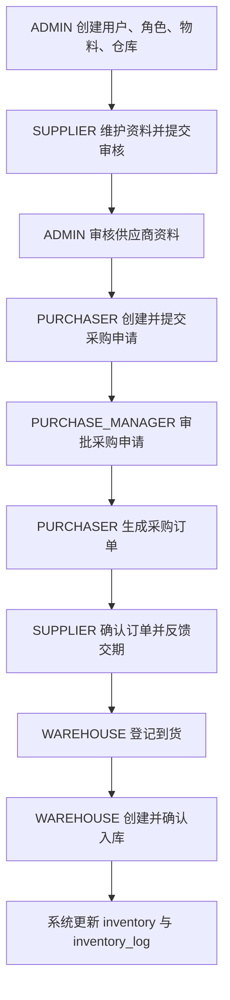

# V3 简历项目开发基线文档

## 1. 项目现状整理

### 1.1 当前仓库真实情况

- `inventory_front` 当前基本未开工，暂时没有稳定的页面结构和业务实现。
- `inventory_back` 当前只有 Spring Boot 骨架，`src/main/java` 里仅保留启动入口，业务源码还没有正式展开。
- [inventory_back/sql/V1__init.sql](../inventory_back/sql/V1__init.sql) 已经有一版建表草案，但命名仍然偏旧版风格，后续如果正式重写 SQL，应以本文档为准。
- `target` 目录中存在历史编译产物和旧迁移痕迹，但它们不属于当前源码基线，只能作为参考，不作为后续开发依据。

### 1.2 现有文档整理结果

- `1.md` 到 `4.md`：偏早期拆分稿，适合回看最初业务设想，不适合作为最终开发基线。
- `完整需求说明书.md`、`完整表设计文档.md`、`状态机设计.md`：内容较全，但范围偏大，超出当前练手项目的实际可控范围。
- `V1统一需求说明书.md`、`V1统一系统设计文档.md`、`V1按模块开发分工文档.md`、`V1按模块按Controller开发文档.md`：更接近开发资料，但一期范围仍然偏多。
- `V2双人协作版系统设计文档.md`、`V2双人协作版数据库设计文档.md`：已经开始收敛到主链路，是本次整理的最主要参考来源。
- `Git协作手册.md`：保留为协作流程参考文档，不参与业务基线定义。

### 1.3 本文档的定位

- 本文档是当前项目正式开发前的最终统一基线。
- 后续如果历史文档与本文档冲突，以本文档为准。
- 本文档只保留适合“在校生实习简历项目”的业务深度，不追求企业级全覆盖。

## 2. 项目重新定位与一期范围

### 2.1 项目定位

本项目重新定位为一个适合简历展示和课程答辩的“供应商协同采购入库系统”。

核心目标只有三个：

1. 跑通采购到入库的完整主链路。
2. 保留供应商协同这个简历亮点。
3. 控制复杂度，让项目真的能做完、能演示、能讲清楚。

### 2.2 一期必须完成的主链路

一期主链路固定为：

`供应商资料维护与审核 -> 采购申请 -> 单级审批 -> 采购订单 -> 供应商确认订单 -> 分批到货 -> 一到货一入库 -> 入库后更新库存`

### 2.3 一期包含范围

- 登录认证
- 基于角色的页面控制
- 用户、角色基础维护
- 物料管理
- 仓库管理
- 供应商资料维护
- 供应商资料审核
- 采购申请
- 采购审批
- 采购订单
- 供应商确认订单
- 到货登记
- 入库确认
- 库存台账查询
- 库存流水查询

### 2.4 一期明确不做

- 字典管理
- 系统参数
- 消息中心
- 操作日志查询
- 统计报表
- 退货管理
- 调拨管理
- 盘点管理
- 财务付款与结算
- 多级审批流
- 复杂质检流程
- PDA 扫码
- ERP、MES 等外部系统集成

## 3. 角色、页面与接口边界

### 3.1 角色定义

| 角色编码 | 角色名称 | 核心职责 |
| --- | --- | --- |
| `ADMIN` | 系统管理员 | 维护用户、角色、物料、仓库，审核供应商 |
| `PURCHASER` | 采购员 | 创建采购申请，生成采购订单，跟踪订单执行 |
| `PURCHASE_MANAGER` | 采购主管 | 审批采购申请 |
| `WAREHOUSE` | 仓库岗 | 到货登记、入库确认、查看库存 |
| `SUPPLIER` | 供应商 | 维护自身资料，确认自己的采购订单 |

### 3.2 页面边界

| 模块 | 页面边界 | 核心说明 |
| --- | --- | --- |
| 认证与首页 | 登录页、首页、个人信息页 | 首页只展示基础工作台，不做复杂大屏 |
| 系统管理 | 用户、角色 | 只做够用的后台维护，不做动态菜单配置 |
| 基础资料 | 物料、仓库 | 作为采购和入库的基础数据来源 |
| 供应商中心 | 供应商资料页、供应商审核页 | 供应商只能维护自己，管理员负责审核 |
| 采购中心 | 采购申请列表/详情、审批列表、采购订单列表/详情 | 一期最重要的业务中心 |
| 仓储中心 | 到货登记、入库管理、库存台账、库存流水 | 入库确认是库存变化唯一入口 |

### 3.3 接口边界

接口层面只做轻量边界定义，不在本文档展开到字段级接口文档。

- 认证模块：登录、当前用户信息、修改密码。
- 系统模块：用户 CRUD、角色 CRUD。
- 基础资料模块：物料 CRUD、仓库 CRUD。
- 供应商模块：供应商资料维护、附件上传、提交审核、审核通过、审核驳回。
- 采购申请模块：新建、编辑、删除草稿、提交、撤回、详情、列表。
- 采购审批模块：待审批列表、审批通过、审批驳回、审批历史。
- 采购订单模块：基于申请生成订单、供应商确认、订单列表、订单详情、关闭订单、取消订单。
- 仓储模块：到货登记、入库创建、入库确认、库存台账查询、库存流水查询。

## 4. 核心业务流程

### 4.1 主流程说明

1. 管理员初始化用户、角色、物料、仓库等基础数据。
2. 供应商使用自己的账号维护企业资料，并上传营业执照和资质文件。
3. 供应商提交审核后，管理员进行审核。
4. 审核通过的供应商才允许出现在采购订单中。
5. 采购员创建采购申请，填写申请标题、期望到货日期和采购明细。
6. 采购员提交采购申请后，采购主管进行单级审批。
7. 审批通过后，采购员基于采购申请生成采购订单，并指定供应商。
8. 供应商确认订单，并反馈预计交期和备注说明。
9. 仓库岗按实际到货情况进行到货登记，允许同一采购订单分批到货。
10. 每次到货登记最多对应一张入库单，由仓库岗进行入库确认。
11. 系统在确认入库时更新库存台账，并记录库存流水。
12. 用户最终可查询采购执行情况、到货情况、入库情况和库存结果。

### 4.2 主流程中的固定业务规则

- 审批只做单级审批。
- 一张采购申请只生成一张采购订单。
- 一张采购订单支持多次到货。
- 一张到货单最多生成一张入库单。
- 库存只允许由确认入库动作更新。
- 供应商只能维护自己的资料和确认自己的订单。

## 5. 业务流程示意

流程图说明：

- 审批为单级审批。
- 一张采购申请只生成一张采购订单。
- 采购订单支持分批到货。
- 一张到货单最多生成一张入库单。
- 库存仅由确认入库驱动。

## 6. 状态流转与关键规则

### 6.1 供应商状态

状态枚举：

- `DRAFT`
- `PENDING`
- `REJECTED`
- `ACTIVE`
- `DISABLED`

状态串联：

`DRAFT -> PENDING -> ACTIVE`

`PENDING -> REJECTED -> DRAFT`

`ACTIVE -> DISABLED`

关键规则：

- 只有 `ACTIVE` 状态供应商可以被采购订单选择。
- `REJECTED` 状态的供应商必须修改资料后重新提交。
- `DISABLED` 状态供应商不能参与新订单。

### 6.2 采购申请状态

状态枚举：

- `DRAFT`
- `PENDING_APPROVAL`
- `APPROVED`
- `REJECTED`
- `WITHDRAWN`
- `ORDER_CREATED`

状态串联：

`DRAFT -> PENDING_APPROVAL -> APPROVED -> ORDER_CREATED`

`PENDING_APPROVAL -> REJECTED`

`PENDING_APPROVAL -> WITHDRAWN`

`REJECTED -> DRAFT`

关键规则：

- `DRAFT` 和 `REJECTED` 状态允许编辑。
- `DRAFT` 状态允许删除。
- `PENDING_APPROVAL` 状态禁止修改明细。
- 只有 `APPROVED` 状态才允许生成采购订单。

### 6.3 采购订单状态

状态枚举：

- `WAIT_CONFIRM`
- `IN_PROGRESS`
- `PARTIAL_ARRIVAL`
- `COMPLETED`
- `CLOSED`
- `CANCELLED`

状态串联：

`WAIT_CONFIRM -> IN_PROGRESS -> PARTIAL_ARRIVAL -> COMPLETED`

`WAIT_CONFIRM -> CANCELLED`

`IN_PROGRESS -> CLOSED`

`PARTIAL_ARRIVAL -> CLOSED`

关键规则：

- 供应商确认订单后，订单进入执行中。
- 只要出现部分到货且未全部完成，订单状态为 `PARTIAL_ARRIVAL`。
- 全部明细完成到货并完成入库后，订单状态更新为 `COMPLETED`。
- `CANCELLED` 和 `CLOSED` 状态订单不允许继续到货。

### 6.4 到货状态

状态枚举：

- `NORMAL`
- `ABNORMAL`

关键规则：

- 到货是一次事件记录，不承担整张订单的状态表达。
- 到货时如果存在短交、超交、破损等情况，记录为 `ABNORMAL`。
- 到货异常只记录异常说明，不直接更新库存。

### 6.5 入库状态

状态枚举：

- `PENDING`
- `COMPLETED`
- `CANCELLED`
- `ABNORMAL`

状态串联：

`PENDING -> COMPLETED`

`PENDING -> CANCELLED`

`PENDING -> ABNORMAL -> COMPLETED`

关键规则：

- 只有确认入库后才更新库存。
- 已完成入库的数据不允许直接修改数量。
- 入库数量不能超过本次到货的可入库数量。

## 7. 数据库表设计

### 7.1 命名与类型约定

#### 表命名约定

- 去掉 `sys_`、`base_` 等前缀。
- 表名保持业务语义，不追求极短缩写。
- `user`、`role` 这类可能与 SQL 关键字冲突的表名，在正式 SQL 中默认使用反引号包裹。

#### 字段命名约定

- 时间字段统一使用 `*_time` 或 `*_date`。
- 数量字段统一使用 `*_number`。
- 关联字段统一使用 `<entity>_id`。
- 通用字段统一使用 `id`、`status`、`remark`、`create_time`、`update_time`、`deleted`。
- 编号字段统一使用 `code` 或 `*_no`。

#### 字段类型约定

- `id`、`*_id`：`BIGINT`
- `code`、`*_no`：`VARCHAR(64)`
- 人名、角色名、文件类型、状态、动作类型：`VARCHAR(32)` 到 `VARCHAR(64)`
- 业务名称、物料名称、供应商名称：`VARCHAR(128)`
- `*_number`：`DECIMAL(18,3)`
- `unit_price`、`line_amount`、`total_amount`：`DECIMAL(18,2)`
- `*_time`、`create_time`、`update_time`、`operate_time`：`DATETIME`
- `*_date`：`DATE`
- `remark`、`*_note`：`VARCHAR(255)`
- `deleted`、`visible`、`active_flag`、`is_primary`：`TINYINT(1)`

#### 旧命名到新命名映射

| 旧表名 | 新表名 |
| --- | --- |
| `sys_user` | `user` |
| `sys_role` | `role` |
| `sys_user_role` | `user_role` |
| `base_material` | `material` |
| `base_warehouse` | `warehouse` |
| `supplier_attachment` | `supplier_file` |
| `purchase_request_approval` | `purchase_request_review` |
| `arrival_record` | `arrival` |
| `arrival_record_item` | `arrival_item` |
| `inbound_order` | `inbound` |
| `inbound_order_item` | `inbound_item` |
| `inventory_flow` | `inventory_log` |

### 7.2 权限与登录相关表

#### `user`

- 作用：系统登录账号表，既包含内部用户，也包含供应商账号。
- 建议字段：`id`、`username`、`password`、`name`、`phone`、`email`、`dept`、`status`、`last_login_time`、`remark`、`create_time`、`update_time`、`deleted`
- 关键约束：`username` 唯一。

#### `role`

- 作用：系统角色表。
- 建议字段：`id`、`code`、`name`、`sort_number`、`status`、`remark`、`create_time`、`update_time`、`deleted`
- 关键约束：`code` 唯一。

#### `user_role`

- 作用：用户与角色关联表。
- 建议字段：`id`、`user_id`、`role_id`、`is_primary`、`create_time`
- 关键约束：`(user_id, role_id)` 唯一。

### 7.3 基础资料表

#### `material`

- 作用：物料主数据。
- 建议字段：`id`、`code`、`name`、`specification`、`unit`、`category_name`、`safety_number`、`upper_number`、`status`、`remark`、`create_time`、`update_time`、`deleted`
- 关键约束：`code` 唯一。

#### `warehouse`

- 作用：仓库主数据。
- 建议字段：`id`、`code`、`name`、`address`、`manager_name`、`manager_phone`、`status`、`remark`、`create_time`、`update_time`、`deleted`
- 关键约束：`code` 唯一。

### 7.4 供应商相关表

#### `supplier`

- 作用：供应商主资料表。
- 建议字段：`id`、`user_id`、`code`、`name`、`contact_name`、`contact_phone`、`email`、`address`、`license_no`、`file_round`、`status`、`submit_time`、`review_time`、`review_user_id`、`review_note`、`remark`、`create_time`、`update_time`、`deleted`
- 关键约束：`user_id` 唯一；`code` 唯一。

#### `supplier_file`

- 作用：供应商附件表，用来保存营业执照、资质文件等。
- 建议字段：`id`、`supplier_id`、`file_round`、`file_type`、`file_name`、`file_url`、`file_size`、`mime_type`、`active_flag`、`remark`、`upload_time`、`deleted`
- 关键约束：建议索引 `(supplier_id, file_round)` 与 `(supplier_id, file_type, active_flag)`。

### 7.5 采购相关表

#### `purchase_request`

- 作用：采购申请主表。
- 建议字段：`id`、`request_no`、`title`、`applicant_id`、`dept`、`expected_date`、`submit_time`、`review_user_id`、`review_time`、`review_note`、`status`、`remark`、`create_time`、`update_time`、`deleted`
- 关键约束：`request_no` 唯一。

#### `purchase_request_item`

- 作用：采购申请明细表。
- 建议字段：`id`、`request_id`、`material_id`、`material_code`、`material_name`、`specification`、`unit`、`request_number`、`sort_number`、`remark`、`create_time`、`update_time`、`deleted`
- 关键约束：至少保留一条明细；建议索引 `request_id`、`material_id`。

#### `purchase_request_review`

- 作用：采购申请状态流转与审批历史表。
- 建议字段：`id`、`request_id`、`action_type`、`from_status`、`to_status`、`operator_id`、`operator_name`、`operate_note`、`operate_time`
- 关键约束：建议索引 `request_id`、`operator_id`、`operate_time`。

#### `purchase_order`

- 作用：采购订单主表。
- 建议字段：`id`、`order_no`、`request_id`、`supplier_id`、`purchaser_id`、`plan_date`、`supplier_date`、`confirm_time`、`total_amount`、`status`、`supplier_note`、`close_time`、`close_reason`、`remark`、`create_time`、`update_time`、`deleted`
- 关键约束：`order_no` 唯一；`request_id` 唯一。

#### `purchase_order_item`

- 作用：采购订单明细表。
- 建议字段：`id`、`order_id`、`request_item_id`、`material_id`、`material_code`、`material_name`、`specification`、`unit`、`order_number`、`unit_price`、`line_amount`、`arrived_number`、`inbound_number`、`sort_number`、`remark`、`create_time`、`update_time`、`deleted`
- 关键约束：建议索引 `order_id`、`request_item_id`、`material_id`。

### 7.6 仓储与库存相关表

#### `arrival`

- 作用：到货主表，表示一次到货事件。
- 建议字段：`id`、`arrival_no`、`order_id`、`warehouse_id`、`arrival_date`、`arrival_number`、`qualified_number`、`unqualified_number`、`status`、`abnormal_note`、`operator_id`、`remark`、`create_time`、`update_time`、`deleted`
- 关键约束：`arrival_no` 唯一。

#### `arrival_item`

- 作用：到货明细表。
- 建议字段：`id`、`arrival_id`、`order_item_id`、`material_id`、`material_code`、`material_name`、`specification`、`unit`、`arrival_number`、`qualified_number`、`unqualified_number`、`abnormal_note`、`sort_number`、`remark`、`create_time`、`update_time`、`deleted`
- 关键约束：建议索引 `arrival_id`、`order_item_id`、`material_id`。

#### `inbound`

- 作用：入库主表。
- 建议字段：`id`、`inbound_no`、`arrival_id`、`warehouse_id`、`inbound_number`、`status`、`operator_id`、`inbound_time`、`remark`、`create_time`、`update_time`、`deleted`
- 关键约束：`inbound_no` 唯一；`arrival_id` 唯一。

#### `inbound_item`

- 作用：入库明细表。
- 建议字段：`id`、`inbound_id`、`arrival_item_id`、`material_id`、`material_code`、`material_name`、`specification`、`unit`、`inbound_number`、`sort_number`、`remark`、`create_time`、`update_time`、`deleted`
- 关键约束：建议索引 `inbound_id`、`arrival_item_id`、`material_id`。

#### `inventory`

- 作用：库存当前台账表。
- 建议字段：`id`、`material_id`、`warehouse_id`、`current_number`、`last_inbound_time`、`remark`、`create_time`、`update_time`、`deleted`
- 关键约束：`(material_id, warehouse_id)` 唯一。

#### `inventory_log`

- 作用：库存流水表，记录库存变更历史。
- 建议字段：`id`、`log_no`、`inventory_id`、`material_id`、`warehouse_id`、`biz_type`、`biz_id`、`before_number`、`change_number`、`after_number`、`operator_id`、`operator_name`、`remark`、`operate_time`
- 关键约束：`log_no` 唯一；建议索引 `(biz_type, biz_id)`、`operate_time`。

### 7.7 必须保留的结构设计

- 明细表保留物料快照字段，至少包括：`material_code`、`material_name`、`specification`、`unit`。
- `purchase_order_item` 必须保留 `arrived_number` 和 `inbound_number`，用于剩余可到货数与可入库数校验。
- `inventory` 必须使用 `(material_id, warehouse_id)` 唯一约束，保证库存只有一个当前结果。
- `inbound` 必须使用 `arrival_id` 唯一约束，落实“一张到货单最多生成一张入库单”。
- 外键继续采用逻辑外键，不强制数据库物理外键，降低开发和调试成本。

## 8. 开发优先级与演示路径

### 8.1 建议开发顺序

#### 第一阶段：先把基础打通

- 登录认证
- 当前用户信息
- 用户、角色基础维护
- 物料管理
- 仓库管理

#### 第二阶段：补上供应商与采购申请

- 供应商资料维护
- 附件上传
- 供应商审核
- 采购申请
- 采购审批

#### 第三阶段：完成采购到入库主链路

- 采购订单生成
- 供应商确认订单
- 到货登记
- 入库确认
- 库存台账
- 库存流水

### 8.2 建议演示路径

建议演示时按以下顺序进行：

1. 管理员登录，展示角色、物料、仓库初始化数据。
2. 供应商登录，维护资料并提交审核。
3. 管理员审核供应商通过。
4. 采购员登录，创建并提交采购申请。
5. 采购主管登录，审批通过采购申请。
6. 采购员生成采购订单。
7. 供应商确认订单并反馈交期。
8. 仓库岗登记第一批到货。
9. 仓库岗创建并确认入库。
10. 查询库存台账和库存流水。
11. 再做第二批到货和入库，展示订单状态变化。

### 8.3 文档验收场景

- 供应商提交资料、审核通过、驳回后补资料再提交。
- 采购申请草稿编辑、提交、审批通过、驳回后重提、撤回。
- 基于审批通过申请创建采购订单，并限制一申请一订单。
- 供应商确认订单并反馈预计交期。
- 同一订单分两次到货，驱动订单状态变化。
- 到货异常时记录异常说明，但不直接改库存。
- 基于到货生成单张入库单并确认入库，更新 `inventory` 和 `inventory_log`。
- 停用供应商、停用物料、停用仓库、供应商越权查看数据等边界规则。

## 9. 二期扩展建议

主链路完成后，如果还想继续加分，可以按下面顺序追加：

### 9.1 优先级高

- 消息中心
- 操作日志查询
- 基础统计报表

### 9.2 优先级中

- 字典管理
- 系统参数
- 供应商评价
- 订单执行看板

### 9.3 优先级低

- 退货流程
- 调拨流程
- 盘点流程
- 多级审批
- 外部系统集成

## 结论

- 当前项目应以“供应商协同采购入库主链路”作为唯一一期核心目标。
- 数据库命名应全面切换到精简版风格，后续正式 SQL 以本文档命名为准。
- 历史文档保留参考价值，但不再作为开发口径。
- 只要按本文档分阶段开发，项目已经足够满足实习简历展示和课程答辩需要。
