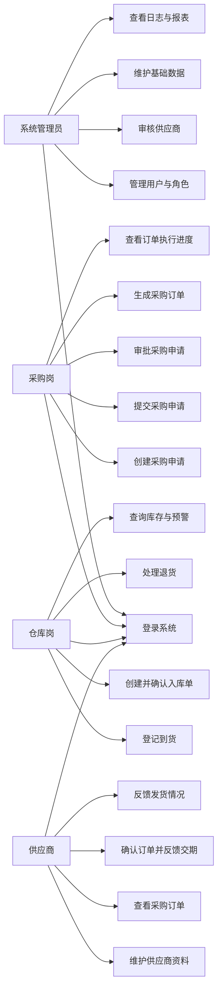

# 面向中小制造企业的供应商协同采购与仓储履约平台
# 功能需求说明书（完整整合版 V1.0）

## 1. 文档信息

| 项目 | 内容 |
|---|---|
| 文档名称 | 功能需求说明书 |
| 项目名称 | 面向中小制造企业的供应商协同采购与仓储履约平台 |
| 文档版本 | V1.0 |
| 文档类型 | 一期开发基线文档 |
| 适用对象 | 产品、后端、前端、测试 |
| 使用目的 | 作为系统设计、开发、联调、验收的统一依据 |

---

## 2. 文档目的

本文档用于完整描述本项目的一期功能需求，包括：

- 项目背景
- 建设目标
- 业务范围
- 角色职责
- 系统架构理解
- 核心业务流程
- 页面与菜单设计
- 核心状态机
- 系统用例
- 模块功能需求
- 关键业务规则
- 验收标准

本说明书将作为本项目后续开发的统一基线版本。

---

## 3. 项目背景

中小制造企业在采购、供应商协同和仓储履约过程中，普遍存在以下问题：

- 采购申请、审批、下单依赖 Excel、纸质单据或聊天工具，流程不透明。
- 供应商档案、资质和状态缺少统一管理，容易出现风险供应商参与采购。
- 采购订单执行进度难以跟踪，交期异常发现不及时。
- 到货、入库和库存记录不规范，容易造成账实不一致。
- 管理层无法及时掌握采购执行、库存预警和供应商履约情况。
- 不同岗位之间信息割裂，协同效率低。

因此，需要建设一套面向中小制造企业的供应商协同采购与仓储履约平台，将采购主链路线上化、规范化、可追踪化。

---

## 4. 建设目标

本项目一期建设目标如下：

- 打通采购申请、审批、采购订单、供应商确认、到货登记、入库、库存更新的完整业务闭环。
- 支持系统管理员、采购岗、仓库岗、供应商四类角色协同工作。
- 实现基础数据、供应商、采购、仓储、库存、消息、日志、报表等核心能力。
- 保持项目范围适中、结构清晰，适合两人协作开发。
- 为后续扩展多仓库、复杂审批、结算对账等功能预留空间。

---

## 5. 一期范围定义

### 5.1 一期包含范围

一期必须完成以下内容：

- 登录认证与权限控制
- 用户、角色、菜单、字典基础管理
- 物料、仓库等基础数据管理
- 供应商档案与资质管理
- 供应商审核
- 采购申请管理
- 采购审批管理
- 采购订单管理
- 供应商订单确认与交期反馈
- 到货登记
- 入库管理
- 库存台账与库存预警
- 消息中心
- 操作日志
- 基础统计报表

### 5.2 一期不包含范围

以下内容不纳入一期：

- 财务付款与正式结算
- 多租户 SaaS 化
- 可配置工作流引擎
- PDA/扫码入库
- 跨仓调拨
- ERP/MES 深度集成
- 完整物流轨迹系统
- 复杂质检流程
- 高级供应商评分模型

---

## 6. 业务假设

为保证项目可落地，一期采用以下业务假设：

- 系统面向单一制造企业内部使用。
- 支持多个仓库主数据，但一期不做仓间调拨。
- 审批流为单级审批。
- 一张采购申请单生成一张采购订单。
- 支持分批到货、分批入库。
- 库存变化以确认入库为准。
- 普通业务场景下不开放手工库存修改。
- 供应商只能查看和处理自身相关数据。

---

## 7. 系统角色定义

系统共有 4 类核心角色。

### 7.1 系统管理员

职责如下：

- 管理用户、角色、菜单、字典
- 维护物料、仓库等基础数据
- 审核供应商资料
- 查看日志与报表
- 维护系统运行基础配置

### 7.2 采购岗

职责如下：

- 创建采购申请
- 提交采购申请
- 查看审批结果
- 根据审批通过的申请生成采购订单
- 跟踪采购订单执行进度

说明：

- 采购岗可细分为 `采购员` 与 `采购主管`
- 采购员负责申请与订单执行
- 采购主管负责审批

### 7.3 仓库岗

职责如下：

- 到货登记
- 创建并确认入库单
- 处理异常与退货
- 查看库存台账和库存预警

### 7.4 供应商

职责如下：

- 维护企业资料和资质附件
- 查看采购订单
- 确认采购订单
- 反馈预计交期和发货情况

---

## 8. 系统核心业务理解

本系统的核心业务主线如下：

`采购申请 -> 审批 -> 采购订单 -> 供应商确认 -> 到货登记 -> 入库 -> 库存更新`

### 8.1 业务链路说明

1. 采购员根据业务需求创建采购申请
2. 采购主管对采购申请进行审批
3. 审批通过后生成正式采购订单
4. 供应商确认订单并反馈交期
5. 仓库岗根据到货情况进行到货登记
6. 仓库岗根据合格到货创建并确认入库单
7. 系统更新库存台账与库存流水
8. 管理员和采购岗查看执行情况、日志与报表

### 8.2 业务主流程图


---

## 9. 角色权限矩阵

| 功能 | 管理员 | 采购岗 | 仓库岗 | 供应商 |
|---|---|---|---|---|
| 登录/退出 | 是 | 是 | 是 | 是 |
| 用户管理 | 是 | 否 | 否 | 否 |
| 角色管理 | 是 | 否 | 否 | 否 |
| 菜单管理 | 是 | 否 | 否 | 否 |
| 字典管理 | 是 | 否 | 否 | 否 |
| 物料管理 | 是 | 否 | 否 | 否 |
| 仓库管理 | 是 | 否 | 否 | 否 |
| 供应商查看 | 是 | 是 | 否 | 仅本人 |
| 供应商审核 | 是 | 否 | 否 | 否 |
| 采购申请创建 | 否 | 是 | 否 | 否 |
| 采购申请提交 | 否 | 是 | 否 | 否 |
| 采购申请审批 | 可查看 | 采购主管可审批 | 否 | 否 |
| 采购订单生成 | 否 | 是 | 否 | 否 |
| 采购订单查看 | 是 | 是 | 是 | 仅本人相关 |
| 订单确认 | 否 | 否 | 否 | 是 |
| 交期反馈 | 否 | 否 | 否 | 是 |
| 到货登记 | 否 | 否 | 是 | 否 |
| 入库确认 | 否 | 否 | 是 | 否 |
| 退货处理 | 否 | 否 | 是 | 否 |
| 库存查询 | 是 | 是 | 是 | 否 |
| 库存预警查看 | 是 | 是 | 是 | 否 |
| 消息中心 | 是 | 是 | 是 | 是 |
| 操作日志查看 | 是 | 否 | 否 | 否 |
| 报表查看 | 是 | 是 | 部分可见 | 否 |

---

## 10. 核心业务对象定义

| 对象 | 说明 |
|---|---|
| 用户 | 系统登录主体 |
| 角色 | 权限载体 |
| 菜单 | 前端导航与权限入口 |
| 物料 | 采购和库存管理基础对象 |
| 仓库 | 入库和库存归属仓库 |
| 供应商 | 外部合作单位 |
| 采购申请单 | 内部采购需求单据 |
| 审批记录 | 采购申请审批过程记录 |
| 采购订单 | 对供应商发起的正式采购执行单 |
| 到货记录 | 仓库接收货物的登记信息 |
| 入库单 | 正式计入库存的业务单据 |
| 库存台账 | 当前库存汇总结果 |
| 库存流水 | 每次库存变化的明细记录 |
| 系统消息 | 审批、订单、预警等通知 |
| 操作日志 | 关键业务操作审计记录 |

---

## 11. 系统模块总览

| 模块编号 | 模块名称 | 优先级 | 是否一期必做 |
|---|---|---|---|
| M01 | 认证与登录 | P0 | 是 |
| M02 | 系统管理 | P0 | 是 |
| M03 | 基础数据管理 | P0 | 是 |
| M04 | 供应商管理 | P0 | 是 |
| M05 | 采购申请管理 | P0 | 是 |
| M06 | 采购审批管理 | P0 | 是 |
| M07 | 采购订单管理 | P0 | 是 |
| M08 | 供应商协同 | P0 | 是 |
| M09 | 到货管理 | P0 | 是 |
| M10 | 入库管理 | P0 | 是 |
| M11 | 库存管理 | P0 | 是 |
| M12 | 消息中心 | P1 | 是 |
| M13 | 操作日志 | P1 | 是 |
| M14 | 统计报表 | P1 | 是 |

---

## 12. 页面与菜单结构设计

## 12.1 公共页面

### 登录页
功能：

- 用户名密码登录
- 登录后跳转对应角色首页

### 首页工作台
功能：

- 展示当前角色待办
- 展示核心统计信息
- 提供常用功能快捷入口

### 个人中心
功能：

- 查看个人信息
- 修改密码

### 消息中心
功能：

- 查看系统通知
- 查看审批提醒
- 查看订单提醒
- 查看预警提醒

---

## 12.2 管理员端菜单

- 工作台
- 用户管理
- 角色管理
- 菜单管理
- 字典管理
- 物料管理
- 仓库管理
- 供应商管理
- 操作日志
- 统计报表

---

## 12.3 采购岗菜单

- 工作台
- 采购申请
- 采购审批
- 采购订单
- 供应商查询
- 消息中心
- 报表中心

说明：

- `采购审批` 菜单仅采购主管可见

---

## 12.4 仓库岗菜单

- 工作台
- 到货管理
- 入库管理
- 退货管理
- 库存台账
- 库存预警
- 消息中心

---

## 12.5 供应商端菜单

- 工作台
- 企业资料
- 我的订单
- 订单确认
- 发货反馈
- 消息中心

---

## 12.6 通用页面结构

### 列表页结构

- 查询条件区
- 操作按钮区
- 数据表格区
- 分页区

### 表单页结构

- 基础信息区
- 明细信息区
- 附件区
- 操作按钮区

### 详情页结构

- 基础信息
- 当前状态
- 明细列表
- 操作记录
- 附件信息

---

## 13. 核心状态机设计

## 13.1 状态机说明

核心状态机指的是：

- 某个业务对象有哪些状态
- 当前状态允许流转到什么状态
- 由什么业务动作触发变化

其作用是：

- 规范业务流转
- 控制按钮显示
- 控制接口调用
- 保证前后端理解一致

---

## 13.2 供应商状态机

### 状态定义

- 待提交
- 待审核
- 审核通过
- 审核驳回
- 合作中
- 已停用

### 状态流转

```text
待提交 -> 待审核
待审核 -> 审核通过
待审核 -> 审核驳回
审核驳回 -> 待提交
审核通过 -> 合作中
合作中 -> 已停用
```

### 规则

- 未审核通过的供应商不得参与采购
- 停用供应商不得新增合作

---

## 13.3 采购申请状态机

### 状态定义

- 草稿
- 待审批
- 已通过
- 已驳回
- 已撤回
- 已转采购单

### 状态流转

```text
草稿 -> 待审批
待审批 -> 已通过
待审批 -> 已驳回
待审批 -> 已撤回
已驳回 -> 草稿
已通过 -> 已转采购单
```

### 规则

- 草稿可编辑、删除
- 待审批不可修改明细
- 已通过才可生成采购订单

---

## 13.4 审批记录状态机

### 状态定义

- 待处理
- 已通过
- 已驳回

### 状态流转

```text
待处理 -> 已通过
待处理 -> 已驳回
```

### 规则

- 同一审批记录只能处理一次
- 审批必须填写意见

---

## 13.5 采购订单状态机

### 状态定义

- 待确认
- 已确认
- 执行中
- 部分到货
- 已完成
- 已关闭
- 已取消

### 状态流转

```text
待确认 -> 已确认
已确认 -> 执行中
执行中 -> 部分到货
部分到货 -> 已完成
执行中 -> 已关闭
部分到货 -> 已关闭
待确认 -> 已取消
```

### 规则

- 供应商确认后进入履约阶段
- 已关闭、已取消订单禁止继续到货和入库

---

## 13.6 到货记录状态机

### 状态定义

- 待登记
- 已登记
- 部分到货
- 全部到货
- 异常到货

### 状态流转

```text
待登记 -> 已登记
已登记 -> 部分到货
部分到货 -> 全部到货
已登记 -> 异常到货
部分到货 -> 异常到货
```

---

## 13.7 入库单状态机

### 状态定义

- 待入库
- 已入库
- 已取消
- 异常

### 状态流转

```text
待入库 -> 已入库
待入库 -> 已取消
待入库 -> 异常
异常 -> 已入库
```

### 规则

- 只有确认入库后才能更新库存
- 已入库记录不可直接修改数量

---

## 14. 系统用例总览

## 14.1 用例说明

系统用例用于描述“哪个角色使用系统做什么事情”。

## 14.2 核心用例图



## 14.3 用例清单

| 用例编号 | 用例名称 | 参与角色 | 说明 |
|---|---|---|---|
| UC-01 | 用户登录 | 全角色 | 用户登录系统 |
| UC-02 | 用户与角色管理 | 管理员 | 管理用户、角色、权限 |
| UC-03 | 供应商审核 | 管理员 | 审核供应商资料 |
| UC-04 | 维护基础数据 | 管理员 | 维护物料、仓库、字典 |
| UC-05 | 查看日志与报表 | 管理员 | 查看日志和经营统计 |
| UC-06 | 创建采购申请 | 采购岗 | 创建采购需求 |
| UC-07 | 提交采购申请 | 采购岗 | 发起审批 |
| UC-08 | 审批采购申请 | 采购主管 | 审批通过或驳回 |
| UC-09 | 生成采购订单 | 采购岗 | 将申请转为订单 |
| UC-10 | 查看订单执行进度 | 采购岗 | 查看订单履约过程 |
| UC-11 | 维护供应商资料 | 供应商 | 维护企业资料和附件 |
| UC-12 | 查看采购订单 | 供应商 | 查看自身订单 |
| UC-13 | 确认订单并反馈交期 | 供应商 | 订单确认和反馈交期 |
| UC-14 | 反馈发货情况 | 供应商 | 发货协同反馈 |
| UC-15 | 登记到货 | 仓库岗 | 登记实际到货 |
| UC-16 | 创建并确认入库单 | 仓库岗 | 正式入库并更新库存 |
| UC-17 | 处理退货 | 仓库岗 | 处理异常物料退货 |
| UC-18 | 查询库存与预警 | 管理员、采购岗、仓库岗 | 查询库存信息 |

---

## 15. 详细功能需求

## 15.1 M01 认证与登录

### 功能目标

实现登录、退出、身份识别和权限控制。

### 功能点

| 编号 | 功能点 | 角色 | 说明 |
|---|---|---|---|
| FR-AUTH-01 | 用户登录 | 全角色 | 用户名密码登录 |
| FR-AUTH-02 | 用户退出 | 全角色 | 退出系统 |
| FR-AUTH-03 | 当前用户信息查询 | 全角色 | 获取登录用户信息 |
| FR-AUTH-04 | 菜单权限加载 | 全角色 | 加载有权限的菜单 |
| FR-AUTH-05 | 修改密码 | 全角色 | 用户修改密码 |

### 业务规则

- 被禁用用户不可登录
- token 失效需重新登录
- 不同角色展示不同菜单

---

## 15.2 M02 系统管理

### 功能目标

实现系统基础管理能力。

### 功能点

| 编号 | 功能点 | 角色 | 说明 |
|---|---|---|---|
| FR-SYS-01 | 用户管理 | 管理员 | 新增、编辑、禁用、重置密码 |
| FR-SYS-02 | 角色管理 | 管理员 | 角色新增、编辑、授权 |
| FR-SYS-03 | 菜单管理 | 管理员 | 菜单配置、显示排序 |
| FR-SYS-04 | 字典管理 | 管理员 | 状态字典、分类字典维护 |
| FR-SYS-05 | 系统参数管理 | 管理员 | 系统参数配置 |

### 业务规则

- 用户至少绑定一个角色
- 菜单权限和接口权限一致

---

## 15.3 M03 基础数据管理

### 功能目标

维护业务运行所需主数据。

### 功能点

| 编号 | 功能点 | 角色 | 说明 |
|---|---|---|---|
| FR-BASE-01 | 物料管理 | 管理员 | 物料新增、编辑、启停用 |
| FR-BASE-02 | 仓库管理 | 管理员 | 仓库新增、编辑 |
| FR-BASE-03 | 计量单位管理 | 管理员 | 单位字典维护 |
| FR-BASE-04 | 安全库存维护 | 管理员 | 维护安全库存和上限库存 |

### 业务规则

- 停用物料不能用于新申请
- 仓库必须启用后才可入库

---

## 15.4 M04 供应商管理

### 功能目标

实现供应商资料、资质、审核和状态管理。

### 功能点

| 编号 | 功能点 | 角色 | 说明 |
|---|---|---|---|
| FR-SUP-01 | 供应商档案维护 | 管理员、供应商 | 维护基本资料 |
| FR-SUP-02 | 资质附件上传 | 供应商 | 上传营业执照等 |
| FR-SUP-03 | 供应商审核 | 管理员 | 审核通过或驳回 |
| FR-SUP-04 | 供应商状态管理 | 管理员 | 启用、停用 |
| FR-SUP-05 | 供应商详情查看 | 管理员、采购岗 | 查看档案和资质 |

### 业务规则

- 未审核通过的供应商不得参与采购订单
- 停用供应商不得新增合作
- 供应商只能维护自己的资料

---

## 15.5 M05 采购申请管理

### 功能目标

实现采购需求创建、提交和跟踪。

### 功能点

| 编号 | 功能点 | 角色 | 说明 |
|---|---|---|---|
| FR-PR-01 | 新建采购申请 | 采购岗 | 创建采购申请单 |
| FR-PR-02 | 编辑采购申请 | 采购岗 | 编辑草稿或驳回单 |
| FR-PR-03 | 删除采购申请 | 采购岗 | 删除草稿 |
| FR-PR-04 | 提交采购申请 | 采购岗 | 提交审批 |
| FR-PR-05 | 撤回采购申请 | 采购岗 | 审批前撤回 |
| FR-PR-06 | 查看采购申请详情 | 采购岗、审批人 | 查看明细和状态 |

### 核心字段

| 字段 | 是否必填 | 说明 |
|---|---|---|
| 申请单号 | 系统生成 | 唯一编号 |
| 申请人 | 是 | 当前采购员 |
| 申请部门 | 是 | 所属部门 |
| 期望到货日期 | 是 | 计划到货日期 |
| 备注 | 否 | 说明信息 |
| 明细列表 | 是 | 至少一条明细 |

### 明细字段

| 字段 | 是否必填 | 说明 |
|---|---|---|
| 物料编码 | 是 | 选择物料 |
| 物料名称 | 是 | 自动带出 |
| 数量 | 是 | 申请数量 |
| 单位 | 是 | 自动带出 |
| 备注 | 否 | 明细说明 |

### 状态定义

- 草稿
- 待审批
- 已通过
- 已驳回
- 已撤回
- 已转采购单

### 业务规则

- 草稿可编辑、删除
- 待审批不可修改明细
- 已驳回可重新编辑提交
- 至少一条明细
- 一期按一张申请生成一张订单设计

---

## 15.6 M06 采购审批管理

### 功能目标

实现采购申请单级审批。

### 功能点

| 编号 | 功能点 | 角色 | 说明 |
|---|---|---|---|
| FR-APP-01 | 待审批列表查询 | 采购主管 | 查看待处理申请 |
| FR-APP-02 | 审批通过 | 采购主管 | 通过申请 |
| FR-APP-03 | 审批驳回 | 采购主管 | 驳回申请 |
| FR-APP-04 | 审批记录查看 | 采购主管、采购岗 | 查看审批结果 |

### 业务规则

- 只有采购主管可审批
- 同一申请只能审批一次
- 审批必须填写意见
- 审批通过后状态变为已通过
- 审批驳回后状态变为已驳回

---

## 15.7 M07 采购订单管理

### 功能目标

将已通过申请转为正式采购执行单。

### 功能点

| 编号 | 功能点 | 角色 | 说明 |
|---|---|---|---|
| FR-PO-01 | 根据申请生成订单 | 采购岗 | 基于已通过申请生成订单 |
| FR-PO-02 | 采购订单列表 | 管理员、采购岗、仓库岗 | 查看订单 |
| FR-PO-03 | 采购订单详情 | 管理员、采购岗、仓库岗、供应商 | 查看详情 |
| FR-PO-04 | 关闭采购订单 | 采购岗 | 无法继续执行时关闭 |
| FR-PO-05 | 取消采购订单 | 采购岗 | 待确认阶段取消 |
| FR-PO-06 | 订单执行进度查看 | 管理员、采购岗 | 查看履约过程 |

### 核心字段

| 字段 | 是否必填 | 说明 |
|---|---|---|
| 订单编号 | 系统生成 | 唯一编号 |
| 来源申请单 | 是 | 关联申请 |
| 供应商 | 是 | 已审核供应商 |
| 计划交期 | 是 | 计划交付日期 |
| 订单总金额 | 是 | 自动汇总 |
| 备注 | 否 | 订单说明 |
| 明细列表 | 是 | 至少一条明细 |

### 订单状态

- 待确认
- 已确认
- 执行中
- 部分到货
- 已完成
- 已关闭
- 已取消

### 业务规则

- 仅已通过申请可生成订单
- 仅审核通过供应商可选
- 已关闭、已取消订单禁止继续执行
- 全部完成入库后订单状态变为已完成

---

## 15.8 M08 供应商协同

### 功能目标

实现供应商接单和交期反馈。

### 功能点

| 编号 | 功能点 | 角色 | 说明 |
|---|---|---|---|
| FR-VEN-01 | 查看待确认订单 | 供应商 | 查看待处理订单 |
| FR-VEN-02 | 订单确认 | 供应商 | 确认接单 |
| FR-VEN-03 | 交期反馈 | 供应商 | 填写预计交期 |
| FR-VEN-04 | 发货反馈 | 供应商 | 填写发货说明 |
| FR-VEN-05 | 我的订单列表 | 供应商 | 查看自身订单 |

### 业务规则

- 供应商只能查看自己的订单
- 订单确认后进入执行阶段
- 发货反馈仅作协同信息，不直接影响库存

---

## 15.9 M09 到货管理

### 功能目标

对货物到达仓库进行登记。

### 功能点

| 编号 | 功能点 | 角色 | 说明 |
|---|---|---|---|
| FR-ARR-01 | 到货登记 | 仓库岗 | 根据订单登记到货 |
| FR-ARR-02 | 到货列表查询 | 仓库岗、采购岗 | 查看到货记录 |
| FR-ARR-03 | 到货详情查看 | 仓库岗、采购岗 | 查看单条详情 |
| FR-ARR-04 | 异常到货记录 | 仓库岗 | 记录异常情况 |

### 核心字段

| 字段 | 是否必填 | 说明 |
|---|---|---|
| 到货单号 | 系统生成 | 唯一编号 |
| 采购订单号 | 是 | 关联订单 |
| 到货日期 | 是 | 实际时间 |
| 到货仓库 | 是 | 目标仓库 |
| 到货数量 | 是 | 本次到货数量 |
| 合格数量 | 是 | 可入库数量 |
| 不合格数量 | 否 | 异常数量 |
| 异常说明 | 否 | 补充说明 |

### 业务规则

- 到货数量不得超过剩余可到货数量
- 支持分批到货
- 异常时必须填写异常说明

---

## 15.10 M10 入库管理

### 功能目标

将合格到货正式计入库存。

### 功能点

| 编号 | 功能点 | 角色 | 说明 |
|---|---|---|---|
| FR-IN-01 | 创建入库单 | 仓库岗 | 基于到货记录创建 |
| FR-IN-02 | 确认入库 | 仓库岗 | 确认后更新库存 |
| FR-IN-03 | 入库单列表 | 仓库岗、采购岗 | 查看入库记录 |
| FR-IN-04 | 入库单详情 | 仓库岗、采购岗 | 查看详情 |
| FR-IN-05 | 取消待入库单 | 仓库岗 | 未入库前可取消 |

### 核心字段

| 字段 | 是否必填 | 说明 |
|---|---|---|
| 入库单号 | 系统生成 | 唯一编号 |
| 到货单号 | 是 | 来源到货记录 |
| 仓库 | 是 | 入库仓库 |
| 入库数量 | 是 | 实际入库数量 |
| 入库时间 | 是 | 确认时间 |
| 入库人 | 是 | 当前仓库岗 |
| 备注 | 否 | 补充说明 |

### 状态定义

- 待入库
- 已入库
- 已取消
- 异常

### 业务规则

- 入库单必须来源于有效到货记录
- 入库数量不得大于合格数量
- 只有确认入库后库存才更新
- 已入库数据不可直接改数量

---

## 15.11 M11 库存管理

### 功能目标

展示库存台账、库存流水和库存预警。

### 功能点

| 编号 | 功能点 | 角色 | 说明 |
|---|---|---|---|
| FR-INV-01 | 库存台账查询 | 管理员、采购岗、仓库岗 | 查看当前库存 |
| FR-INV-02 | 库存流水查询 | 管理员、仓库岗 | 查看库存变动 |
| FR-INV-03 | 低库存预警 | 管理员、采购岗、仓库岗 | 小于安全库存 |
| FR-INV-04 | 超储预警 | 管理员、采购岗、仓库岗 | 大于上限库存 |

### 业务规则

- 库存变化由已入库单驱动
- 库存流水必须关联来源单据
- 一期不开放手工调整库存

---

## 15.12 M12 消息中心

### 功能目标

提供流程提醒和系统通知。

### 功能点

| 编号 | 功能点 | 角色 | 说明 |
|---|---|---|---|
| FR-MSG-01 | 审批提醒 | 采购主管 | 有新申请待审批时提醒 |
| FR-MSG-02 | 审批结果通知 | 采购岗 | 审批通过/驳回提醒 |
| FR-MSG-03 | 订单待确认提醒 | 供应商 | 新订单提醒 |
| FR-MSG-04 | 到货/入库提醒 | 采购岗 | 履约进度提醒 |
| FR-MSG-05 | 库存预警提醒 | 管理员、采购岗、仓库岗 | 库存异常提醒 |
| FR-MSG-06 | 消息已读/未读 | 全角色 | 消息状态管理 |

---

## 15.13 M13 操作日志

### 功能目标

记录关键业务操作。

### 功能点

| 编号 | 功能点 | 角色 | 说明 |
|---|---|---|---|
| FR-LOG-01 | 日志记录 | 系统自动 | 自动记录关键操作 |
| FR-LOG-02 | 日志查询 | 管理员 | 按用户、模块、时间过滤 |
| FR-LOG-03 | 日志详情查看 | 管理员 | 查看操作详情 |

### 必须记录日志的操作

- 登录成功/失败
- 用户新增、禁用、重置密码
- 供应商审核
- 采购申请提交、撤回
- 审批通过、驳回
- 采购订单生成、关闭、取消
- 到货登记
- 入库确认
- 退货处理

---

## 15.14 M14 统计报表

### 功能目标

提供采购和库存的基础统计视图。

### 功能点

| 编号 | 功能点 | 角色 | 说明 |
|---|---|---|---|
| FR-RPT-01 | 采购金额统计 | 管理员、采购岗 | 按时间统计 |
| FR-RPT-02 | 订单状态统计 | 管理员、采购岗 | 按订单状态统计 |
| FR-RPT-03 | 入库趋势统计 | 管理员、采购岗、仓库岗 | 按日期统计入库 |
| FR-RPT-04 | 库存预警统计 | 管理员、仓库岗 | 预警数量统计 |
| FR-RPT-05 | 供应商订单统计 | 管理员、采购岗 | 按供应商统计金额和订单数 |

---

## 16. 关键业务规则汇总

系统开发必须遵守以下规则：

1. 采购申请和采购订单是两个不同业务对象。
2. 采购申请通过审批后才能生成采购订单。
3. 未审核通过的供应商不能参与正式采购。
4. 供应商只能查看和处理与自身相关的订单。
5. 到货可以分批，入库也可以分批。
6. 到货数量不能超过订单剩余数量。
7. 入库数量不能超过合格到货数量。
8. 库存更新只能由确认入库触发。
9. 已关闭、已取消的订单不得继续到货和入库。
10. 所有关键状态变化必须记录日志。
11. 所有页面按钮应受当前状态控制。
12. 一期审批流只做单级审批。

---

## 17. 非功能需求

### 17.1 安全性

- 系统必须基于 JWT 或同类方案实现身份认证
- 系统必须基于角色实现访问控制
- 关键操作必须记录审计日志
- 文件上传必须限制类型和大小

### 17.2 性能

- 常用列表页和详情页需保持流畅响应
- 热点基础数据可使用 Redis 缓存
- 消息通知和日志写入可采用异步处理

### 17.3 可维护性

- 按业务模块分层组织代码
- Controller 不承载核心业务逻辑
- 复杂 SQL 统一在 Mapper XML 中实现
- 状态枚举统一管理

### 17.4 可追溯性

- 单据必须有唯一编号
- 单据之间必须可追溯来源关系
- 库存流水必须关联来源单据

---

## 18. 验收标准

一期验收至少满足以下标准：

1. 管理员可以完成用户、角色、物料、仓库、供应商审核等配置
2. 采购岗可以完成采购申请创建、提交、查看审批结果
3. 采购主管可以完成审批通过或驳回
4. 采购岗可以基于已通过申请生成采购订单
5. 供应商可以查看并确认订单、反馈交期
6. 仓库岗可以完成到货登记和入库确认
7. 入库后库存台账和库存流水正确更新
8. 系统能够展示库存预警信息
9. 关键操作能够在日志中查询
10. 系统能够展示基础采购和入库统计报表

---

## 19. 建议开发顺序

建议按以下顺序开发：

1. 登录认证与权限
2. 用户、角色、菜单
3. 物料、仓库、字典
4. 供应商管理与审核
5. 采购申请
6. 采购审批
7. 采购订单
8. 供应商订单确认
9. 到货登记
10. 入库管理
11. 库存台账与预警
12. 消息中心
13. 操作日志
14. 统计报表

---

## 20. 文档结论

本说明书作为本项目一期开发的统一基线，核心目标是：

- 保证采购主链路闭环
- 保证角色职责清晰
- 保证项目范围可控
- 保证两人协作时边界明确

后续如需增加结算、多级审批、跨仓调拨、复杂质检等能力，应在 V2 文档中单独扩展，不直接改动本版范围边界。
