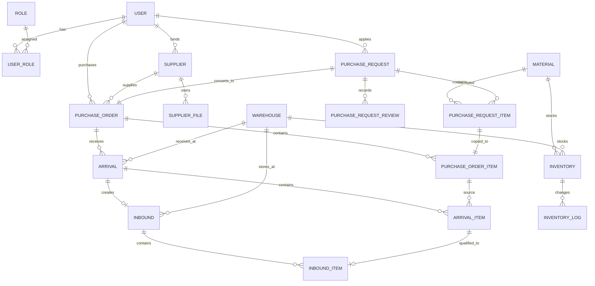

# 数据库设计说明书

## 修订记录

| 修改人员 | 日期 | 变更原因 |
| --- | --- | --- |
| Codex | 2026-06-05 | 参考益行志愿服务平台数据库设计说明书结构，结合当前库存采购项目 `V3__init.sql`、实体、Mapper 和业务流程重新整理核心表关系。 |

## 一、项目背景

本系统面向制造企业采购与仓储履约场景，数据库需要支撑用户权限、基础资料、供应商档案、采购申请、采购审批、采购订单、到货登记、入库确认、库存台账和库存流水等业务数据。系统主链路为：

```text
采购申请 -> 审批 -> 采购订单 -> 供应商确认 -> 到货登记 -> 入库确认 -> 库存更新
```

当前核心初始化脚本为 `inventory_back/sql/V3__init.sql`，该脚本包含 18 张核心业务表：

```text
user, role, user_role,
material, warehouse,
supplier, supplier_file,
purchase_request, purchase_request_item, purchase_request_review,
purchase_order, purchase_order_item,
arrival, arrival_item,
inbound, inbound_item,
inventory, inventory_log
```

另外，当前后端代码存在 `sys_oper_log` 实体、Mapper、Controller 和操作日志切面；但该表不在 `V3__init.sql` 中，而在旧版 `V1__init.sql` 中。本文将其作为“代码使用但 V3 脚本待补齐”的审计表单独说明。

## 二、概念结构设计

### 2.1 主要实体分组

| 分组 | 实体 | 说明 |
| --- | --- | --- |
| 用户权限 | 用户、角色、用户角色 | 支撑登录、角色权限、菜单路由和操作人记录。 |
| 基础资料 | 物料、仓库 | 为采购申请、到货、入库和库存提供基础字典。 |
| 供应商 | 供应商、供应商附件 | 支撑可合作供应商选择、供应商资料维护和资质附件管理。 |
| 采购申请 | 采购申请、申请明细、审批历史 | 记录采购需求、需求物料、审批动作和状态流转。 |
| 采购订单 | 采购订单、订单明细 | 由已审批申请生成正式订单，记录供应商、交期、价格、金额、到货和入库累计数。 |
| 仓储履约 | 到货、到货明细、入库、入库明细 | 记录仓库收货、质检数量和入库确认过程。 |
| 库存 | 库存台账、库存流水 | 记录物料在仓库中的当前库存，以及每次业务驱动的数量变更。 |
| 审计 | 操作日志 | 记录登录、业务操作和异常结果，便于追溯。 |

### 2.2 总体 E-R 关系



### 2.3 关键业务关系

| 关系 | 基数字段 | 说明 |
| --- | --- | --- |
| 用户与角色 | `user.id` -> `user_role.user_id`，`role.id` -> `user_role.role_id` | 多对多。用户可拥有多个角色，`is_primary` 表示主角色。 |
| 用户与供应商 | `user.id` -> `supplier.user_id` | 一对一。供应商账号绑定一条供应商档案。 |
| 采购申请与申请明细 | `purchase_request.id` -> `purchase_request_item.request_id` | 一对多。申请明细保存物料快照和申请数量。 |
| 采购申请与审批历史 | `purchase_request.id` -> `purchase_request_review.request_id` | 一对多。提交、撤回、审批通过、审批驳回均写入历史。 |
| 采购申请与采购订单 | `purchase_request.id` -> `purchase_order.request_id` | 一对一。`uk_purchase_order_request` 限制同一申请只生成一张订单。 |
| 采购订单与订单明细 | `purchase_order.id` -> `purchase_order_item.order_id` | 一对多。订单明细由申请明细复制而来，并新增价格、金额、到货和入库累计数量。 |
| 采购订单与到货 | `purchase_order.id` -> `arrival.order_id` | 一对多。支持同一订单分批到货。 |
| 到货与入库 | `arrival.id` -> `inbound.arrival_id` | 当前设计一对一。`uk_inbound_arrival` 限制一张到货单只能生成一张入库单。 |
| 入库与库存 | `inbound.id` -> `inventory_log.biz_id` | 确认入库时按物料和仓库更新库存台账，并以 `INBOUND` 业务类型写流水。 |
| 物料仓库库存 | `inventory.material_id + inventory.warehouse_id` | 唯一约束保证同一物料在同一仓库只有一条库存台账。 |

## 三、逻辑结构设计

本章按业务分组列出关系模式。当前 SQL 主要建立唯一键和普通索引，没有使用数据库级外键约束，关联关系由业务代码、单据状态和事务控制保证。

### 3.1 用户权限关系模式

1. 用户表 `user`（`id`，`username`，`password`，`name`，`phone`，`email`，`dept`，`status`，`last_login_time`，`remark`，`create_time`，`update_time`，`deleted`）。主键：`id`。唯一键：`username`。
2. 角色表 `role`（`id`，`code`，`name`，`sort_number`，`status`，`remark`，`create_time`，`update_time`，`deleted`）。主键：`id`。唯一键：`code`。
3. 用户角色关联表 `user_role`（`id`，`user_id`，`role_id`，`is_primary`，`create_time`）。主键：`id`。唯一键：`user_id + role_id`。

### 3.2 基础资料关系模式

4. 物料表 `material`（`id`，`code`，`name`，`specification`，`unit`，`category_name`，`safety_number`，`upper_number`，`status`，`remark`，`create_time`，`update_time`，`deleted`）。主键：`id`。唯一键：`code`。
5. 仓库表 `warehouse`（`id`，`code`，`name`，`address`，`manager_name`，`manager_phone`，`status`，`remark`，`create_time`，`update_time`，`deleted`）。主键：`id`。唯一键：`code`。

### 3.3 供应商关系模式

6. 供应商表 `supplier`（`id`，`user_id`，`code`，`name`，`contact_name`，`contact_phone`，`email`，`address`，`license_no`，`file_round`，`status`，`submit_time`，`review_time`，`review_user_id`，`review_note`，`remark`，`create_time`，`update_time`，`deleted`）。主键：`id`。唯一键：`user_id`、`code`。
7. 供应商附件表 `supplier_file`（`id`，`supplier_id`，`file_round`，`file_type`，`file_name`，`file_url`，`file_size`，`mime_type`，`active_flag`，`remark`，`upload_time`，`deleted`）。主键：`id`。

### 3.4 采购申请关系模式

8. 采购申请主表 `purchase_request`（`id`，`request_no`，`title`，`applicant_id`，`dept`，`expected_date`，`submit_time`，`review_user_id`，`review_time`，`review_note`，`status`，`remark`，`create_time`，`update_time`，`deleted`）。主键：`id`。唯一键：`request_no`。
9. 采购申请明细表 `purchase_request_item`（`id`，`request_id`，`material_id`，`material_code`，`material_name`，`specification`，`unit`，`request_number`，`sort_number`，`remark`，`create_time`，`update_time`，`deleted`）。主键：`id`。
10. 采购申请审批历史表 `purchase_request_review`（`id`，`request_id`，`action_type`，`from_status`，`to_status`，`operator_id`，`operator_name`，`operate_note`，`operate_time`）。主键：`id`。

### 3.5 采购订单关系模式

11. 采购订单主表 `purchase_order`（`id`，`order_no`，`request_id`，`supplier_id`，`purchaser_id`，`plan_date`，`supplier_date`，`confirm_time`，`total_amount`，`status`，`supplier_note`，`close_time`，`close_reason`，`remark`，`create_time`，`update_time`，`deleted`）。主键：`id`。唯一键：`order_no`、`request_id`。
12. 采购订单明细表 `purchase_order_item`（`id`，`order_id`，`request_item_id`，`material_id`，`material_code`，`material_name`，`specification`，`unit`，`order_number`，`unit_price`，`line_amount`，`arrived_number`，`inbound_number`，`sort_number`，`remark`，`create_time`，`update_time`，`deleted`）。主键：`id`。

### 3.6 仓储履约关系模式

13. 到货主表 `arrival`（`id`，`arrival_no`，`order_id`，`warehouse_id`，`arrival_date`，`arrival_number`，`qualified_number`，`unqualified_number`，`status`，`abnormal_note`，`operator_id`，`remark`，`create_time`，`update_time`，`deleted`）。主键：`id`。唯一键：`arrival_no`。
14. 到货明细表 `arrival_item`（`id`，`arrival_id`，`order_item_id`，`material_id`，`material_code`，`material_name`，`specification`，`unit`，`arrival_number`，`qualified_number`，`unqualified_number`，`abnormal_note`，`sort_number`，`remark`，`create_time`，`update_time`，`deleted`）。主键：`id`。
15. 入库主表 `inbound`（`id`，`inbound_no`，`arrival_id`，`warehouse_id`，`inbound_number`，`status`，`operator_id`，`inbound_time`，`remark`，`create_time`，`update_time`，`deleted`）。主键：`id`。唯一键：`inbound_no`、`arrival_id`。
16. 入库明细表 `inbound_item`（`id`，`inbound_id`，`arrival_item_id`，`material_id`，`material_code`，`material_name`，`specification`，`unit`，`inbound_number`，`sort_number`，`remark`，`create_time`，`update_time`，`deleted`）。主键：`id`。

### 3.7 库存关系模式

17. 库存台账表 `inventory`（`id`，`material_id`，`warehouse_id`，`current_number`，`last_inbound_time`，`remark`，`create_time`，`update_time`，`deleted`）。主键：`id`。唯一键：`material_id + warehouse_id`。
18. 库存流水表 `inventory_log`（`id`，`log_no`，`inventory_id`，`material_id`，`warehouse_id`，`biz_type`，`biz_id`，`before_number`，`change_number`，`after_number`，`operator_id`，`operator_name`，`remark`，`operate_time`）。主键：`id`。唯一键：`log_no`。

### 3.8 审计日志关系模式

19. 系统操作日志表 `sys_oper_log`（`id`，`log_type`，`module_name`，`biz_type`，`biz_id`，`operation_type`，`operation_desc`，`operator_id`，`operator_name`，`request_uri`，`request_method`，`ip_address`，`success_flag`，`error_message`，`operate_time`，`create_time`）。主键：`id`。

说明：该表当前在代码中使用，但不在 `V3__init.sql` 中。若以 V3 脚本初始化新库，需要补齐该表，否则操作日志查询和切面写入会失败。

## 四、数据表结构

字段宽度说明：`varchar` 类型填写字符长度，`decimal` 类型填写精度；`bigint`、`int`、`tinyint`、`date`、`datetime` 等不以字符长度作为主要约束的类型，宽度列统一填写 `-`。

### 4.1 用户表 `user`

| 字段名 | 数据类型 | 宽度 | 是否主键 | 描述 |
| --- | --- | --- | --- | --- |
| id | bigint | - | 是 | 主键ID |
| username | varchar | 50 | 否 | 登录账号 |
| password | varchar | 255 | 否 | 密码密文 |
| name | varchar | 64 | 否 | 用户姓名 |
| phone | varchar | 20 | 否 | 手机号 |
| email | varchar | 100 | 否 | 邮箱 |
| dept | varchar | 64 | 否 | 部门名称 |
| status | varchar | 32 | 否 | 状态：ENABLED、DISABLED |
| last_login_time | datetime | - | 否 | 最后登录时间 |
| remark | varchar | 255 | 否 | 备注 |
| create_time | datetime | - | 否 | 创建时间 |
| update_time | datetime | - | 否 | 修改时间 |
| deleted | tinyint | - | 否 | 逻辑删除标记 |

主要约束：`uk_user_username` 唯一限制登录账号；`idx_user_status` 支持按账号状态筛选。

### 4.2 角色表 `role`

| 字段名 | 数据类型 | 宽度 | 是否主键 | 描述 |
| --- | --- | --- | --- | --- |
| id | bigint | - | 是 | 主键ID |
| code | varchar | 64 | 否 | 角色编码 |
| name | varchar | 64 | 否 | 角色名称 |
| sort_number | int | - | 否 | 排序值 |
| status | varchar | 32 | 否 | 状态：ENABLED、DISABLED |
| remark | varchar | 255 | 否 | 备注 |
| create_time | datetime | - | 否 | 创建时间 |
| update_time | datetime | - | 否 | 修改时间 |
| deleted | tinyint | - | 否 | 逻辑删除标记 |

主要约束：`uk_role_code` 唯一限制角色编码；当前角色编码包括 `ADMIN`、`PURCHASER`、`PURCHASE_MANAGER`、`WAREHOUSE`、`SUPPLIER`。

### 4.3 用户角色关联表 `user_role`

| 字段名 | 数据类型 | 宽度 | 是否主键 | 描述 |
| --- | --- | --- | --- | --- |
| id | bigint | - | 是 | 主键ID |
| user_id | bigint | - | 否 | 用户ID |
| role_id | bigint | - | 否 | 角色ID |
| is_primary | tinyint | - | 否 | 是否主角色 |
| create_time | datetime | - | 否 | 创建时间 |

主要约束：`uk_user_role_user_role` 限制同一用户不能重复绑定同一角色。

### 4.4 物料表 `material`

| 字段名 | 数据类型 | 宽度 | 是否主键 | 描述 |
| --- | --- | --- | --- | --- |
| id | bigint | - | 是 | 主键ID |
| code | varchar | 64 | 否 | 物料编码 |
| name | varchar | 128 | 否 | 物料名称 |
| specification | varchar | 128 | 否 | 规格型号 |
| unit | varchar | 32 | 否 | 单位 |
| category_name | varchar | 64 | 否 | 分类名称 |
| safety_number | decimal | 18,3 | 否 | 安全库存 |
| upper_number | decimal | 18,3 | 否 | 库存上限 |
| status | varchar | 32 | 否 | 状态：ENABLED、DISABLED |
| remark | varchar | 255 | 否 | 备注 |
| create_time | datetime | - | 否 | 创建时间 |
| update_time | datetime | - | 否 | 修改时间 |
| deleted | tinyint | - | 否 | 逻辑删除标记 |

主要约束：`uk_material_code` 唯一限制物料编码。采购申请、订单、到货、入库明细均保存物料快照字段。

### 4.5 仓库表 `warehouse`

| 字段名 | 数据类型 | 宽度 | 是否主键 | 描述 |
| --- | --- | --- | --- | --- |
| id | bigint | - | 是 | 主键ID |
| code | varchar | 64 | 否 | 仓库编码 |
| name | varchar | 128 | 否 | 仓库名称 |
| address | varchar | 255 | 否 | 仓库地址 |
| manager_name | varchar | 64 | 否 | 负责人姓名 |
| manager_phone | varchar | 20 | 否 | 负责人电话 |
| status | varchar | 32 | 否 | 状态：ENABLED、DISABLED |
| remark | varchar | 255 | 否 | 备注 |
| create_time | datetime | - | 否 | 创建时间 |
| update_time | datetime | - | 否 | 修改时间 |
| deleted | tinyint | - | 否 | 逻辑删除标记 |

主要约束：`uk_warehouse_code` 唯一限制仓库编码。到货登记必须选择启用仓库。

### 4.6 供应商表 `supplier`

| 字段名 | 数据类型 | 宽度 | 是否主键 | 描述 |
| --- | --- | --- | --- | --- |
| id | bigint | - | 是 | 主键ID |
| user_id | bigint | - | 否 | 供应商账号ID |
| code | varchar | 64 | 否 | 供应商编码 |
| name | varchar | 128 | 否 | 供应商名称 |
| contact_name | varchar | 64 | 否 | 联系人 |
| contact_phone | varchar | 20 | 否 | 联系电话 |
| email | varchar | 100 | 否 | 邮箱 |
| address | varchar | 255 | 否 | 地址 |
| license_no | varchar | 64 | 否 | 营业执照号 |
| file_round | int | - | 否 | 当前附件轮次 |
| status | varchar | 32 | 否 | 状态：DRAFT、PENDING、REJECTED、ACTIVE、DISABLED |
| submit_time | datetime | - | 否 | 提交审核时间 |
| review_time | datetime | - | 否 | 审核时间 |
| review_user_id | bigint | - | 否 | 审核人ID |
| review_note | varchar | 255 | 否 | 审核说明 |
| remark | varchar | 255 | 否 | 备注 |
| create_time | datetime | - | 否 | 创建时间 |
| update_time | datetime | - | 否 | 修改时间 |
| deleted | tinyint | - | 否 | 逻辑删除标记 |

主要约束：`uk_supplier_user_id` 限制供应商账号一对一；`uk_supplier_code` 限制供应商编码唯一。采购订单创建时只允许选择 `ACTIVE` 供应商。

### 4.7 供应商附件表 `supplier_file`

| 字段名 | 数据类型 | 宽度 | 是否主键 | 描述 |
| --- | --- | --- | --- | --- |
| id | bigint | - | 是 | 主键ID |
| supplier_id | bigint | - | 否 | 供应商ID |
| file_round | int | - | 否 | 附件轮次 |
| file_type | varchar | 32 | 否 | 文件类型：BUSINESS_LICENSE、QUALIFICATION、OTHER |
| file_name | varchar | 255 | 否 | 文件名称 |
| file_url | varchar | 500 | 否 | 文件地址 |
| file_size | bigint | - | 否 | 文件大小 |
| mime_type | varchar | 100 | 否 | MIME 类型 |
| active_flag | tinyint | - | 否 | 是否当前有效 |
| remark | varchar | 255 | 否 | 备注 |
| upload_time | datetime | - | 否 | 上传时间 |
| deleted | tinyint | - | 否 | 逻辑删除标记 |

主要索引：`idx_supplier_file_supplier_round`、`idx_supplier_file_supplier_type` 支持按供应商、轮次、文件类型和有效标记查询。

### 4.8 采购申请主表 `purchase_request`

| 字段名 | 数据类型 | 宽度 | 是否主键 | 描述 |
| --- | --- | --- | --- | --- |
| id | bigint | - | 是 | 主键ID |
| request_no | varchar | 64 | 否 | 采购申请单号 |
| title | varchar | 128 | 否 | 申请标题 |
| applicant_id | bigint | - | 否 | 申请人ID |
| dept | varchar | 64 | 否 | 申请部门 |
| expected_date | date | - | 否 | 期望到货日期 |
| submit_time | datetime | - | 否 | 提交时间 |
| review_user_id | bigint | - | 否 | 最后审批人ID |
| review_time | datetime | - | 否 | 最后审批时间 |
| review_note | varchar | 255 | 否 | 最后审批说明 |
| status | varchar | 32 | 否 | 状态：DRAFT、PENDING_APPROVAL、APPROVED、REJECTED、WITHDRAWN、ORDER_CREATED |
| remark | varchar | 255 | 否 | 备注 |
| create_time | datetime | - | 否 | 创建时间 |
| update_time | datetime | - | 否 | 修改时间 |
| deleted | tinyint | - | 否 | 逻辑删除标记 |

主要约束：`uk_purchase_request_no` 限制采购申请单号唯一。

### 4.9 采购申请明细表 `purchase_request_item`

| 字段名 | 数据类型 | 宽度 | 是否主键 | 描述 |
| --- | --- | --- | --- | --- |
| id | bigint | - | 是 | 主键ID |
| request_id | bigint | - | 否 | 采购申请ID |
| material_id | bigint | - | 否 | 物料ID |
| material_code | varchar | 64 | 否 | 物料编码快照 |
| material_name | varchar | 128 | 否 | 物料名称快照 |
| specification | varchar | 128 | 否 | 规格型号快照 |
| unit | varchar | 32 | 否 | 单位快照 |
| request_number | decimal | 18,3 | 否 | 申请数量 |
| sort_number | int | - | 否 | 排序值 |
| remark | varchar | 255 | 否 | 备注 |
| create_time | datetime | - | 否 | 创建时间 |
| update_time | datetime | - | 否 | 修改时间 |
| deleted | tinyint | - | 否 | 逻辑删除标记 |

主要索引：`idx_purchase_request_item_request` 支持按申请查询明细；`idx_purchase_request_item_material` 支持按物料追踪申请。

### 4.10 采购申请审批历史表 `purchase_request_review`

| 字段名 | 数据类型 | 宽度 | 是否主键 | 描述 |
| --- | --- | --- | --- | --- |
| id | bigint | - | 是 | 主键ID |
| request_id | bigint | - | 否 | 采购申请ID |
| action_type | varchar | 32 | 否 | 动作：SUBMIT、APPROVE、REJECT、WITHDRAW、RESUBMIT |
| from_status | varchar | 32 | 否 | 变更前状态 |
| to_status | varchar | 32 | 否 | 变更后状态 |
| operator_id | bigint | - | 否 | 操作人ID |
| operator_name | varchar | 64 | 否 | 操作人姓名快照 |
| operate_note | varchar | 255 | 否 | 操作说明 |
| operate_time | datetime | - | 否 | 操作时间 |

主要索引：按 `request_id`、`operator_id`、`operate_time` 查询审批历史。

### 4.11 采购订单主表 `purchase_order`

| 字段名 | 数据类型 | 宽度 | 是否主键 | 描述 |
| --- | --- | --- | --- | --- |
| id | bigint | - | 是 | 主键ID |
| order_no | varchar | 64 | 否 | 采购订单号 |
| request_id | bigint | - | 否 | 来源采购申请ID |
| supplier_id | bigint | - | 否 | 供应商ID |
| purchaser_id | bigint | - | 否 | 采购员ID |
| plan_date | date | - | 否 | 计划交期 |
| supplier_date | date | - | 否 | 供应商反馈交期 |
| confirm_time | datetime | - | 否 | 供应商确认时间 |
| total_amount | decimal | 18,2 | 否 | 订单总金额 |
| status | varchar | 32 | 否 | 状态：WAIT_CONFIRM、IN_PROGRESS、PARTIAL_ARRIVAL、COMPLETED、CLOSED、CANCELLED |
| supplier_note | varchar | 255 | 否 | 供应商反馈说明 |
| close_time | datetime | - | 否 | 关闭时间 |
| close_reason | varchar | 255 | 否 | 关闭原因 |
| remark | varchar | 255 | 否 | 备注 |
| create_time | datetime | - | 否 | 创建时间 |
| update_time | datetime | - | 否 | 修改时间 |
| deleted | tinyint | - | 否 | 逻辑删除标记 |

主要约束：`uk_purchase_order_no` 限制订单号唯一；`uk_purchase_order_request` 限制同一采购申请只能生成一张订单。

### 4.12 采购订单明细表 `purchase_order_item`

| 字段名 | 数据类型 | 宽度 | 是否主键 | 描述 |
| --- | --- | --- | --- | --- |
| id | bigint | - | 是 | 主键ID |
| order_id | bigint | - | 否 | 采购订单ID |
| request_item_id | bigint | - | 否 | 来源申请明细ID |
| material_id | bigint | - | 否 | 物料ID |
| material_code | varchar | 64 | 否 | 物料编码快照 |
| material_name | varchar | 128 | 否 | 物料名称快照 |
| specification | varchar | 128 | 否 | 规格型号快照 |
| unit | varchar | 32 | 否 | 单位快照 |
| order_number | decimal | 18,3 | 否 | 订单数量 |
| unit_price | decimal | 18,2 | 否 | 单价 |
| line_amount | decimal | 18,2 | 否 | 行金额 |
| arrived_number | decimal | 18,3 | 否 | 累计到货数量 |
| inbound_number | decimal | 18,3 | 否 | 累计入库数量 |
| sort_number | int | - | 否 | 排序值 |
| remark | varchar | 255 | 否 | 备注 |
| create_time | datetime | - | 否 | 创建时间 |
| update_time | datetime | - | 否 | 修改时间 |
| deleted | tinyint | - | 否 | 逻辑删除标记 |

主要索引：按 `order_id` 查询订单明细，按 `request_item_id` 追溯来源申请明细。

### 4.13 到货主表 `arrival`

| 字段名 | 数据类型 | 宽度 | 是否主键 | 描述 |
| --- | --- | --- | --- | --- |
| id | bigint | - | 是 | 主键ID |
| arrival_no | varchar | 64 | 否 | 到货单号 |
| order_id | bigint | - | 否 | 采购订单ID |
| warehouse_id | bigint | - | 否 | 仓库ID |
| arrival_date | date | - | 否 | 到货日期 |
| arrival_number | decimal | 18,3 | 否 | 总到货数量 |
| qualified_number | decimal | 18,3 | 否 | 总合格数量 |
| unqualified_number | decimal | 18,3 | 否 | 总不合格数量 |
| status | varchar | 32 | 否 | 状态：NORMAL、ABNORMAL |
| abnormal_note | varchar | 255 | 否 | 异常说明 |
| operator_id | bigint | - | 否 | 登记人ID |
| remark | varchar | 255 | 否 | 备注 |
| create_time | datetime | - | 否 | 创建时间 |
| update_time | datetime | - | 否 | 修改时间 |
| deleted | tinyint | - | 否 | 逻辑删除标记 |

主要约束：`uk_arrival_no` 限制到货单号唯一。

### 4.14 到货明细表 `arrival_item`

| 字段名 | 数据类型 | 宽度 | 是否主键 | 描述 |
| --- | --- | --- | --- | --- |
| id | bigint | - | 是 | 主键ID |
| arrival_id | bigint | - | 否 | 到货主表ID |
| order_item_id | bigint | - | 否 | 采购订单明细ID |
| material_id | bigint | - | 否 | 物料ID |
| material_code | varchar | 64 | 否 | 物料编码快照 |
| material_name | varchar | 128 | 否 | 物料名称快照 |
| specification | varchar | 128 | 否 | 规格型号快照 |
| unit | varchar | 32 | 否 | 单位快照 |
| arrival_number | decimal | 18,3 | 否 | 到货数量 |
| qualified_number | decimal | 18,3 | 否 | 合格数量 |
| unqualified_number | decimal | 18,3 | 否 | 不合格数量 |
| abnormal_note | varchar | 255 | 否 | 异常说明 |
| sort_number | int | - | 否 | 排序值 |
| remark | varchar | 255 | 否 | 备注 |
| create_time | datetime | - | 否 | 创建时间 |
| update_time | datetime | - | 否 | 修改时间 |
| deleted | tinyint | - | 否 | 逻辑删除标记 |

主要索引：按 `arrival_id` 查询到货明细，按 `order_item_id` 累计回写订单明细到货数量。

### 4.15 入库主表 `inbound`

| 字段名 | 数据类型 | 宽度 | 是否主键 | 描述 |
| --- | --- | --- | --- | --- |
| id | bigint | - | 是 | 主键ID |
| inbound_no | varchar | 64 | 否 | 入库单号 |
| arrival_id | bigint | - | 否 | 来源到货单ID |
| warehouse_id | bigint | - | 否 | 仓库ID |
| inbound_number | decimal | 18,3 | 否 | 总入库数量 |
| status | varchar | 32 | 否 | 状态：PENDING、COMPLETED、CANCELLED、ABNORMAL |
| operator_id | bigint | - | 否 | 入库人ID |
| inbound_time | datetime | - | 否 | 确认入库时间 |
| remark | varchar | 255 | 否 | 备注 |
| create_time | datetime | - | 否 | 创建时间 |
| update_time | datetime | - | 否 | 修改时间 |
| deleted | tinyint | - | 否 | 逻辑删除标记 |

主要约束：`uk_inbound_no` 限制入库单号唯一；`uk_inbound_arrival` 限制同一到货单只能生成一张入库单。

### 4.16 入库明细表 `inbound_item`

| 字段名 | 数据类型 | 宽度 | 是否主键 | 描述 |
| --- | --- | --- | --- | --- |
| id | bigint | - | 是 | 主键ID |
| inbound_id | bigint | - | 否 | 入库单ID |
| arrival_item_id | bigint | - | 否 | 来源到货明细ID |
| material_id | bigint | - | 否 | 物料ID |
| material_code | varchar | 64 | 否 | 物料编码快照 |
| material_name | varchar | 128 | 否 | 物料名称快照 |
| specification | varchar | 128 | 否 | 规格型号快照 |
| unit | varchar | 32 | 否 | 单位快照 |
| inbound_number | decimal | 18,3 | 否 | 入库数量 |
| sort_number | int | - | 否 | 排序值 |
| remark | varchar | 255 | 否 | 备注 |
| create_time | datetime | - | 否 | 创建时间 |
| update_time | datetime | - | 否 | 修改时间 |
| deleted | tinyint | - | 否 | 逻辑删除标记 |

主要索引：按 `inbound_id` 查询入库明细，按 `arrival_item_id` 追溯来源到货明细。

### 4.17 库存台账表 `inventory`

| 字段名 | 数据类型 | 宽度 | 是否主键 | 描述 |
| --- | --- | --- | --- | --- |
| id | bigint | - | 是 | 主键ID |
| material_id | bigint | - | 否 | 物料ID |
| warehouse_id | bigint | - | 否 | 仓库ID |
| current_number | decimal | 18,3 | 否 | 当前库存数量 |
| last_inbound_time | datetime | - | 否 | 最后入库时间 |
| remark | varchar | 255 | 否 | 备注 |
| create_time | datetime | - | 否 | 创建时间 |
| update_time | datetime | - | 否 | 修改时间 |
| deleted | tinyint | - | 否 | 逻辑删除标记 |

主要约束：`uk_inventory_material_warehouse` 限制同一物料在同一仓库只有一条库存记录。

### 4.18 库存流水表 `inventory_log`

| 字段名 | 数据类型 | 宽度 | 是否主键 | 描述 |
| --- | --- | --- | --- | --- |
| id | bigint | - | 是 | 主键ID |
| log_no | varchar | 64 | 否 | 库存流水号 |
| inventory_id | bigint | - | 否 | 库存台账ID |
| material_id | bigint | - | 否 | 物料ID |
| warehouse_id | bigint | - | 否 | 仓库ID |
| biz_type | varchar | 32 | 否 | 业务类型：INBOUND、INIT |
| biz_id | bigint | - | 否 | 业务主键ID |
| before_number | decimal | 18,3 | 否 | 变更前数量 |
| change_number | decimal | 18,3 | 否 | 变更数量 |
| after_number | decimal | 18,3 | 否 | 变更后数量 |
| operator_id | bigint | - | 否 | 操作人ID |
| operator_name | varchar | 64 | 否 | 操作人姓名快照 |
| remark | varchar | 255 | 否 | 备注 |
| operate_time | datetime | - | 否 | 操作时间 |

主要约束：`uk_inventory_log_no` 限制库存流水号唯一；`idx_inventory_log_biz` 支持按业务类型和业务主键追溯来源单据。

### 4.19 系统操作日志表 `sys_oper_log`

| 字段名 | 数据类型 | 宽度 | 是否主键 | 描述 |
| --- | --- | --- | --- | --- |
| id | bigint | - | 是 | 主键ID |
| log_type | varchar | 20 | 否 | 日志类型：LOGIN、LOGOUT、BUSINESS |
| module_name | varchar | 64 | 否 | 模块名称 |
| biz_type | varchar | 32 | 否 | 业务类型 |
| biz_id | bigint | - | 否 | 业务主键ID |
| operation_type | varchar | 32 | 否 | 操作类型 |
| operation_desc | varchar | 255 | 否 | 操作描述 |
| operator_id | bigint | - | 否 | 操作人ID |
| operator_name | varchar | 64 | 否 | 操作人姓名快照 |
| request_uri | varchar | 255 | 否 | 请求路径 |
| request_method | varchar | 16 | 否 | 请求方式 |
| ip_address | varchar | 64 | 否 | IP 地址 |
| success_flag | tinyint | - | 否 | 是否成功 |
| error_message | varchar | 500 | 否 | 错误信息 |
| operate_time | datetime | - | 否 | 操作时间 |
| create_time | datetime | - | 否 | 创建时间 |

说明：该表来自旧版 `V1__init.sql` 和当前 Java 实体。当前实体还包含 `create_by` 对应字段意图，若补齐 V3 脚本时需要与实体和 Mapper 再核对一次。

## 五、状态与数据一致性设计

### 5.1 采购申请状态流转

```text
DRAFT -> PENDING_APPROVAL
REJECTED -> PENDING_APPROVAL
PENDING_APPROVAL -> APPROVED
PENDING_APPROVAL -> REJECTED
PENDING_APPROVAL -> WITHDRAWN
APPROVED -> ORDER_CREATED
ORDER_CREATED -> APPROVED  （取消待确认采购订单时回写）
```

状态说明：

- `DRAFT`：采购员创建后未提交。
- `PENDING_APPROVAL`：已提交，等待采购经理审批。
- `APPROVED`：审批通过，可生成采购订单。
- `REJECTED`：审批驳回，可修改后重新提交。
- `WITHDRAWN`：申请人从待审批状态撤回。
- `ORDER_CREATED`：已生成采购订单。

### 5.2 采购订单状态流转

```text
WAIT_CONFIRM -> IN_PROGRESS -> PARTIAL_ARRIVAL -> COMPLETED
WAIT_CONFIRM -> CANCELLED
IN_PROGRESS -> CLOSED
PARTIAL_ARRIVAL -> CLOSED
```

当前实现说明：

- 创建采购订单后状态为 `WAIT_CONFIRM`。
- 到货登记只允许 `IN_PROGRESS` 或 `PARTIAL_ARRIVAL`。
- 确认入库后根据所有明细是否入库完成，将订单更新为 `COMPLETED` 或 `PARTIAL_ARRIVAL`。
- `WAIT_CONFIRM -> IN_PROGRESS` 的供应商确认接口当前缺失，是主链待补齐点。

### 5.3 到货状态

到货单状态由到货明细自动汇总：

- `NORMAL`：不存在不合格数量，且无异常说明。
- `ABNORMAL`：存在不合格数量，或任一明细填写异常说明。

到货登记会同步增加 `purchase_order_item.arrived_number`。

### 5.4 入库状态

```text
PENDING -> COMPLETED
PENDING -> CANCELLED
```

状态说明：

- `PENDING`：入库单已生成，尚未确认入库。
- `COMPLETED`：确认入库成功，库存已更新。
- `CANCELLED`：入库单取消，不改变库存。
- `ABNORMAL`：表结构预留异常状态，当前主流程未重点使用。

### 5.5 库存一致性

确认入库时在同一事务中完成以下动作：

1. 锁定入库单。
2. 更新入库单状态为 `COMPLETED`，写入入库时间。
3. 根据入库明细增加采购订单明细 `inbound_number`。
4. 按 `material_id + warehouse_id` 锁定库存台账。
5. 库存不存在则新增，存在则增加 `current_number`。
6. 写入 `inventory_log`，记录变更前数量、变更数量、变更后数量。
7. 根据订单明细入库完成情况更新采购订单状态。

任何一步失败都应回滚，避免出现订单入库数量、库存台账和库存流水不一致。

## 六、索引与约束汇总

| 表 | 唯一约束 | 主要索引 | 说明 |
| --- | --- | --- | --- |
| user | `username` | `status` | 登录账号唯一。 |
| role | `code` | `status` | 角色编码唯一。 |
| user_role | `user_id + role_id` | `user_id + is_primary`、`role_id` | 用户角色不重复。 |
| material | `code` | `name`、`status` | 物料编码唯一。 |
| warehouse | `code` | `name`、`status` | 仓库编码唯一。 |
| supplier | `user_id`、`code` | `name`、`status` | 供应商账号一对一，供应商编码唯一。 |
| supplier_file | 无 | `supplier_id + file_round`、`supplier_id + file_type + active_flag` | 支持附件轮次和当前有效文件查询。 |
| purchase_request | `request_no` | `applicant_id`、`status` | 采购申请单号唯一。 |
| purchase_request_item | 无 | `request_id`、`material_id` | 支持按申请和物料查询明细。 |
| purchase_request_review | 无 | `request_id`、`operator_id`、`operate_time` | 支持审批历史追踪。 |
| purchase_order | `order_no`、`request_id` | `supplier_id`、`purchaser_id`、`status` | 同一申请只能生成一张订单。 |
| purchase_order_item | 无 | `order_id`、`request_item_id`、`material_id` | 支持订单明细和来源追踪。 |
| arrival | `arrival_no` | `order_id`、`warehouse_id`、`status` | 到货单号唯一，支持订单分批到货。 |
| arrival_item | 无 | `arrival_id`、`order_item_id`、`material_id` | 支持到货明细和订单明细累计回写。 |
| inbound | `inbound_no`、`arrival_id` | `warehouse_id`、`status` | 同一到货单只能生成一张入库单。 |
| inbound_item | 无 | `inbound_id`、`arrival_item_id`、`material_id` | 支持入库明细和来源追踪。 |
| inventory | `material_id + warehouse_id` | `material_id`、`warehouse_id` | 同一物料同一仓库唯一库存台账。 |
| inventory_log | `log_no` | `inventory_id`、`material_id`、`warehouse_id`、`biz_type + biz_id`、`operate_time` | 支持库存变更追溯。 |

## 七、业务表操作链路

| 业务阶段 | 主要读取表 | 主要新增表 | 主要更新表 |
| --- | --- | --- | --- |
| 登录与权限加载 | `user`、`role`、`user_role` | 无 | `user.last_login_time` |
| 基础资料维护 | `material`、`warehouse`、`supplier` | 对应基础表 | 对应基础表 |
| 上传供应商附件 | `supplier`、`supplier_file` | `supplier_file` | `supplier_file.active_flag`、`supplier.file_round` |
| 创建采购申请 | `user` | `purchase_request` | 无 |
| 维护申请明细 | `purchase_request`、`material` | `purchase_request_item` | `purchase_request_item` |
| 提交采购申请 | `purchase_request`、`purchase_request_item` | `purchase_request_review` | `purchase_request.status`、`purchase_request.submit_time` |
| 审批采购申请 | `purchase_request` | `purchase_request_review` | `purchase_request.status`、`review_user_id`、`review_time`、`review_note` |
| 创建采购订单 | `purchase_request`、`purchase_request_item`、`supplier` | `purchase_order`、`purchase_order_item` | `purchase_request.status` |
| 取消采购订单 | `purchase_order` | 无 | `purchase_order.status`、`purchase_request.status` |
| 关闭采购订单 | `purchase_order` | 无 | `purchase_order.status`、`close_time`、`close_reason` |
| 到货登记 | `purchase_order`、`purchase_order_item`、`warehouse` | `arrival`、`arrival_item` | `purchase_order_item.arrived_number`、`purchase_order.status` |
| 生成入库单 | `arrival`、`arrival_item` | `inbound`、`inbound_item` | 无 |
| 确认入库 | `inbound`、`inbound_item`、`arrival`、`purchase_order_item`、`inventory` | `inventory`、`inventory_log` | `inbound.status`、`purchase_order_item.inbound_number`、`inventory.current_number`、`purchase_order.status` |

## 八、当前数据库设计注意事项

| 注意点 | 当前情况 | 建议 |
| --- | --- | --- |
| V3 缺少操作日志表 | 代码使用 `sys_oper_log`，V3 初始化脚本未创建。 | 在 V3 或新增迁移脚本中补齐表结构，并核对 `create_by` 字段。 |
| 供应商确认字段已存在但接口缺失 | `purchase_order` 有 `supplier_date`、`confirm_time`、`supplier_note`，状态有 `WAIT_CONFIRM` 和 `IN_PROGRESS`。 | 增加供应商确认接口和页面动作，补齐 `WAIT_CONFIRM -> IN_PROGRESS`。 |
| 没有数据库外键 | 当前表通过索引和业务代码维护关系。 | 如项目答辩强调关系，可在文档说明“逻辑外键”；如生产化，可评估增加物理外键或更强业务校验。 |
| 库存查询接口不完整 | 有 `inventory` 和 `inventory_log`，确认入库会写入，但未看到独立库存查询 Controller。 | 增加库存台账和流水查询接口，支撑仓库岗和管理员查询。 |
| 状态编码前后端需统一 | 前端常量和后端字符串直接使用状态编码。 | 后续可抽统一枚举或字典接口，避免状态不一致。 |

